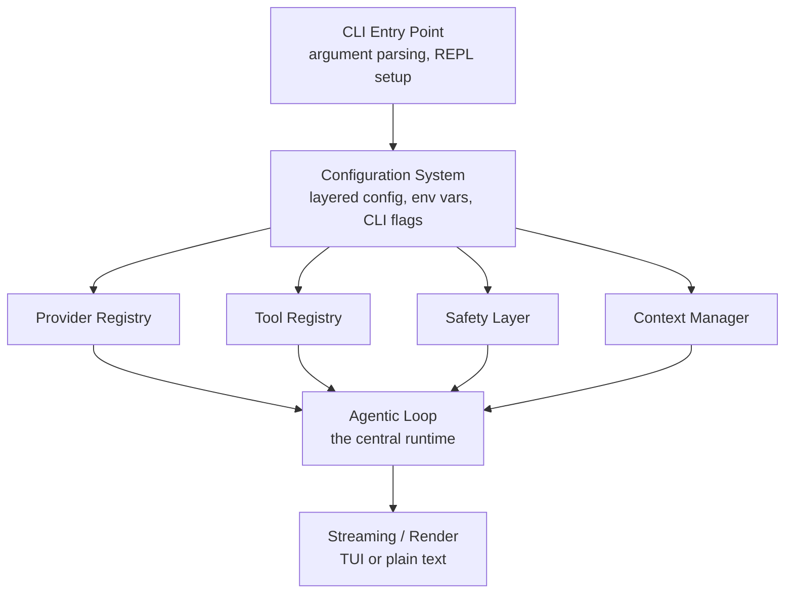

# Architecture Review

> **What you'll learn:**
> - How to draw the full dependency graph of a coding agent, from the CLI entry point through the agentic loop, tools, providers, and safety layers
> - The key architectural boundaries (provider abstraction, tool registry, permission system) and why they exist as separate concerns
> - How data flows through the system during a typical agent session — user input to LLM request to tool execution to response rendering

You have spent seventeen chapters building up individual components. You understand how the agentic loop processes turns, how tools register and execute, how streaming delivers tokens to the terminal, how context management keeps conversations within token limits, how safety systems gate dangerous operations, and how providers abstract away the differences between LLM APIs. Now it is time to step back and see the whole picture at once.

This subchapter is a map. By the end, you will be able to trace a single user request from the moment it enters the CLI all the way through every subsystem until the final response appears on screen. More importantly, you will understand *why* the boundaries between those subsystems exist where they do.

## The Component Graph

A production coding agent is built from roughly a dozen interconnected subsystems. Let's enumerate them and then draw the connections.



Each box in this diagram is a distinct subsystem with its own module, its own types, and its own error variants. Let's walk through them from top to bottom.

### CLI Entry Point

This is `main.rs` and the argument parsing layer. It is responsible for exactly two things: parsing command-line arguments into a typed structure (using `clap`) and handing off control to the initialization sequence. It does not contain business logic. It does not know about LLMs. It is the thinnest possible shell.

```rust
use clap::Parser;

#[derive(Parser)]
#[command(name = "agent", about = "A CLI coding agent")]
struct Cli {
    /// Initial prompt (if provided, runs non-interactively)
    prompt: Option<String>,

    /// Model to use (overrides config file)
    #[arg(short, long)]
    model: Option<String>,

    /// Path to configuration file
    #[arg(short, long)]
    config: Option<PathBuf>,

    /// Run in verbose/debug mode
    #[arg(short, long)]
    verbose: bool,
}

#[tokio::main]
async fn main() -> anyhow::Result<()> {
    let cli = Cli::parse();
    let config = Config::load(cli.config.as_deref())?;
    let agent = Agent::builder()
        .with_config(config)
        .with_model_override(cli.model)
        .with_verbose(cli.verbose)
        .build()
        .await?;

    match cli.prompt {
        Some(prompt) => agent.run_once(&prompt).await,
        None => agent.run_interactive().await,
    }
}
```

Notice how `main` does not construct providers, register tools, or set up safety rules. It delegates all of that to the `Agent::builder()`, which we will examine in the next subchapter.

### Configuration System

The configuration layer loads settings from multiple sources — global config file, project-local config, environment variables, and CLI flags — and merges them with a clear precedence order. It produces a strongly-typed `Config` struct that every other subsystem reads from. We cover this in detail in subchapter 5.

### The Four Core Registries

The middle layer contains four registries that the agentic loop depends on:

**Provider Registry** holds initialized LLM providers (Anthropic, OpenAI, local models). Each provider implements a common trait, so the loop does not care which one is active. You built this abstraction in Chapter 14.

**Tool Registry** holds all available tools — file read, file write, shell execution, search, and any MCP-provided extensions. Each tool implements the `Tool` trait with `name()`, `description()`, `parameters()`, and `execute()` methods. You built this in Chapter 5.

**Safety Layer** enforces permission rules, path restrictions, and command filters. It sits between the agentic loop and tool execution, intercepting every tool call before it reaches the actual tool. You built this in Chapter 13.

**Context Manager** tracks token usage, manages conversation history, and performs compaction when the context window fills up. It ensures the loop never sends a request that exceeds the model's limits. You built this in Chapter 10.

### The Agentic Loop

The loop is the central runtime. It receives user input, assembles context, calls the LLM, processes the response (which may include tool calls), dispatches tools through the safety layer, collects results, and feeds them back for the next iteration. Every other subsystem serves the loop.

### Streaming and Rendering

The output layer handles real-time token display. It receives streamed chunks from the provider and renders them to the terminal — either as plain text with markdown formatting, or through a full TUI built with `ratatui`. You built streaming in Chapter 8 and TUI in Chapter 9.

## Architectural Boundaries and Why They Exist

Each boundary in the component graph exists to enable a specific kind of change without cascading effects:

**Provider boundary** lets you switch from Anthropic to OpenAI (or to a local model) without touching any tool code, loop logic, or UI code. The loop talks to a `dyn Provider` trait object and never knows which concrete provider is behind it.

**Tool boundary** lets you add a new tool by implementing a single trait and registering it. No changes to the loop, the provider, or the safety layer. The tool registry is the single point of extension for new capabilities.

**Safety boundary** lets you change permission rules without modifying tools. A tool does not check whether it has permission — the safety layer intercepts the call before it reaches the tool. This separation of concerns means tools are simpler and safety logic is centralized.

**Context boundary** lets you change compaction strategies, token counting algorithms, or conversation storage without affecting the loop's control flow. The loop asks the context manager "is there room?" and "compact if needed" — it does not manage tokens directly.

::: python Coming from Python
In a Python codebase, you might achieve similar separation through abstract base classes or Protocol types. The Rust equivalent — traits — serves the same purpose but with compile-time verification. If you add a method to the `Provider` trait, the compiler immediately tells you which implementations are missing. In Python, you would discover that at runtime (or with mypy, if you use it). The Rust approach means your architectural boundaries are enforced by the type system, not by convention.
:::

## Data Flow: A Single User Request

Let's trace a concrete example. The user types: "Add a retry mechanism to the HTTP client in src/client.rs."

1. **CLI layer** reads the input from stdin (REPL mode) and passes the raw string to the agentic loop.
2. **Context manager** adds the user message to the conversation history, counts tokens, and determines whether compaction is needed before the next LLM call.
3. **Agentic loop** assembles the full message array (system prompt + conversation history + tool definitions) and calls the active provider.
4. **Provider** sends the HTTP request to the LLM API with streaming enabled.
5. **Streaming layer** receives tokens and renders them to the terminal in real time. The model's response includes a tool call: `read_file("src/client.rs")`.
6. **Agentic loop** detects the tool call, looks up "read_file" in the tool registry, and passes the call to the safety layer.
7. **Safety layer** checks the path against allowed directories. `src/client.rs` is within the project root, so the call is approved.
8. **Tool registry** dispatches the call to the `ReadFile` tool, which reads the file and returns its contents.
9. **Agentic loop** appends the tool result to the conversation and makes another LLM call.
10. **Provider** streams back a response with a `write_file` tool call containing the modified source code.
11. **Safety layer** checks write permissions. The path is in the project directory, so it prompts the user for approval (or auto-approves if the user set that policy).
12. **Tool** writes the file. The loop continues until the model emits a text-only response with no tool calls — the stop condition.
13. **Context manager** records the final state of the conversation for potential session persistence.

Every step in this flow crosses exactly one architectural boundary. That is the hallmark of a well-designed system.

::: wild In the Wild
Claude Code structures its architecture around a similar component graph, but with an additional layer for "skills" — pre-composed sequences of tool calls that handle common tasks like creating a commit or reviewing a pull request. These skills sit between the agentic loop and the tool registry, acting as macro-tools that decompose into multiple lower-level tool calls. OpenCode takes a flatter approach where all tool calls are atomic and the model handles sequencing entirely through its own reasoning.
:::

## The Module Structure

In a Rust project, this architecture maps to a clean module tree:

```
src/
├── main.rs              # CLI entry point
├── config/
│   ├── mod.rs           # Config loading and merging
│   └── schema.rs        # Typed config structs
├── provider/
│   ├── mod.rs           # Provider trait and registry
│   ├── anthropic.rs     # Anthropic implementation
│   └── openai.rs        # OpenAI implementation
├── tools/
│   ├── mod.rs           # Tool trait and registry
│   ├── read_file.rs     # File reading tool
│   ├── write_file.rs    # File writing tool
│   ├── shell.rs         # Shell execution tool
│   └── search.rs        # Code search tool
├── safety/
│   ├── mod.rs           # Permission checking
│   └── rules.rs         # Rule definitions
├── context/
│   ├── mod.rs           # Context manager
│   ├── tokenizer.rs     # Token counting
│   └── compaction.rs    # History compaction
├── loop/
│   ├── mod.rs           # The agentic loop
│   └── state.rs         # Loop state machine
├── stream/
│   ├── mod.rs           # Stream processing
│   └── renderer.rs      # Terminal rendering
└── agent.rs             # Agent builder and top-level orchestration
```

Each module depends only on the traits defined in adjacent modules, never on their concrete implementations. `loop/mod.rs` imports `Provider` (the trait), not `AnthropicProvider` (the struct). This is dependency inversion at the module level, and it is what makes the system testable and extensible.

## The Dependency Direction Rule

There is a simple rule that keeps this architecture clean: **dependencies point inward**. The CLI depends on the agent builder. The agent builder depends on the registries. The registries depend on traits. Traits depend on nothing. If you ever find a tool importing something from the streaming layer, or a provider importing from the safety module, you have a dependency violation that will cause problems as the system grows.

In Rust, you can enforce this with crate-level module visibility. Mark internal types as `pub(crate)` and expose only trait definitions and builder APIs from each module. The compiler will catch any cross-boundary violations that slip through code review.

## Key Takeaways

- A production coding agent consists of roughly a dozen subsystems organized around four core registries (providers, tools, safety, context) that all serve the central agentic loop.
- Architectural boundaries exist at provider, tool, safety, and context interfaces — each boundary isolates one kind of change (switching models, adding tools, updating permissions, changing compaction strategies) from the rest of the system.
- Data flows through the system in a predictable path: user input enters the loop, the loop calls the provider, the provider streams a response, tool calls route through the safety layer before reaching tools, and results feed back into the loop.
- Dependencies always point inward toward abstract traits, never outward toward concrete implementations — this is the key to testability and extensibility.
- The module structure in Rust maps directly to this architecture: one module per subsystem, trait-based interfaces at every boundary, and compile-time enforcement of dependency rules.
