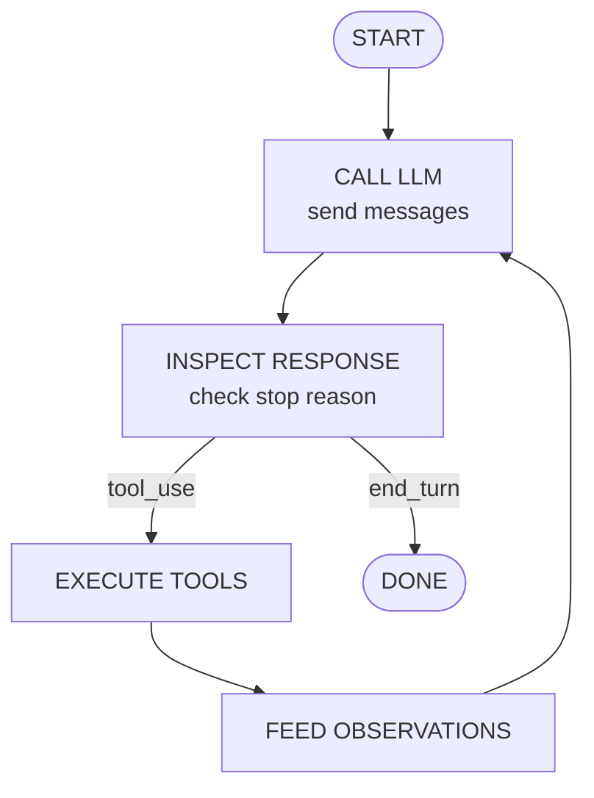

# Loop Architecture

> **What you'll learn:**
> - How to diagram the agentic loop as a state machine with clear transitions between phases
> - The role of each component: message history, LLM client, tool dispatcher, and output renderer
> - How to structure the loop in Rust so it remains testable and easy to extend with new capabilities

Now that you understand *what* an agentic loop is, let's design *how* it works at the architectural level. The loop is not just a `while` loop with an API call inside it -- it is a system of cooperating components with well-defined responsibilities. Getting this architecture right means that adding tools, streaming, context management, and safety checks in later chapters will be straightforward additions rather than painful rewrites.

## The Four Components

Your agentic loop has four core components. Each one has a single, clear job:

**1. Conversation State** -- The `Vec<Message>` that holds every message exchanged so far. This is the model's memory. Each time you call the API, you send the full conversation state (or a truncated version of it), and each time you get a response, you append it. The conversation state is the source of truth for what has happened in the session.

**2. LLM Client** -- The HTTP client that sends requests to the Anthropic API and returns parsed responses. You built this in Chapter 2. From the loop's perspective, it is a function: give it a list of messages and get back a response with content blocks and a stop reason.

**3. Tool Dispatcher** -- The component that takes a tool-use request (a tool name and a JSON input) and routes it to the correct tool implementation. In this chapter, the dispatcher is a stub that returns placeholder results. In Chapter 4, it becomes a real registry with actual tool implementations.

**4. Output Renderer** -- The component that displays results to the user. For now, this is a simple `println!`. In Chapter 8, it will become a full terminal UI.

## The State Machine

The agentic loop moves through a predictable sequence of states. Think of it as a state machine with four states and clear transition rules:



Let's walk through each transition:

**START -> CALL LLM**: The loop begins when the user submits a prompt. The system prompt and user message are assembled into the message history, and the first API call is made.

**CALL LLM -> INSPECT RESPONSE**: The API returns a response containing one or more content blocks and a `stop_reason`. The loop inspects these to determine what happens next.

**INSPECT RESPONSE -> DONE** (when `stop_reason == "end_turn"`): The model has finished its work. The loop extracts any text content from the response, displays it to the user, and exits.

**INSPECT RESPONSE -> EXECUTE TOOLS** (when `stop_reason == "tool_use"`): The model wants to use one or more tools. The loop extracts every `tool_use` content block from the response and passes them to the tool dispatcher.

**EXECUTE TOOLS -> FEED OBSERVATIONS**: Each tool call produces a result (success or error). These results are packaged as `tool_result` content blocks.

**FEED OBSERVATIONS -> CALL LLM**: The tool results are appended to the message history, and the loop circles back to call the LLM again. The model now sees the tool results and can decide what to do next.

## Mapping to Rust

Let's sketch how this maps to Rust code. You will see the full implementation in subchapter 7, but the shape is important now:

```rust
use serde::{Deserialize, Serialize};

// The four states of the loop, expressed as control flow
pub async fn agent_loop(
    client: &Client,
    system_prompt: &str,
    user_message: &str,
    max_turns: usize,
) -> Result<String, AgentError> {
    let mut messages: Vec<Message> = vec![
        Message::user(user_message),
    ];
    let mut turns = 0;

    loop {
        // Guard: stop if we've exceeded the turn limit
        if turns >= max_turns {
            return Err(AgentError::MaxTurnsReached(max_turns));
        }

        // STATE 1: Call the LLM
        let response = client
            .send_message(system_prompt, &messages)
            .await?;

        // Append the assistant's response to conversation state
        messages.push(Message::assistant(response.content.clone()));
        turns += 1;

        // STATE 2: Inspect the response
        match response.stop_reason.as_str() {
            "end_turn" => {
                // STATE 3a: Done -- extract text and return
                let text = extract_text(&response.content);
                return Ok(text);
            }
            "tool_use" => {
                // STATE 3b: Execute tools
                let tool_results = execute_tool_calls(&response.content).await?;
                // STATE 4: Feed observations back
                messages.push(Message::user_from_tool_results(tool_results));
                // Loop continues...
            }
            other => {
                return Err(AgentError::UnexpectedStopReason(other.to_string()));
            }
        }
    }
}
```

Notice how the Rust code mirrors the state machine almost exactly. The `loop` keyword creates the cycle. The `match` on `stop_reason` handles the branching. The `messages` vector is the conversation state that persists across iterations. And the `turns` counter enforces our safety limit.

::: python Coming from Python
In Python, the same structure would use a `while True` loop with `if/elif` branches:
```python
while True:
    response = client.messages.create(model=model, messages=messages)
    messages.append({"role": "assistant", "content": response.content})
    if response.stop_reason == "end_turn":
        return extract_text(response)
    elif response.stop_reason == "tool_use":
        results = execute_tools(response.content)
        messages.append({"role": "user", "content": results})
```
The logic is identical. The key difference is that Rust's `match` is exhaustive -- if the API adds a new stop reason in the future and you update your enum, the compiler will force you to handle it. Python's `elif` chain silently falls through, and you would discover the problem at runtime.
:::

## Separation of Concerns

The architecture is deliberately layered so that each concern can change independently:

| Concern | Component | Changes when... |
|---------|-----------|-----------------|
| What messages look like | Message types | API format changes |
| How messages are sent | LLM Client | Provider changes (OpenAI, local model) |
| What the loop does | Agent loop | New control flow needed (parallel tools, human-in-the-loop) |
| How tools run | Tool dispatcher | New tools added |
| What the user sees | Output renderer | UI changes (streaming, TUI) |

This separation is not academic neatness. It is practical engineering. When you add streaming in Chapter 7, only the LLM client and output renderer change. When you add new tools in Chapter 5, only the tool dispatcher changes. The loop itself stays the same.

::: wild In the Wild
Claude Code separates its architecture in a similar way. The core agentic loop orchestrates the conversation, but tool execution is handled by a separate tool dispatch system. Each tool is a self-contained module that can be added or removed without touching the loop. OpenCode takes the same approach in Go, with a clean interface between its `agent` package (the loop) and its `tool` package (the executors). This separation is what lets these agents support dozens of tools without the main loop becoming a tangled mess.
:::

## Where the Complexity Lives

In a chatbot, most of the complexity is in the prompt engineering. In an agent, the complexity moves to the loop. Here are the things that will get tricky as we build out each piece:

- **Message types** are more complex than you might expect. A single assistant message can contain multiple content blocks -- some text, followed by a tool use, followed by more text. Your types must handle this.
- **Conversation state** grows with every iteration. A 10-turn interaction might accumulate 30+ messages. You will need to think about context window limits.
- **Stop conditions** are not just "end_turn or tool_use." What if the model returns an empty response? What if it gets stuck in a loop calling the same tool over and over? You need defensive logic.
- **Tool execution** can fail. A file might not exist, a command might time out, the model might send malformed JSON as tool input. Every failure mode needs a code path.

Do not worry about solving all of these right now. This chapter builds them up one piece at a time, starting with the message types in the next subchapter.

## Key Takeaways

- The agentic loop is a four-component system: conversation state, LLM client, tool dispatcher, and output renderer
- The loop operates as a state machine cycling through CALL LLM, INSPECT RESPONSE, EXECUTE TOOLS, and FEED OBSERVATIONS states
- In Rust, this maps cleanly to a `loop` with a `match` on the response's `stop_reason` field
- Separation of concerns means you can change tools, UI, or providers without rewriting the loop
- The architecture you design now must handle complexity that arrives in later chapters -- message diversity, state growth, failure modes, and stop conditions
