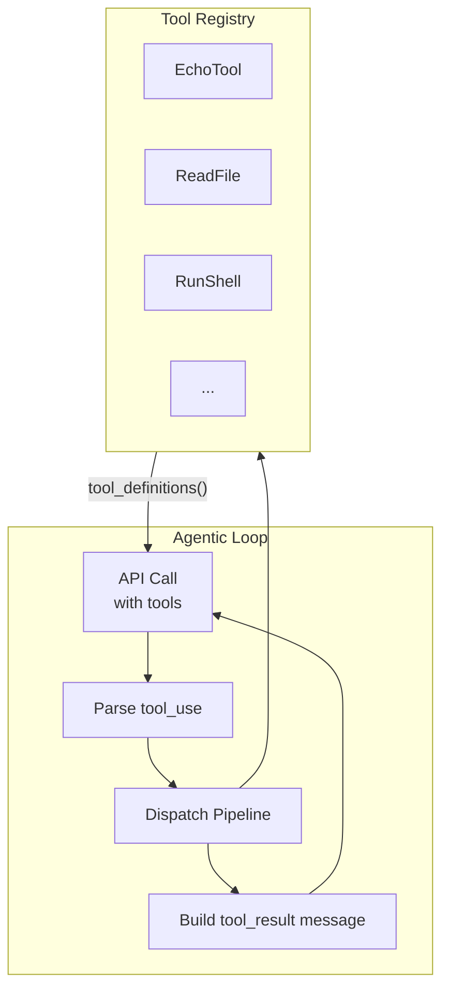

# Summary

> **What you'll learn:**
> - How the trait, registry, dispatch, and lifecycle components form a cohesive tool system
> - How your implementation compares to tool systems in production agents and what trade-offs you made
> - What concrete tools you will implement in Chapter 5 to give your agent the ability to read and write files

You have built a complete tool system from scratch. Starting from the question "what are tools?" you designed a trait, built a registry, implemented dispatch with validation, handled errors at every level, and traced the full lifecycle of a tool call. Let's review what you have, what trade-offs you made, and where you go next.

## What You Built

The tool system has five major components:

### 1. The Tool Trait

The `Tool` trait defines the contract every tool must satisfy:

```rust
pub trait Tool: Send + Sync {
    fn name(&self) -> &str;
    fn description(&self) -> &str;
    fn input_schema(&self) -> serde_json::Value;
    fn execute(&self, input: &serde_json::Value) -> Result<String, ToolError>;
}
```

Four methods. `name` for identification, `description` for the model, `input_schema` for argument validation, and `execute` for the actual work. The `Send + Sync` bounds make tools safe for use in the async, multi-threaded tokio runtime. Any struct that implements this trait can be registered and used by the agent.

### 2. The ToolError Type

Three variants that categorize failures:

```rust
pub enum ToolError {
    InvalidInput(String),    // Model sent bad arguments
    ExecutionFailed(String), // Tool ran but operation failed
    SystemError(String),     // Infrastructure failure (panic, timeout)
}
```

Each variant produces a different observation for the model. `InvalidInput` tells the model to fix its arguments. `ExecutionFailed` tells it the operation did not work. `SystemError` signals something beyond the model's control.

### 3. The ToolRegistry

A `HashMap<String, Box<dyn Tool>>` that provides O(1) tool lookup and generates the `tools` array for API requests:

```rust
pub struct ToolRegistry {
    tools: HashMap<String, Box<dyn Tool>>,
}

impl ToolRegistry {
    pub fn new() -> Self { /* ... */ }
    pub fn register(&mut self, tool: Box<dyn Tool>) { /* ... */ }
    pub fn get(&self, name: &str) -> Option<&dyn Tool> { /* ... */ }
    pub fn tool_definitions(&self) -> Vec<Value> { /* ... */ }
}
```

Built once at startup, used immutably throughout the agentic loop. Adding a new tool is a single line: `registry.register(Box::new(MyTool))`.

### 4. The Dispatch Pipeline

The complete path from a `tool_use` block to a `tool_result` observation:

1. **Lookup** -- Find the tool in the registry by name.
2. **Validate** -- Check the input against the tool's JSON Schema.
3. **Execute** -- Run the tool with panic recovery and timing.
4. **Format** -- Truncate large outputs and construct the `ToolResult`.
5. **Feed** -- Convert to the API's `tool_result` format and append to the conversation.

### 5. JSON Schemas

Each tool produces a JSON Schema describing its input parameters. These schemas serve two purposes: they tell the model what arguments to construct, and they enable input validation before execution.

## Architecture Diagram

Here is how the components connect:



The agentic loop sends tool definitions with the API request, receives tool calls from the model, routes them through the dispatch pipeline, and feeds results back. The registry is the source of truth for what tools exist and how they behave.

## Trade-Offs You Made

Every design has trade-offs. Here are the ones in your tool system and why you made them:

**Synchronous execute vs. async execute.** Your `execute` method is synchronous. This simplifies the trait (no `async_trait` crate needed) and works fine for fast tools like file reads. The trade-off is that truly async operations (network requests, long shell commands) block the tokio runtime thread. You will revisit this in Chapter 6 when you build the shell execution tool.

**Dynamic dispatch vs. static dispatch.** Using `Box<dyn Tool>` means every tool call goes through a vtable. The alternative is an enum with one variant per tool, which enables static dispatch. The trade-off: dynamic dispatch is slower (by nanoseconds) but more extensible. Static dispatch is faster but requires modifying the enum every time you add a tool. For a coding agent with a handful of tools, dynamic dispatch is the right choice.

**Manual schemas vs. derived schemas.** You write schemas by hand with `json!` macros rather than deriving them from Rust types. The trade-off: manual schemas can drift from the implementation, but they are transparent and dependency-free. Derived schemas stay in sync automatically but add a dependency and generate extra schema keywords. For small schemas (1-5 parameters), manual wins on simplicity.

**String output vs. structured output.** Tools return `Result<String, ToolError>` -- the output is always a string. The alternative is a structured enum or JSON output. The trade-off: strings are simple and universal (every tool can produce a string), but you lose type safety on the output side. Since the output goes into a text-based API message anyway, strings are the natural choice.

::: python Coming from Python
These trade-offs have Python parallels. Python agents typically use dynamic dispatch by default (dictionaries and method calls), manual schemas (dictionaries or Pydantic), and string outputs. The Rust version is not fundamentally different in architecture -- it just makes the trade-offs explicit through the type system. Where Python lets you duck-type your way through, Rust forces you to choose and encode your choice in types.
:::

## Comparison with Production Agents

How does your tool system compare to what production agents use?

| Feature | Your System | Claude Code | OpenCode |
|---------|------------|-------------|----------|
| Tool interface | Trait | Trait-like (static dispatch) | Interface (Go) |
| Registry | HashMap | Static list | HashMap |
| Dispatch | Name lookup | Match statement | Name lookup |
| Validation | jsonschema crate | Schema validation | Schema validation |
| Error handling | ToolError enum | Error types | Error interface |
| Output format | String | String | String |

The core architecture is remarkably similar. Production agents have more tools, more sophisticated error recovery, and better logging, but the fundamental pattern -- trait, registry, dispatch, validate, execute, observe -- is the same.

::: wild In the Wild
Claude Code's tool system evolved from a prototype very similar to what you built here. It started with a simple trait-like interface and a static list of tools. Over time, it added caching, parallel dispatch, sophisticated truncation, and detailed telemetry. But the core contract -- name, description, schema, execute -- has remained stable since the beginning. OpenCode followed a similar evolution in Go, starting with a basic interface and building up from there.
:::

## What Comes Next

Your tool system is ready but empty -- the only tool you have is the `EchoTool`, which is useful for testing but not for coding tasks. In the next two chapters, you fill the registry with real tools:

**Chapter 5: File Operations Tools** -- You implement `ReadFile`, `WriteFile`, and `EditFile` tools. These give the agent the ability to examine code, create new files, and make targeted edits. You will handle path resolution, safety checks, atomic writes, and large file handling.

**Chapter 6: Shell Execution** -- You implement a `Shell` tool that runs commands and captures their output. This is where you switch to async execution and add real timeouts with `tokio::time::timeout`. The agent gains the ability to compile code, run tests, and use any command-line tool.

After Chapter 6, your agent can read files, write files, edit code, and run commands. That is enough capability to complete real coding tasks autonomously.

## The Complete Code So Far

Here is the consolidated tool system code that serves as the foundation for Chapter 5:

```rust
use serde_json::{json, Value};
use std::collections::HashMap;
use std::fmt;

// --- Error Type ---

#[derive(Debug)]
pub enum ToolError {
    InvalidInput(String),
    ExecutionFailed(String),
    SystemError(String),
}

impl fmt::Display for ToolError {
    fn fmt(&self, f: &mut fmt::Formatter<'_>) -> fmt::Result {
        match self {
            ToolError::InvalidInput(msg) => write!(f, "Invalid input: {}", msg),
            ToolError::ExecutionFailed(msg) => write!(f, "Execution failed: {}", msg),
            ToolError::SystemError(msg) => write!(f, "System error: {}", msg),
        }
    }
}

impl std::error::Error for ToolError {}

// --- Tool Trait ---

pub trait Tool: Send + Sync {
    fn name(&self) -> &str;
    fn description(&self) -> &str;
    fn input_schema(&self) -> Value;
    fn execute(&self, input: &Value) -> Result<String, ToolError>;
}

// --- Tool Registry ---

pub struct ToolRegistry {
    tools: HashMap<String, Box<dyn Tool>>,
}

impl ToolRegistry {
    pub fn new() -> Self {
        ToolRegistry { tools: HashMap::new() }
    }

    pub fn register(&mut self, tool: Box<dyn Tool>) -> Option<Box<dyn Tool>> {
        let name = tool.name().to_string();
        self.tools.insert(name, tool)
    }

    pub fn get(&self, name: &str) -> Option<&dyn Tool> {
        self.tools.get(name).map(|t| t.as_ref())
    }

    pub fn tool_definitions(&self) -> Vec<Value> {
        self.tools.values().map(|t| json!({
            "name": t.name(),
            "description": t.description(),
            "input_schema": t.input_schema()
        })).collect()
    }

    pub fn tool_names(&self) -> impl Iterator<Item = &str> {
        self.tools.keys().map(|s| s.as_str())
    }
}

// --- Dispatch Types ---

pub struct ToolUse {
    pub id: String,
    pub name: String,
    pub input: Value,
}

pub struct ToolResult {
    pub tool_use_id: String,
    pub content: String,
    pub is_error: bool,
}

// --- Dispatch Function ---

pub fn dispatch_tool_call(
    registry: &ToolRegistry,
    tool_use: &ToolUse,
) -> ToolResult {
    let tool = match registry.get(&tool_use.name) {
        Some(t) => t,
        None => return ToolResult {
            tool_use_id: tool_use.id.clone(),
            content: format!("Unknown tool: '{}'", tool_use.name),
            is_error: true,
        },
    };

    let result = std::panic::catch_unwind(std::panic::AssertUnwindSafe(|| {
        tool.execute(&tool_use.input)
    }));

    match result {
        Ok(Ok(output)) => ToolResult {
            tool_use_id: tool_use.id.clone(),
            content: output,
            is_error: false,
        },
        Ok(Err(e)) => ToolResult {
            tool_use_id: tool_use.id.clone(),
            content: e.to_string(),
            is_error: true,
        },
        Err(_) => ToolResult {
            tool_use_id: tool_use.id.clone(),
            content: format!("System error: tool '{}' panicked", tool_use.name),
            is_error: true,
        },
    }
}

// --- Observation Formatting ---

pub fn tool_result_to_message(result: &ToolResult) -> Value {
    let mut block = json!({
        "type": "tool_result",
        "tool_use_id": result.tool_use_id,
        "content": result.content,
    });
    if result.is_error {
        block["is_error"] = json!(true);
    }
    json!({ "role": "user", "content": [block] })
}

fn main() {
    // Build the registry
    let mut registry = ToolRegistry::new();

    // Register the echo tool (placeholder until Chapter 5)
    struct EchoTool;
    impl Tool for EchoTool {
        fn name(&self) -> &str { "echo" }
        fn description(&self) -> &str { "Echoes the input message back." }
        fn input_schema(&self) -> Value {
            json!({
                "type": "object",
                "properties": {
                    "message": {
                        "type": "string",
                        "description": "The message to echo back."
                    }
                },
                "required": ["message"]
            })
        }
        fn execute(&self, input: &Value) -> Result<String, ToolError> {
            let msg = input.get("message").and_then(|v| v.as_str())
                .ok_or_else(|| ToolError::InvalidInput("Missing 'message'".into()))?;
            Ok(format!("Echo: {}", msg))
        }
    }

    registry.register(Box::new(EchoTool));

    // Show tool definitions
    println!("Tool definitions for API:");
    println!("{}", serde_json::to_string_pretty(&registry.tool_definitions()).unwrap());

    // Simulate a tool call
    let tool_use = ToolUse {
        id: "toolu_01ABC".to_string(),
        name: "echo".to_string(),
        input: json!({"message": "Tool system complete!"}),
    };

    let result = dispatch_tool_call(&registry, &tool_use);
    let message = tool_result_to_message(&result);
    println!("\nTool result message:");
    println!("{}", serde_json::to_string_pretty(&message).unwrap());
}
```

This code compiles and runs. It is the starting point for Chapter 5, where you will replace the `EchoTool` with `ReadFile`, `WriteFile`, and `EditFile` implementations.

## Exercises

Practice each concept with these exercises. They build on the tool system you created in this chapter.

### Exercise 1: Add a TimeTool (Easy)

Implement a `TimeTool` that returns the current date and time as a formatted string. It should take no required parameters but accept an optional `format` parameter (e.g., `"%Y-%m-%d"`, `"%H:%M:%S"`). Register it in your `ToolRegistry` and test it through the dispatch pipeline.

- Implement the `Tool` trait on a new `TimeTool` struct
- Use `chrono::Local::now()` for the current time (add the `chrono` crate)
- Define the `input_schema` with an optional `format` property

### Exercise 2: Add Input Validation to Dispatch (Easy)

Extend `dispatch_tool_call` to validate the input against the tool's `input_schema` before calling `execute`. If the input is missing a required field, return a `ToolResult` with `is_error: true` and a message listing the missing fields.

- Use `tool.input_schema()["required"]` to get the list of required fields
- Check each required field exists in `tool_use.input` with `.get(field)`
- Return early with a descriptive error if any required fields are missing

### Exercise 3: Add Execution Timing to ToolResult (Medium)

Extend `ToolResult` with a `duration_ms: u64` field that records how long the tool's `execute` method took. Modify `dispatch_tool_call` to measure execution time using `std::time::Instant`. Include the duration in the formatted tool result message so the LLM can see how long operations take.

**Hints:**
- Capture `let start = std::time::Instant::now();` before calling `tool.execute()`
- After execution, compute `start.elapsed().as_millis() as u64`
- Append a line like `\n[Completed in 12ms]` to the tool result content

### Exercise 4: Implement a Tool Output Truncator (Medium)

Write a `truncate_output` function that limits tool output to a configurable maximum length (e.g., 10,000 characters). When truncation occurs, keep the first and last portions of the output with a `[... truncated N characters ...]` marker in the middle. Integrate it into `dispatch_tool_call`.

**Hints:**
- Accept parameters for `max_length` and the ratio of head-to-tail content (e.g., 60% head, 40% tail)
- Calculate `head_len` and `tail_len` from the ratio
- Construct the truncated string: `&output[..head_len]` + marker + `&output[output.len()-tail_len..]`
- Call it in `dispatch_tool_call` before constructing the `ToolResult`

### Exercise 5: Add a Calculator Tool End-to-End (Hard)

Build a complete `CalculatorTool` that evaluates simple arithmetic expressions (addition, subtraction, multiplication, division). Define the schema, implement parsing, handle errors (division by zero, invalid expressions), register the tool, and write tests that exercise it through `dispatch_tool_call`.

**Hints:**
- The schema should have one required `expression` field of type `string`
- Parse the expression by splitting on operators -- start simple with two-operand expressions like `"3 + 4"`
- Use `str::parse::<f64>()` to convert operands, returning `ToolError::InvalidInput` on failure
- Handle division by zero with `ToolError::ExecutionFailed`
- Write at least four tests: valid expression, division by zero, invalid input, and unknown tool name

## Key Takeaways

- The tool system has five components: the `Tool` trait, the `ToolError` type, the `ToolRegistry`, the dispatch pipeline, and JSON schemas. Each is simple individually; together they form a complete tool infrastructure.
- The design trade-offs (sync vs. async, dynamic vs. static dispatch, manual vs. derived schemas, string vs. structured output) favor simplicity and clarity. You can revisit any of them as the system grows.
- Your architecture matches production agents in structure. The difference is scale (more tools, more error handling) not fundamental design.
- Adding a new tool requires one struct that implements `Tool` and one call to `registry.register()`. The loop, dispatch, validation, and observation code do not change.
- In Chapter 5 you implement file tools (read, write, edit) and in Chapter 6 you add shell execution. After those two chapters, your agent can perform real coding tasks.
