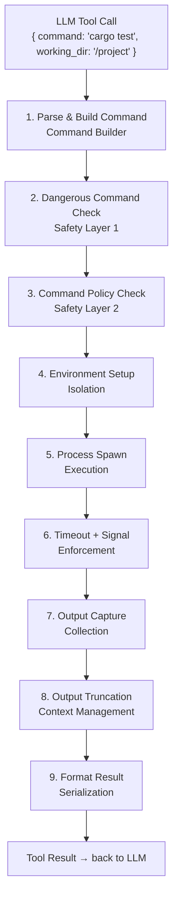

# Summary

> **What you'll learn:**
> - How all the shell execution components fit together into a cohesive tool
> - Which safety layers are essential versus optional for different deployment contexts
> - What patterns from this chapter carry forward to building other system-interaction tools

You have built a complete shell execution tool for your coding agent. Let's step back and see how all the pieces fit together, review the design decisions you made, and identify the patterns that will recur throughout the rest of this project.

## The Complete Architecture

Here is the full execution pipeline, from the LLM's tool call to the result sent back:

Each layer is independent and testable. You can swap out the truncation strategy without touching the timeout logic. You can add new dangerous patterns without changing the command builder. This separation of concerns is what makes the tool maintainable.

## What You Built

Let's recap every component and its role:

### Process Spawning (Subchapter 1)
You learned the foundations: `std::process::Command` for synchronous execution and `tokio::process::Command` for async. The async version integrates with Tokio's event loop so your agent can handle concurrent operations while a command runs.

### Stdout/Stderr Capture (Subchapter 2)
You configured piped streams and learned about the deadlock trap when reading stdout and stderr sequentially. The solution: `tokio::join!` for concurrent reading. You built a `ShellOutput` struct to hold the structured result.

### Command Builder (Subchapter 3)
You designed a `ShellCommand` builder that separates configuration from execution. This created a clean boundary for safety checks, logging, and testing. The builder supports both shell mode (`sh -c "..."`) and direct exec mode.

### Timeouts (Subchapter 4)
You wrapped process execution in `tokio::time::timeout` to prevent runaway commands. The `timed_out` flag in `ShellOutput` tells the LLM what happened so it can decide whether to retry.

### Signal Handling (Subchapter 5)
You implemented a SIGTERM-then-SIGKILL escalation strategy for graceful process termination. Process groups ensure that all descendant processes (not just the direct child) are cleaned up.

### Environment Variables (Subchapter 6)
You built an `EnvPolicy` that strips sensitive variables (API keys, tokens) from the child environment and injects useful variables like `NO_COLOR=1` for clean output.

### Working Directory (Subchapter 7)
You created a `WorkingDirManager` that tracks the agent's current directory across tool calls and validates paths to prevent directory traversal.

### Sandboxing Basics (Subchapter 8)
You implemented command allow/deny lists and filesystem path policies. You learned about OS-level sandboxing with macOS `sandbox-exec` and Linux bubblewrap for stronger isolation.

### Output Truncation (Subchapter 9)
You built head, tail, and middle truncation strategies with configurable byte and line limits. Truncation metadata tells the LLM how much output was cut and suggests more targeted commands.

### Dangerous Command Detection (Subchapter 10)
You built a pattern-based detector with regex matching and risk levels. Critical commands are blocked, high-risk commands trigger warnings, and the system is extensible with new patterns.

### Testing (Subchapter 11)
You wrote unit tests for the builder, detector, and truncation logic, plus integration tests that spawn real processes to verify timeouts, environment handling, and working directory behavior.

## Safety Layer Summary

Here is a quick reference for which safety layers to implement depending on your deployment context:

| Layer | Development | Staging | Production |
|---|---|---|---|
| Dangerous command detection | Required | Required | Required |
| Command allow/deny lists | Optional | Required | Required |
| Environment variable stripping | Required | Required | Required |
| Path validation | Optional | Required | Required |
| OS-level sandbox | Optional | Recommended | Required |
| User confirmation flow | Optional | Optional | Required |
| Output truncation | Required | Required | Required |

Even in development, you want dangerous command detection and environment variable stripping. These cost almost nothing in complexity and prevent accidental damage.

## Patterns That Carry Forward

Several patterns from this chapter will reappear as you build more tools:

### The Builder Pattern
The `ShellCommand` builder pattern works for any tool that needs complex configuration: file operations, git commands, HTTP requests. Accumulate configuration, validate, then execute.

### Defense in Depth
Multiple overlapping safety layers is not just for shell commands. File write operations need similar treatment: path validation, permission checks, content scanning, and user confirmation.

### Output Management
LLM context windows are finite. Every tool that produces output (file reads, search results, git diffs) needs truncation and metadata. The `TruncationConfig` pattern applies to all of them.

### Timeout Enforcement
Any tool that interacts with external systems (network, filesystem, processes) needs a timeout. The `tokio::time::timeout` wrapper pattern is universal.

::: python Coming from Python
If you have built similar tools in Python, you may have noticed that Rust requires more upfront structure -- builders, enums, explicit error handling. But this structure pays for itself: the compiler catches type errors, exhaustive matches on enums ensure you handle all cases, and the ownership system prevents the data races that plague concurrent Python code. The extra boilerplate is not busywork; it is the compiler helping you write correct code.
:::

## What Comes Next

In Chapter 7, you will add **streaming responses** to your agent. Instead of waiting for the LLM to finish its entire response before displaying it, you will stream tokens to the terminal as they arrive. This creates a more responsive user experience and enables the agent to start processing tool calls before the full response is complete.

The shell tool you built in this chapter will be a critical part of streaming: as the LLM generates a shell command, you will parse it from the stream, execute it, and feed the result back -- all while the streaming connection is still open.

::: wild In the Wild
Production agents like Claude Code and Codex execute the full pipeline described in this chapter for every shell command, often in under 100 milliseconds for the overhead (excluding the command execution itself). The safety checks, environment setup, and output processing add negligible latency compared to the actual command execution. This demonstrates that safety does not have to come at the cost of performance -- well-designed safety layers are fast.
:::

## Exercises

Practice each concept with these exercises. They build on the shell execution tool you created in this chapter.

### Exercise 1: Add a Command Duration Display (Easy)

Extend `ShellOutput` with a `duration_ms: u64` field that records the wall-clock time of command execution. Display the duration in the formatted tool result (e.g., `[Completed in 1.2s]`). Test it by running a `sleep 1` command and verifying the duration is approximately 1000ms.

- Capture `Instant::now()` before spawning the process
- Record `elapsed().as_millis()` after the process completes (or times out)
- Include the duration in `to_tool_result()` output

### Exercise 2: Implement a Command History Log (Easy)

Add a `CommandHistory` struct that records every command executed during a session, including the command string, exit code, duration, and whether it was truncated. Add a method `recent(n: usize)` that returns the last N entries. This gives the LLM context about what commands have already been run.

- Store entries in a `Vec<CommandRecord>` with fields for command, exit code, duration, and truncated flag
- Push a new record after each `ShellCommand` execution
- Implement `recent()` using `.iter().rev().take(n)`

### Exercise 3: Add Configurable Timeout Escalation (Medium)

Extend the timeout handling to use a two-phase approach: first send SIGTERM and wait for a configurable grace period, then send SIGKILL. Make both the initial timeout and the grace period configurable through `ShellCommand` builder methods (e.g., `.timeout(30s).grace_period(5s)`).

**Hints:**
- Add a `grace_period: Duration` field to `ShellCommand` with a default of 5 seconds
- After the initial timeout fires, send SIGTERM and start a second `tokio::time::timeout` for the grace period
- Only send SIGKILL if the process is still alive after the grace period
- Add a `termination_method` field to `ShellOutput` to record whether it was SIGTERM or SIGKILL

### Exercise 4: Implement a Smart Dangerous Command Detector (Medium)

Extend `DangerDetector` with context-aware detection: a command like `rm file.txt` is low risk, but `rm -rf /` is critical. Implement a scoring system where the base command, its flags, and its arguments each contribute to a risk score. Commands above a threshold require approval; commands above a higher threshold are blocked.

**Hints:**
- Define a `RiskScore` struct with `base: u32`, `flag_modifier: i32`, and `path_modifier: i32` fields
- `rm` starts at risk 30; adding `-r` adds 20; adding `-f` adds 20; targeting `/` or `$HOME` adds 30
- Sum the components and compare against thresholds: below 40 is allowed, 40-70 requires approval, above 70 is blocked
- Write tests for `rm temp.txt` (allowed), `rm -rf ./build` (approval), and `rm -rf /` (blocked)

### Exercise 5: Add Working Directory Validation and Sandboxing (Hard)

Extend `WorkingDirManager` to enforce a project root boundary. The agent should only be able to set working directories within the project root or its subdirectories. Implement path canonicalization that resolves symlinks and `..` components, then verify the resolved path starts with the project root. Return a `ToolError` if the path escapes the boundary.

**Hints:**
- Store `project_root: PathBuf` in `WorkingDirManager`, canonicalized at construction time
- Use `std::fs::canonicalize()` on the requested path to resolve symlinks and `..`
- Check `canonical_path.starts_with(&self.project_root)` to verify containment
- Handle the case where the path does not exist yet (canonicalize will fail) by canonicalizing the longest existing prefix
- Write tests for valid subdirectories, `..` escape attempts, and symlink escape attempts

## Key Takeaways

- A production shell tool is a **pipeline** of discrete, testable stages: parse, validate, configure, spawn, wait, capture, truncate, format.
- Safety is not a single feature but a **layered strategy**. Each layer catches different threats, and no single layer is sufficient on its own.
- The patterns you learned -- builder, timeout wrapper, defense in depth, output management -- are universal building blocks for all system-interaction tools.
- Rust's type system and ownership model provide safety guarantees at compile time that would require careful discipline (and often still fail) in Python.
- Start with application-level safety (it works everywhere and is easy to test), then add OS-level sandboxing for production deployments.
