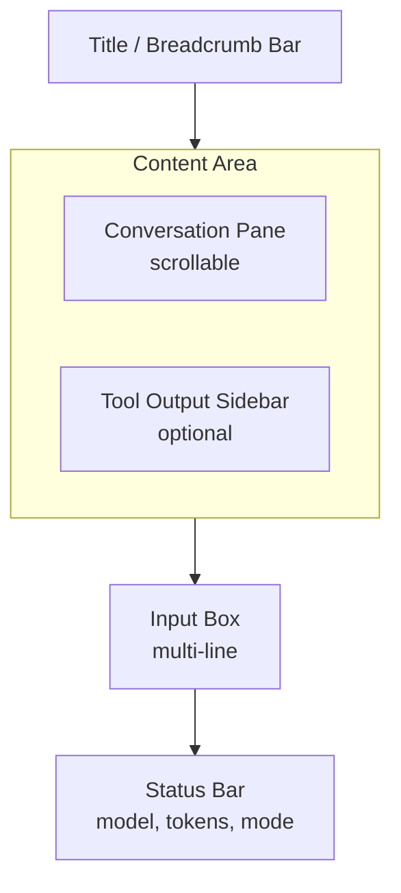

# Multi Pane Layout

> **What you'll learn:**
> - How to design a practical multi-pane layout for a coding agent with conversation and input regions
> - How to handle focus management and visual indicators for the active pane
> - How to support dynamic pane resizing and toggling optional panels

You have learned how to split screen space with layouts and render widgets into those regions. Now you will combine those skills to build the actual multi-pane interface for your coding agent. This is where the UI starts to look like a real product -- a conversation pane, an input area, a status bar, and an optional sidebar for tool output.

## Designing the Layout

A production coding agent typically needs these regions:



Let's implement this layout as a reusable struct:

```rust
use ratatui::prelude::*;

/// All the screen regions our agent UI needs.
pub struct AgentLayout {
    pub title_bar: Rect,
    pub conversation: Rect,
    pub tool_sidebar: Option<Rect>,
    pub input: Rect,
    pub status_bar: Rect,
}

impl AgentLayout {
    pub fn compute(area: Rect, show_sidebar: bool) -> Self {
        // First: vertical split into four bands
        let vertical = Layout::default()
            .direction(Direction::Vertical)
            .constraints([
                Constraint::Length(1),    // title bar
                Constraint::Min(5),      // content area (conversation + optional sidebar)
                Constraint::Length(5),    // input box (taller for multi-line)
                Constraint::Length(1),    // status bar
            ])
            .split(area);

        // Second: optionally split the content area horizontally
        let (conversation, tool_sidebar) = if show_sidebar && area.width >= 80 {
            let horizontal = Layout::default()
                .direction(Direction::Horizontal)
                .constraints([
                    Constraint::Percentage(60),
                    Constraint::Percentage(40),
                ])
                .split(vertical[1]);
            (horizontal[0], Some(horizontal[1]))
        } else {
            (vertical[1], None)
        };

        Self {
            title_bar: vertical[0],
            conversation,
            tool_sidebar,
            input: vertical[2],
            status_bar: vertical[3],
        }
    }
}
```

## Focus Management

When your UI has multiple interactive panes, you need to track which one is "focused" -- receiving keyboard input and displaying as visually active. Focus changes how key events are routed and how panes are styled.

```rust
#[derive(Debug, Clone, Copy, PartialEq)]
pub enum FocusedPane {
    Conversation,
    Input,
    ToolSidebar,
}

pub struct App {
    pub focused_pane: FocusedPane,
    pub input_mode: InputMode,
    // ... other fields
}

impl App {
    /// Cycle focus to the next pane.
    pub fn cycle_focus(&mut self) {
        self.focused_pane = match self.focused_pane {
            FocusedPane::Input => FocusedPane::Conversation,
            FocusedPane::Conversation => {
                if self.show_sidebar {
                    FocusedPane::ToolSidebar
                } else {
                    FocusedPane::Input
                }
            }
            FocusedPane::ToolSidebar => FocusedPane::Input,
        };

        // Auto-switch input mode based on focus
        self.input_mode = match self.focused_pane {
            FocusedPane::Input => InputMode::Editing,
            _ => InputMode::Normal,
        };
    }
}
```

## Visual Focus Indicators

Users need a clear visual signal showing which pane has focus. The most effective approach is to change the border color and style:

```rust
use ratatui::{prelude::*, widgets::{Block, Borders, BorderType}};

/// Create a block with focus-aware styling.
fn pane_block(title: &str, is_focused: bool) -> Block {
    let (border_color, border_type) = if is_focused {
        (Color::Cyan, BorderType::Double)
    } else {
        (Color::DarkGray, BorderType::Rounded)
    };

    Block::default()
        .title(format!(" {} ", title))
        .borders(Borders::ALL)
        .border_type(border_type)
        .border_style(Style::default().fg(border_color))
        .title_style(
            if is_focused {
                Style::default().fg(Color::Cyan).add_modifier(Modifier::BOLD)
            } else {
                Style::default().fg(Color::DarkGray)
            }
        )
}
```

## Rendering the Complete Layout

Now let's put it all together in the view function:

```rust
use ratatui::{prelude::*, widgets::{Paragraph, Wrap, Scrollbar, ScrollbarOrientation, ScrollbarState}};

pub fn view(frame: &mut Frame, app: &App) {
    let layout = AgentLayout::compute(frame.area(), app.show_sidebar);

    // Title bar
    render_title_bar(frame, app, layout.title_bar);

    // Conversation pane
    render_conversation(frame, app, layout.conversation);

    // Tool sidebar (if visible)
    if let Some(sidebar_area) = layout.tool_sidebar {
        render_tool_sidebar(frame, app, sidebar_area);
    }

    // Input box
    render_input_box(frame, app, layout.input);

    // Status bar
    render_status_bar(frame, app, layout.status_bar);
}

fn render_title_bar(frame: &mut Frame, app: &App, area: Rect) {
    let title = Paragraph::new(Line::from(vec![
        Span::styled(" Agent ", Style::default().fg(Color::Cyan).bold()),
        Span::styled("| ", Style::default().fg(Color::DarkGray)),
        Span::styled(
            &app.session_name,
            Style::default().fg(Color::White),
        ),
    ]))
    .style(Style::default().bg(Color::Rgb(30, 30, 46))); // Catppuccin Base

    frame.render_widget(title, area);
}

fn render_conversation(frame: &mut Frame, app: &App, area: Rect) {
    let is_focused = app.focused_pane == FocusedPane::Conversation;
    let block = pane_block("Conversation", is_focused);

    // Build conversation lines
    let mut lines: Vec<Line> = Vec::new();
    for msg in &app.messages {
        let (prefix, color) = match msg.role {
            Role::User => ("You", Color::Blue),
            Role::Assistant => ("Agent", Color::Green),
        };

        lines.push(Line::from(vec![
            Span::styled(
                format!("{}: ", prefix),
                Style::default().fg(color).add_modifier(Modifier::BOLD),
            ),
        ]));

        // Add each line of the message content
        for line in msg.content.lines() {
            lines.push(Line::from(format!("  {}", line)));
        }
        lines.push(Line::from("")); // spacing between messages
    }

    // Streaming indicator
    if app.is_streaming {
        lines.push(Line::from(Span::styled(
            "  ...",
            Style::default().fg(Color::DarkGray),
        )));
    }

    let paragraph = Paragraph::new(lines)
        .block(block)
        .wrap(Wrap { trim: true })
        .scroll((app.scroll_offset, 0));

    frame.render_widget(paragraph, area);
}

fn render_tool_sidebar(frame: &mut Frame, app: &App, area: Rect) {
    let is_focused = app.focused_pane == FocusedPane::ToolSidebar;
    let block = pane_block("Tool Output", is_focused);

    let content = if let Some(ref output) = app.last_tool_output {
        output.as_str()
    } else {
        "No tool output yet"
    };

    let paragraph = Paragraph::new(content)
        .block(block)
        .wrap(Wrap { trim: true });

    frame.render_widget(paragraph, area);
}

fn render_input_box(frame: &mut Frame, app: &App, area: Rect) {
    let is_focused = app.focused_pane == FocusedPane::Input;
    let mode_label = match app.input_mode {
        InputMode::Normal => "Input (press 'i' to edit)",
        InputMode::Editing => "Input (Ctrl+Enter to send, Esc to exit)",
    };

    let block = pane_block(mode_label, is_focused);

    let paragraph = Paragraph::new(app.input.as_str())
        .block(block)
        .wrap(Wrap { trim: true });

    frame.render_widget(paragraph, area);

    // Show cursor in editing mode
    if app.input_mode == InputMode::Editing && is_focused {
        let cursor_x = area.x + (app.cursor_position as u16 % (area.width - 2)) + 1;
        let cursor_y = area.y + (app.cursor_position as u16 / (area.width - 2)) + 1;
        frame.set_cursor_position((cursor_x, cursor_y));
    }
}
```

::: python Coming from Python
Python's `textual` framework handles focus automatically through its widget tree -- pressing Tab cycles focus, and focused widgets get a special CSS class. In Ratatui, you manage focus entirely yourself since there is no widget tree. This is more work but gives you complete control over the focus order and behavior. The `textual` equivalent of our focus cycling would be:
```python
class AgentApp(App):
    BINDINGS = [("tab", "focus_next")]

    def compose(self):
        yield ConversationPane(id="conversation")
        yield InputBox(id="input")
        yield StatusBar(id="status")
```
:::

## Toggling the Sidebar

Users should be able to show and hide the sidebar with a keyboard shortcut. This is a simple state toggle that the layout system adapts to automatically:

```rust
impl App {
    pub fn update(&mut self, msg: Message) {
        match msg {
            Message::ToggleSidebar => {
                self.show_sidebar = !self.show_sidebar;
                // If sidebar was focused and is now hidden, move focus
                if !self.show_sidebar && self.focused_pane == FocusedPane::ToolSidebar {
                    self.focused_pane = FocusedPane::Conversation;
                }
            }
            // ... other handlers
            _ => {}
        }
    }
}

// In the key handler:
fn handle_normal_mode(key: KeyEvent) -> Option<Message> {
    match key.code {
        KeyCode::Char('s') => Some(Message::ToggleSidebar),
        // ... other bindings
        _ => None,
    }
}
```

Because the layout is computed fresh each frame using `AgentLayout::compute(area, app.show_sidebar)`, the UI adapts instantly. The conversation pane expands to fill the space when the sidebar is hidden. No manual resize calculations needed.

## Handling Terminal Resize

When the user resizes their terminal window, crossterm sends a `Resize` event. Your layout adapts automatically because it is recomputed every frame, but you may want to adjust other state:

```rust
impl App {
    pub fn handle_resize(&mut self, width: u16, height: u16) {
        // Clamp scroll offset to prevent it from exceeding content bounds
        // after a resize makes the viewport larger
        self.scroll_offset = self.scroll_offset.min(
            self.total_content_lines().saturating_sub(height.saturating_sub(10))
        );

        // Auto-hide sidebar on narrow terminals
        if width < 80 {
            self.show_sidebar = false;
        }
    }
}
```

::: wild In the Wild
Claude Code uses a single-column layout that adapts based on terminal width. When the terminal is wide enough, tool results appear inline with the conversation. OpenCode uses a more complex layout with distinct panes for conversation, file context, and tool output. Both agents handle resize events gracefully -- the layout reflows rather than breaking. The key insight is that constraint-based layouts handle resize naturally; you only need to worry about state adjustments (like scroll positions) when the viewport size changes.
:::

## Key Takeaways

- **A multi-pane layout** for a coding agent typically includes a conversation pane, input box, status bar, and optionally a tool output sidebar -- all computed from nested `Layout` splits.
- **Focus management** tracks which pane receives keyboard input and uses visual indicators (border color, border style) to show the active pane.
- **Toggling panels** is a simple boolean in your Model; the layout system adapts automatically because layouts are computed fresh each frame.
- **The view function** orchestrates rendering by computing the layout once and calling dedicated render functions for each pane with their allocated `Rect`.
- **Terminal resize** is handled naturally by constraint-based layouts, but you may need to adjust state (scroll offsets, sidebar visibility) when the terminal size changes.
