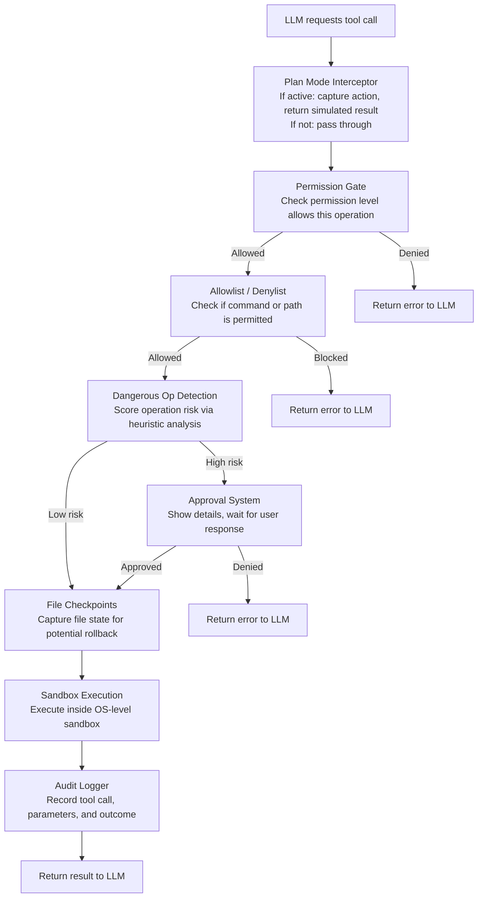

# Summary

> **What you'll learn:**
> - How all safety layers — permissions, approvals, checkpoints, sandboxing — combine into defense in depth
> - Which safety features are essential for any production coding agent versus nice-to-have
> - How to evaluate and improve your agent's safety posture over time

You have built a complete safety system for your coding agent. Let's step back and see how all the pieces fit together, what you should prioritize when shipping, and how to think about safety as an ongoing practice rather than a one-time implementation.

## The Complete Safety Architecture

Here is the full safety pipeline that every tool call passes through before it reaches execution:



Each layer is independent. Removing any single layer weakens the system but does not destroy it. This is the defining characteristic of defense in depth.

## What Each Layer Catches

Let's map back to the threat model from the first subchapter:

| Threat | Primary Defense | Secondary Defense | Tertiary Defense |
|--------|----------------|-------------------|------------------|
| Prompt Injection | Allowlists/denylists | Sandboxing | Audit logging |
| Confused Deputy | Plan mode | Approval system | Checkpoints/undo |
| Data Exfiltration | Network sandboxing | Path denylists | Dangerous op detection |
| Accidental Destruction | File checkpoints | Approval system | Undo/revert |
| Privilege Escalation | Path denylists | Permission levels | Audit logging |

No threat relies on a single defense. Even if the primary defense fails, secondary and tertiary layers provide coverage.

## Priority Ordering for Implementation

Not all safety features need to be in place before you can use your agent. Here is a practical priority ordering:

### Tier 1: Ship Blockers (implement before any real use)

1. **Permission levels** — The foundation. Without these, the agent has no concept of operation risk.
2. **Command allowlists/denylists** — Blocks the most obviously dangerous commands. Quick to implement, high impact.
3. **File checkpoints** — Enables undo, which makes every mistake recoverable. This single feature dramatically reduces the blast radius of any error.

```rust
/// Minimum viable safety: the three features you need before real use.
pub struct MinimumViableSafety {
    pub permission_gate: PermissionGate,
    pub command_filter: CommandFilter,
    pub checkpoint_manager: CheckpointManager,
}

impl MinimumViableSafety {
    pub fn new(project_root: &std::path::Path) -> Self {
        Self {
            permission_gate: PermissionGate::new(PermissionLevel::Standard),
            command_filter: CommandFilter::with_defaults(),
            checkpoint_manager: CheckpointManager::new(100),
        }
    }
}
```

### Tier 2: Important (implement before sharing with others)

4. **Approval system** — Adds the human-in-the-loop checkpoint. Essential when others use your agent.
5. **Dangerous operation detection** — Catches risky operations that slip through simple pattern matching.
6. **Undo/revert** — User-facing commands for the checkpoint system. Makes safety tangible and accessible.

### Tier 3: Production Polish (implement for production deployment)

7. **Sandboxing** — OS-level enforcement. The strongest defense but also the most complex to configure correctly.
8. **Audit logging** — Accountability and debugging. Critical for team use and compliance.
9. **Plan mode** — The premium safety experience. Valuable for high-stakes changes.

::: python Coming from Python
If you have built web applications in Python, this priority ordering maps to a familiar pattern:
- Tier 1 is like input validation and CSRF protection — basic hygiene.
- Tier 2 is like authentication and authorization — needed for multi-user access.
- Tier 3 is like rate limiting, audit trails, and WAF rules — production hardening.

The same "get the basics right first, then layer on sophistication" principle applies.
:::

## The Safety Configuration Object

In your final agent, all safety components come together in a single configuration object:

```rust
use std::path::{Path, PathBuf};

/// Complete safety configuration for the agent.
pub struct SafetyConfig {
    pub permission_level: PermissionLevel,
    pub project_root: PathBuf,
    pub max_checkpoints: usize,
    pub enable_sandbox: bool,
    pub enable_audit_log: bool,
    pub audit_log_path: Option<PathBuf>,
    pub plan_mode: bool,
}

impl Default for SafetyConfig {
    fn default() -> Self {
        Self {
            permission_level: PermissionLevel::Standard,
            project_root: PathBuf::from("."),
            max_checkpoints: 100,
            enable_sandbox: true,
            enable_audit_log: true,
            audit_log_path: None,
            plan_mode: false,
        }
    }
}

/// The complete safety system, initialized from configuration.
pub struct SafetySystem {
    pub permission_gate: PermissionGate,
    pub approval_manager: ApprovalManager,
    pub checkpoint_manager: CheckpointManager,
    pub safety_filter: SafetyFilter,
    pub command_analyzer: CommandAnalyzer,
    pub audit_logger: AuditLogger,
    pub mode_interceptor: ModeInterceptor,
}

impl SafetySystem {
    pub fn from_config(config: &SafetyConfig, session_id: &str) -> Self {
        let mode = if config.plan_mode {
            AgentMode::Plan
        } else {
            AgentMode::Execute
        };

        Self {
            permission_gate: PermissionGate::new(config.permission_level),
            approval_manager: ApprovalManager::new(),
            checkpoint_manager: CheckpointManager::new(config.max_checkpoints),
            safety_filter: SafetyFilter::new(&config.project_root),
            command_analyzer: CommandAnalyzer::with_default_rules(),
            audit_logger: AuditLogger::new(session_id, config.audit_log_path.clone()),
            mode_interceptor: ModeInterceptor::new(mode),
        }
    }
}
```

## Continuous Safety Improvement

Safety is not a checkbox you tick and move on. It is an ongoing practice:

1. **Review audit logs regularly.** Look for patterns: which commands does the agent attempt most often? Which get blocked? Are there legitimate operations being blocked that should be allowlisted?

2. **Expand your red-team tests.** Every time you discover a new bypass pattern or see a concerning operation in the audit log, add a test for it.

3. **Tune risk scores.** The initial scoring heuristics are a starting point. Adjust them based on real-world usage: if `cargo test` is being flagged too often, lower the score for safe build commands. If a dangerous pattern is getting through, add a new rule.

4. **Update allowlists.** As the agent learns to use new tools, add them to the allowlist rather than disabling filtering.

5. **Monitor false positive rates.** If users are constantly dismissing approval prompts, either the prompts are too aggressive (tune the thresholds) or users are developing "approval fatigue" (consider plan mode instead).

::: wild In the Wild
Production coding agents continuously evolve their safety systems. Claude Code's safety rules are updated in each release based on feedback from real usage and internal red-teaming. Codex's sandboxing approach was specifically designed to be "safe by default" — the container starts with minimal permissions and capabilities are added incrementally based on what the task requires. Both approaches reflect the same principle: start restrictive and loosen carefully based on evidence.
:::

## What Comes Next

With the safety layer in place, your agent has the foundation to be trustworthy. The next chapters build on this trust:

- **Chapter 13: Multi-Provider Support** — Your safety system works regardless of which LLM provider is generating tool calls. The same permission checks, filters, and sandboxing apply whether the model is GPT, Claude, or a local model.
- **Chapter 14: Extensibility and Plugins** — When users add custom tools via plugins, those tools go through the same safety pipeline. The permission registry needs an API for plugins to register their required permission levels.
- **Chapter 15: Production Polish** — Production deployment adds operational concerns: log rotation for audit logs, monitoring for safety violations, and alerting when the agent encounters repeated blocks.

## Exercises

Practice each concept with these exercises. They build on the permission and safety system you created in this chapter.

### Exercise 1: Add a /permissions Status Command (Easy)

Implement a `/permissions` REPL command that displays the current permission level, lists all active allowlist and denylist rules, and shows the number of operations approved, denied, and pending in the current session. Format it as a readable safety dashboard.

- Read the current `PermissionLevel` and format it as a string
- Iterate through `CommandFilter` rules and display them grouped by allow/deny
- Track approval counts with simple counters incremented in the approval handler

### Exercise 2: Implement Path-Based Write Protection (Easy)

Add a `ProtectedPaths` struct that maintains a list of glob patterns for paths that should never be written to (e.g., `.env`, `*.key`, `.git/`). Integrate it into the safety pipeline so that any `WriteFile` or `EditFile` tool call targeting a protected path is blocked with a descriptive error message.

- Store patterns as `Vec<String>` and use the `glob` crate for matching
- Check the target path against all patterns in a `is_protected(&self, path: &Path) -> bool` method
- Return a `ToolResult` with `is_error: true` and a message explaining which protection rule matched

### Exercise 3: Add Session-Scoped Auto-Approval Rules (Medium)

Implement an "approve once" and "approve for session" flow. When the user approves a tool call, give them the option to approve all similar operations for the rest of the session. Store session-scoped rules in a `SessionApprovals` struct that the approval system checks before prompting.

**Hints:**
- Define "similar" as same tool name and same path prefix (e.g., approving a write to `src/main.rs` auto-approves writes to `src/`)
- Store approvals as a `HashMap<String, Vec<PathBuf>>` mapping tool names to approved path prefixes
- Check `SessionApprovals` before calling the interactive approval prompt
- Add a `/approvals` command that lists all session-scoped auto-approval rules and a `/revoke` command to remove them

### Exercise 4: Implement a Command Allowlist Configuration File (Medium)

Add support for loading command allowlists from a `.kodai/allowed-commands.toml` file in the project root. The file should support patterns with wildcards (e.g., `cargo *`, `npm run *`) and categories (e.g., `[build]`, `[test]`). Reload the file when it changes without restarting the agent.

**Hints:**
- Define a TOML schema with `[commands]` sections containing `allow = ["pattern1", "pattern2"]`
- Convert patterns to regex: replace `*` with `.*` and anchor with `^` and `$`
- Use `notify` or `std::fs::metadata` polling to detect file changes
- Merge file-based rules with built-in rules, with file-based rules taking priority

### Exercise 5: Build an Audit Log with Rollback Support (Hard)

Extend the audit logger to record enough information for any file modification to be rolled back. Each audit entry for a write or edit operation should capture the file path, the original content hash, a patch (diff) of the change, and a timestamp. Implement a `/undo` command that reverts the last N file modifications by applying patches in reverse.

**Hints:**
- Store file content snapshots using `sha256` hashes as keys in a content-addressable store (a directory of files named by hash)
- Use the `similar` or `diffy` crate to generate unified diffs, and apply them in reverse for undo
- Record operations in a `Vec<AuditEntry>` with fields for `path`, `before_hash`, `after_hash`, `patch`, and `timestamp`
- The `/undo` command should apply patches in reverse chronological order and verify that the current file hash matches `after_hash` before reverting (to avoid reverting files the user modified manually)
- Write tests that perform a sequence of edits, undo them all, and verify the files return to their original state

## Key Takeaways

- Defense in depth means layering independent safety mechanisms (permissions, filters, approval, checkpoints, sandboxing, audit logging) so that no single failure leads to catastrophe.
- Prioritize implementation: permission levels, command filtering, and file checkpoints are ship blockers; approval systems and risk detection are important for shared use; sandboxing and audit logging are production essentials.
- Every safety component traces back to a specific threat in the threat model — if you cannot identify which threat a feature addresses, it may not be worth the complexity.
- Safety is an ongoing practice: review audit logs, expand red-team tests, tune risk scores, and update allowlists based on real-world usage.
- The complete safety system initializes from a single `SafetyConfig` and slots into the agent loop as a pre-execution pipeline, keeping safety concerns separate from tool execution logic.
