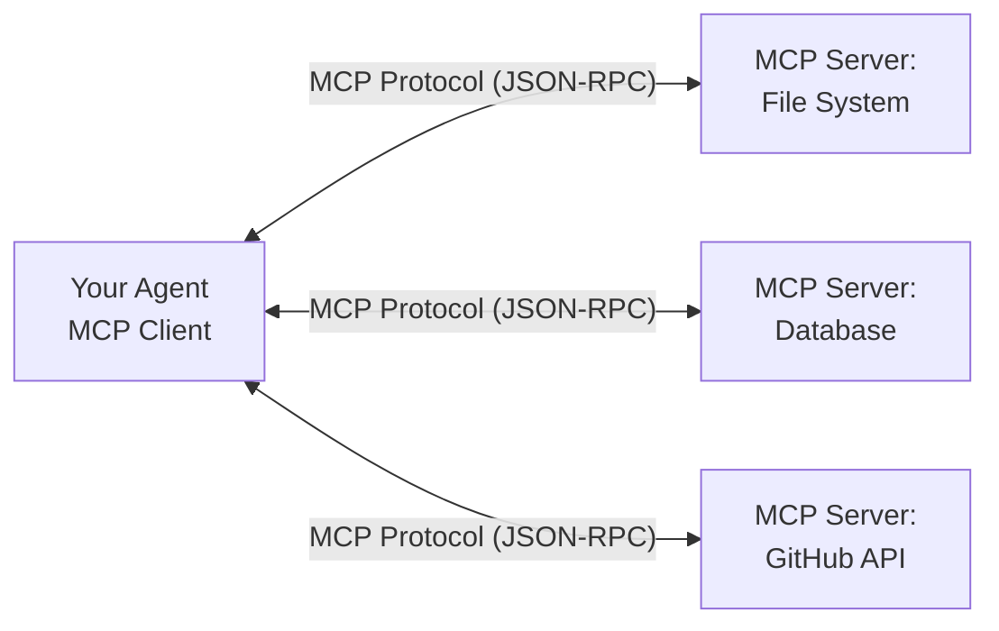
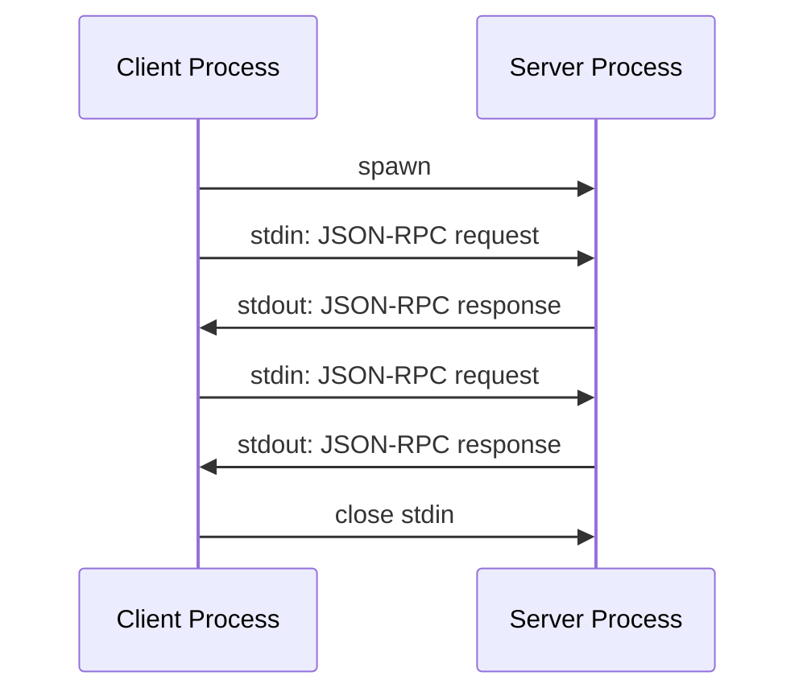
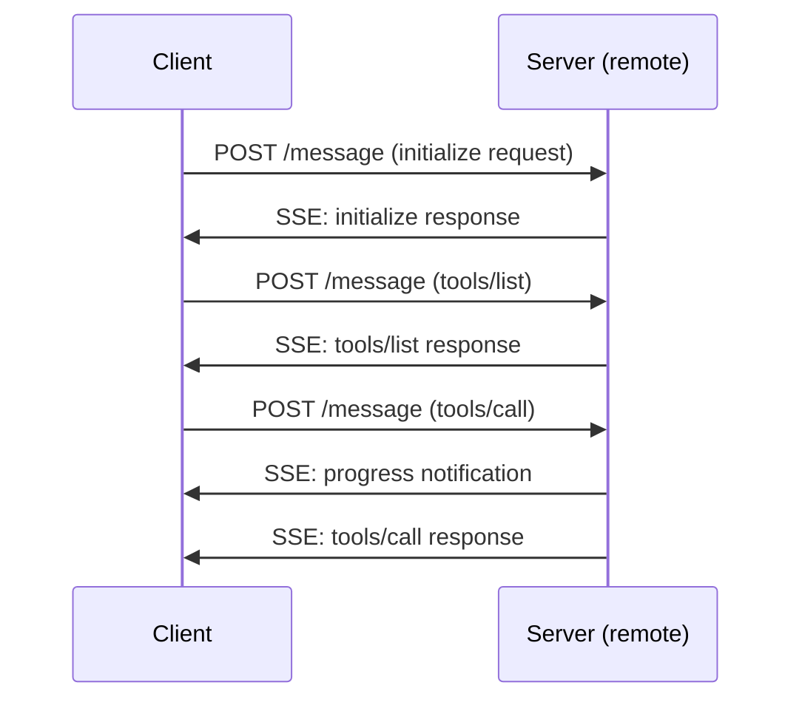

# MCP Protocol Overview

> **What you'll learn:**
> - What the Model Context Protocol is and why it matters for the agent tooling ecosystem
> - How MCP defines tool discovery, invocation, and resource access through JSON-RPC
> - The transport layer options (stdio, HTTP+SSE) and how they affect deployment topology

So far, every tool in your agent runs inside the same process. The security hook, the file reader, the shell executor -- they all share the same memory space and the same binary. This works, but it creates two problems. First, adding a tool requires recompiling the agent. Second, tools written in other languages cannot participate. The Model Context Protocol (MCP) solves both problems by defining a standard way for AI agents to communicate with external tool servers over a well-defined protocol.

## What Is MCP?

MCP is an open protocol, originally developed by Anthropic, that standardizes how AI applications connect to external data sources and tools. Think of it as a USB port for AI agents -- a universal interface that any tool server can plug into. Instead of each agent inventing its own plugin format, MCP provides a shared specification that works across agents, languages, and deployment environments.

The protocol has three core concepts:

1. **Tools** -- Functions that an MCP server exposes for the AI to invoke (like `read_file`, `query_database`, `search_web`)
2. **Resources** -- Data that the server can provide as context (like file contents, database schemas, documentation)
3. **Prompts** -- Reusable prompt templates the server offers to guide the AI's behavior for specific tasks

An MCP server is a process that implements one or more of these capabilities. An MCP client (your agent) connects to servers, discovers what they offer, and makes those capabilities available to the LLM.



::: python Coming from Python
If you have used Python's Language Server Protocol (LSP) support in editors, MCP follows a similar idea. LSP standardized how editors talk to language intelligence servers. MCP standardizes how AI agents talk to tool servers. In Python, you might connect to an LSP server with:
```python
import subprocess
process = subprocess.Popen(
    ["pyright-langserver", "--stdio"],
    stdin=subprocess.PIPE, stdout=subprocess.PIPE
)
# Send JSON-RPC messages over stdio
```
MCP uses the same JSON-RPC protocol and the same stdio transport. The concepts transfer directly -- the difference is that MCP messages are about tool invocation and resource access rather than code intelligence.
:::

## The JSON-RPC Foundation

MCP uses JSON-RPC 2.0 as its message format. Every message is a JSON object with a specific structure:

**Request** (client to server or server to client):
```json
{
    "jsonrpc": "2.0",
    "id": 1,
    "method": "tools/call",
    "params": {
        "name": "read_file",
        "arguments": {
            "path": "/home/user/project/src/main.rs"
        }
    }
}
```

**Response** (matching a request by ID):
```json
{
    "jsonrpc": "2.0",
    "id": 1,
    "result": {
        "content": [
            {
                "type": "text",
                "text": "fn main() {\n    println!(\"Hello, world!\");\n}"
            }
        ]
    }
}
```

**Notification** (no response expected):
```json
{
    "jsonrpc": "2.0",
    "method": "notifications/progress",
    "params": {
        "progressToken": "abc123",
        "progress": 50,
        "total": 100
    }
}
```

The `id` field distinguishes requests from notifications. If `id` is present, the receiver must send a response. If absent, it is a fire-and-forget notification.

## The MCP Lifecycle

Every MCP connection follows a strict lifecycle:

### 1. Initialize

The client sends an `initialize` request declaring its capabilities:

```json
{
    "jsonrpc": "2.0",
    "id": 1,
    "method": "initialize",
    "params": {
        "protocolVersion": "2024-11-05",
        "capabilities": {
            "roots": { "listChanged": true }
        },
        "clientInfo": {
            "name": "our-coding-agent",
            "version": "0.14.0"
        }
    }
}
```

The server responds with its own capabilities:

```json
{
    "jsonrpc": "2.0",
    "id": 1,
    "result": {
        "protocolVersion": "2024-11-05",
        "capabilities": {
            "tools": {},
            "resources": { "subscribe": true },
            "prompts": {}
        },
        "serverInfo": {
            "name": "filesystem-server",
            "version": "1.0.0"
        }
    }
}
```

### 2. Initialized Notification

After processing the server's response, the client sends an `initialized` notification:

```json
{
    "jsonrpc": "2.0",
    "method": "notifications/initialized"
}
```

This signals that the handshake is complete and normal operations can begin.

### 3. Discovery

Now the client discovers what the server offers. List available tools:

```json
{
    "jsonrpc": "2.0",
    "id": 2,
    "method": "tools/list"
}
```

Response:

```json
{
    "jsonrpc": "2.0",
    "id": 2,
    "result": {
        "tools": [
            {
                "name": "read_file",
                "description": "Read the contents of a file",
                "inputSchema": {
                    "type": "object",
                    "properties": {
                        "path": {
                            "type": "string",
                            "description": "Path to the file to read"
                        }
                    },
                    "required": ["path"]
                }
            },
            {
                "name": "write_file",
                "description": "Write content to a file",
                "inputSchema": {
                    "type": "object",
                    "properties": {
                        "path": { "type": "string" },
                        "content": { "type": "string" }
                    },
                    "required": ["path", "content"]
                }
            }
        ]
    }
}
```

Similarly, `resources/list` and `prompts/list` discover other capabilities.

### 4. Tool Invocation

When the LLM wants to use a tool, the client sends a `tools/call` request:

```json
{
    "jsonrpc": "2.0",
    "id": 3,
    "method": "tools/call",
    "params": {
        "name": "read_file",
        "arguments": {
            "path": "/home/user/project/Cargo.toml"
        }
    }
}
```

The server executes the tool and returns the result:

```json
{
    "jsonrpc": "2.0",
    "id": 3,
    "result": {
        "content": [
            {
                "type": "text",
                "text": "[package]\nname = \"coding-agent\"\nversion = \"0.14.0\""
            }
        ],
        "isError": false
    }
}
```

### 5. Shutdown

When the client is done, it closes the connection. For stdio transport, this means closing stdin. For HTTP, it disconnects the SSE stream.

## Transport Options

MCP supports two primary transports:

### Stdio Transport

The client spawns the MCP server as a child process and communicates over stdin/stdout:



Stdio is the simplest transport and the most common for local development. The server runs as a child process -- no network configuration needed. Messages are newline-delimited JSON.

### HTTP with Server-Sent Events (Streamable HTTP)

For remote servers or multi-client scenarios, MCP uses HTTP. The client sends requests via HTTP POST and receives responses and notifications through a Server-Sent Events stream:



The HTTP transport enables sharing a single MCP server across multiple agent instances, running servers on remote machines, and connecting through firewalls.

::: wild In the Wild
Claude Code supports MCP natively. Users configure MCP servers in their project settings (`.claude/settings.json`) or global settings. Claude Code launches each server as a child process using the stdio transport and discovers tools during initialization. The tools appear alongside built-in tools -- the LLM does not know or care whether a tool is built-in or provided by an MCP server. OpenCode also supports MCP servers with a similar configuration-driven approach, showing that MCP is becoming the standard extension mechanism across coding agents.
:::

## MCP vs. Direct Plugin APIs

Why use MCP instead of the direct plugin API you built earlier? Each approach has its place:

| Aspect | Direct Plugin API | MCP |
|--------|------------------|-----|
| **Language** | Rust only | Any language with JSON-RPC |
| **Performance** | In-process, zero serialization | IPC overhead, JSON serialization |
| **Isolation** | Shared process space | Separate process, natural isolation |
| **Ecosystem** | Custom to your agent | Shared across all MCP-compatible agents |
| **Complexity** | Simple trait implementation | Full protocol lifecycle |
| **Discovery** | Compile-time known | Runtime discovery via protocol |

The practical approach is to use both: direct plugins for core functionality that needs maximum performance, and MCP for community extensions that benefit from language independence and the broader ecosystem. When a user adds an MCP server for PostgreSQL access, it works with your agent, Claude Code, and any other MCP-compatible agent without modification.

## The MCP Ecosystem

The MCP ecosystem is growing rapidly. Available MCP servers include:

- **Filesystem** -- Read, write, and search files (the reference implementation)
- **Git** -- Repository operations, log inspection, diff viewing
- **Database** -- PostgreSQL, SQLite, and other database access
- **Web** -- Fetch web pages, search the web, interact with APIs
- **Memory** -- Persistent key-value storage across sessions
- **Slack, GitHub, Jira** -- Integration with development tools and communication platforms

Each of these is a standalone process that speaks MCP. Your agent connects to whichever servers the user configures. No code changes needed -- just configuration.

## Key Takeaways

- MCP is an open protocol that standardizes how AI agents communicate with external tool servers, providing a "USB port" for agent extensions that works across implementations
- The protocol is built on JSON-RPC 2.0 with a defined lifecycle: initialize, discover capabilities, invoke tools/resources/prompts, and shutdown
- Two transport options serve different needs: stdio for local development (spawning servers as child processes) and HTTP+SSE for remote and multi-client deployments
- MCP servers are language-independent -- any language that can do JSON over stdio or HTTP can implement an MCP server, unlocking a shared ecosystem across agents
- Use direct plugins for performance-critical core functionality and MCP for community extensions that benefit from language independence and cross-agent compatibility
