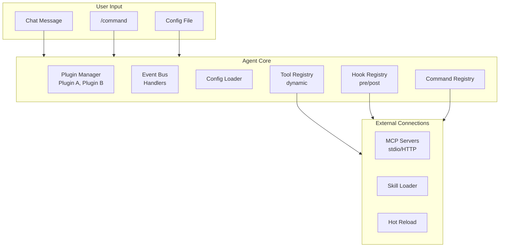

# Summary

> **What you'll learn:**
> - How all extensibility mechanisms -- plugins, events, hooks, MCP, skills -- form a cohesive platform
> - Which extension patterns provide the highest value for the least implementation complexity
> - How to evolve the plugin system as the agent and its community grow

This chapter transformed your coding agent from a closed application into an extensible platform. You started with a monolithic agent where every capability was compiled in, and you built the infrastructure that lets anyone -- including people who do not write Rust -- add tools, modify behavior, and connect external systems. Let's review what you built and how the pieces fit together.

## The Extension Architecture at a Glance

Here is a summary of every extension mechanism you implemented and where it fits:

## What You Built

### Core Infrastructure

| Component | Purpose | Key Type |
|-----------|---------|----------|
| **Plugin Architecture** | Lifecycle management, dependency resolution, extension points | `Plugin` trait, `PluginManager` |
| **Tool Registry** | Dynamic tool registration with schema validation and conflict resolution | `ToolRegistry`, `ToolHandler` |
| **Event Bus** | Pub-sub event system for agent lifecycle notifications | `EventBus`, `AgentEvent` |
| **Hook Registry** | Synchronous interception points for modifying or vetoing operations | `HookRegistry`, `HookAction` |

### Protocol and Integration

| Component | Purpose | Key Type |
|-----------|---------|----------|
| **MCP Client** | Connect to external tool servers via the Model Context Protocol | `McpClient`, `StdioTransport` |
| **MCP Bridge** | Integrate MCP-provided tools into the agent's tool registry | `McpToolBridge` |
| **Skill Loader** | Bundle and manage coherent sets of tools, prompts, and config | `SkillLoader`, `SkillDefinition` |
| **Command Registry** | User-facing slash commands with argument parsing and tab completion | `CommandRegistry`, `SlashCommand` trait |

### Operations and Quality

| Component | Purpose | Key Type |
|-----------|---------|----------|
| **Config Loader** | Declarative extensions via TOML/JSON without writing code | `AgentConfig`, `ConfigLoader` |
| **Hot Reloading** | Watch files for changes and apply them without restart | `ReloadManager`, `FileWatcher` |
| **Plugin Isolation** | Fault boundaries, timeouts, and resource tracking | `FaultBoundary`, `ResourceTracker` |
| **Test Harness** | Mock environment for plugin developers to test against | `PluginTestHarness` |

## The Extension Spectrum

Not all extension mechanisms are equally complex or useful. Here they are ordered by implementation effort and practical value:

### High Value, Low Effort

1. **Config-driven tools** -- Shell command tools defined in TOML. Users write zero code, and the tools work immediately. This covers the vast majority of simple extensions.

2. **MCP servers** -- Point the agent at an existing MCP server and its tools appear automatically. The ecosystem provides dozens of ready-made servers for databases, APIs, and services.

3. **System prompt injection** -- CLAUDE.md-style project files that inject context. Simple text files that dramatically improve agent behavior for specific projects.

### High Value, Medium Effort

4. **Hook configuration** -- Shell commands that run at lifecycle points. Security checks, audit logging, and custom notifications without compiled code.

5. **Skill packages** -- TOML-defined bundles of tools and prompts with context-aware activation. Reusable across projects.

6. **Slash commands** -- Direct user actions that bypass the LLM. Essential for agent control (clear context, switch models, check status).

### High Value, High Effort

7. **Plugin trait implementation** -- Full compiled plugins with access to all registries. Maximum power and performance, but requires Rust.

8. **Event system** -- Useful for cross-cutting concerns like metrics and logging, but most plugin developers do not need it directly.

9. **Extension marketplace** -- Discovery and distribution infrastructure. Essential at scale, but only worth building after you have an active plugin community.

::: python Coming from Python
This spectrum mirrors the Python ecosystem's evolution. Python started with simple script-based extensions (like config-driven tools), grew to support entry-point-based plugins (like the Plugin trait), and eventually built PyPI for distribution (like the marketplace). The lesson: start simple and add complexity only when the simpler approaches are insufficient. Most users will never need the full Plugin trait -- config-driven tools and MCP servers cover 90% of real-world needs.
:::

## How Production Agents Approach Extensibility

::: wild In the Wild
Production coding agents take pragmatic approaches to extensibility:

**Claude Code** focuses on three mechanisms: MCP servers for tool extensibility, hooks (shell commands at lifecycle points) for behavior modification, and CLAUDE.md files for project-specific prompting. This covers the high-value, low-effort quadrant. There is no formal plugin API or marketplace -- the focus is on mechanisms that non-developers can use.

**OpenCode** provides MCP support and a clean tool interface, making it straightforward to add tools by implementing the Tool interface in Go. It does not have a hook system or marketplace -- extensibility comes through code contributions and MCP servers.

The trend is clear: MCP is becoming the universal extension mechanism. Rather than each agent defining its own plugin format, the community is converging on MCP as the shared interface. Write an MCP server once, and it works with every compatible agent.
:::

## Evolving the Plugin System

As your agent grows, the extension system will evolve. Here is a practical roadmap:

**Phase 1: Core** (what you built in this chapter)
- Plugin trait and manager
- Tool, event, hook, and command registries
- Config-driven tools and MCP support

**Phase 2: Ecosystem**
- Publish a catalog of official MCP server recommendations
- Create a skill package format and share common skills
- Document the plugin API for community developers

**Phase 3: Distribution**
- Build or adopt a registry for extension discovery
- Implement install/update commands
- Establish a security review process for community contributions

**Phase 4: Advanced**
- WebAssembly-based plugin isolation for untrusted code
- Plugin composition (plugins that extend other plugins)
- Analytics and quality metrics for published extensions

## What Comes Next

In [Chapter 15: Production Polish](/project/15-production-polish/), you will take everything you have built -- from the basic REPL in Chapter 1 through the extensible platform in this chapter -- and prepare it for real-world use. You will add logging, error reporting, performance profiling, graceful shutdown, and the polish that separates a prototype from a production tool.

The extension system you built here is what makes that production transition worthwhile. A polished agent that only does what you built is useful. A polished agent that anyone can extend is a platform.

## Exercises

Practice each concept with these exercises. They build on the extensibility and plugin system you created in this chapter.

### Exercise 1: Create a Config-Driven Tool (Easy)

Define a new tool entirely in TOML configuration (no Rust code). Create a `git-status` tool that runs `git status --short` in the project root and returns the output. Add it to your `.kodai/tools.toml` file, reload the config, and verify it appears in the tool registry and can be invoked by the LLM.

- Define the tool in TOML with `name`, `description`, `command`, and `working_dir` fields
- Set the `input_schema` to accept an optional `path` parameter for checking status of a subdirectory
- Test by sending a message like "What files have changed?" and verifying the agent uses your tool

### Exercise 2: Add a /plugins Status Command (Easy)

Implement a `/plugins` REPL command that lists all loaded plugins with their name, version, status (active/disabled/errored), and the number of tools, hooks, and commands each one registered. Include MCP servers as a separate section showing their connection status.

- Iterate through `PluginManager`'s loaded plugins and format each entry
- For MCP servers, show the transport type (stdio/HTTP) and connection state
- Display a summary line at the bottom: `[4 plugins active, 12 tools, 3 hooks, 2 MCP servers]`

### Exercise 3: Implement a Pre-Execution Hook (Medium)

Add a hook that runs before every shell command execution. The hook receives the command string and working directory, and can modify the command, allow it unchanged, or block it. Implement a concrete hook that prepends `time` to every command so the LLM can see execution duration.

**Hints:**
- Define the hook point as `HookPoint::PreShellExec` in the `HookRegistry`
- The hook function signature should be `fn(command: &str, cwd: &Path) -> HookAction` where `HookAction` is `Allow(String)`, `PassThrough`, or `Block(String)`
- Register the timing hook: it transforms `"cargo test"` into `"time cargo test"` by returning `HookAction::Allow(format!("time {}", command))`
- Test that blocked hooks return the block reason as a tool error

### Exercise 4: Build an MCP Server Connector (Medium)

Implement a function that connects to an MCP server via stdio transport, performs the initialization handshake, queries the server's tool list, and registers those tools in your agent's `ToolRegistry`. Test it against a simple MCP server that provides one tool (you can use an existing MCP server or write a minimal one as a script).

**Hints:**
- Spawn the MCP server process with `tokio::process::Command` and piped stdin/stdout
- Send the `initialize` JSON-RPC message and parse the response to get server capabilities
- Send `tools/list` to get available tools, then create `McpToolBridge` instances for each
- Each bridged tool should forward `execute()` calls as `tools/call` JSON-RPC messages to the server
- Handle server disconnection gracefully by removing bridged tools from the registry

### Exercise 5: Build a Complete Plugin with Lifecycle Management (Hard)

Create a full plugin that implements the `Plugin` trait, registers two custom tools (e.g., `http-get` for fetching URLs and `json-query` for extracting values from JSON using a path expression), subscribes to the `ToolExecuted` event for logging, and supports hot-reloading its configuration. Package it as a separate module that can be loaded at startup.

**Hints:**
- Implement all `Plugin` lifecycle methods: `init()`, `on_load()`, `on_unload()`, `name()`, `version()`
- In `on_load()`, register your tools with `context.tool_registry.register()` and subscribe to events with `context.event_bus.subscribe()`
- The `http-get` tool should use `reqwest::blocking::get()` with a timeout; the `json-query` tool should accept a JSON string and a dot-separated path like `"data.users[0].name"`
- For hot-reloading, watch a config file and call `on_unload()` then `on_load()` when it changes, re-registering tools with updated configuration
- Write tests using `PluginTestHarness` that verify tool registration, execution, event handling, and reload behavior

## Key Takeaways

- The extensibility system has three tiers: config-driven extensions (no code, highest accessibility), protocol-based extensions (MCP, any language), and compiled plugins (maximum power, Rust only)
- Start with the high-value, low-effort patterns: config-driven tools, MCP servers, and prompt injection cover 90% of real-world extension needs without requiring users to write Rust
- The event bus, hook registry, tool registry, and command registry form the internal extension API surface, connected through `Arc<RwLock<_>>` for thread-safe concurrent access
- MCP is converging as the universal extension protocol for AI agents -- building MCP support gives your agent access to a growing ecosystem shared across all compatible agents
- Plugin isolation through fault boundaries, resource tracking, and process separation ensures that the agent remains stable even when third-party extensions misbehave
