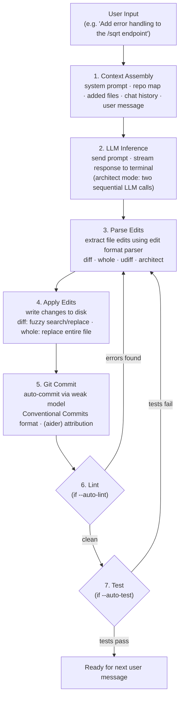
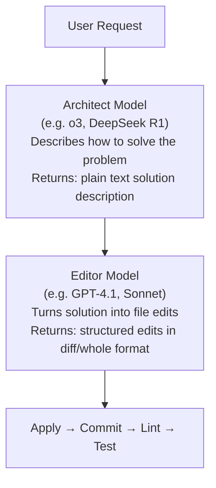

# Aider — The Edit-Apply-Lint-Test Loop

## Overview

Aider's core loop is simpler than a full autonomous agent loop — it's a **human-directed, single-turn edit cycle** with optional automated lint/test feedback. The human remains in control of the conversation, but within each turn, aider can iterate autonomously on lint and test failures.

This is a key distinction from tools like Claude Code or Devin: aider doesn't plan multi-step strategies, browse documentation, or decide what to do next. The user tells it what to change, and aider focuses on producing correct edits.

## The Core Loop

## Detailed Step Breakdown

### Step 1: Context Assembly

The context assembly is where aider's intelligence lives. For each LLM call, it constructs a prompt containing:

1. **System prompt** — Instructions specific to the edit format (e.g., "Return edits as SEARCH/REPLACE blocks"). Each format has its own `*_prompts.py` file with carefully crafted instructions.

2. **Repo map** — A ranked, token-budgeted summary of the codebase. The map dynamically expands when no files have been added to chat (to help the LLM understand the full repo) and contracts as files are added and conversation grows.

3. **Added files** — Full content of files the user has `/add`'d to the chat. These are the files the LLM is allowed to edit.

4. **Read-only files** — Files added with `/read-only` that provide context but can't be edited.

5. **Chat history** — Previous messages in the conversation. Aider manages this carefully — it summarizes old messages when the context grows too large.

6. **The user's message** — The actual request.

### Step 2: LLM Inference

Aider streams the LLM response in real time, displaying it in the terminal with syntax highlighting. Key behaviors:

- **Streaming display** — Code appears as it's generated, with live syntax highlighting
- **Token counting** — Tracks tokens used and remaining budget
- **Retry logic** — Handles rate limits and transient API errors with exponential backoff

### Step 3: Parse Edits

Each edit format has its own parser. The parsers must handle LLM imperfections:

- **Fuzzy matching** for diff format — if the SEARCH block doesn't exactly match the file, aider tries fuzzy matching (stripping whitespace, ignoring blank lines, etc.)
- **Multiple edit blocks** — A single response can contain edits to multiple files
- **New file creation** — The LLM can create new files by specifying a path that doesn't exist

### Step 4: Apply Edits

For the `diff` (search/replace) format, application involves:
1. Find the SEARCH text in the file
2. If exact match fails, try progressively fuzzier matching
3. Replace with the REPLACE text
4. Handle multiple edits to the same file in order

For the `whole` format, the entire file is simply replaced.

### Step 5: Git Commit

The auto-commit is notable for its design:
- Uses the **weak model** (a cheaper, faster model) to generate commit messages
- Sends the diff and chat context to the weak model
- Follows Conventional Commits format by default
- Commit message prompt is customizable
- Dirty files are pre-committed to protect user work

### Steps 6-7: Lint and Test Feedback Loop

This is where aider becomes somewhat agentic — it can **autonomously iterate** on lint and test failures:

1. Run linter/tests on modified files
2. If errors found, send error output back to the LLM
3. LLM produces new edits to fix the errors
4. Apply edits, commit, lint/test again
5. Repeat with bounded retries

This is the same approach used in the benchmark: the LLM gets two attempts (initial + one fix attempt based on test output).

## Architect Mode: The Two-Model Loop

In architect mode, the loop expands:

This split allows:
- **Reasoning models** (o1, o3, R1) to focus purely on problem-solving
- **Code-editing models** (Sonnet, GPT-4o) to focus on producing clean, parseable edits
- Each model plays to its strengths

## Comparison to Autonomous Agent Loops

| Aspect | Aider | Autonomous Agents (Claude Code, etc.) |
|--------|-------|--------------------------------------|
| **Who decides what to do?** | The human | The agent (with tool calls) |
| **Multi-step planning** | No — single-turn edits | Yes — plans and executes |
| **Tool use** | Edit files, run lint/test | Shell, browser, file ops, search |
| **Iteration** | On lint/test failures only | On any sub-goal failure |
| **Context management** | Manual (/add, /drop) | Automatic (agent decides) |
| **Strengths** | Predictable, fast, low cost | Handles complex tasks autonomously |
| **Weaknesses** | Requires human guidance | Expensive, sometimes unpredictable |

## The Benchmark Loop

The benchmark (`benchmark/`) uses a simplified version of this loop:

1. Send exercise instructions + stub file to LLM
2. Parse and apply edits
3. Run unit tests
4. If tests fail, send first 50 lines of error output + "fix it" message
5. Parse and apply second attempt
6. Run tests again → record pass/fail

This two-attempt structure is the standard for the Aider leaderboard, and it's a fair approximation of real interactive use (initial attempt + one round of debugging).