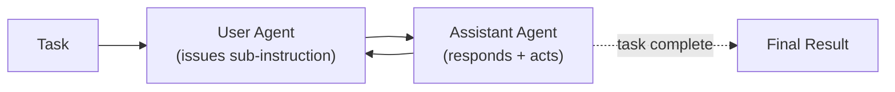

# CAMEL-AI — Agentic Loop

## Single-Agent: ChatAgent

The base loop is a `ChatAgent.step(message)` call: provide a message,
get a response, optionally with tool calls executed in between. This is
the basic building block.

```python
from camel.agents import ChatAgent
agent = ChatAgent(system_message=..., model=..., tools=[...])
response = agent.step(user_message)
```

The README's "Starting with ChatAgent" snippet is the entry point for
new users.

## Multi-Agent: Role-Playing

The original CAMEL pattern is two `ChatAgent`s with complementary
roles — typically a "user" agent (issues instructions) and an
"assistant" agent (executes them). They converse, with each turn
becoming the next turn's input, until a task-completion criterion is
met.



This is the loop described in the original arXiv:2303.17760 paper that
gave the project its name.

## Workforce

Workforce generalises role-play into N-agent teams with explicit
hierarchies (managers, workers, reviewers). The loop becomes a
managed dispatch: a coordinator allocates sub-tasks to specialists,
collects results, and retries / escalates as needed. Long-horizon tasks
benefit from this — each agent specialises on a piece of the work
without inflating any single context.

The TB2 coding-mode entry almost certainly uses a Workforce
configuration, though the public docs don't enumerate the exact roles.

## OWL Loop

OWL (sister project) implements its own multi-agent collaboration loop
on top of CAMEL primitives. The OWL README claims SOTA-OSS on GAIA
(69.09 avg). The loop emphasises **dynamic agent interactions** — agents
choosing which other agents to invoke at runtime — over static
hierarchies.

## Loop Cap

Per-agent step caps are configurable; framework defaults are not
foregrounded in the README. For long-running multi-agent simulations,
the project explicitly supports very high turn counts (the "1M agents"
scaling claim presupposes this).

## Stop Conditions

Termination is task-dependent. For role-play this is typically a
"task completed" signal from one of the agents; for Workforce it's a
manager-agent decision; for data-generation runs it's reaching the
target dataset size.

## Public Loop Detail Limits

The framework is large and the loop varies substantially across:

- single-agent (`ChatAgent.step`)
- two-agent role-play
- Workforce N-agent
- OWL dynamic collaboration
- Data-generation pipelines

There is no single "CAMEL agent loop" diagram that covers all of these.
The TB2 submission represents one specific configuration whose details
aren't published.

---

*Loop description synthesised from `camel-ai/camel` README, the original
CAMEL paper (arXiv:2303.17760), and the OWL repo.*
