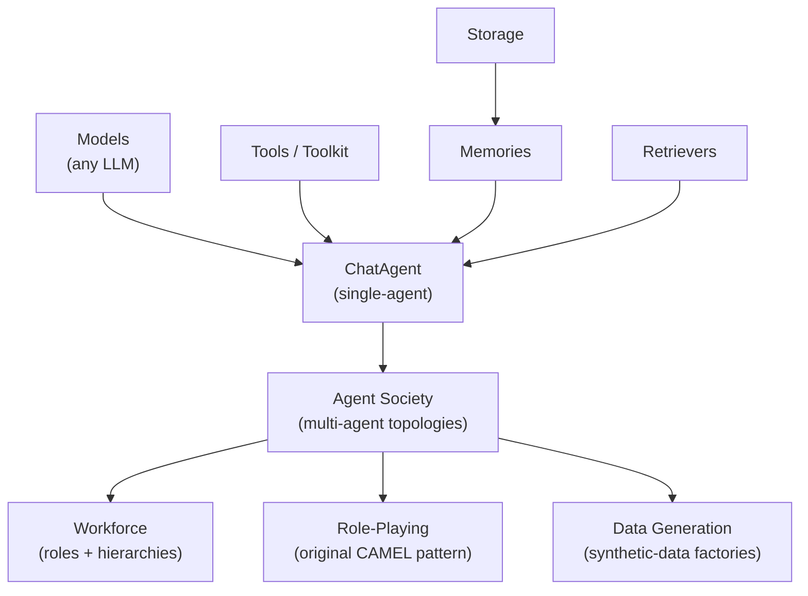

# CAMEL-AI — Architecture

## Framework Layers

CAMEL is a layered framework, not a single agent. Layers from bottom up
(synthesised from the project README and tech stack page):

The ecosystem also includes Data Loaders, Environments, Interpreters,
Verifiers, MCP, Human-in-the-Loop, and Observe (observability)
components — all listed on the
[CAMEL tech stack page](https://www.camel-ai.org/techstacks).

## ChatAgent

The base abstraction. A `ChatAgent` is a single LLM-backed agent with:

- a system prompt (role)
- tools
- memory
- model client

This is the primitive used to build everything else. The README's
quickstart is an instantiation of `ChatAgent`.

## Agent Societies

Multi-agent topologies built on `ChatAgent`. The original CAMEL
contribution is a two-agent role-playing setup (e.g. user proxy +
assistant) that converse to complete a task. The framework now supports
many other topologies under the **Workforce** abstraction.

## Workforce

Models real agent workforces with roles, hierarchies, and long-horizon
tasks. This is the abstraction most relevant to the TB2 coding-mode
submission — a configurable team of agents (planner, executor,
reviewer, etc.) operating on a shared task.

The exact Workforce configuration used for the TB2 #58 entry isn't
publicly documented.

## Code-as-Prompt Principle

One of CAMEL's four stated design principles:

> *"Each line of code or comment serves as a prompt for agents. Code
> should be written clearly and readably, ensuring that both humans and
> agents can interpret it effectively."*

This shapes the framework's API style — verbose, descriptive,
heavily-commented — which is unusual but intentional.

## Statefulness

Another core principle. Agents maintain context across multi-step
interactions; memory is a first-class component, not an add-on. This
makes CAMEL agents a natural fit for long-horizon coding tasks even
though the framework wasn't built coding-first.

## OWL: Sister Project

[`camel-ai/owl`](https://github.com/camel-ai/owl) is a multi-agent
collaboration framework built on top of CAMEL. OWL is what reaches **#1
on GAIA among open-source frameworks** (69.09 avg). It's worth
mentioning because OWL's design feeds back into CAMEL — CAMEL and OWL
co-evolve, and OWL's GAIA results are often cited when evaluating
CAMEL.

## Repository

- `camel-ai/camel` — the framework
- `camel-ai/owl` — multi-agent collaboration on top
- Apache 2.0
- Cited paper: arXiv:2303.17760 (original CAMEL)

---

*Architecture from `camel-ai/camel` README, `camel-ai.org`, and the
OWL repo. The TB2 submission's exact Workforce config is not published.*
