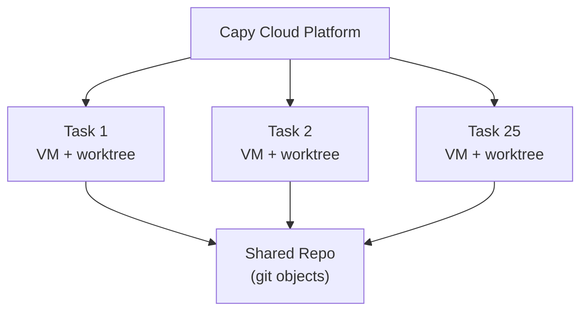

# Capy — Architecture

> Cloud-based IDE with a distinctive two-agent architecture: Captain (planning) and Build (execution), running in isolated sandboxed VMs.

## Overview

Capy is a **cloud-based IDE platform**, not a local CLI agent or editor extension. The entire development environment — code editing, agent orchestration, execution — runs in the cloud. This architectural decision enables Capy's core value proposition: parallel execution of many tasks simultaneously, each in isolated environments.

The most distinctive architectural element is the **Captain/Build split** — two separate agents with hard-enforced capability boundaries that handle planning and execution respectively.

## The Captain/Build Two-Agent Architecture

Capy's core insight, detailed in their blog post "Captain vs Build: Why We Split the AI Agent in Two" (Feb 2026), is that **planning and execution should be handled by different agents with non-overlapping capabilities**.

### Captain (Planning Agent)

- **Role**: Technical architect who PLANS but never IMPLEMENTS
- **System prompt**: _"You are a technical architect who PLANS but never IMPLEMENTS."_
- **Can do**: Read codebases, research documentation, ask the user clarifying questions, write exhaustive specs
- **Cannot do**: Write production code, run terminal commands, push commits
- **Output**: A spec document (described as "a short PRD") that fully describes the implementation task

Captain's hard constraint — it literally cannot write code — forces it to produce thorough, unambiguous specifications. This is a deliberate architectural enforcement, not just a prompt instruction.

### Build (Execution Agent)

- **Role**: Autonomous executor that receives specs and ships code
- **System prompt**: _"You are an autonomous AI agent with access to an Ubuntu virtual machine to complete the user's coding and research tasks independently and asynchronously."_
- **Can do**: Edit files, install dependencies, run tests, open pull requests, full Ubuntu VM with sudo access
- **Cannot do**: Ask the user clarifying questions mid-task
- **Input**: The spec from Captain + access to the codebase

Build's hard constraint — it cannot ask questions — forces Captain to be thorough. If the spec is ambiguous, Build must make its best judgment rather than pausing for clarification.

### Why the Split Matters

Traditional single-agent systems (Claude Code, Cursor Agent, Codex) use one agent for both planning and execution. This often leads to:

1. **Premature implementation** — the agent starts coding before fully understanding the task
2. **Wasted iterations** — ambiguities surface only after code is written, requiring multiple rounds
3. **Context pollution** — planning context and execution context compete for the same window

The Captain/Build split addresses all three by making the spec the mandatory interface between planning and execution.

## Cloud Execution Model

### Sandboxed Ubuntu VMs

Each task (or "jam") runs in its own **sandboxed Ubuntu virtual machine**:

- Full OS environment with sudo access for the Build agent
- Isolated from other tasks and other users
- Can install dependencies, run builds, execute test suites
- Network access for package managers and API calls

### Git Worktree Isolation

Capy uses **git worktrees by default** to prevent merge conflicts between parallel tasks:

- Each task operates on its own worktree (separate working directory, shared git objects)
- Multiple tasks can modify different parts of the same repository simultaneously
- No risk of one task's in-progress changes interfering with another

This is critical for the parallel execution model — without worktree isolation, running 25 concurrent tasks on the same repo would be chaos.

### Parallel Execution

The Pro plan supports up to **25 concurrent jams**, each with its own VM and worktree.

## Model Layer

Capy is **model-agnostic** — it does not lock users into a single LLM provider:

| Provider | Models |
|----------|--------|
| Anthropic | Claude Opus 4.6 |
| OpenAI | GPT-5.3 Codex |
| Google | Gemini 3 Pro |
| xAI | Grok 4 Fast |
| Moonshot | Kimi K2 |
| Zhipu | GLM 4.7 |
| Alibaba | Qwen 3 Coder |

Both Captain and Build can presumably use different models, though the exact model routing logic is not publicly documented.

## Security

- **SOC 2 Type II** certified (March 2026)
- Per-task VM sandboxing
- Enterprise plan with custom security configurations

## Limitations of This Analysis

Capy is a **closed-source commercial product**. There is no public GitHub repository, no open-source codebase to inspect, and internal architecture details beyond what's described in marketing materials and blog posts are not available. The Captain/Build system prompt snippets come from Capy's own blog post.
