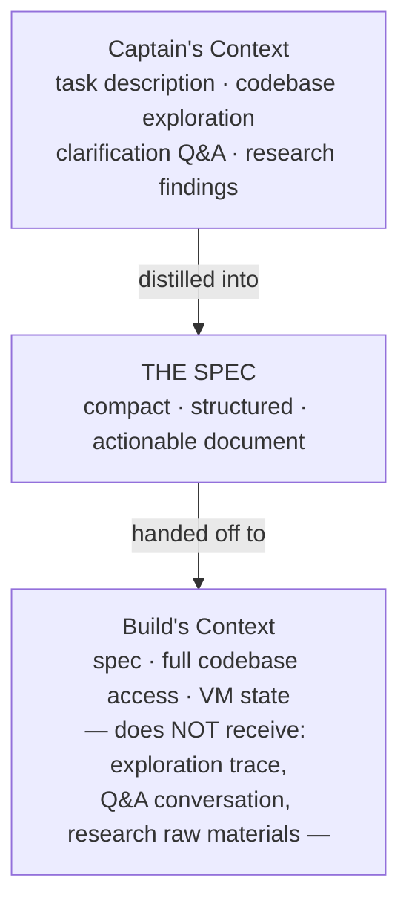

# Capy — Context Management

> The spec is the context handoff mechanism between Captain and Build. Limited internal details are publicly available.

## Overview

Capy's context management strategy is fundamentally shaped by its **two-agent architecture**. Rather than managing a single, growing context window (as terminal agents like Claude Code or Aider must), Capy uses the **spec as a context boundary** — a structured handoff document that transfers relevant knowledge from Captain to Build without carrying over the full planning conversation.

## The Spec as Context Handoff

The central context management pattern in Capy is the **spec document** produced by Captain:

This is architecturally significant because:

1. **Context compression is forced**: Captain must distill all relevant information into a spec. Irrelevant exploration paths, dead ends, and verbose clarification dialogues are naturally excluded.

2. **Build starts fresh**: Build doesn't inherit Captain's growing context window. It receives a clean, focused document plus codebase access. This means Build's context budget is spent on code, not on planning history.

3. **Separation prevents pollution**: In single-agent systems, planning context (research, exploration, user back-and-forth) competes with execution context (code, test output, error messages) for the same finite window. The Captain/Build split eliminates this competition.

## Captain's Context During Planning

During the planning phase, Captain's context includes:

- **User's task description**: The original request and any referenced issues
- **Codebase content**: Files and directories Captain reads during exploration
- **Clarification history**: The Q&A dialogue with the user
- **Research materials**: Documentation, dependencies, patterns discovered

Captain must manage this growing context to produce a useful spec. The exact mechanisms (compaction, summarization, selective retrieval) are not publicly documented.

## Build's Context During Execution

During execution, Build's context includes:

- **The spec**: The structured document from Captain — this is the primary context
- **Codebase state**: Files being edited, test outputs, build results
- **VM state**: Installed packages, environment variables, running processes

Build operates **asynchronously and autonomously**, so its context management must handle the full execution lifecycle without human intervention. If Build runs into issues, it must resolve them using only the spec and codebase — it cannot request more context from the user.

## Codebase Exploration

Both agents need to understand the codebase, but at different phases:

| Aspect | Captain | Build |
|--------|---------|-------|
| **When** | During planning | During execution |
| **Purpose** | Understand architecture for spec writing | Navigate code for implementation |
| **Depth** | Broad exploration of patterns and structure | Focused on files being modified |
| **Output** | Informs the spec | Informs code edits |

## Task-Level Isolation

Each task in Capy operates in complete isolation:

- **Separate git worktree**: No file-level conflicts between parallel tasks
- **Separate VM**: No process-level conflicts
- **Separate context**: No context contamination between tasks

This means parallel tasks don't share context at all — each Captain/Build pair operates independently.

## What's Not Publicly Known

- Exact format and structure of spec documents
- Whether Captain uses any form of RAG or embedding-based retrieval
- Context window sizes or compaction strategies
- How Build handles context overflow during long execution runs
- Whether there's any context sharing mechanism between related tasks
- Caching or persistence of codebase exploration results
