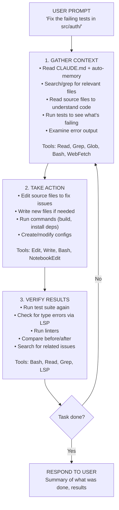
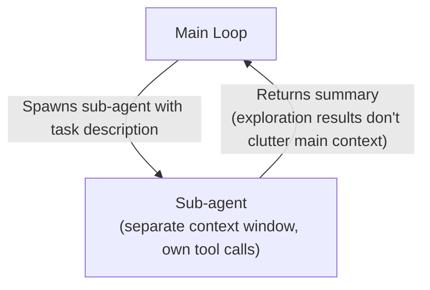

# Claude Code — Agentic Loop

> How Claude Code's agentic execution loop works, based on official documentation and observable behavior.

## Overview

Claude Code's core execution model is a **three-phase agentic loop**: gather context → take action → verify results. These phases blend together fluidly — Claude uses tools throughout, whether searching files to understand code, editing to make changes, or running tests to verify.

The loop repeats until the task is complete. The user can interrupt at any point to redirect, provide context, or ask Claude to try a different approach.

## The Loop in Detail



## Phase Behavior

### Adaptive Phase Selection

The loop adapts to the task type:

- **Question about codebase**: Mostly context gathering — search, read, then respond
- **Bug fix**: Full cycle — find the bug, fix it, verify the fix, possibly iterate
- **Refactoring**: Heavy verification — make changes, run tests, check for regressions
- **Code review**: Context gathering + analysis — read code, identify issues, report
- **PR creation**: Action-heavy — stage changes, craft commit messages, push

### Tool Chaining

Claude chains dozens of tool calls together within a single turn, course-correcting based on what it learns:

1. `Grep("error message")` → finds the relevant file
2. `Read("src/auth/session.ts")` → understands the code
3. `Bash("npm test -- --grep 'session'")` → sees the failing test
4. `Edit("src/auth/session.ts", ...)` → fixes the issue
5. `Bash("npm test -- --grep 'session'")` → verifies the fix passes
6. Continue or respond based on result

Each tool use returns information that feeds back into the loop, informing the next decision.

## Model Selection and Reasoning

### Available Models

| Model | Strengths | Typical Use |
|-------|-----------|-------------|
| **Sonnet** | Fast, cost-effective | Most coding tasks, everyday use |
| **Opus** | Strongest reasoning | Complex architecture, difficult bugs |
| **Haiku** | Fastest, cheapest | Used by Explore sub-agent, quick tasks |

Users can switch models mid-session with `/model` or start with `claude --model <name>`.

### Extended Thinking

Extended thinking is enabled by default, giving Claude space to reason through complex problems before responding:

- **Opus 4.6 / Sonnet 4.6**: Adaptive reasoning — dynamically allocates thinking tokens based on effort level
- **Older models**: Fixed thinking token budget
- **Effort levels**: `/effort low|medium|high` controls thinking depth
- **"ultrathink" keyword**: Include in prompt for maximum thinking on a single turn
- **Visible reasoning**: Press `Ctrl+O` to toggle verbose mode and see thinking as gray italic text

## User Interaction Points

The user is part of the loop. Key interaction mechanisms:

### Interruption
- **`Esc`**: Stop mid-action, context preserved, redirect immediately
- **Type while Claude works**: Claude sees your message and adjusts approach
- No need to wait for completion — just type corrections

### Rewind / Undo
- **`Esc + Esc` or `/rewind`**: Open rewind menu — restore conversation, code, or both to any checkpoint
- **"Undo that"**: Claude reverts its changes
- Checkpoints persist across sessions — close terminal, rewind later

### Context Reset
- **`/clear`**: Wipe conversation context between unrelated tasks
- Clean context with better prompt > long session with accumulated corrections

### Permission Mode Cycling
- **`Shift+Tab`**: Cycle through default → auto-accept edits → plan mode
- Plan mode: Read-only analysis, no modifications until you approve

## Sub-Agent Delegation

Claude can delegate work to sub-agents that run in separate context windows:

### Built-in Sub-Agents

| Agent | Model | Purpose | Tools |
|-------|-------|---------|-------|
| **Explore** | Haiku | Codebase search/analysis | Read-only (Read, Grep, Glob) |
| **Plan** | Inherits | Research for plan mode | Read-only |
| **General-purpose** | Inherits | Complex multi-step tasks | All tools |

### Delegation Flow



Key constraint: **Sub-agents cannot spawn other sub-agents** — this prevents infinite nesting.

### When Claude Delegates

Claude delegates to sub-agents when:
- **Exploration**: Needs to read many files without cluttering main context (→ Explore)
- **Planning**: In plan mode, needs to research codebase (→ Plan)
- **Complex tasks**: Needs both exploration and modification with complex reasoning (→ General-purpose)
- **User explicitly asks**: "Use a sub-agent to review this code"

## Headless / Non-Interactive Mode

Claude Code can run without user interaction:

```bash
# Single prompt, no interactive session
claude -p "explain the auth system" > output.txt

# Piped input
cat error.log | claude -p "explain this error"

# Plan mode headless
claude --permission-mode plan -p "analyze the authentication system"

# JSON output
claude -p "list all API endpoints" --output-format json
```

In headless mode, the agentic loop runs autonomously — no permission prompts (depending on mode), no user interruption points. Used for CI/CD integration, scripting, and automation.

## Key Observations

1. **The loop is not fixed-step**: Claude doesn't follow a rigid gather→act→verify pipeline. It dynamically decides what each step requires. A simple question may need only one read; a complex bug fix may cycle through all phases multiple times.

2. **Verification is the key to quality**: Anthropic's best practices emphasize that Claude performs "dramatically better" when it can verify its own work — tests, linters, screenshots. Without verification criteria, the user becomes the only feedback loop.

3. **Context accumulation is the enemy**: Every tool call (file reads, command outputs) adds to context. The loop must be efficient — unnecessary reads degrade performance. This is why sub-agents are critical for exploration.

4. **The user is always in the loop**: Despite being "agentic," Claude Code is designed for human oversight. Esc to interrupt, Shift+Tab to restrict, checkpoints to rewind. The loop never fully escapes user control.

5. **Model choice affects loop behavior**: Opus reasons more deeply but is slower; Sonnet is faster for routine tasks; Haiku is fastest for exploration sub-agents. The choice of model shapes how many iterations the loop needs.
