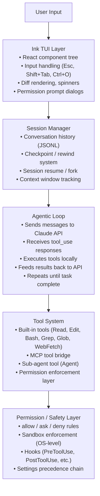

# Claude Code — Architecture

> What we know about Claude Code's architecture based on official documentation, the public npm package, and observable behavior.

## Technology Stack

### Confirmed (from npm package metadata and docs)

- **Language**: TypeScript
- **Runtime**: Node.js 18+
- **TUI Framework**: Ink (React for the terminal) — renders the interactive CLI using React components
- **Package**: `@anthropic-ai/claude-code` on npm
- **Distribution**: Native installers (shell script / PowerShell), Homebrew cask, WinGet, npm (deprecated)
- **GitHub**: `github.com/anthropics/claude-code` — hosts plugins, issue tracker, and the npm package (not the full source)

### Inferred from Observable Behavior

- **API Client**: Uses the Anthropic Messages API with tool-use / function-calling
- **Streaming**: Likely uses streaming responses (SSE) for real-time token display
- **Local Storage**: Conversations stored as JSONL files locally; sessions persist across restarts
- **Git Integration**: Shell-out to `git` CLI for worktrees, diffs, commits

## High-Level Architecture

Claude Code is described in official docs as an **"agentic harness"** around Claude models. The harness provides tools, context management, and the execution environment that turn a language model into a capable coding agent.

## Component Details

### 1. Ink TUI Layer

Claude Code uses **Ink** — a React renderer for the terminal (built on the `ink` npm package). This is an unusual architectural choice that means:

- The CLI UI is a React component tree using JSX/TSX
- Components handle input, render diffs/spinners/progress bars, and display permission dialogs
- The spinner shows customizable "action verbs" while Claude works (`spinnerVerbs` setting)
- Keyboard shortcuts are handled as component events:
  - `Esc` — interrupt current action (context preserved)
  - `Esc + Esc` — open rewind menu
  - `Shift+Tab` — cycle permission modes (default → acceptEdits → plan)
  - `Ctrl+O` — toggle verbose mode (shows extended thinking)
  - `Option+T` / `Alt+T` — toggle thinking mode
- Terminal progress bar support for Windows Terminal and iTerm2

### 2. Session Management

- **Storage**: Conversations stored as local JSONL files, one per session
- **Cleanup**: Configurable via `cleanupPeriodDays` (default 30 days); setting to 0 disables persistence
- **Checkpointing**: File snapshots taken before every edit, enabling rewind to any previous state
- **Resume**: `--continue` (most recent), `--resume` (picker), `--fork-session` (branch off)
- **Session picker**: Interactive TUI with search, branch filtering, preview, keyboard navigation
- **Naming**: `/rename` for descriptive names; auto-named from plan content
- **Session isolation**: Each new session starts with fresh context window — no conversation history carried over (only CLAUDE.md + auto-memory persist)
- **Forking**: `--fork-session` creates a new session ID while preserving conversation up to that point; original session unchanged

### 3. Configuration System (Scoped Settings)

Claude Code has a multi-scope configuration system with strict precedence:

| Scope | Location | Precedence |
|-------|----------|------------|
| **Managed** | Server-managed / MDM / plist / registry / system `managed-settings.json` | Highest (cannot be overridden) |
| **CLI args** | `--model`, `--allowedTools`, etc. | Session-level override |
| **Local** | `.claude/settings.local.json` | Per-project personal (gitignored) |
| **Project** | `.claude/settings.json` | Shared via git with team |
| **User** | `~/.claude/settings.json` | Global personal (lowest) |

Settings control: permissions, hooks, environment variables, model selection, MCP servers, attribution, cleanup, output style, language, and more. A `$schema` reference to `json.schemastore.org/claude-code-settings.json` provides IDE autocomplete.

### 4. Extension Points

| Extension | Purpose | Context Cost |
|-----------|---------|-------------|
| **CLAUDE.md** | Persistent instructions, loaded every session | Always loaded (keep < 200 lines) |
| **Auto Memory** | Claude's self-written notes from corrections | First 200 lines of MEMORY.md loaded |
| **Skills** | On-demand knowledge packages (`.claude/skills/`) | Loaded only when relevant |
| **Sub-agents** | Delegated tasks in separate context windows | Isolated; return summary only |
| **MCP Servers** | External tool/data integrations via Model Context Protocol | Tool definitions per request |
| **Hooks** | Deterministic shell scripts at lifecycle events | Zero context cost |
| **Plugins** | Bundles of skills + hooks + agents + MCP | Varies by components |

### 5. Execution Environments

| Environment | Where Code Runs | Use Case |
|-------------|----------------|----------|
| **Local** | Your machine | Default — full access to files, tools, environment |
| **Cloud** | Anthropic-managed VMs | Offload tasks, repos not local, parallel work |
| **Remote Control** | Your machine, controlled from browser | Use web UI while keeping everything local |

## Key Architectural Decisions

1. **Harness + Model separation**: Claude Code is the "agentic harness" — it provides tools, context, execution. The model does reasoning. This clean separation allows model swapping (Sonnet ↔ Opus ↔ Haiku) mid-session.

2. **React for the terminal**: Using Ink (React) for the TUI is architecturally novel. It enables component-based UI with familiar React patterns but for CLI rendering. This differentiates it from competitors using simpler terminal output.

3. **Local-first architecture**: Conversations, checkpoints, memory, and settings are all stored locally. No cloud dependency for session state (the model API is cloud-based, but all state is local).

4. **Defense-in-depth for safety**: Three complementary layers — permission rules (allow/ask/deny), OS-level sandboxing (filesystem + network), and hooks (programmatic pre/post-tool checks). Deny rules always win regardless of source.

5. **Context as the primary design constraint**: The entire architecture is designed around managing the finite context window. Auto-compaction, sub-agents (separate windows), skills (on-demand loading), concise CLAUDE.md, and `/compact` all exist because performance degrades as context fills.

6. **Tool-use protocol**: Claude Code uses Anthropic's native tool-use (function-calling) API, not prompt-injection-based tool use. The model receives tool definitions, returns `tool_use` blocks, the harness executes them, and results go back as `tool_result` messages.
