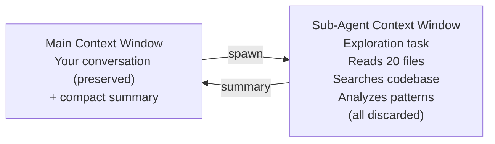

# Claude Code — Context Management

> How Claude Code manages its finite context window — the single most important resource in agentic coding.

## The Core Constraint

From Anthropic's best practices documentation:

> "Most best practices are based on one constraint: Claude's context window fills up fast, and performance degrades as it fills."

The context window holds: conversation history, file contents Claude has read, command outputs, CLAUDE.md instructions, loaded skills, auto-memory, MCP tool definitions, and system instructions. A single debugging session can consume tens of thousands of tokens. As context fills, Claude starts "forgetting" earlier instructions and makes more errors.

**Context management is the central design challenge of Claude Code.** Nearly every architectural decision — sub-agents, skills, compaction, CLAUDE.md guidelines — exists to address this.

## Context Management Mechanisms

### 1. Auto-Compaction

When Claude approaches the context limit, it automatically compacts conversation history:

- **Process**: Clears older tool outputs first, then summarizes the conversation if needed
- **Preserved**: User requests, key code snippets, important decisions
- **Lost**: Detailed instructions from early in the conversation, verbose command outputs
- **Configurable**: Add "Compact Instructions" section to CLAUDE.md to control what's preserved

```
# Example CLAUDE.md compact instructions
When compacting, always preserve:
- The full list of modified files
- All test commands and their results
- Architecture decisions made during this session
```

### 2. Manual Compaction (`/compact`)

Users can trigger compaction manually with focus instructions:

```
/compact                            # General compaction
/compact Focus on the API changes   # Directed compaction
/compact Keep the test results      # Selective preservation
```

This is useful when you know context is getting bloated but auto-compaction hasn't triggered yet.

### 3. Selective Rewind Summarization

Via `Esc + Esc` or `/rewind`, users can select a message checkpoint and choose **"Summarize from here"**:

- Condenses messages from the selected point forward
- Keeps earlier context intact
- Gives fine-grained control over what to compress vs. preserve

### 4. `/clear` — Full Context Reset

Wipes the entire conversation context. Recommended:
- Between unrelated tasks
- When you've corrected Claude more than twice on the same issue
- After long exploration sessions before implementation

> "A clean session with a better prompt almost always outperforms a long session with accumulated corrections."

### 5. `/btw` — Side Questions

For quick questions that shouldn't enter the conversation history:

- Answer appears in a dismissible overlay
- Never enters conversation context
- Check details without growing context
- Example: `/btw what's the syntax for Python f-strings?`

## Context Loading Mechanisms

### CLAUDE.md Files

Persistent instructions loaded at the start of every session:

| Scope | Location | Loading |
|-------|----------|---------|
| Managed policy | System dirs (`/Library/Application Support/ClaudeCode/`) | Always loaded, can't be excluded |
| Project root | `./CLAUDE.md` or `./.claude/CLAUDE.md` | Loaded at session start |
| Parent directories | Walking up from CWD | Loaded at session start |
| Child directories | Subdirectory CLAUDE.md files | Loaded on demand (when Claude reads files in that dir) |
| User | `~/.claude/CLAUDE.md` | Loaded at session start |

**Best practices for CLAUDE.md**:
- Target under 200 lines per file
- Every line should pass the test: "Would removing this cause Claude to make mistakes?"
- Use specific, verifiable instructions ("Use 2-space indentation" not "Format code properly")
- Check for conflicts between multiple CLAUDE.md files
- Use `@path/to/import` syntax to import additional files
- Treat it like code: review when things go wrong, prune regularly

### `.claude/rules/` — Modular Project Rules

For larger projects, instructions can be split into topic-specific files:

```
.claude/
├── CLAUDE.md              # Main instructions
└── rules/
    ├── code-style.md      # Always loaded (no paths frontmatter)
    ├── testing.md          # Always loaded
    └── api-design.md      # Path-scoped (see below)
```

**Path-scoped rules** only load when Claude works with matching files:

```yaml
---
paths:
  - "src/api/**/*.ts"
---
# API Development Rules
- All API endpoints must include input validation
- Use the standard error response format
```

This reduces context waste — rules load only when relevant.

### Auto Memory

Claude's self-written notes that persist across sessions:

- **Storage**: `~/.claude/projects/<project>/memory/MEMORY.md` + topic files
- **Loading**: First 200 lines of MEMORY.md at session start
- **Topic files**: Loaded on demand by Claude, not at startup
- **Content**: Build commands, debugging insights, architecture notes, code style preferences
- **Shared scope**: All worktrees/subdirectories within same git repo share one memory directory
- **Machine-local**: Not shared across machines or cloud environments

### Skills — On-Demand Knowledge

Skills are knowledge packages that load only when relevant:

```
.claude/skills/
└── api-conventions/
    └── SKILL.md
```

- Claude sees skill descriptions at session start (minimal context cost)
- Full skill content loads only when invoked or matched
- `disable-model-invocation: true` keeps descriptions out of context until `/skill-name` is used
- Much more context-efficient than putting everything in CLAUDE.md

## Sub-Agents for Context Isolation

**Sub-agents are the most powerful context management tool.** They run in completely separate context windows:



**Why this matters**: When Claude explores a codebase, it reads many files — each consuming context. With sub-agents, the exploration happens in a separate window. Only the summary comes back. Your main conversation stays clean.

### Built-in Sub-Agents and Context

| Agent | Context Impact on Main |
|-------|----------------------|
| **Explore** (Haiku) | Minimal — returns only findings summary |
| **Plan** (inherits) | Minimal — returns research summary |
| **General-purpose** (inherits) | Minimal — returns action summary |
| **Custom sub-agents** | Configurable via `maxTurns`, tool restrictions |

### Prompting for Sub-Agent Use

```
# Explicit delegation
Use subagents to investigate how our auth system handles token refresh

# Verification via sub-agent
Use a subagent to review this code for edge cases

# Research then implement
Use a subagent to explore the codebase structure, then implement the feature
```

## MCP Server Context Costs

MCP servers add tool definitions to every API request. A few servers can consume significant context before any work begins.

- **Check costs**: `/mcp` command shows per-server token costs
- **Tool Search**: When MCP tools exceed 10% of context, tools are deferred and loaded on demand
- **Mitigation**: Scope MCP servers to sub-agents to keep definitions out of main context

## `/context` — Monitor Context Usage

The `/context` command shows what's using space in the context window. Use it to:
- Identify bloated conversation history
- See MCP tool definition costs
- Decide when to `/clear` or `/compact`

## Context-Aware Workflow Patterns

### Pattern 1: Explore → Clear → Implement

```
1. Explore codebase with questions
2. /clear
3. Start fresh with implementation prompt incorporating learnings
```

### Pattern 2: Sub-Agent Exploration

```
1. "Use a sub-agent to explore src/auth/ and summarize the architecture"
2. Receive compact summary
3. "Now implement OAuth2 support based on that architecture"
```

### Pattern 3: Plan Mode → New Session

```
1. claude --permission-mode plan
2. Research and create a detailed plan
3. Plan saved to file
4. Start new session with clean context
5. "Implement the plan in SPEC.md"
```

### Pattern 4: Session Naming and Resume

```
claude --name "oauth-migration"
# ... work on task ...
# Later:
claude --resume  # Find by name, resume with preserved context
```

## Key Observations

1. **Context is explicitly the #1 concern**: Anthropic's documentation centers virtually all best practices around context management. This is unusually transparent about the fundamental limitation.

2. **Multiple compaction strategies**: Auto-compaction + manual `/compact` + selective rewind summarization + `/clear` + `/btw` — five different granularities of context control. No other coding agent offers this many.

3. **CLAUDE.md survives compaction**: After `/compact`, CLAUDE.md is re-read from disk and re-injected fresh. This is a key design decision — project instructions are never lost to compaction.

4. **Sub-agents are a context architecture, not just delegation**: The primary motivation for sub-agents isn't task specialization — it's context isolation. This is made explicit in the docs.

5. **Skills vs. CLAUDE.md trade-off**: CLAUDE.md is always loaded (cost: every session). Skills load on demand (cost: only when needed). This is a deliberate design tension for context budgeting.

6. **200-line limits are everywhere**: CLAUDE.md recommended < 200 lines, auto-memory loads first 200 lines. This number appears to be a practical token budget threshold.
