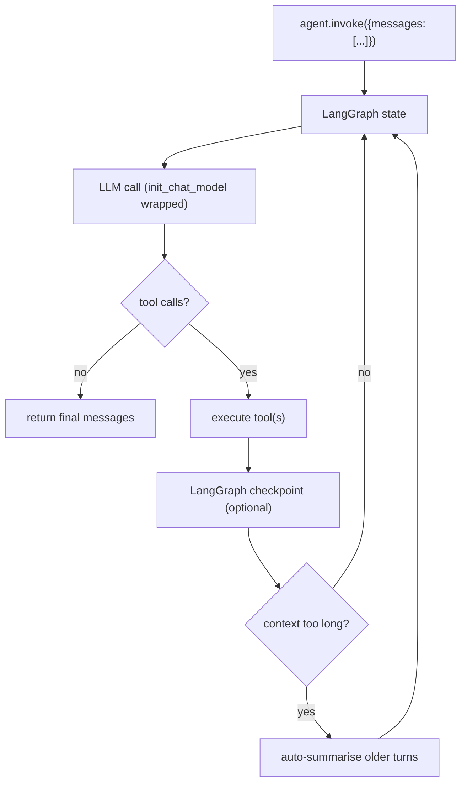

# Deep Agents — Agentic Loop

## LangGraph-Native Loop

`create_deep_agent()` returns a compiled LangGraph — meaning the loop
itself is a LangGraph state graph, with all the runtime properties that
implies: durable execution, checkpointing, streaming, human-in-the-loop
gates, and the ability to plug into LangSmith for observability.

The README puts it plainly:

> *"It is the same core tool calling loop as other agent frameworks,
> but with built-in tools and capabilities."*

## Planning via `write_todos`

The default prompt teaches the model to break work down into a todo
list using the `write_todos` tool. Progress is tracked in that same
list. This pattern is now common (Claude Code, Mux, Codex CLI all do
similar) — Deep Agents bakes it in as part of the "smart defaults".

## Sub-Agent Dispatch via `task`

`task` is the delegation primitive: spawn a sub-agent with an isolated
context window to handle a sub-problem, return only the result. The
parent loop continues with a clean context — important on long-running
tasks where exploration would otherwise bloat the main thread.

Each sub-agent is itself a Deep Agent (or a configured variant), so the
sub-agent has the same tool surface unless restricted.

## Context Management Triggers

The loop monitors message length and applies two strategies:

1. **Auto-summarisation** when conversations get long (older turns
   replaced with a summary).
2. **Large outputs to files** — if a tool returns a giant blob (a long
   `cat`, a noisy build log), the harness writes it to a file and gives
   the model a path/preview rather than dropping the raw content into
   context.

Both happen automatically — the user doesn't have to invoke a
`/compact` command.

## Streaming, Checkpoints, HITL

Because the loop is a real LangGraph:

- **Streaming**: native token streaming via LangGraph's stream API
- **Checkpointers**: pluggable persistence (memory, SQLite, Postgres) so
  long runs can survive restarts
- **Human-in-the-loop**: LangGraph's `interrupt` mechanism lets you
  pause for approval before mutating actions

All of this is the LangGraph runtime, not Deep Agents-specific — but
Deep Agents inherits it for free.

## ACP-Driven Loop

When run via ACP (Agent Client Protocol), the loop is driven by an
external editor like Zed. The state graph is the same; only the I/O
surface changes — messages come in over the protocol and stream back
the same way.

## CLI Loop Cap

Not explicitly published. Headless mode in the CLI presumably has a
turn cap to prevent runaway runs in CI; the CLI documentation at
`docs.langchain.com/oss/python/deepagents/cli/overview` is the
authoritative source.

---

*Loop description from `langchain-ai/deepagents` README and
`docs.langchain.com/oss/python/deepagents/`.*
