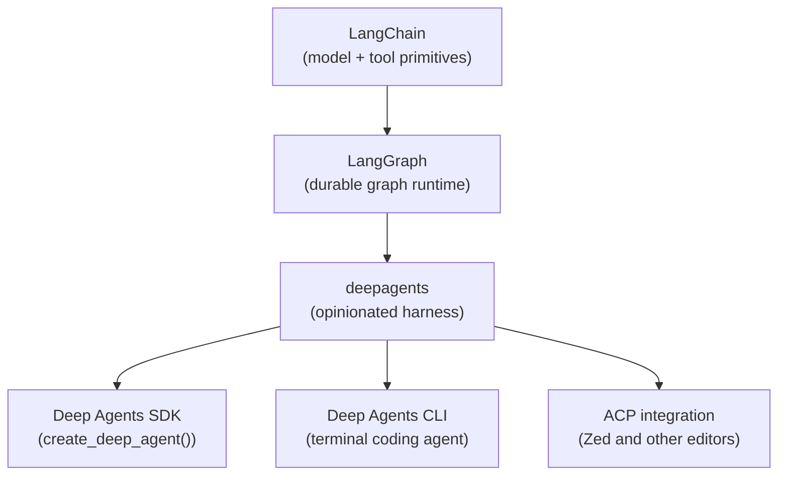

# Deep Agents — Architecture

## "Harness" Positioning

LangChain's docs are explicit about positioning Deep Agents as an
**agent harness** rather than a framework:

> *"Instead of wiring up prompts, tools, and context management
> yourself, you get a working agent immediately and customize what you
> need."*

The hierarchy is: **LangChain** (building blocks) → **LangGraph**
(runtime) → **Deep Agents** (opinionated harness on top of the runtime).



## SDK

The library entrypoint is one function:

```python
from deepagents import create_deep_agent

agent = create_deep_agent()
result = agent.invoke({"messages": [{"role": "user", "content": "..."}]})
```

Customisation knobs:

```python
from langchain.chat_models import init_chat_model

agent = create_deep_agent(
    model=init_chat_model("openai:gpt-4o"),  # or any LangChain model
    tools=[my_custom_tool],                  # add to built-in set
    system_prompt="You are a research assistant.",
)
```

Returns a compiled LangGraph — so you get streaming, checkpointing,
human-in-the-loop, and all other LangGraph runtime features for free.

## CLI

Installed via:

```bash
curl -LsSf https://langch.in/gh-da-cli | bash
```

Provides:

- Interactive TUI with rich streaming output
- Web search grounding
- Headless mode (scripting / CI)
- All SDK features: remote sandboxes, persistent memory, custom
  skills, human-in-the-loop approval

The CLI is what produced the TB2 #21 entry (GPT-5.2-Codex, 66.5%).

## ACP Integration

Agent Client Protocol connector — lets editors like Zed consume a Deep
Agent over a structured protocol. Documented at
`docs.langchain.com/oss/python/deepagents/acp`.

## Provider Support

The docs list explicit `init_chat_model` helpers for:

- Google (Gemini)
- OpenAI
- Anthropic
- OpenRouter
- Fireworks
- Baseten
- Ollama

Plus any provider with a LangChain integration. The TB2 #21 row used
`openai:gpt-5.2-codex`.

## What "Batteries-Included" Includes

From the README:

- **Planning** — `write_todos` for task breakdown and progress tracking
- **Filesystem** — `read_file`, `write_file`, `edit_file`, `ls`,
  `glob`, `grep`
- **Shell access** — `execute` with sandboxing
- **Sub-agents** — `task` for delegating work with isolated context
- **Smart defaults** — prompts that teach the model how to use these
  tools effectively
- **Context management** — auto-summarisation; large outputs saved to
  files

That's the harness. Anything beyond it is a custom tool you add.

---

*Architecture from `langchain-ai/deepagents` README and
`docs.langchain.com/oss/python/deepagents/`.*
