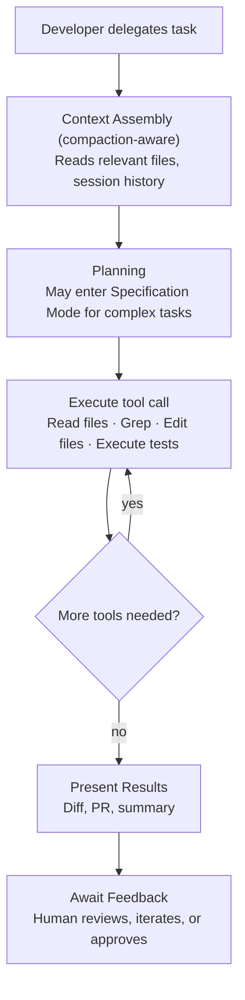

# Droid — Agentic Loop

> How Droid executes tasks: from delegation to completion, across synchronous and asynchronous modes, with autonomous tool use and human checkpoints.

## Core Loop Pattern

Droid's agentic loop follows a **delegation-oriented** pattern rather than a simple prompt-response cycle. The fundamental model is:

1. **Task Intake** — Developer delegates a task via any interface (CLI prompt, Slack message, Linear ticket, CI trigger, web workspace).
2. **Context Assembly** — Droid gathers relevant context: codebase structure, file contents, project management context, previous session history (via compaction).
3. **Planning** — For complex tasks, Droid enters Specification Mode to generate a detailed implementation plan before executing.
4. **Autonomous Execution** — Droid executes a series of tool calls (Read, Edit, Execute, Grep, Glob) with minimal human intervention.
5. **Output Delivery** — Results surface wherever is appropriate: PR created, Slack message sent, CI status updated, IDE diff shown.
6. **Human Review** — Developer reviews, provides feedback, or approves.

## Autonomy Ratio

Factory Analytics tracks the **autonomy ratio** — the number of tool calls per user message — as a key metric of Droid's independent execution capability.

- An autonomy ratio of **13x** means Droid performs 13 tool calls for every human message.
- Higher ratios indicate the developer is delegating larger units of work with less hand-holding.
- Enterprise teams track this metric to measure how effectively developers trust and use autonomous agents.

This metric is fundamentally different from what most coding agents track. Rather than measuring "how good is the AI at coding," it measures **how much work is delegated per human interaction** — a proxy for real-world productivity impact.

## Execution Modes

### Interactive Mode (CLI, IDE, Web)

In interactive mode, Droid operates as a conversational agent:

### Non-Interactive Mode (CI/CD)

In CI/CD pipelines, Droid operates autonomously without human interaction:

- Triggered by events (PR opened, CI failure, scheduled job).
- Executes predefined workflows (auto-review, GitHub Actions repair).
- Produces artifacts (review comments, fix PRs, status updates).
- Controlled by `.droid.yaml` configuration.

### Async Delegation Mode (Slack, Linear, Teams)

When tasks are delegated from messaging/PM tools:

- Developer sends a natural language task ("Fix the flaky test in `auth_test.py`").
- Droid acknowledges, begins background execution.
- Progress updates can be monitored across any interface.
- Results are delivered as PRs or status updates.

## Auto-Review Loop

One of Droid's most mature agentic loops is automated code review:

1. **Trigger**: PR is opened (if `auto_review.enabled: true` in `.droid.yaml`).
2. **Filter**: Check skip conditions (draft PRs, bot PRs, WIP titles, excluded labels/branches).
3. **Analysis**: Read the diff, apply path-specific guidelines, analyze changed files.
4. **Review**: Generate PR summary, file summaries, actionable review comments, and tips.
5. **CI Repair**: If GitHub Actions failed, analyze the failure and suggest fixes (`github_action_repair: true`).
6. **Skip Transparency**: If review is skipped, optionally leave a comment explaining why.

## Specification Mode

For complex tasks, Droid supports a **Specification Mode** that separates planning from execution:

- A reasoning model (e.g., Claude Opus, o3) generates a detailed implementation specification.
- The spec includes technical details, file changes needed, edge cases, and test requirements.
- An execution model (potentially a different, more cost-efficient model) then implements the spec.
- This mirrors the architect/editor pattern seen in other agents but is built into the platform with explicit model routing.

## Session Continuity

Unlike most agents where each conversation is ephemeral, Droid sessions can persist across:

- **Days or weeks**: The compaction engine preserves critical context across extremely long sessions.
- **Interface transitions**: Start in Slack, continue in CLI, review in web.
- **Teaching and reuse**: Developers can teach Droid a pattern once, and it applies the pattern independently across subsequent iterations (as demonstrated by Chainguard's package-building workflow).

## Cloud & Local Background Agents

Factory supports both cloud and local background agents:

- **Cloud background agents**: Execute in Factory's infrastructure, accessible from web/Slack.
- **Local background agents**: Execute on the developer's machine via CLI.
- Both modes support long-running tasks that don't require constant developer attention.