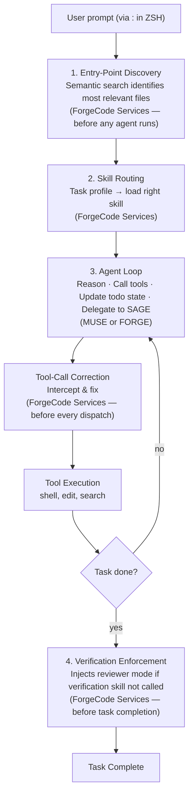

# ForgeCode — Multi-Agent Loop Orchestration

## Overview

ForgeCode does not use a single agentic loop. It orchestrates across three sub-agents (Forge, Muse, Sage), each with different access levels and thinking budgets, managed by a runtime layer (ForgeCode Services) that enforces planning, controls reasoning budgets, and corrects tool calls.

## The Orchestration Flow

### Typical Task Lifecycle

## Phase 1: Pre-Agent Setup

Before any agent starts reasoning, ForgeCode Services performs two preparatory steps:

### Semantic Entry-Point Discovery

The context engine runs a lightweight semantic pass over the indexed codebase to identify the most likely starting files and functions for the given task. This addresses a critical failure mode identified during TermBench evaluation: agents that explore randomly waste their time budget.

**Without entry-point discovery**: Agent reads `ls`, explores directory tree, reads unrelated files, eventually finds the right module after burning 30% of its time budget.

**With entry-point discovery**: Agent starts in the right file/function immediately. More context then helps it reason more deeply from the correct starting point.

### Dynamic Skill Loading

The skill engine matches the task profile against available skills and loads only the relevant ones. Each skill is a specialized instruction set — it might include:

- Domain-specific tool-calling patterns
- Preferred sequences of operations
- Quality criteria for the task type
- Known pitfalls and how to avoid them

Skills that aren't relevant stay unloaded, keeping the system prompt lean.

## Phase 2: The Agent Loop

### Progressive Thinking Policy

The reasoning budget changes as the agent progresses through a task:

**Messages 1–10 (Planning Phase)**:
- Very high thinking budget
- This is where the agent forms its plan, identifies problem structure, and selects its approach
- Getting the plan right is worth the additional latency
- The `todo_write` tool must be called to create task items for multi-step work

**Messages 11+ (Execution Phase)**:
- Low thinking budget by default
- The plan is set; the agent should act, not re-deliberate
- Sub-agents handle parallelizable work (file reads, pattern searches)
- Each completed sub-task is marked done via `todo_write`

**Verification Checkpoint**:
- When the verification skill is invoked, thinking budget switches back to high
- The agent shifts from builder mode to reviewer mode

### The Inner Loop

Each turn within an agent follows this cycle:

1. **Reason**: The model considers the current state, remaining tasks, and available tools
2. **Select tool**: Choose the appropriate tool call (edit, shell, search, etc.)
3. **Tool-call correction**: ForgeCode Services intercepts the call, validates arguments, and auto-corrects if needed
4. **Execute**: The tool runs and returns results
5. **Update state**: If applicable, `todo_write` is called to update task progress
6. **Check completion**: Is the task done? If not, loop back to step 1

### Sage Delegation

When Forge or Muse needs deeper codebase understanding, they delegate to Sage:

- Sage operates in read-only mode with focused context
- It traces functionality across files, maps dependencies, and analyzes architecture
- Only the relevant findings are returned to the calling agent — not the full investigation context
- This prevents context bloat in the main agent's window

### Sub-Agent Parallelization

For low-complexity, parallelizable work, ForgeCode spawns sub-agents:

- File reads across multiple locations
- Pattern searches in different directories
- Routine edits that don't depend on each other

Sub-agents run with minimal thinking budget. The main agent coordinates results and handles decisions that require deeper reasoning.

## Phase 3: Verification Enforcement

This is ForgeCode's most distinctive loop feature. Before a task is marked complete:

1. **Check**: Has the agent called the verification skill?
2. **If no**: The runtime injects a reminder and requires a verification pass. No opt-out.
3. **If yes**: The verification skill asks a different question from building: "What evidence proves this objective is actually complete?"

The verification pass generates a checklist:
- What was requested
- What was actually done
- What evidence exists that it worked
- What is still missing

If gaps are found, the agent generates follow-up tasks and completes them before exiting.

**Why enforcement matters**: Normal prompting ("please verify your work") does not reliably produce this behavior. Models under pressure take the path of least resistance — they skip verification when it's optional. Programmatic enforcement was the key insight that drove a significant score improvement on TermBench.

## Non-Interactive Mode

For benchmark evaluation and CI/CD usage, ForgeCode has a strict Non-Interactive Mode:

- System prompt rewritten to prohibit clarification requests and conversational branching
- The agent assumes reasonable defaults and proceeds autonomously
- Completion logic tightened so the agent commits rather than hedging
- No user to answer questions — every turn asking is a turn not solving

This mode was essential for TermBench: the interactive-first agent scored ~25%. Non-Interactive Mode + tool fixes brought it to ~38% before other improvements.

## The Plan-and-Act Pattern

The recommended user workflow mirrors the internal architecture:

1. **`:muse` — Plan**: Switch to Muse agent. Ask it to analyze the task and produce a detailed implementation plan. Muse operates read-only, so it can think freely without side effects.

2. **Review**: The user reviews Muse's plan, asks for refinements.

3. **`:forge` — Execute**: Switch to Forge agent. Reference the plan and begin implementation. Forge has full read+write access.

4. **Iterate**: If complex decisions arise during implementation, switch back to Muse for analysis, then return to Forge.

Context is preserved across agent switches, but each agent's internal working context remains bounded.

## Failure Budget Management

TermBench imposes strict wall-clock time limits. ForgeCode manages failure budgets:

- **`max_tool_failure_per_turn`**: Limits how many times a tool can fail before forcing completion (prevents infinite retry loops)
- **`max_requests_per_turn`**: Caps total requests per turn to control API costs
- **Tool timeout**: `FORGE_TOOL_TIMEOUT` (default 300s) kills hung tool executions

## Session Continuity

- Conversations persist across prompts within a ZSH session
- `:new` starts a fresh conversation (clears history, keeps agent selection)
- `:conversation` switches between saved conversations
- `:retry` resends the last prompt after a cancel or timeout
- Model and agent switches preserve conversation context