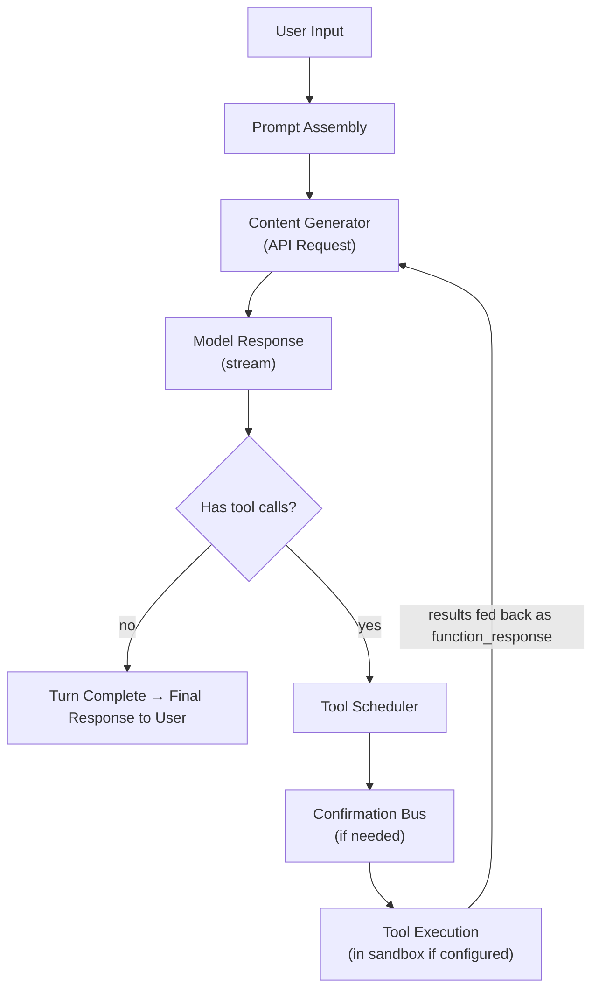
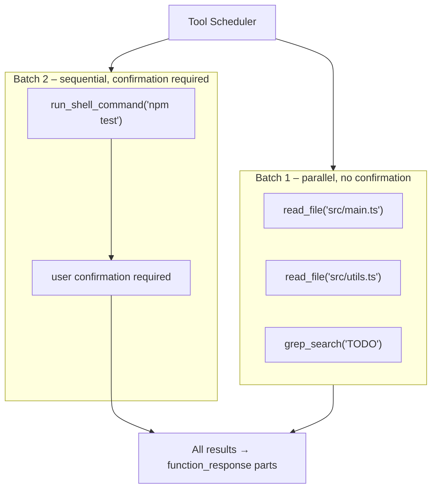
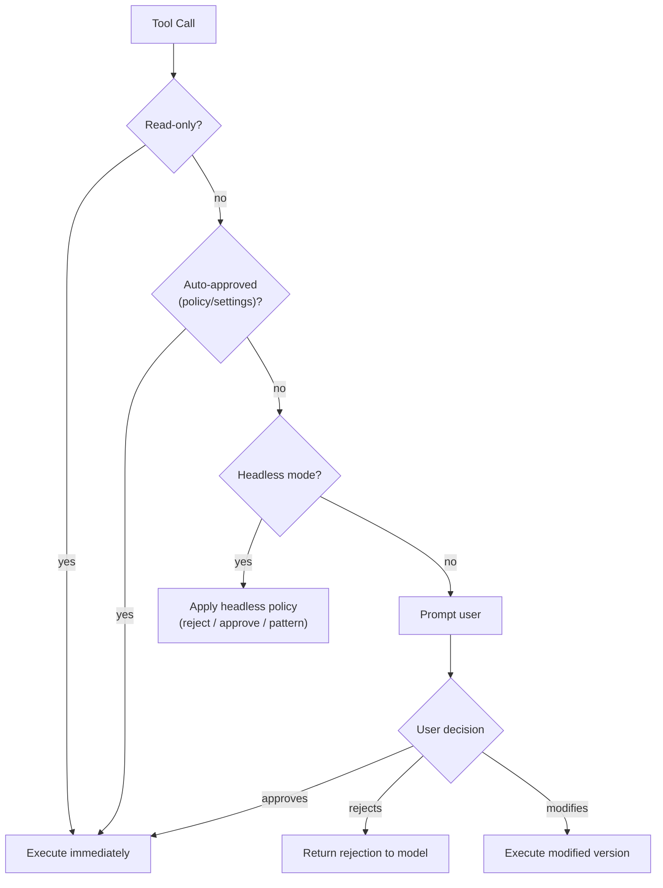
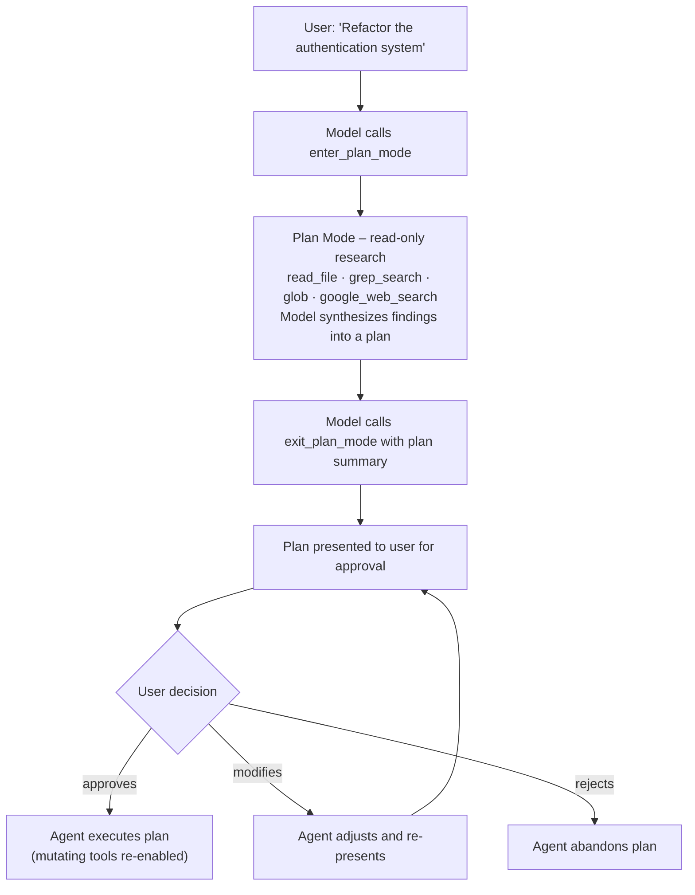
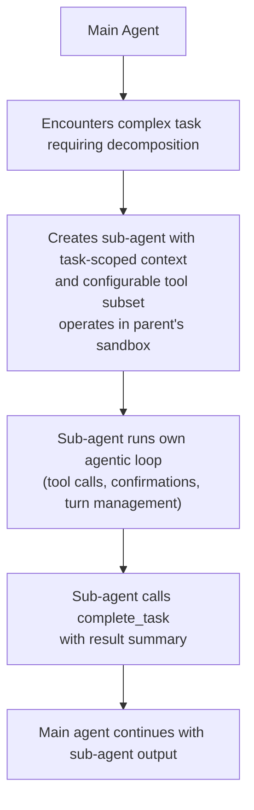

# Gemini CLI — Agentic Loop

> How Gemini CLI processes turns, generates content, schedules tools,
> manages plan mode, orchestrates sub-agents, and operates in headless mode.

## Loop Overview

Gemini CLI's agentic loop follows the standard pattern of terminal coding agents:



## Turn Processing (turn.ts)

Each user message initiates a **turn**, which may involve multiple model invocations
(iterations) as tools are called and results are fed back.

### Turn Lifecycle

```
TurnState {
  INIT          -> Initial state, processing user input
  GENERATING    -> Waiting for model response
  TOOL_CALLING  -> Executing tool calls from model response
  WAITING       -> Waiting for user confirmation
  COMPLETE      -> Turn finished (model produced final text, no tool calls)
  ERROR         -> Turn encountered an unrecoverable error
}
```

### Turn Iteration Flow

1. **Prompt assembly**: System instructions + GEMINI.md context + conversation history +
   tool declarations + user message
2. **API request**: Sent to Gemini via contentGenerator
3. **Streaming response**: Processed token-by-token for real-time display
4. **Tool call extraction**: If model response contains function_call parts
5. **Tool scheduling**: coreToolScheduler coordinates execution
6. **Result injection**: Tool results added to conversation as function_response
7. **Next iteration**: Back to step 1 (within same turn)
8. **Completion**: When model produces text-only response (no tool calls)

### Iteration Limits

To prevent infinite loops:
- Maximum iterations per turn (configurable)
- Timeout per turn
- Token budget exhaustion triggers completion
- The model can explicitly signal completion

## Content Generation (contentGenerator.ts)

The content generator is the core of the loop — it bridges the agent state to API calls.

### Request Assembly

```typescript
// Simplified content generation flow
async function generateContent(turn: Turn): Promise<ModelResponse> {
  // 1. Assemble prompt components
  const systemInstruction = buildSystemInstruction({
    basePrompt: getBasePrompt(),
    geminiMdContent: getGeminiMdHierarchy(),
    skillsContent: getActiveSkills(),
  });

  // 2. Calculate token budget
  const budget = tokenLimits.calculateBudget({
    model: currentModel,
    systemInstruction,
    toolDeclarations: toolRegistry.getDeclarations(),
  });

  // 3. Trim conversation history to fit budget
  const history = geminiChat.getHistory(budget.conversationBudget);

  // 4. Build API request
  const request = geminiRequest.build({
    systemInstruction,
    history,
    tools: toolRegistry.getDeclarations(),
    generationConfig: getGenerationConfig(),
    safetySettings: getSafetySettings(),
  });

  // 5. Apply token caching (for API key users)
  if (canUseTokenCaching()) {
    request.cachedContent = getCachedContentRef(systemInstruction);
  }

  // 6. Stream response
  return await client.streamGenerateContent(request);
}
```

### Token Caching

A distinctive optimization for API key users:
- System instructions and tool declarations are cached server-side
- Subsequent requests reference the cached content instead of resending
- Reduces input token costs significantly for long conversations
- Cache is invalidated when system instructions change (e.g., new skill activated)

### Streaming

Responses are streamed token-by-token:
- Text tokens rendered immediately in terminal
- Tool call tokens accumulated until complete
- Streaming can be interrupted by user (Ctrl+C)
- Partial responses are preserved in conversation history

## Tool Scheduling (coreToolScheduler.ts)

The tool scheduler coordinates execution of tool calls from a single model response.

### Scheduling Strategy

When the model returns multiple tool calls in one response:

```
Model Response
├── tool_call_1: read_file("src/main.ts")
├── tool_call_2: read_file("src/utils.ts")
├── tool_call_3: grep_search("TODO")
└── tool_call_4: run_shell_command("npm test")
```

The scheduler determines execution order:
1. **Read-only tools** (read_file, grep_search, glob) -> execute in parallel
2. **Mutating tools** (write_file, replace, run_shell_command) -> may require sequential
   execution or user confirmation before proceeding
3. **Interactive tools** (ask_user) -> block until user responds

### Parallel Execution



### Error Handling

When a tool execution fails:
- Error message is included in the function_response
- The model receives the error and can retry or adapt
- Persistent failures may trigger fallback behavior
- Certain errors (sandbox violations) are surfaced to the user

## Confirmation Flow

The confirmation bus integrates with the tool scheduler:

### Confirmation Decision Tree



### Confirmation UI

In interactive mode, confirmations show:
- Tool name and parameters
- What the tool will do (human-readable description)
- File paths affected (for file operations)
- Command to run (for shell operations)
- Options: approve, reject, approve-all (for session)

## Plan Mode

Plan mode is a **read-only research phase** where the agent gathers information
before proposing changes.

### Entry: enter_plan_mode

When the model calls `enter_plan_mode`:
1. All mutating tools are disabled (write_file, replace, run_shell_command)
2. Read-only tools remain available (read_file, grep_search, glob, google_web_search)
3. The model can research the codebase without making changes
4. UI indicates plan mode is active

### Plan Mode Workflow



### Plan Mode Benefits

- Prevents premature changes before understanding the codebase
- Gives users visibility into the agent's research process
- Creates a checkpoint before potentially destructive operations
- Encourages thoughtful, well-researched modifications

## Sub-Agent Orchestration

Gemini CLI supports sub-agents through the `complete_task` tool and the `agents/` module.

### Sub-Agent Architecture



### complete_task Tool

The `complete_task` tool is used by sub-agents to signal task completion:
- Returns a summary of what was accomplished
- Includes any artifacts produced (file changes, test results)
- Main agent receives this as a tool result
- Main agent can then continue with additional sub-agents or its own work

### Sub-Agent vs Main Agent

| Aspect | Main Agent | Sub-Agent |
|---|---|---|
| Conversation | Full history | Task-scoped |
| Tools | All available | Configurable subset |
| Confirmation | Full user interaction | Inherited from parent |
| Sandbox | Configured backend | Parent's sandbox |
| Completion | User ends session | complete_task tool |
| Token budget | Full model limit | Allocated portion |

## Headless Mode

Gemini CLI supports non-interactive operation for CI/CD and scripting.

### Headless Configuration

```bash
# Basic headless usage
echo "Fix all TypeScript errors" | gemini --headless

# With specific output format
gemini --headless --output-format=json < prompt.txt

# Stream JSON output for programmatic consumption
gemini --headless --output-format=stream-json < prompt.txt
```

### Output Formats

1. **text** (default): Plain text output, similar to interactive mode but without UI chrome
2. **json**: Complete structured response as a single JSON object
3. **stream-json**: Newline-delimited JSON objects for streaming consumption

### Headless Tool Confirmation

In headless mode, tool confirmations are handled by policy:
- Default: reject all mutating operations (safe mode)
- Configurable: auto-approve patterns for known-safe operations
- Example: auto-approve file writes within project directory, reject shell commands

### CI/CD Integration

Gemini CLI is designed for GitHub Actions integration:
- PR review automation
- Issue triage
- Code generation from issue descriptions
- @gemini-cli mentions in GitHub comments
- Structured output for downstream processing

### Headless Loop Differences

```
Interactive Mode               Headless Mode
─────────────────              ──────────────
User types input        ->     stdin / argument
Streaming terminal UI   ->     Buffered output
Confirmation prompts    ->     Policy-based auto-decision
Rich formatting         ->     Plain text / JSON
Manual termination      ->     Auto-complete on task done
```

## Error Recovery

The agentic loop includes several error recovery mechanisms:

### Retry Logic

- **API errors** (rate limits, server errors): Exponential backoff retry
- **Tool execution errors**: Error message fed back to model for adaptation
- **Sandbox errors**: Retry with relaxed sandbox or prompt user
- **Token limit errors**: Conversation history pruning and retry

### Fallback Module

The `fallback/` module handles scenarios where primary behavior fails:
- Model unavailability -> try alternate model
- Tool failure -> suggest alternative approach to model
- Context overflow -> aggressive history pruning
- Network errors -> cached responses where available

### Graceful Degradation

When operating with constraints:
- Rate limited -> slower but continuous operation
- Sandbox unavailable -> warn user, operate unsandboxed with extra confirmations
- Token cache expired -> fall back to full prompt sends
- MCP server disconnected -> continue with built-in tools only

## Loop Performance Characteristics

### Token Efficiency

The loop is designed to minimize token waste:
- Token caching avoids resending system instructions
- Conversation pruning removes less-relevant history
- Tool results can be summarized if too large
- Skills loaded only when needed (progressive disclosure)

### Latency

- First token: Depends on model + prompt size (typically 1-3s)
- Tool execution: Varies by tool (file reads < 100ms, shell commands unbounded)
- Confirmation wait: User-dependent (0 in headless, variable in interactive)
- Total turn: Sum of iterations x (API latency + tool execution + confirmation)
