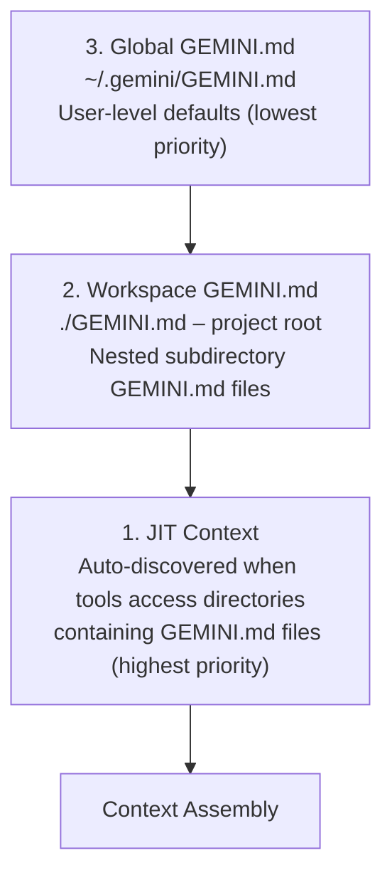
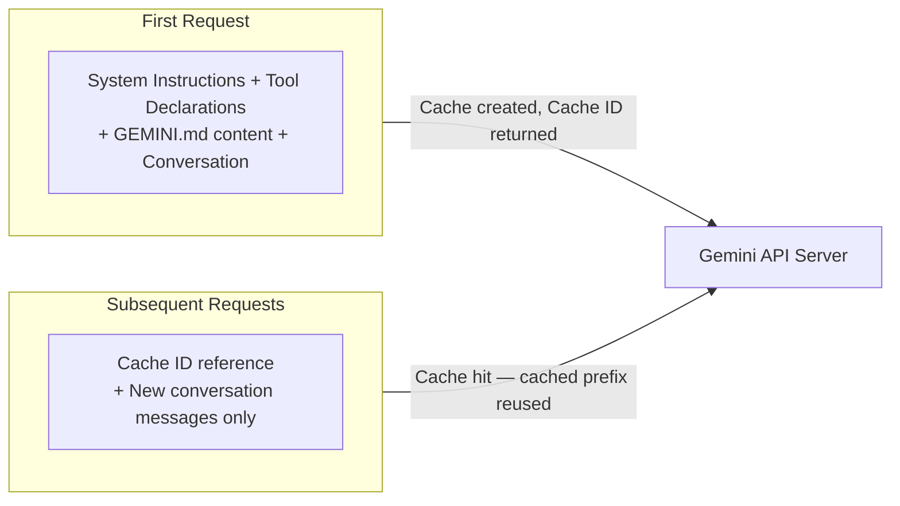
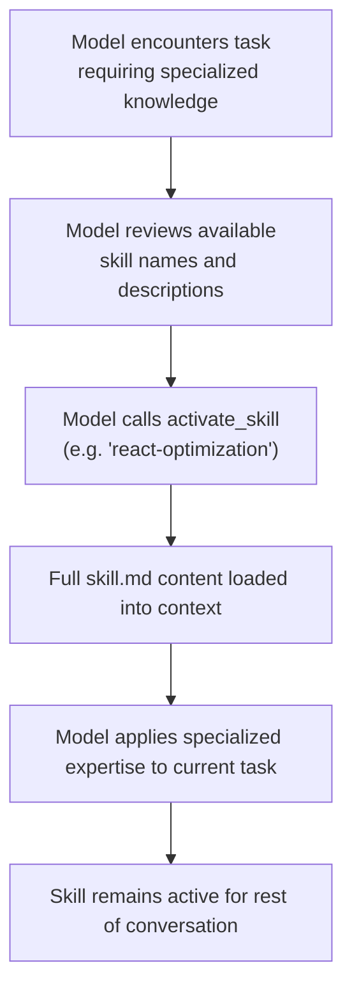
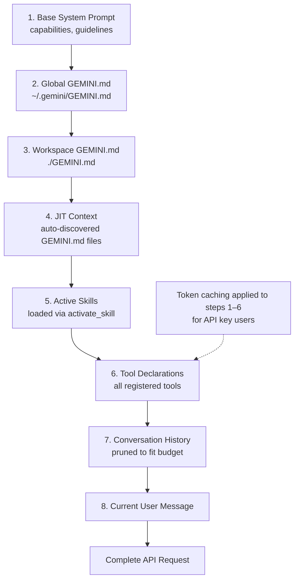

# Gemini CLI — Context Management

> How Gemini CLI manages context through GEMINI.md hierarchy, JIT discovery,
> token caching, checkpointing, the skills system, and conversation history.

## Overview

Context management in Gemini CLI is built around three key innovations:
1. **Hierarchical GEMINI.md files** — layered project/user configuration
2. **Progressive skill disclosure** — on-demand expertise loading
3. **Token caching** — server-side caching of system instructions

These work together with standard conversation history and the 1M token context
window to provide a rich, efficient context system.

## GEMINI.md Hierarchy

GEMINI.md files are the primary mechanism for providing persistent context to the agent.
They follow a three-tier hierarchy:



### Tier 1: Global (~/.gemini/GEMINI.md)

User-wide preferences and instructions that apply to all projects:

```markdown
# Global Preferences

## Coding Style
- Always use TypeScript strict mode
- Prefer functional programming patterns
- Use meaningful variable names, avoid abbreviations

## Communication
- Explain changes before making them
- Always run tests after modifications
- Use git commits with conventional commit messages
```

### Tier 2: Workspace (./GEMINI.md)

Project-specific context at the repository root:

```markdown
# Project: MyApp

## Architecture
- Monorepo with packages/frontend and packages/backend
- Frontend: React 18 + TypeScript
- Backend: Express + Prisma + PostgreSQL

## Conventions
- Tests in __tests__/ directories alongside source
- API routes in packages/backend/src/routes/
- Use zod for runtime validation

## Important
- Never modify migration files directly
- Always run npm run typecheck before committing
- Database schema changes require a migration
```

### Tier 3: JIT Context (Auto-Discovered)

When the agent accesses files in a directory, it automatically checks for GEMINI.md
files in that directory and parent directories (up to workspace root).

```
project/
├── GEMINI.md                    <-- Workspace context
├── src/
│   ├── auth/
│   │   ├── GEMINI.md            <-- JIT: loaded when auth/ files accessed
│   │   ├── login.ts
│   │   └── session.ts
│   └── api/
│       ├── GEMINI.md            <-- JIT: loaded when api/ files accessed
│       └── routes.ts
```

**JIT discovery flow:**
1. Agent calls `read_file("src/auth/login.ts")`
2. Before returning file contents, system checks for GEMINI.md in src/auth/
3. If found, GEMINI.md content is injected into context
4. This happens transparently — the model receives the additional context
   alongside the file contents

### Configurable Filename

The context filename is configurable — not locked to GEMINI.md:

```json
{
  "contextFile": "AGENTS.md"
}
```

This enables compatibility with other agent tools that use different filenames
(e.g., AGENTS.md for Cursor, CLAUDE.md for Claude Code).

### Modular Imports (@-syntax)

GEMINI.md files can import other files:

```markdown
# Project Context

@coding-standards.md
@architecture-overview.md
@api-conventions.md
```

This keeps individual files focused and enables sharing context modules across projects.

## Token Caching

Token caching is an API-level optimization unique to Gemini CLI among terminal agents.

### How It Works



### Benefits

- **Cost reduction**: System instructions (often 10K+ tokens) aren't billed repeatedly
- **Latency reduction**: Server skips processing cached prefix
- **Automatic**: No user configuration needed — works transparently for API key users
- **Smart invalidation**: Cache invalidated when system instructions change
  (new skill activated, GEMINI.md modified, etc.)

### Availability

- **API Key users**: Automatic token caching
- **OAuth users**: Not available (free tier limitations)
- **Vertex AI users**: Separate caching mechanism through Vertex API

## Checkpointing System

Checkpointing creates persistent snapshots of conversation state using shadow git repos.

### Architecture

```
~/.gemini/history/<project_hash>/
├── .git/                    # Shadow git repository
├── conversation.json        # Full conversation history
├── tool_calls.json          # All tool calls and results
├── metadata.json            # Session metadata (model, timestamps)
└── files/                   # Snapshots of modified files
```

### How Checkpointing Works

1. **Automatic snapshots**: After each turn, conversation state is committed to
   the shadow git repo
2. **Project isolation**: Each project gets its own history directory (hashed path)
3. **Full state capture**: Conversation messages + tool calls + file states
4. **Git-based history**: Standard git tooling can inspect checkpoint history

### Restoring Conversations

The `/restore` command lets users resume from a checkpoint:

```
> /restore

Available checkpoints:
1. [2h ago] "Refactor auth module" - 12 turns, 3 files modified
2. [1d ago] "Add API endpoints" - 8 turns, 5 files modified
3. [3d ago] "Fix login bug" - 4 turns, 1 file modified

Select checkpoint: 1

Restored conversation with 12 turns. Continuing from last state.
```

### Checkpoint Benefits

- Resume work after terminal crashes or session interruptions
- Review past conversations for reference
- Branch conversations from earlier states
- Audit trail of agent actions

## Skills System (Progressive Disclosure)

The skills system is Gemini CLI's most distinctive context management feature.

### What Are Skills?

Skills are modular bundles of expertise that can be loaded on-demand:

```
.gemini/skills/
├── react-optimization/
│   ├── skill.md          # Full skill content
│   └── metadata.json     # Name, description, triggers
├── database-design/
│   ├── skill.md
│   └── metadata.json
└── security-review/
    ├── skill.md
    └── metadata.json
```

### Progressive Disclosure

The key insight: loading all skills into every prompt wastes tokens and dilutes focus.

```
Level 0: Only skill metadata loaded
    │
    │  name: "react-optimization"
    │  description: "Expert guidance on React performance"
    │
    │  (approx 50 tokens per skill)
    │
    v
Level 1: Skill activated via activate_skill tool
    │
    │  Full skill.md content loaded into context
    │
    │  (Could be 1000s of tokens of specialized expertise)
    │
    v
Level 2: Skill knowledge applied to current task
```

### Discovery Tiers

Skills are discovered from three locations (in priority order):

```
1. Workspace Skills
   └── ./.gemini/skills/        # Project-specific skills

2. User Skills
   └── ~/.gemini/skills/        # User-wide skills

3. Extension Skills
   └── Provided by MCP servers or extensions
```

### Skill Activation Flow



### Skill Metadata Example

```json
{
  "name": "react-optimization",
  "description": "Expert guidance on React component performance, memoization strategies, virtual DOM optimization, and render cycle management",
  "triggers": ["react", "performance", "render", "memo", "useMemo", "useCallback"],
  "version": "1.0"
}
```

### /skills Command

The `/skills` command provides skill management:

```
> /skills

Available Skills:
  [active]   react-optimization    - React performance expertise
  [inactive] database-design      - Database schema and query optimization
  [inactive] security-review      - Security vulnerability analysis

Commands:
  /skills activate <name>  - Manually activate a skill
  /skills reload           - Reload skill definitions
  /skills list             - List all available skills
```

## /memory Command

The `/memory` command provides direct control over persistent context:

```
> /memory show

Global (~/.gemini/GEMINI.md):
  - Coding style preferences
  - Communication preferences

Workspace (./GEMINI.md):
  - Project architecture
  - Coding conventions
  - Important warnings

JIT Context (currently loaded):
  - src/auth/GEMINI.md (loaded during auth file access)

> /memory reload

Reloaded all GEMINI.md files from disk.

> /memory add "Always use pnpm instead of npm in this project"

Added to workspace GEMINI.md.
```

## Conversation History Management

### History Structure

```
Conversation = [
  { role: "system", content: [system_instructions] },
  { role: "user",   content: [user_message_1] },
  { role: "model",  content: [text + tool_calls] },
  { role: "function", content: [tool_results] },
  { role: "model",  content: [text + tool_calls] },
  { role: "function", content: [tool_results] },
  { role: "model",  content: [final_text] },
  { role: "user",   content: [user_message_2] },
  ...
]
```

### History Pruning

When conversation history approaches the token limit:

1. **Token counting**: Calculate total tokens in conversation
2. **Budget allocation**: Reserve tokens for system instructions, tool declarations,
   and generation (output)
3. **Pruning strategy**: Remove oldest turns first, keeping recent context intact
4. **Preservation**: System instructions and current turn are never pruned
5. **Summary injection**: Optionally, pruned content is summarized before removal

### 1M Token Advantage

With 1M token context, pruning is less aggressive than competing agents:
- Can maintain significantly longer conversation histories
- Can ingest entire codebases without chunking
- Reduces information loss from context window overflow
- Enables multi-file refactoring with full visibility

## Context Assembly Pipeline

The complete context assembly for each API request:



## Comparison with Other Agents

| Feature | Gemini CLI | Claude Code | Codex CLI |
|---|---|---|---|
| Context files | GEMINI.md (hierarchical) | CLAUDE.md (hierarchical) | None standard |
| JIT discovery | Yes (auto-load on file access) | Yes (similar) | No |
| Token caching | API-level (server-side) | Prompt caching | N/A |
| Checkpointing | Shadow git repos | Conversation resume | No |
| Skills system | Progressive disclosure | N/A | N/A |
| Max context | 1M tokens | 200K tokens | 128K tokens |
| History pruning | Less aggressive (1M) | More aggressive (200K) | Most aggressive |
| Modular imports | @-syntax | @-syntax | N/A |
