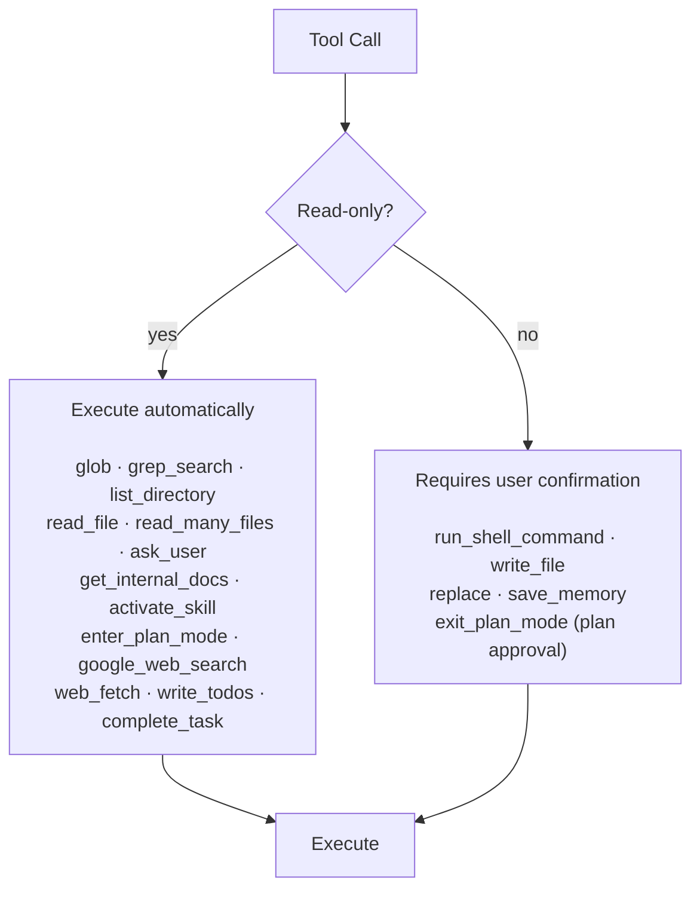
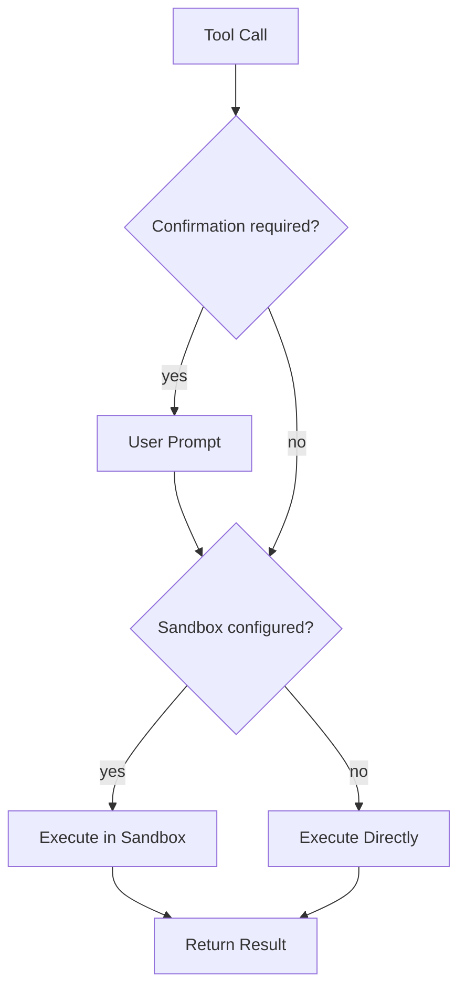
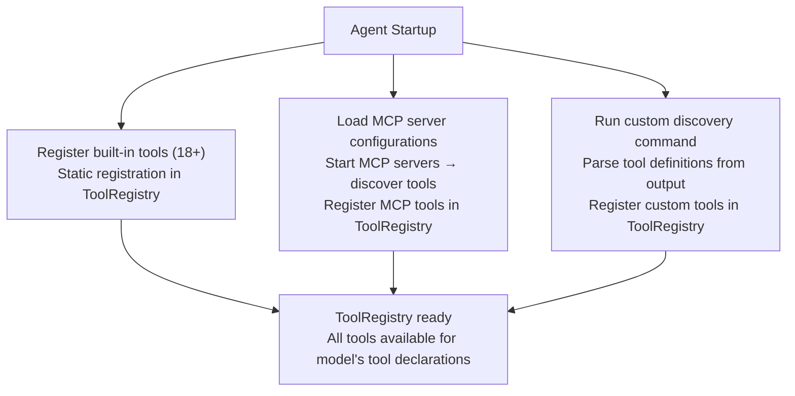

# Gemini CLI — Tool System

> Comprehensive catalog of all built-in tools, confirmation model, sandbox integration,
> MCP extension, custom tools, and shorthand syntax.

## Tool Inventory

Gemini CLI ships with 18+ built-in tools organized into functional categories.

### Execution Tools

#### run_shell_command
- **Purpose**: Execute arbitrary shell commands
- **Confirmation**: Always required (mutating)
- **Sandbox**: Runs in configured sandbox (Seatbelt, Docker, etc.)
- **Parameters**: `command` (string), `working_directory` (optional string)
- **Behavior**: Streams stdout/stderr, captures exit code
- **Notes**: Most powerful and most dangerous tool — sandboxing is critical

### File System Tools

#### glob
- **Purpose**: Find files matching glob patterns
- **Confirmation**: None (read-only)
- **Parameters**: `pattern` (string), `root_directory` (optional string)
- **Returns**: List of matching file paths
- **Notes**: Supports standard glob patterns (*, **, ?, {a,b})

#### grep_search
- **Purpose**: Search file contents using regex patterns
- **Confirmation**: None (read-only)
- **Parameters**: `pattern` (string), `path` (optional string), `include` (optional glob),
  `case_sensitive` (optional boolean)
- **Returns**: Matching lines with file paths and line numbers
- **Notes**: Built on ripgrep for performance

#### list_directory
- **Purpose**: List directory contents
- **Confirmation**: None (read-only)
- **Parameters**: `path` (string)
- **Returns**: File and directory names with metadata

#### read_file
- **Purpose**: Read file contents
- **Confirmation**: None (read-only)
- **Parameters**: `path` (string), `start_line` (optional), `end_line` (optional)
- **Returns**: File contents with line numbers
- **Notes**: Supports partial reads with line ranges

#### read_many_files
- **Purpose**: Read multiple files at once
- **Confirmation**: None (read-only)
- **Trigger**: Activated by @-syntax in user input
- **Parameters**: `paths` (array of strings)
- **Returns**: Contents of all specified files
- **Notes**: More efficient than multiple read_file calls; can be triggered
  with `@src/main.ts @src/utils.ts` syntax in user input

#### replace
- **Purpose**: Precise text replacement in files
- **Confirmation**: Required (mutating)
- **Parameters**: `path` (string), `old_text` (string), `new_text` (string)
- **Behavior**: Finds exact match of old_text and replaces with new_text
- **Notes**: Preferred over write_file for edits — surgical, reviewable changes.
  Similar to Claude Code's Edit tool. Fails if old_text not found or ambiguous.

#### write_file
- **Purpose**: Create or overwrite a file
- **Confirmation**: Required (mutating)
- **Parameters**: `path` (string), `content` (string)
- **Notes**: Used for new files or complete rewrites; replace is preferred for edits

### Interaction Tools

#### ask_user
- **Purpose**: Ask the user a clarifying question
- **Confirmation**: None (non-destructive)
- **Parameters**: `question` (string)
- **Returns**: User's response
- **Notes**: Blocks until user responds. In headless mode, behavior is configurable
  (skip, provide default, or fail)

#### write_todos
- **Purpose**: Track subtasks within a complex operation
- **Confirmation**: None (internal tracking)
- **Parameters**: `todos` (array of task objects with title, status)
- **Notes**: Displayed in UI as a progress checklist. Helps users track
  multi-step operations and gives the model a way to maintain a task list.

### Memory Tools

#### activate_skill
- **Purpose**: Load specialized expertise from skills directory
- **Confirmation**: None (read-only expansion of context)
- **Parameters**: `skill_name` (string)
- **Behavior**: Loads full content from .gemini/skills/<skill_name>/
- **Notes**: Part of progressive disclosure system — only loads when needed

#### get_internal_docs
- **Purpose**: Access Gemini CLI's own documentation
- **Confirmation**: None (read-only)
- **Parameters**: `topic` (string)
- **Returns**: Internal documentation about capabilities and usage
- **Notes**: Self-documentation tool, helps model understand its own features

#### save_memory
- **Purpose**: Persist information to GEMINI.md
- **Confirmation**: Required (writes to file)
- **Parameters**: `content` (string), `scope` (optional: "project" or "global")
- **Behavior**: Appends or updates content in the appropriate GEMINI.md file
- **Notes**: Creates persistent context that survives across sessions.
  Project-level saves to workspace GEMINI.md, global saves to ~/.gemini/GEMINI.md

### Planning Tools

#### enter_plan_mode
- **Purpose**: Switch to read-only research mode
- **Confirmation**: None (restricts capabilities)
- **Parameters**: None
- **Behavior**: Disables all mutating tools, enables focused research
- **Notes**: Agent can still read files, search, and use web tools

#### exit_plan_mode
- **Purpose**: Present plan and exit research mode
- **Confirmation**: User approval of plan
- **Parameters**: `plan_summary` (string)
- **Behavior**: Presents plan to user, re-enables mutating tools on approval
- **Notes**: Clean checkpoint before executing potentially destructive changes

### System Tools

#### complete_task
- **Purpose**: Signal sub-agent task completion
- **Confirmation**: None (system signal)
- **Parameters**: `result` (string)
- **Behavior**: Returns result to parent agent, terminates sub-agent
- **Notes**: Only used by sub-agents, not available to main agent

### Web Tools

#### google_web_search
- **Purpose**: Search the web using Google Search
- **Confirmation**: None (read-only)
- **Parameters**: `query` (string)
- **Returns**: Search results with snippets and URLs
- **Notes**: Uses Google Search grounding API — higher quality than generic web
  scraping. Provides real-time information the model wouldn't have from training.
  Unique to Gemini CLI among terminal agents.

#### web_fetch
- **Purpose**: Fetch content from a URL
- **Confirmation**: None (read-only)
- **Parameters**: `url` (string)
- **Returns**: Page content (HTML to text conversion)
- **Notes**: Used to read documentation, API references, etc.

## Tool Confirmation Model

### Confirmation Categories



### Confirmation Interface

When a mutating tool is called, the user sees:

```
run_shell_command
   Command: npm install express
   Directory: /home/user/project

   [Allow] [Deny] [Allow All for Session]
```

For file operations:
```
replace
   File: src/auth/login.ts
   Replacing:
   - const token = jwt.sign(payload, SECRET);
   + const token = jwt.sign(payload, SECRET, { expiresIn: '1h' });

   [Allow] [Deny] [Allow All for Session]
```

### Policy Engine Override

Users can configure auto-approval rules in settings:

```json
{
  "toolConfirmation": {
    "autoApprove": [
      {
        "tool": "run_shell_command",
        "pattern": "npm test*"
      },
      {
        "tool": "write_file",
        "pathPattern": "src/**/*.test.ts"
      }
    ]
  }
}
```

## Sandbox Integration

Tools that execute external code run inside the configured sandbox:

### Sandboxed Tools
- `run_shell_command` — always sandboxed when sandbox is configured
- `write_file` — may be sandboxed depending on configuration
- `replace` — may be sandboxed depending on configuration

### Sandbox + Confirmation Interaction



## MCP Extension

Gemini CLI supports extending its tool set via Model Context Protocol servers.

### MCP Tool Registration

MCP tools are registered dynamically when servers connect:

```json
{
  "mcpServers": {
    "filesystem": {
      "command": "npx",
      "args": ["-y", "@modelcontextprotocol/server-filesystem", "/tmp/safe"],
      "env": {}
    },
    "github": {
      "command": "npx",
      "args": ["-y", "@modelcontextprotocol/server-github"],
      "env": {}
    },
    "custom-db": {
      "command": "python",
      "args": ["./mcp-servers/db-server.py"],
      "env": {}
    }
  }
}
```

### MCP Tool Behavior

- MCP tools appear alongside built-in tools in the model's tool declarations
- Confirmation behavior: MCP tools require confirmation by default (treated as mutating)
- Sandbox behavior: MCP tools execute in the MCP server process (outside agent sandbox)
- Error handling: MCP errors surfaced as tool execution errors

### MCP vs Built-in Tools

| Aspect | Built-in Tools | MCP Tools |
|---|---|---|
| Registration | Static, compiled | Dynamic, runtime |
| Confirmation | Per-tool configuration | Default: required |
| Sandbox | In-agent sandbox | MCP server process |
| Performance | Direct execution | IPC overhead |
| Availability | Always present | Server must be running |

## Custom Tools via Discovery

Beyond MCP, Gemini CLI supports custom tool discovery:

```json
{
  "tools": {
    "discoveryCommand": "./scripts/discover-tools.sh"
  }
}
```

The discovery command returns a JSON array of tool definitions that are dynamically
registered in the ToolRegistry.

## Shorthand Syntax

### @ — File Reference

The `@` prefix in user input triggers `read_many_files`:

```
> Look at @src/main.ts and @src/utils.ts and tell me about the error handling

This automatically reads both files before the model starts processing.
```

### ! — Shell Command


```

Executes the command and shows output (still requires confirmation).
```

## Tool Discovery and Registration Flow



## Tool Usage Patterns

### Common Tool Sequences

The model typically uses tools in recognizable patterns:

**Exploration pattern:**
```
glob("src/**/*.ts") -> read_file(interesting files) -> grep_search(specific patterns)
```

**Edit pattern:**
```
read_file(target) -> replace(surgical edit) -> read_file(verify)
```

**Test-driven pattern:**
```
read_file(test) -> replace(implementation) -> run_shell_command("npm test")
```

**Research pattern (plan mode):**
```
enter_plan_mode -> glob + read_file + grep_search + google_web_search -> exit_plan_mode
```

**Multi-file refactor:**
```
grep_search(pattern) -> read_many_files(all matches) -> replace(file1) -> replace(file2) -> ...
```

## Tool Count Summary

| Category | Count | Tools |
|---|---|---|
| Execution | 1 | run_shell_command |
| File System | 7 | glob, grep_search, list_directory, read_file, read_many_files, replace, write_file |
| Interaction | 2 | ask_user, write_todos |
| Memory | 3 | activate_skill, get_internal_docs, save_memory |
| Planning | 2 | enter_plan_mode, exit_plan_mode |
| System | 1 | complete_task |
| Web | 2 | google_web_search, web_fetch |
| **Total** | **18** | |

Plus dynamically registered MCP tools and custom discovery tools.
