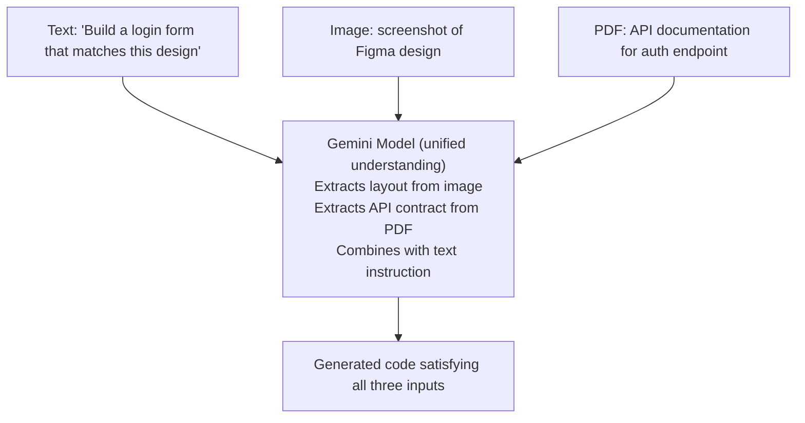
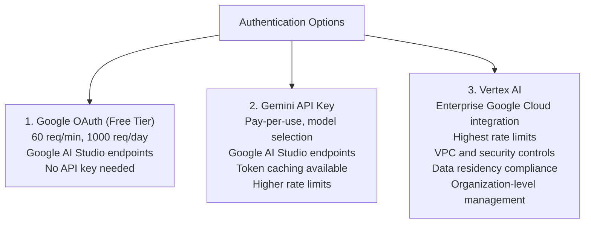
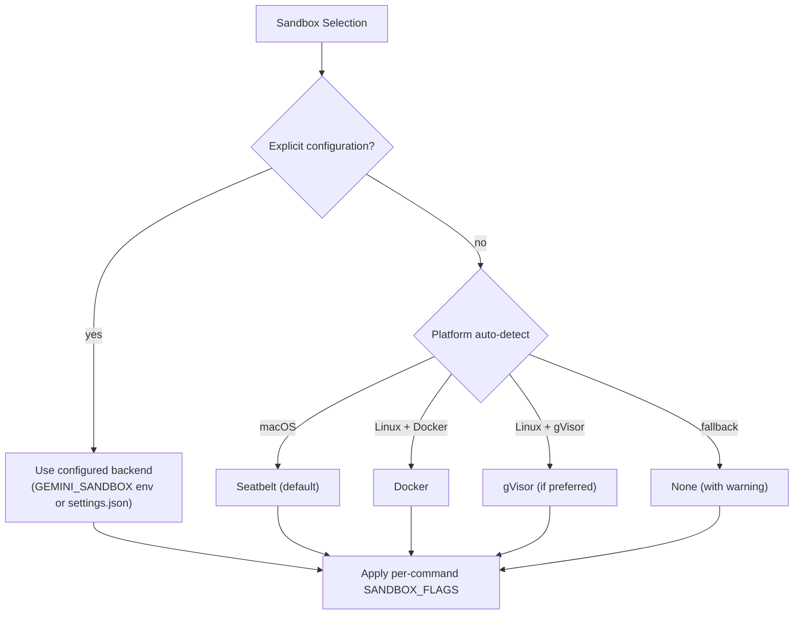
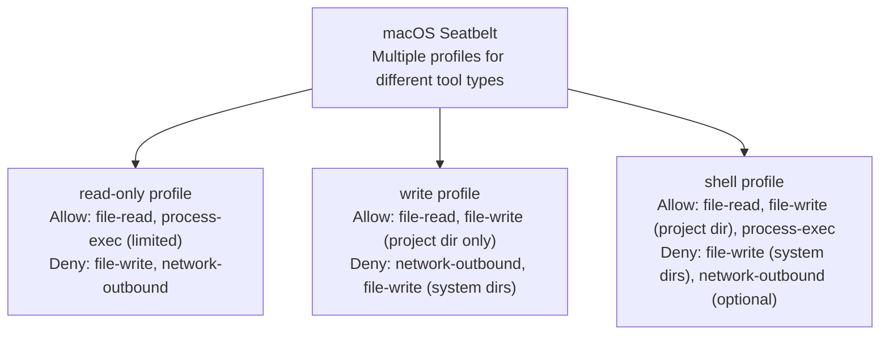
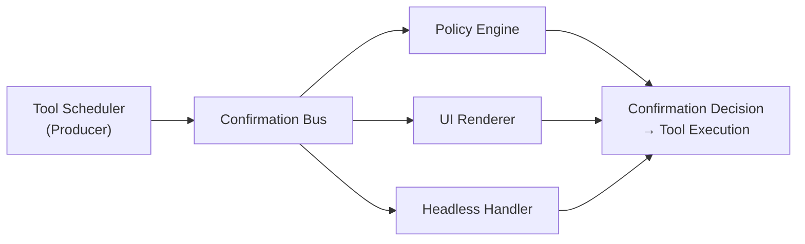

# Gemini CLI — Unique Patterns

> What makes Gemini CLI architecturally distinctive: 1M context strategy,
> multimodal coding, Google ecosystem integration, progressive skills,
> and multi-tier sandboxing.

## 1. Gemini Model Optimizations

### 1M Token Context Window

The most significant differentiator. While Claude Code works with 200K tokens and
Codex CLI with 128K tokens, Gemini CLI can leverage up to 1M tokens of context.

**What 1M tokens means in practice:**
- ~750,000 words of text
- ~30,000 lines of code (average 25 tokens/line)
- An entire medium-sized codebase loaded at once
- Full conversation histories spanning hours of work

**Architectural implications:**
- Less aggressive history pruning -> less information loss over long sessions
- Can read and hold entire modules in context simultaneously
- Multi-file refactoring with complete visibility (no "forgetting" files)
- Larger system prompts possible without crowding conversation

### Large Context Utilization Strategy

Gemini CLI doesn't just have a large window — it's designed to use it intelligently:

```
Strategy: Progressive Context Enrichment

Turn 1: User asks about a feature
├── System instructions (~5K tokens)
├── GEMINI.md context (~2K tokens)
├── Tool declarations (~3K tokens)
└── User message (~100 tokens)
    Total: ~10K / 1M tokens (1% utilized)

Turn 5: Agent has explored the codebase
├── System instructions (~5K tokens)
├── GEMINI.md context (~2K tokens)
├── JIT context from 3 directories (~1.5K tokens)
├── 1 skill activated (~2K tokens)
├── Tool declarations (~3K tokens)
├── 5 turns of conversation (~15K tokens)
└── Tool results: 12 file reads, 3 greps (~40K tokens)
    Total: ~68K / 1M tokens (7% utilized)

Turn 20: Deep refactoring session
├── All above context growing
├── 20 turns of conversation (~60K tokens)
├── Tool results: 50+ file reads, modifications (~200K tokens)
└── Full codebase map in working memory
    Total: ~300K / 1M tokens (30% utilized)
    
    Still has 700K tokens of headroom!
```

**Contrast with 200K agents:**
At turn 20, a 200K-context agent would have been aggressively pruning for several
turns, losing context about earlier files and decisions. Gemini CLI retains it all.

### Token Caching: Amortizing Context Cost

Token caching is a unique server-side optimization:

```
Without caching:
  Request 1: [System(5K) + Tools(3K) + History(10K)] = 18K input tokens billed
  Request 2: [System(5K) + Tools(3K) + History(20K)] = 28K input tokens billed
  Request 3: [System(5K) + Tools(3K) + History(30K)] = 38K input tokens billed
  Total billed: 84K tokens

With caching:
  Request 1: [System(5K) + Tools(3K)] cached + [History(10K)] = 10K billed + cache
  Request 2: Cache hit + [History(20K)] = 20K billed
  Request 3: Cache hit + [History(30K)] = 30K billed
  Total billed: 60K tokens + small cache cost
  
  Savings: ~29% fewer input tokens billed
```

The savings compound over longer sessions where system instructions remain stable.

## 2. Multimodal Input in Coding

Gemini CLI is the only terminal coding agent with comprehensive multimodal input:
images, audio, and PDFs as first-class inputs.

### Image Input

**Use cases for images in coding:**
- Paste a screenshot of a UI bug -> "Make the layout match this design"
- Share a whiteboard architecture diagram -> "Implement this architecture"
- Show a design mockup -> "Build this component"
- Screenshot of an error dialog -> "Fix this error"

**How it works:**
- Images are encoded and sent as inline data in the API request
- Gemini's vision capabilities analyze the image
- The model extracts relevant information (text, layout, colors, structure)
- Extracted information informs code generation/modification

### Audio Input

**Use cases for audio in coding:**
- Voice descriptions of desired changes
- Audio recordings of user stories or requirements
- Dictated comments or documentation
- Accessibility: voice-driven coding for users who prefer speech

**Voice module (packages/core/src/voice/):**
- Captures audio input from terminal
- Sends audio data to Gemini for transcription + understanding
- Model processes the audio semantically (not just transcription)
- Enables natural language coding interactions via voice

### PDF Input

**Use cases for PDFs in coding:**
- API documentation PDFs -> "Implement this API"
- Design specification documents -> "Follow this spec"
- Academic papers -> "Implement this algorithm"
- RFC documents -> "Implement this protocol"

**How it works:**
- PDF content extracted and sent to Gemini
- Model processes document structure (headings, code blocks, diagrams)
- Extracted information used to inform code generation

### Multimodal Context Integration



## 3. Google Ecosystem Integration

### Google Search Grounding

The `google_web_search` tool uses Google's Search grounding API — not basic web scraping:

**How it differs from web_fetch:**
- `google_web_search`: Structured search results with relevance ranking,
  snippets, and source attribution — powered by Google Search infrastructure
- `web_fetch`: Raw URL fetching, converts HTML to text

**Use cases:**
- "What's the latest syntax for React Server Components?" -> real-time docs
- "How do I configure Tailwind v4?" -> current (post-training) information
- "What's the recommended way to handle auth in Next.js 15?" -> up-to-date guidance
- Package version lookups, API changelog checks, etc.

**Unique advantage**: No other terminal agent has native Google Search integration.
Claude Code has web_fetch for URL retrieval, but no search engine integration.

### Vertex AI Integration

For enterprise users, Gemini CLI connects to Google Cloud's Vertex AI:



### GitHub Actions Integration

Gemini CLI is designed for CI/CD automation:

```yaml
# .github/workflows/gemini-review.yml
name: Gemini PR Review
on:
  pull_request:
    types: [opened, synchronize]

jobs:
  review:
    runs-on: ubuntu-latest
    steps:
      - uses: actions/checkout@v4
      - name: Gemini CLI Review
        run: |
          echo "Review this PR for bugs, security issues, and style" | \
            gemini --headless --output-format=json
        env:
          GEMINI_API_KEY: example-key-placeholder
```

**GitHub integration features:**
- @gemini-cli mentions in issues/PRs
- Automated PR reviews
- Issue triage and labeling
- Code generation from issue descriptions
- Structured JSON output for downstream processing

## 4. Progressive Skill Disclosure

This is architecturally unique among terminal agents. No other agent has a formal
system for on-demand expertise loading.

### The Problem It Solves

Traditional approach (all context always loaded):
```
System prompt: 5K tokens
+ All expertise: 50K tokens (React, DB, Security, Testing, DevOps, ...)
= 55K tokens EVERY request, even for "what does this function do?"
```

Progressive disclosure approach:
```
System prompt: 5K tokens
+ Skill metadata: 500 tokens (names + descriptions only)
= 5.5K tokens for simple queries

When specialized knowledge needed:
+ activate_skill("react-optimization"): +5K tokens
= 10.5K tokens, but only when needed
```

### Savings Analysis

```
Scenario: 20-turn conversation, 3 out of 10 skills ever needed

Traditional (all skills loaded):
  20 turns x 55K tokens/turn = 1.1M input tokens

Progressive (skills on demand):
  17 turns x 5.5K tokens/turn = 93.5K
  + 3 turns x 10.5K tokens/turn = 31.5K
  = 125K input tokens

Savings: ~89% fewer input tokens for skill content
```

### Skill Discovery Flow

```
1. Agent startup
   └── Load skill metadata from:
       ├── .gemini/skills/ (workspace)
       ├── ~/.gemini/skills/ (user)
       └── Extensions (MCP-provided)

2. Skill metadata injected into system prompt
   └── "Available skills: react-optimization (React perf),
        database-design (DB schemas), security-review (vuln analysis)"

3. Model encounters relevant task
   └── "I need to optimize this React component's rendering"

4. Model calls activate_skill("react-optimization")
   └── Full skill content loaded into context

5. Model applies expertise
   └── Generates specialized, high-quality guidance
```

## 5. Multi-Tier Sandboxing

Gemini CLI's sandboxing system is the most flexible of any terminal agent.

### Why Multiple Tiers?

Different security needs require different tradeoffs:

```
Security Level    | Sandbox Backend     | Tradeoff
──────────────────|────────────────────|─────────────────────
Light isolation   | macOS Seatbelt     | Low overhead, macOS only
Medium isolation  | Docker/Podman      | Cross-platform, moderate overhead
Strong isolation  | gVisor (runsc)     | Linux only, syscall-level
Full isolation    | LXC/LXD           | Linux only, highest overhead
No isolation      | None               | Fastest, no protection
```

### Adaptive Sandbox Selection



### Seatbelt Profile System

macOS Seatbelt uses SBPL (Seatbelt Profile Language) profiles:



## 6. Confirmation Bus as Event Architecture

The confirmation bus is more than a yes/no prompt — it's a full event-driven system:



This separation means:
- Adding new confirmation strategies doesn't require changing tool code
- Headless mode, interactive mode, and CI mode all use the same tool implementations
- Policy rules can be updated without touching confirmation logic
- Third-party integrations can subscribe to confirmation events

## 7. Shadow Git for History

Using git as the storage backend for conversation checkpoints is clever:

**Advantages over custom storage:**
- Battle-tested data integrity (git's SHA-based content addressing)
- Built-in history navigation (git log, git diff between checkpoints)
- Branching capability (explore different conversation paths)
- Compression (git's packfile format is efficient)
- Standard tooling for inspection and debugging

## Summary: What's Truly Novel

| Pattern | Novel? | Notes |
|---|---|---|
| 1M token context | Yes | 5x larger than nearest competitor |
| Token caching | Yes | Server-side, automatic, unique to Gemini API |
| Multimodal coding | Yes | Only terminal agent with image + audio + PDF |
| Google Search grounding | Yes | Native search engine integration |
| Progressive skill disclosure | Yes | No other agent has this |
| Multi-tier sandboxing | Yes | Most flexible sandbox system |
| Shadow git checkpoints | Somewhat | Others have resume, not git-based |
| Confirmation bus | Somewhat | Clean pattern, similar concept in others |
| GEMINI.md hierarchy | No | Similar to CLAUDE.md, AGENTS.md patterns |
| MCP integration | No | Standard across modern agents |
| Sub-agents | No | Similar to Claude Code's sub-agent system |
