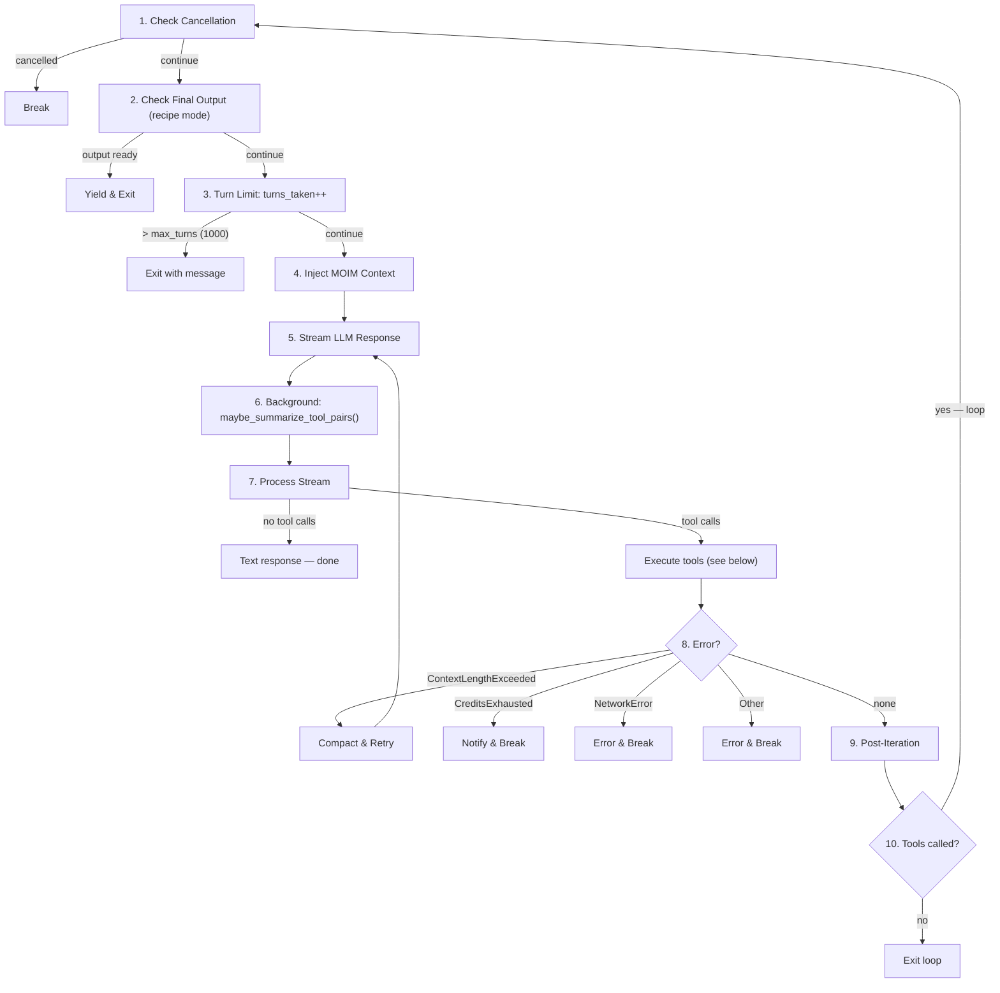
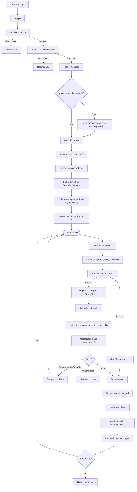

# Goose — Agent Loop Analysis

## Overview

Goose's agent loop is implemented in `crates/goose/src/agents/agent.rs` (~97KB), making it one of the largest single files in the codebase. The loop follows a streaming architecture: it yields `AgentEvent` items as an async stream, allowing the UI to render responses progressively.

The core loop pattern is: **prepare context → stream LLM response → parse tool calls → inspect & approve → dispatch tools → collect results → persist → loop**.

## Entry Point: `reply()`

The public API is the `reply()` method on `Agent`:

```rust
pub async fn reply(
    &self,
    user_message: Message,
    session_config: SessionConfig,
    cancel_token: Option<CancellationToken>,
) -> Result<BoxStream<'_, Result<AgentEvent>>>
```

This method handles pre-loop concerns before delegating to the core loop:

### Pre-Loop Steps

1. **Elicitation responses**: If the user message is a response to an elicitation (a tool asking for user input), it's routed directly to the waiting tool via the elicitation channel — the main loop is not entered.

2. **Slash commands**: Checks for custom recipe commands (e.g., from the Summon extension). If the message matches a registered command, `execute_command()` processes it and may return early.

3. **Message persistence**: The user message is saved to the `SessionManager`.

4. **Auto-compaction check**: Before entering the loop, checks if the conversation has exceeded 80% of the context window. If so, compaction runs first and yields `AgentEvent::HistoryReplaced`.

5. **Delegation**: Calls `reply_internal()` for the actual loop.

## Core Loop: `reply_internal()`

```rust
async fn reply_internal(
    &self,
    conversation: Conversation,
    session_config: SessionConfig,
    session: Session,
    cancel_token: Option<CancellationToken>,
) -> Result<BoxStream<'_, Result<AgentEvent>>>
```

### Preparation Phase

Before entering the loop, `prepare_reply_context()` runs:

1. **Fix conversation ordering** — ensures alternating user/assistant messages as expected by providers
2. **Gather tools** — calls `extension_manager.get_prefixed_tools()` to collect all available tools from all enabled extensions
3. **Build system prompt** — assembles the system prompt from base instructions, goosehints, and extension-specific instructions
4. **Determine tool_call_cut_off** — calculates where old tool-call pairs should be summarized
5. **Capture initial_messages** — snapshot for retry/reset scenarios

The result is a `ReplyContext`:

```rust
pub struct ReplyContext {
    pub conversation: Conversation,
    pub tools: Vec<Tool>,
    pub toolshim_tools: Vec<Tool>,
    pub system_prompt: String,
    pub goose_mode: GooseMode,
    pub tool_call_cut_off: usize,
    pub initial_messages: Vec<Message>,
}
```

### The Loop



### Max Turns

The loop has a hard limit of `max_turns` (default 1000, configurable via `GOOSE_MAX_TURNS`). If exceeded, Goose yields a message: "I've reached the maximum number of actions" and exits.

## LLM Streaming

The `stream_response_from_provider()` function handles the LLM call:

```rust
pub(crate) async fn stream_response_from_provider(
    provider: Arc<dyn Provider>,
    session_id: &str,
    system_prompt: &str,
    messages: &[Message],
    tools: &[Tool],
    toolshim_tools: &[Tool],
) -> Result<MessageStream, ProviderError>
```

Key behaviors:

1. **Message filtering**: Only agent-visible messages are sent (messages marked invisible by summarization are excluded)
2. **Toolshim mode**: For models without native tool support, tool definitions are converted to text instructions. After the LLM responds, the output is post-processed to extract JSON tool calls from code blocks.
3. **Error enhancement**: Provider errors are wrapped with model suggestions via `enhance_model_error()`
4. **Streaming**: Returns an async `MessageStream` that yields `(Option<Message>, Option<ProviderUsage>)` chunks

## MOIM (Model-Oriented Information Management)

Before each LLM call, Goose injects MOIM context:

```rust
let conversation_with_moim = super::moim::inject_moim(...).await;
```

MOIM allows extensions to inject dynamic context into the conversation each turn. This is used by extensions like "Top of Mind" (`tom`) to ensure persistent instructions are always present. The `get_moim()` method on `McpClientTrait` is called for each extension.

## Tool Call Processing

### Step 1: Categorize Tool Requests

```rust
let result = self.categorize_tools(&response, &tools).await;
```

Tool requests from the LLM are split into:
- **Frontend tools** — executed by the UI (e.g., user-facing widgets)
- **Remaining tools** — executed server-side by extensions

### Step 2: Argument Coercion

Tool arguments are coerced to match the tool's JSON Schema. For example, if the LLM sends a string `"42"` but the schema expects a number, the argument is converted to `42`. This handles common LLM mistakes gracefully.

### Step 3: Permission & Security Inspection

For non-chat-mode, remaining tools go through the inspection pipeline:

```rust
// 1. Run ALL inspectors
let inspection_results = tool_inspection_manager.inspect_tools(...)

// 2. Classify results
//    - Approved: safe to execute
//    - NeedsApproval: requires user confirmation
//    - Denied: blocked (security risk, repeated failure, etc.)

// 3. Process
handle_approved_and_denied_tools(...)   // dispatch or return denial
handle_approval_tool_requests(...)       // ask user, then dispatch or deny
```

The 4 inspectors run in order:
1. **SecurityInspector** — Pattern-matching for dangerous commands
2. **AdversaryInspector** — Prompt injection detection in tool arguments
3. **PermissionInspector** — Per-tool permission rules
4. **RepetitionInspector** — Detects tools called repeatedly without progress

In **Chat mode**, all tool calls are skipped with a `CHAT_MODE_TOOL_SKIPPED_RESPONSE` message.

### Step 4: Dispatch

```rust
pub async fn dispatch_tool_call(
    &self,
    tool_call: CallToolRequestParams,
    request_id: String,
    cancellation_token: Option<CancellationToken>,
    session: &Session,
) -> (String, Result<ToolCallResult, ErrorData>)
```

Dispatch routing:
1. **Schedule tool** → `handle_schedule_management()` (task scheduling)
2. **Final output tool** → `final_output_tool.execute_tool_call()` (recipe completion)
3. **Frontend tools** → routed to UI via channel
4. **Everything else** → `extension_manager.dispatch_tool_call()` → MCP client

### Step 5: Collect Results

Tool results are collected via a `tokio::select!` loop that merges:
- Tool result streams from all dispatched tools (`stream::select_all`)
- Elicitation messages (user prompts from tools, polled every 100ms)

```rust
loop {
    tokio::select! {
        biased;
        tool_item = combined.next() => {
            // Handle Result or Notification
        }
        _ = tokio::time::sleep(Duration::from_millis(100)) => {
            // Drain elicitation messages
        }
    }
}
```

### Step 6: Build Tool Response Messages

Each tool result is converted into a `ToolResponse` message content item and added to the conversation. Both success results and errors are captured.

## Error Handling

| Error Type | Recovery Strategy |
|-----------|-------------------|
| `ContextLengthExceeded` | Compact conversation (up to 2 attempts), then retry the turn |
| `CreditsExhausted` | Yield notification with `top_up_url`, break the loop |
| `NetworkError` | Yield "please resend your last message" error, break |
| Other `ProviderError` | Yield error message, break |
| Unparseable tool call | Yield "try breaking into smaller steps" message, exit |

### Emergency Compaction

When `ContextLengthExceeded` is returned mid-loop:

```rust
compaction_attempts += 1;
if compaction_attempts >= 2 {
    // Give up, yield error
    break;
}
let (compacted, usage) = compact_messages(
    provider, session_id, &conversation, false
).await?;
// Replace conversation, yield HistoryReplaced event, retry turn
```

## Retry System (Recipe Mode)

The `RetryManager` supports automated task execution with validation:

```rust
pub struct RetryManager {
    attempts: Arc<Mutex<u32>>,
    repetition_inspector: Option<Arc<Mutex<Option<RepetitionInspector>>>>,
}
```

`handle_retry_logic()` flow:
1. If no `retry_config` → `Skipped` (normal conversation mode)
2. Run **success checks** (shell commands with timeouts)
3. All pass → `SuccessChecksPassed` (yield success, exit)
4. If `attempts >= max_retries` → `MaxAttemptsReached` (yield error)
5. If `on_failure` command configured → execute it
6. **Reset conversation** to `initial_messages`, clear `final_output_tool`
7. Increment attempts → `Retried` (loop continues from scratch)

## Event Stream

The loop yields `AgentEvent` items through an async stream:

```rust
pub enum AgentEvent {
    Message(Message),                              // Assistant text or tool results
    McpNotification((String, ServerNotification)), // Extension notifications
    HistoryReplaced(Conversation),                 // After compaction
}
```

This streaming design allows the UI to:
- Render assistant text as it's generated
- Show tool execution progress
- Update the conversation after compaction

## Post-Loop: Session Naming

A background task generates a session name from the conversation content:

```rust
let naming_task = tokio::spawn(async move {
    // Call provider with summarization prompt
    // Update session metadata with generated name
});
```

This runs concurrently with the reply loop and doesn't block the response.

## Flow Diagram



## Key Design Decisions

1. **Streaming-first**: The loop yields events as a stream rather than returning a complete response. This enables progressive UI rendering.

2. **Unified tool dispatch**: All tools go through the same `ExtensionManager.dispatch_tool_call()` path, regardless of whether they're built-in, platform, or external.

3. **Security by default**: The 4-inspector pipeline runs before every tool execution, even in autonomous mode (security + adversary inspectors always run).

4. **Graceful degradation**: Context overflow triggers automatic compaction rather than failure. Network errors suggest retry rather than crashing.

5. **Background optimization**: Tool-pair summarization runs in the background to proactively shrink context without blocking the response.

6. **Cancellation-aware**: The loop checks `cancel_token` at the top of each iteration and during tool collection, enabling clean session interruption.