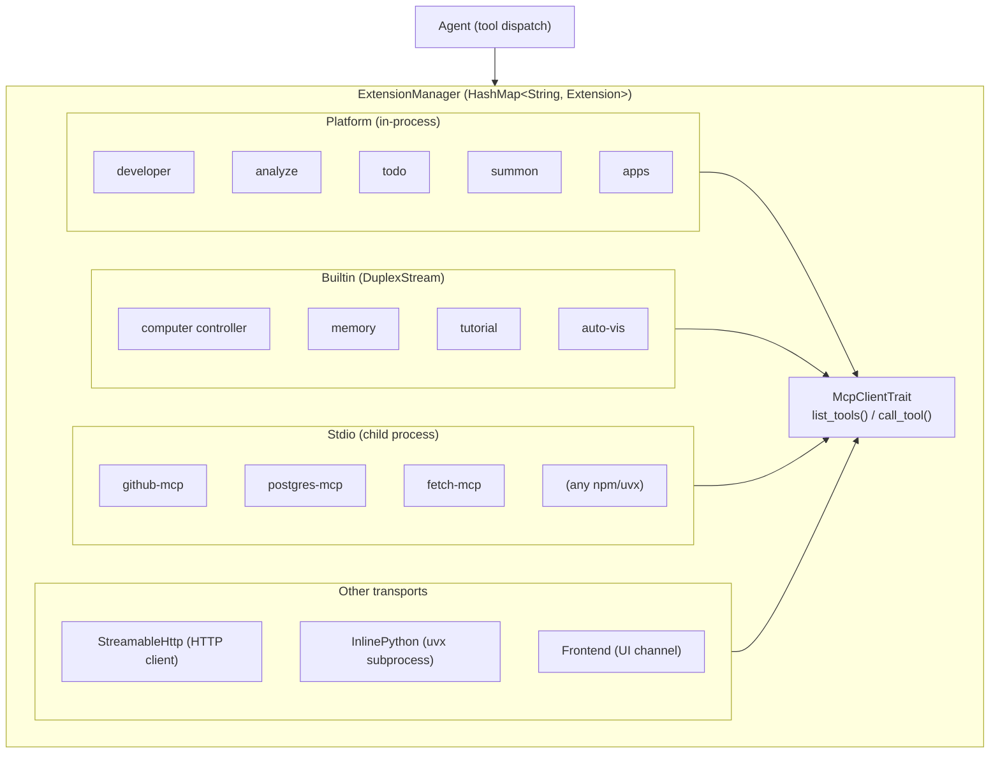

# Goose — Tool System & MCP Integration

## Overview

Goose's tool system is built entirely on the **Model Context Protocol (MCP)**. Every tool — from file editing to shell execution to memory — is an MCP server. This is Goose's most distinctive architectural decision: there is no separate "built-in tool" abstraction. The `ExtensionManager` acts as an MCP client router, connecting to multiple MCP servers and presenting a unified tool interface to the agent loop.

## Extension Configuration Types

Goose supports 7 extension transport types, defined in `crates/goose/src/agents/extension.rs`:

```rust
pub enum ExtensionConfig {
    Stdio { name, cmd, args, envs, env_keys, timeout, available_tools, .. },
    StreamableHttp { name, uri, headers, envs, env_keys, timeout, available_tools, .. },
    Builtin { name, display_name, timeout, available_tools, .. },
    Platform { name, description, display_name, available_tools, .. },
    Frontend { name, tools: Vec<Tool>, instructions, .. },
    InlinePython { name, code, timeout, dependencies, available_tools, .. },
    Sse { name, uri, .. },  // DEPRECATED
}
```

### Transport Comparison

| Type | Transport | Use Case | Example |
|------|----------|----------|---------|
| **Platform** | In-process, no MCP transport | Core tools with agent access | `developer`, `analyze`, `todo` |
| **Builtin** | In-process via `DuplexStream` | Feature-rich MCP servers | `computercontroller`, `memory` |
| **Stdio** | Child process stdin/stdout | External MCP servers | GitHub, Postgres, any npm/uvx package |
| **StreamableHttp** | HTTP client | Remote MCP servers | Cloud-hosted services |
| **InlinePython** | Child process (via `uvx`) | Ad-hoc Python tools | User-defined Python scripts |
| **Frontend** | UI channel | UI-executed tools | Interactive widgets |
| **SSE** | Server-Sent Events | Legacy remote servers | (deprecated) |

## ExtensionManager

The `ExtensionManager` (`crates/goose/src/agents/extension_manager.rs`, ~81KB) is the central hub for all extensions:

```rust
pub struct ExtensionManager {
    extensions: Mutex<HashMap<String, Extension>>,
    context: PlatformExtensionContext,
    provider: SharedProvider,
    tools_cache: Mutex<Option<Arc<Vec<Tool>>>>,
    tools_cache_version: AtomicU64,
    client_name: String,
    capabilities: ExtensionManagerCapabilities,
}
```

Each loaded extension:

```rust
struct Extension {
    config: ExtensionConfig,
    resolved_config: ExtensionConfig,   // with secrets substituted
    client: McpClientBox,               // Arc<dyn McpClientTrait>
    server_info: Option<ServerInfo>,
    _temp_dir: Option<TempDir>,         // for InlinePython
}
```

### Extension Loading (`add_extension()`)

The loading process varies by transport type:

#### Stdio Extensions
1. Resolve environment variables from config + keyring
2. Run malware check on the command (blocks known malicious packages)
3. Launch child process via `Command::new(cmd).args(args).envs(envs)`
4. Connect MCP client over stdin/stdout via `rmcp`
5. Cache discovered tools

#### Builtin Extensions
1. Look up factory function in `BUILTIN_EXTENSIONS` map
2. Create in-memory `DuplexStream` pair (65KB buffer):
   ```rust
   let (server_read, client_write) = tokio::io::duplex(65536);
   let (client_read, server_write) = tokio::io::duplex(65536);
   ```
3. Spawn MCP server on one end
4. Connect MCP client on the other end
5. Cache discovered tools

#### Platform Extensions
1. Look up factory function in `PLATFORM_EXTENSIONS` lazy HashMap
2. Call factory: `fn(PlatformExtensionContext) -> Box<dyn McpClientTrait>`
3. Platform extensions implement `McpClientTrait` directly — no MCP transport layer
4. They have direct access to agent internals via `PlatformExtensionContext`

#### StreamableHttp Extensions
1. Resolve environment variables, substitute into URI/headers
2. Connect via `rmcp`'s streamable HTTP transport
3. Cache discovered tools

#### InlinePython Extensions
1. Write Python code to a temporary file
2. Launch `uvx --with mcp python <tempfile>` as a child process
3. Connect MCP client over stdin/stdout
4. Temp directory is kept alive via `_temp_dir` field

### Tool Namespacing

Tools are namespaced as `extensionname__toolname` (double underscore separator) unless the extension has `unprefixed_tools: true`. This prevents collisions when multiple extensions define similarly-named tools.

Extensions with `unprefixed_tools: true` (their tools appear as bare names to the LLM):
- `developer` — `shell`, `write`, `edit`, `tree` (not `developer__shell`)
- `analyze` — `analyze` (not `analyze__analyze`)
- `summon` — subagent tools
- `code_execution` — code mode tools

### Tool Dispatch

```rust
pub async fn dispatch_tool_call(
    &self,
    ctx: ToolCallContext,
    tool_call: CallToolRequestParams,
    cancel_token: Option<CancellationToken>,
) -> Result<ToolCallResult, ErrorData>
```

Dispatch flow:
1. `resolve_tool()` — parses the `extensionname__toolname` format, finds the matching extension
2. `config.is_tool_available()` — validates the tool is in the extension's whitelist
3. Calls `client.call_tool()` with the actual tool name (prefix stripped)
4. Returns `ToolCallResult` containing both a result future and a notification stream

### Tool Whitelisting

Each extension config supports `available_tools: Vec<String>` to control which tools the LLM can see:

```yaml
extensions:
  github:
    cmd: npx
    args: [-y, @modelcontextprotocol/server-github]
    available_tools: [create_issue, list_issues, get_file_contents]
```

If `available_tools` is empty, all tools from the extension are exposed.

## MCP Client Implementation

The MCP client wraps the `rmcp` SDK (`crates/goose/src/agents/mcp_client.rs`):

```rust
pub struct McpClient {
    client: Mutex<RunningService<RoleClient, GooseClient>>,
    notification_subscribers: Arc<Mutex<Vec<mpsc::Sender<ServerNotification>>>>,
    server_info: Option<InitializeResult>,
    timeout: Duration,
    docker_container: Option<String>,
}
```

### McpClientTrait

The unified interface all extensions implement:

```rust
#[async_trait]
pub trait McpClientTrait: Send + Sync {
    async fn list_tools(&self, session_id, next_cursor, cancel_token)
        -> Result<ListToolsResult>;
    async fn call_tool(&self, ctx, name, arguments, cancel_token)
        -> Result<CallToolResult>;
    fn get_info(&self) -> Option<&InitializeResult>;
    async fn list_resources(...) -> Result<ListResourcesResult>;
    async fn read_resource(...) -> Result<ReadResourceResult>;
    async fn list_prompts(...) -> Result<ListPromptsResult>;
    async fn get_prompt(...) -> Result<GetPromptResult>;
    async fn subscribe(&self) -> mpsc::Receiver<ServerNotification>;
    async fn get_moim(&self, session_id) -> Option<String>;
    async fn update_working_dir(...) -> Result<()>;
}
```

### GooseClient (MCP Client Handler)

`GooseClient` implements `rmcp::ClientHandler`, providing server-side callbacks:

- **`list_roots()`** — Returns the working directory as a `file://` URI
- **`on_progress()`** — Forwards progress notifications to subscribers
- **`on_logging_message()`** — Forwards log messages
- **`create_message()`** — Implements MCP **sampling**: when an extension needs to call the LLM (e.g., for sub-reasoning), this handler routes the request through the agent's provider
- **`create_elicitation()`** — Handles elicitation requests: when a tool needs user input, this routes the request to the UI

## Built-in Platform Extensions

These run in-process with direct agent access, registered in `PLATFORM_EXTENSIONS`:

### Developer Extension (default, enabled)

**Path**: `crates/goose/src/agents/platform_extensions/developer/`

The most important extension — provides the core development tools:

| Tool | Description | Implementation |
|------|-------------|---------------|
| `shell` | Execute shell commands, returns stdout/stderr | `developer/shell.rs` |
| `write` | Create/overwrite files (creates parent dirs) | `developer/edit.rs` |
| `edit` | Find-and-replace text editing | `developer/edit.rs` |
| `tree` | List directory tree with line counts, respects .gitignore | `developer/tree.rs` |

Tool schemas are derived from Rust structs via `schemars::JsonSchema`:
```rust
fn schema<T: JsonSchema>() -> JsonObject {
    serde_json::to_value(schema_for!(T))
        .expect("schema").as_object().expect("object").clone()
}
```

### Analyze Extension (default, enabled)

Tree-sitter based code analysis:
- Directory overviews with file counts and sizes
- File-level analysis with symbols and structure
- Symbol call graphs and dependency tracking

### Todo Extension (default, enabled)

Task tracking for the agent — manages task lists across sessions.

### Extension Manager Extension (default, enabled)

Allows the agent to discover, enable, and disable extensions at runtime:
- `search_extensions()` — searches the extension directory
- `manage_extensions()` — enable/disable extensions mid-session
- Smart recommendation: auto-suggests extensions based on task context

### Summon Extension (default, enabled)

Subagent delegation:
- Load "skills" and "recipes" (predefined task templates)
- Delegate tasks to subagents with isolated contexts
- Subagents can have their own extension sets

### Other Platform Extensions

| Extension | Purpose | Default |
|-----------|---------|---------|
| Apps | Create/manage HTML/CSS/JS apps in standalone windows | Yes |
| Chat Recall | Search past conversation content | No |
| Code Mode | Token-saving code execution mode | No |
| Summarize | LLM-powered file/directory summarization | No |
| Top of Mind | Inject persistent instructions every turn | Yes |

## Built-in MCP Servers (goose-mcp crate)

These run as in-process MCP servers over `DuplexStream`, registered in `BUILTIN_EXTENSIONS`:

```rust
pub static BUILTIN_EXTENSIONS: Lazy<HashMap<&'static str, SpawnServerFn>> = Lazy::new(|| {
    HashMap::from([
        builtin!(autovisualiser, AutoVisualiserRouter),
        builtin!(computercontroller, ComputerControllerServer),
        builtin!(memory, MemoryServer),
        builtin!(tutorial, TutorialServer),
    ])
});
```

### Computer Controller

Uses `rmcp`'s `#[tool_router]` / `#[tool]` macros:

```rust
#[tool_router(router = tool_router)]
impl ComputerControllerServer {
    #[tool(name = "web_scrape")]
    pub async fn web_scrape(&self, params: Parameters<WebScrapeParams>)
        -> Result<CallToolResult, ErrorData> { ... }

    #[tool(name = "automation_script")]
    pub async fn automation_script(..) -> ..

    #[tool(name = "computer_control")]
    pub async fn computer_control(..) -> ..

    #[tool(name = "xlsx_tool")]
    pub async fn xlsx_tool(..) -> ..

    #[tool(name = "pdf_tool")]
    pub async fn pdf_tool(..) -> ..
}
```

### Memory Extension

Persistent memory that teaches Goose to remember preferences:
- Stores memories as key-value pairs
- Automatically loaded at session start
- Updated based on user interactions

### Auto Visualiser

Automatically generates graphical data visualizations during conversations.

## External Extension Ecosystem

Goose can connect to any MCP server. The extension directory at https://block.github.io/goose/extensions lists curated options:

### Adding External Extensions

**Via CLI:**
```bash
goose session --with-extension "npx -y @modelcontextprotocol/server-github"
goose session --with-extension "uvx mcp-server-fetch"
goose session --with-streamable-http-extension "https://example.com/mcp"
```

**Via config file:**
```yaml
extensions:
  github:
    name: GitHub
    cmd: npx
    args: [-y, @modelcontextprotocol/server-github]
    enabled: true
    envs: { "GITHUB_PERSONAL_ACCESS_TOKEN": "<TOKEN>" }
    type: stdio
    timeout: 300
```

**Via deep link:**
```
goose://extension?cmd=npx&arg=-y&arg=%40modelcontextprotocol/server-github&id=github&name=GitHub
```

### Docker Container Support

Extensions can run inside Docker containers:
```bash
goose session --container <container_id>
```

## Tool Inspection & Security

Before any tool executes, it passes through 4 inspectors:

### 1. SecurityInspector
Pattern-matching for dangerous command patterns. Catches obviously destructive operations.

### 2. AdversaryInspector
Detects prompt injection attempts in tool arguments. Looks for instructions embedded in tool outputs that try to manipulate the agent.

### 3. PermissionInspector
Applies per-tool permission rules based on the current permission mode:
- **Autonomous**: All tools approved
- **Manual Approval**: All tools need confirmation
- **Smart Approval**: AI decides what needs review
- **Chat Only**: All tools denied

### 4. RepetitionInspector
Detects tools called repeatedly without progress. Prevents infinite loops where the agent keeps retrying a failing tool.

### Inspection Results

```
Approved → execute immediately
NeedsApproval → yield ActionRequired event to UI, wait for user response
Denied → return DECLINED_RESPONSE to the LLM
```

## Tool Result Format

Tool results use the MCP `CallToolResult` type:

```rust
pub struct CallToolResult {
    pub content: Vec<Content>,    // Text, Image, or Resource
    pub is_error: Option<bool>,
    pub meta: Option<Meta>,       // Extension metadata, notifications
}
```

Results are converted to `ToolResponse` message content items and added to the conversation, maintaining the tool request → tool response pairing that LLMs expect.

## Architecture Diagram



## Key Design Decisions

1. **MCP as the universal interface**: Everything is an MCP server, from core file editing to external plugins. This means any MCP-compatible tool works with Goose without adaptation.

2. **Namespace-based routing**: The `extension__tool` naming convention allows clean multiplexing of many extensions without collisions, while `unprefixed_tools` keeps common tools (shell, edit) ergonomic.

3. **Lazy tool caching**: Tools are cached per-extension and only refreshed when extensions change. An atomic version counter (`tools_cache_version`) ensures consistency.

4. **Argument coercion**: Rather than failing on type mismatches, Goose coerces LLM arguments to match schemas. This handles the common case where LLMs send `"42"` instead of `42`.

5. **Security-first dispatch**: Every tool call passes through the inspection pipeline, even in autonomous mode. Security and adversary inspectors always run.