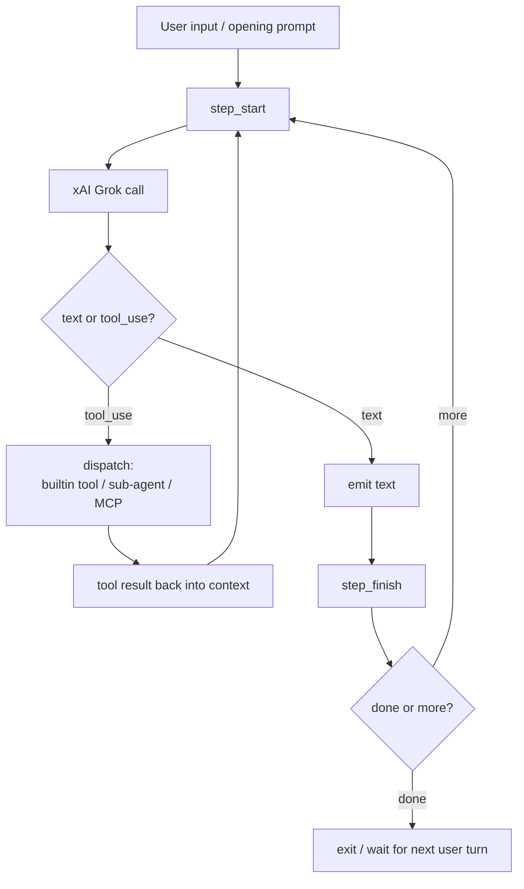

# grok-cli — Agentic Loop

## Two Entry Modes

### Interactive (default)

```
grok                      # OpenTUI session
grok -d /path/to/repo     # explicit project dir
grok fix the flaky test in src/foo.test.ts   # opening message
```

The TUI runs as long as the user wants. Sessions persist; `--session
latest` or `-s <id>` resumes.

### Headless

```
grok --prompt "run the test suite and summarize failures"
grok -p "show me package.json"
grok --prompt "..." --max-tool-rounds 30
grok --prompt "..." --format json
grok --prompt "..." --batch-api
grok --verify
```

Headless mode is for CI, scripts, schedules. `--max-tool-rounds`
caps the loop. `--format json` emits an NDJSON event stream
(`step_start`, `text`, `tool_use`, `step_finish`, `error`).
`--batch-api` routes through xAI's Batch API for delayed-but-cheaper
unattended runs.

## Loop Shape

The README does not enumerate the loop's state machine in detail, but
based on the public surface it's a standard tool-using ReAct loop:



## Sub-Agent Dispatch

Sub-agents are first-class citizens. The reserved names (`general`,
`explore`, `vision`, `verify`, `computer`, `delegate`) plus user-defined
names from `subAgents` config are presented to the model as a `task` /
`delegate` tool call surface. The README's tagline:

> *"Sub-agents on by default — parallelize like you mean it."*

`task` is foreground (blocks main loop on result), `delegate` is
background read-only (results stream back asynchronously).

## `/verify`

Special verb. The `verify` sub-agent inspects the project, builds it,
runs the tests, boots the app, and performs browser smoke checks in a
sandboxed environment. Returns screenshots and (if applicable) a video.
This is the closest analog to Claude Code's built-in test/verify flow,
but with a richer browser story.

## Schedules

Schedules are defined in natural language inside a session and stored
for the daemon to execute. Recurring schedules require the background
daemon (`grok daemon --background`).

```
"Create a schedule named daily-changelog-update that runs every weekday
 at 9am and updates CHANGELOG.md from the latest merged commits."
```

## Loop Cap

`--max-tool-rounds` (e.g. `--max-tool-rounds 30`) limits how many
tool-execution rounds a headless run will take. Default is not stated in
the README excerpt; for interactive TUI the cap is effectively
session-bound.

## Telegram Remote

After pairing via `/remote-control`, the user can DM the bot from a
phone. The CLI must be running locally; the bot acts as a remote
control. Useful for "kick off a task while heading out, check progress
from the train" workflows.

---

*Loop description from `superagent-ai/grok-cli` README. The internal
TypeScript loop is open-source and could be analysed further if desired.*
