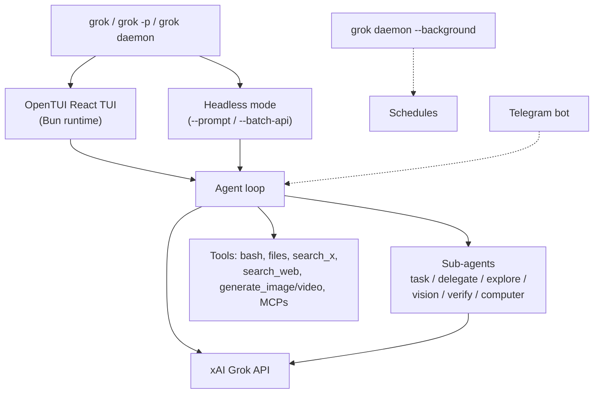

# grok-cli — Architecture

## Components



## Runtime: Bun + OpenTUI

The CLI is a TypeScript project that runs on Bun. The terminal UI is
built with OpenTUI (React-for-the-terminal). The README recommends modern
GPU-aware terminals — WezTerm, Alacritty, Ghostty, Kitty — for the best
interactive experience. Headless mode (`--prompt`) does not require any
of that.

## Settings

Two configuration locations:

```
~/.grok/user-settings.json    # apiKey, custom subAgents, defaults
.grok/settings.json           # project: mcpServers, project overrides
```

Project-scoped state lives under `.grok/`:

- `.grok/computer/` — screenshots from the `computer` sub-agent
- `.grok/generated-media/` — output from `generate_image` / `generate_video`
- `.grok/settings.json` — project config

## Built-In Sub-Agents

Six reserved names — these cannot be overloaded by user config:

| Name | Purpose |
|---|---|
| `general` | foreground generalist |
| `explore` | foreground codebase exploration |
| `vision` | image / visual reasoning |
| `verify` | builds, tests, boots, runs browser smoke checks |
| `computer` | macOS desktop automation via `agent-desktop` |
| `delegate` | background read-only deep dives |

Plus a `task` mechanism for foreground delegation.

## Custom Sub-Agents

`subAgents` in `~/.grok/user-settings.json` — each with `name`, `model`,
`instruction`. Names cannot collide with the reserved six.

```json
{
  "subAgents": [
    {
      "name": "security-review",
      "model": "grok-code-fast-1",
      "instruction": "Prioritize security implications and suggest concrete fixes."
    }
  ]
}
```

## Daemon

`grok daemon --background` runs a long-lived process that owns:

- Recurring schedules (daily-changelog-update, etc.)
- Telegram bot connection (after `/remote-control` pairing)

One-time schedules start immediately and exit when finished; recurring
ones live as long as the daemon does.

## Computer Sub-Agent

Backed by [`agent-desktop`](https://github.com/lahfir/agent-desktop).
macOS only. Requires Accessibility permission for the terminal app.
Preferred workflow:

```
computer_snapshot  → returns refs (e.g. @e1) for visible UI elements
computer_click @e1 / computer_type / computer_scroll
computer_snapshot  → confirm
```

`computer_screenshot` is also available for visual confirmation, but
ref-based actions on accessibility snapshots are preferred over
pixel-based clicks.

---

*Architecture from `superagent-ai/grok-cli` README.*
