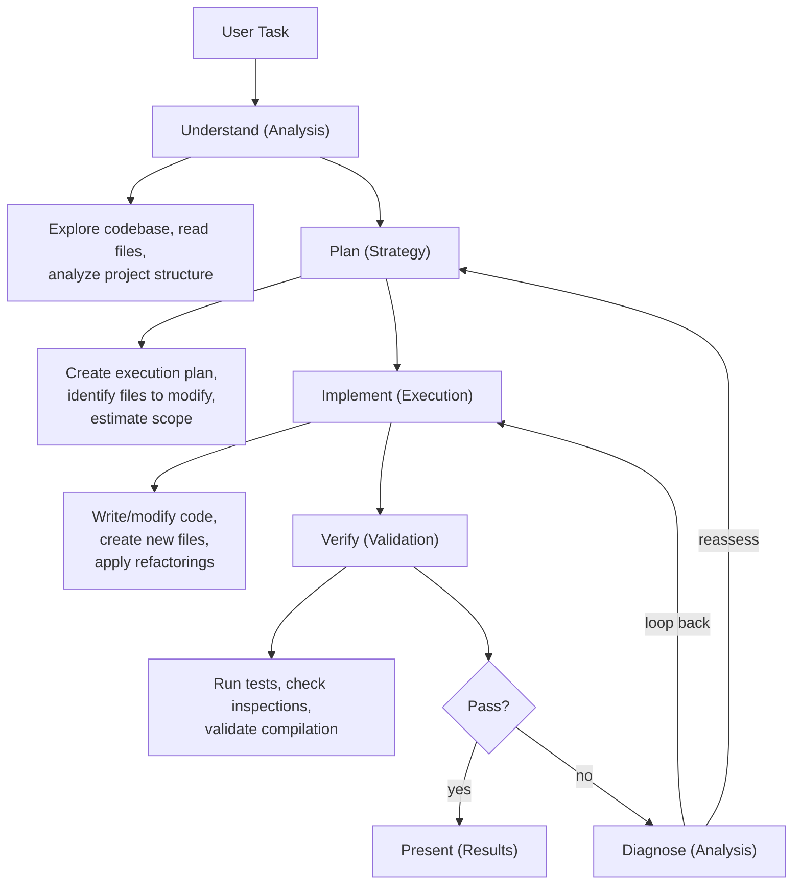
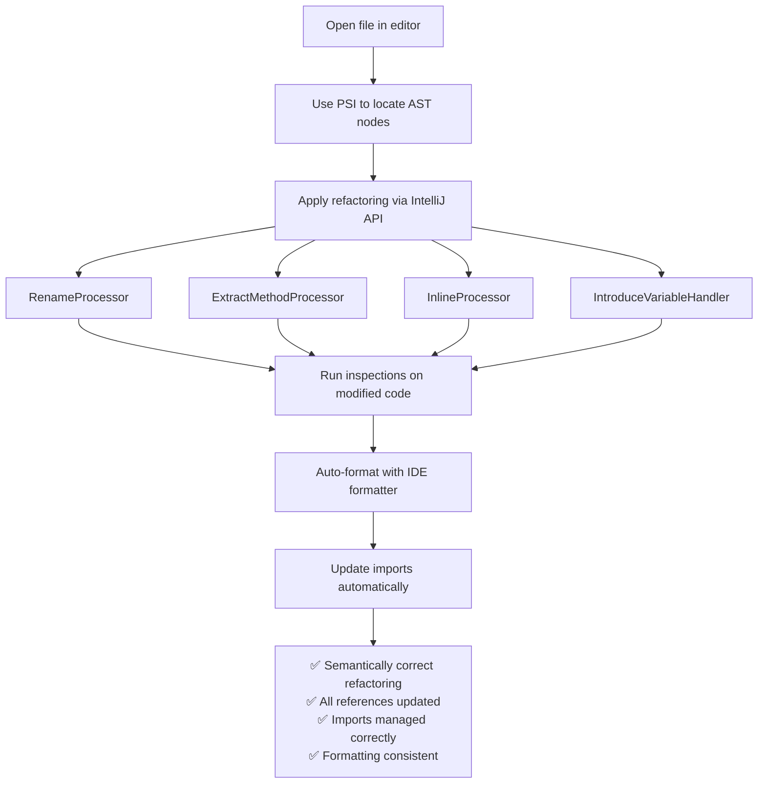
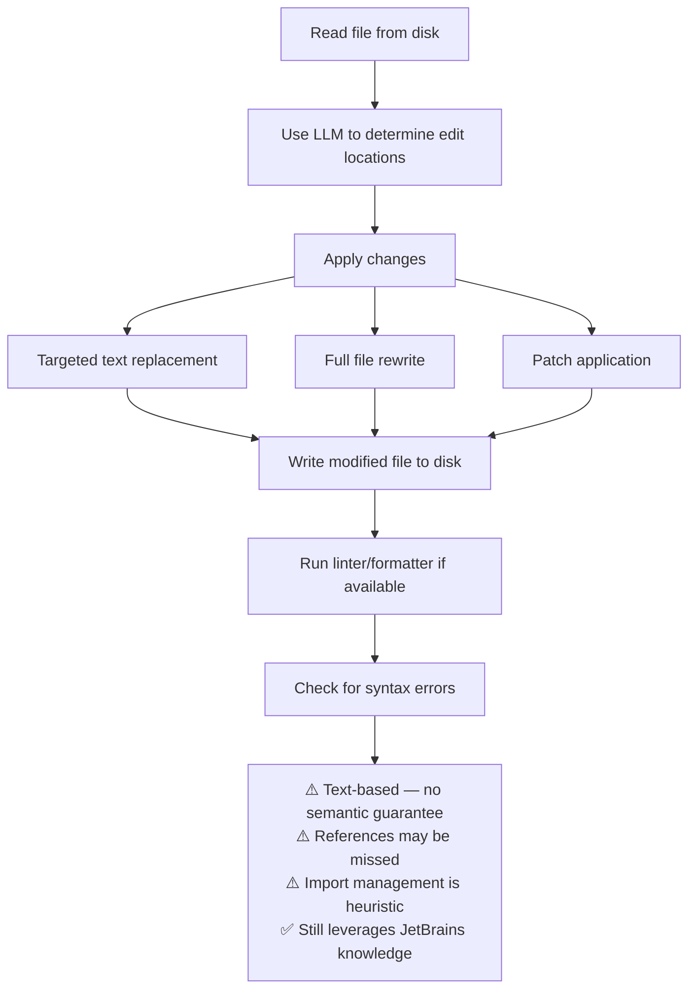
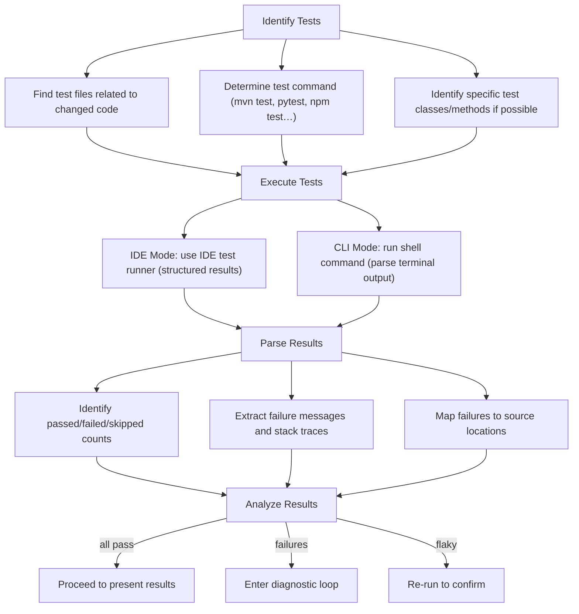
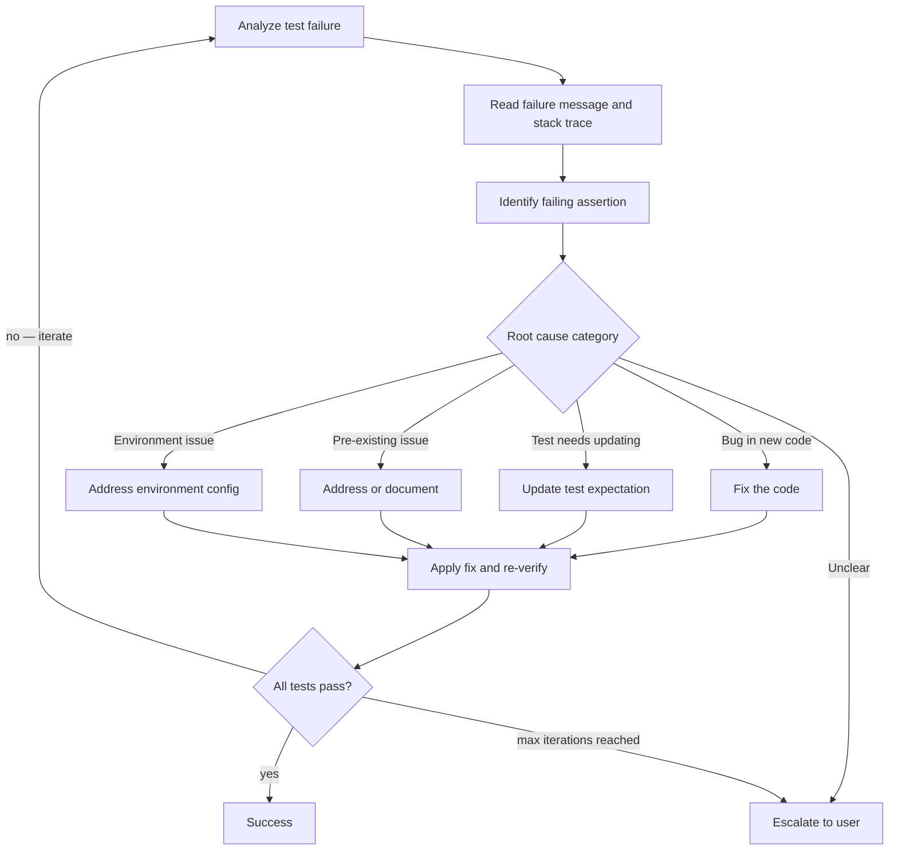
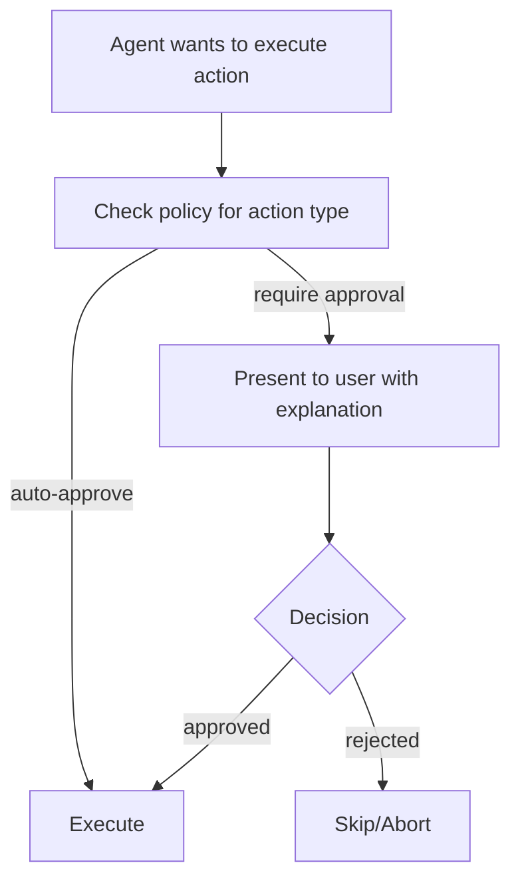

# Junie CLI — Agentic Loop

## Overview

Junie follows a structured agentic loop that emphasizes planning, multi-model
delegation, and test-driven verification. Its execution flow reflects JetBrains'
philosophy of rigorous code quality — the agent doesn't just make changes, it
verifies them through the same testing and inspection processes that JetBrains
IDE users rely on daily.

This document examines Junie's task execution lifecycle, comparing IDE and CLI
execution paths and analyzing the multi-model delegation strategy.

## Core Execution Loop



## Phase 1: Understanding

The first phase involves building context about the user's request and the
relevant codebase:

### Code Exploration

```
1. Parse user request to identify:
   - What needs to change (functional requirement)
   - Where the change should happen (file/component scope)
   - What constraints exist (backward compatibility, performance, etc.)

2. Explore project structure:
   - Read build files (pom.xml, build.gradle, package.json, etc.)
   - Identify project type, language, framework
   - Map directory structure and module organization

3. Find relevant code:
   - Search for files related to the task
   - Read key files to understand current implementation
   - Trace call chains and dependencies
   - Identify test files related to the code under change

4. Assess scope:
   - Estimate number of files to modify
   - Identify potential ripple effects
   - Note existing test coverage
```

### Multi-Model Delegation in Understanding Phase

During understanding, Junie likely uses a **fast model** for initial exploration
and a **reasoning model** for complex analysis:

- **Fast model (e.g., Gemini Flash)**: Quick file reads, directory scans, simple searches
- **Reasoning model (e.g., Claude Sonnet)**: Understanding complex code relationships,
  analyzing architectural patterns, interpreting ambiguous requirements

## Phase 2: Planning

The planning phase creates a structured execution strategy:

### Plan Structure

```
Plan {
  summary: "High-level description of what will be done"
  
  steps: [
    Step {
      id: 1
      description: "Modify UserService to add validation"
      files: ["src/services/UserService.java"]
      type: MODIFY
      dependencies: []
    },
    Step {
      id: 2
      description: "Add validation utility class"
      files: ["src/utils/Validator.java"]
      type: CREATE
      dependencies: [1]
    },
    Step {
      id: 3
      description: "Update tests for UserService"
      files: ["tests/services/UserServiceTest.java"]
      type: MODIFY
      dependencies: [1, 2]
    },
    Step {
      id: 4
      description: "Run test suite to verify"
      type: VERIFY
      dependencies: [3]
    }
  ]
  
  risks: [
    "Validation changes may affect downstream consumers",
    "Existing tests may need assertion updates"
  ]
}
```

### Planning Model Selection

Planning is a high-reasoning task, so Junie likely routes to the strongest
reasoning model available:

- Complex multi-file changes → Claude Opus or GPT-4 class
- Simple single-file changes → May skip detailed planning entirely
- Ambiguous requirements → Reasoning model to interpret intent

### User Interaction During Planning

Junie may present the plan to the user for approval before proceeding:

```
I've analyzed the codebase and created a plan:

1. ✏️  Modify UserService.java - Add input validation
2. ➕  Create Validator.java - Shared validation utilities
3. ✏️  Update UserServiceTest.java - Add validation test cases
4. ✅  Run test suite to verify all changes

Shall I proceed with this plan?
```

This approval step is configurable — in some modes, Junie may execute
autonomously without waiting for confirmation.

## Phase 3: Implementation

The implementation phase executes the plan, making actual code changes:

### File Modification Strategy

Junie applies changes using a structured approach:

```
For each step in plan:
  1. Read the current file content
  2. Determine the precise edit locations
  3. Apply modifications:
     - In IDE mode: Use PSI-aware refactoring when possible
     - In CLI mode: Use text-based search-and-replace or full rewrites
  4. Validate the change is syntactically correct
  5. Move to next step
```

### IDE vs CLI Implementation Paths

#### IDE Mode Implementation



#### CLI Mode Implementation



### Multi-Model Delegation in Implementation

During implementation, Junie optimizes model selection per task:

| Sub-task | Likely Model | Rationale |
|---|---|---|
| Simple variable rename | Gemini Flash | Speed, low complexity |
| New function implementation | Claude Sonnet or GPT-4 | Code quality |
| Complex refactoring | Claude Opus | Deep reasoning needed |
| Boilerplate generation | Gemini Flash | Template-like work |
| Test case writing | Balanced model | Needs domain understanding |

## Phase 4: Verification

Verification is where Junie's JetBrains heritage shines most brightly. The agent
treats test execution as a first-class operation, not an afterthought.

### Test Execution Flow



### IDE vs CLI Verification Differences

#### IDE Mode Verification

In IDE mode, Junie gets rich, structured test results:

```kotlin
// IDE provides structured test results
data class TestResult(
    val name: String,
    val status: TestStatus,    // PASSED, FAILED, ERROR, SKIPPED
    val duration: Duration,
    val failureMessage: String?,
    val stackTrace: List<StackFrame>?,
    val sourceLocation: PsiElement?,  // Direct link to source
    val diffOutput: String?           // Expected vs actual
)
```

Additionally, IDE mode can:
- Run inspections on modified code to catch non-test issues
- Check for compiler warnings introduced by changes
- Validate code formatting against project style settings
- Verify that imports are correct and complete

#### CLI Mode Verification

In CLI mode, Junie must parse test output from terminal text:

```
$ pytest tests/test_user.py -v
tests/test_user.py::test_create_user PASSED
tests/test_user.py::test_create_user_invalid FAILED
tests/test_user.py::test_update_user PASSED

FAILED tests/test_user.py::test_create_user_invalid
    AssertionError: Expected status 400, got 201
    
    tests/test_user.py:42: AssertionError
```

The agent must:
1. Parse the terminal output to identify failures
2. Extract error messages and locations
3. Read the relevant test code and source code
4. Diagnose the issue
5. Apply a fix

This is less precise than IDE mode but still effective, especially with
JetBrains' knowledge of test framework output formats.

## Phase 5: Diagnostic Loop

When tests fail, Junie enters a diagnostic loop:



### Diagnostic Model Selection

Failure diagnosis is a high-reasoning task. Junie likely uses the strongest
available reasoning model for this phase:

- **Understanding the failure**: Requires reasoning about expected vs actual behavior
- **Tracing root cause**: May need to follow call chains and data flow
- **Generating fix**: Must produce correct code that addresses the specific issue
- **Avoiding regression**: Must ensure fix doesn't break other tests

## Phase 6: Presentation

Once all verifications pass, Junie presents results to the user:

```
✅ Task completed successfully!

Changes made:
  ✏️  src/services/UserService.java — Added input validation
  ➕  src/utils/Validator.java — Created shared validation utilities  
  ✏️  tests/services/UserServiceTest.java — Added 3 new test cases

Test results:
  ✅ 47 tests passed
  ⏭️  2 tests skipped
  ❌ 0 tests failed

Summary:
  Added email and phone validation to UserService. Created a reusable
  Validator utility class. All existing tests continue to pass, and
  3 new tests cover the validation logic.
```

## Permission and Approval Model

Junie implements a permission system that varies by operation type and
configuration:

### Operation Categories

```
Low Risk (auto-approved):
  - Reading files
  - Searching code
  - Analyzing project structure
  - Reading documentation

Medium Risk (configurable):
  - Modifying existing files
  - Creating new files
  - Running read-only shell commands (ls, cat, grep)

High Risk (typically requires approval):
  - Deleting files
  - Running build commands
  - Executing tests
  - Running arbitrary shell commands
  - Git operations (commit, push)
  - Network operations
```

### Approval Flow



## Iteration Limits and Safeguards

Junie implements several safeguards to prevent infinite loops or runaway execution:

1. **Maximum iteration count**: Limits the number of implement-verify cycles
   (typically 3-5 attempts before escalating to the user)

2. **Token budget**: Tracks cumulative LLM token usage and may pause if costs
   exceed expected bounds

3. **Time limits**: Maximum wall-clock time for a single task

4. **Scope guards**: Detects if the agent is modifying files far outside the
   expected scope of the task

5. **Regression detection**: If previously passing tests start failing, the agent
   may roll back changes and reassess

## Comparison with Other Agent Loops

| Aspect | Junie | Claude Code | Aider | Codex CLI |
|---|---|---|---|---|
| Planning Phase | Explicit, shown to user | Implicit | Minimal | Explicit |
| Test Integration | First-class, automatic | User-directed | User-directed | User-directed |
| Multi-Model Delegation | Dynamic per-task | Single model | Architect + Editor | Single model |
| Max Iterations | Configurable (3-5) | Unlimited (user) | Configurable | Configurable |
| Approval Model | Granular permissions | Allowlist-based | Auto-commit | Permission-based |
| Rollback | Git-based + undo | Git-based | Git-based (native) | Git-based |

## Key Insights

1. **Test-driven loop is core, not optional**: Unlike many agents where test execution
   is a tool the user must explicitly invoke, Junie treats verification as an integral
   part of every task. This mirrors JetBrains' philosophy of "write code, run tests,
   iterate."

2. **Multi-model routing adds latency but improves quality**: Each model switch adds
   API overhead, but the benchmark results (71.0% multi-model vs 64.3% single) suggest
   the quality improvement is worth the latency cost.

3. **IDE mode enables a richer loop**: The diagnostic capabilities in IDE mode (PSI,
   inspections, structured test results) make the verification loop significantly more
   precise than CLI mode. Users in IDE mode get a qualitatively different experience.

4. **Planning reduces iteration count**: By investing in an upfront planning phase with
   a strong reasoning model, Junie likely reduces the number of implement-verify cycles
   needed, since the initial implementation is better targeted.
