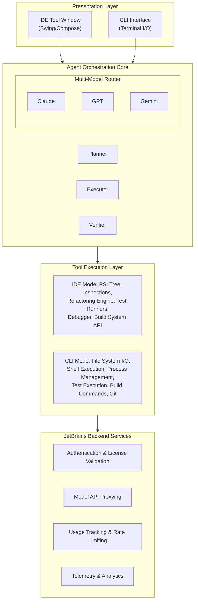
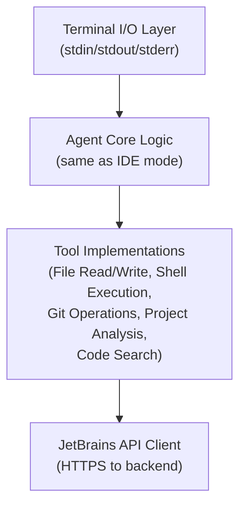
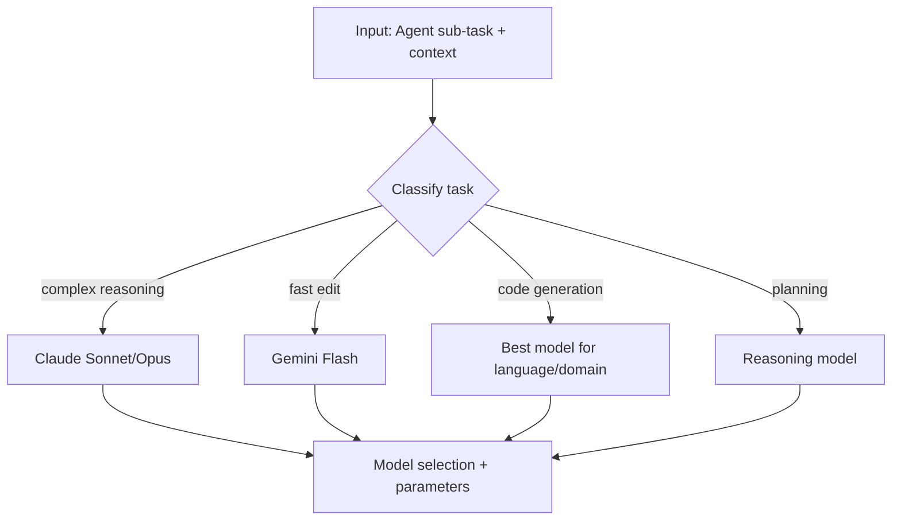
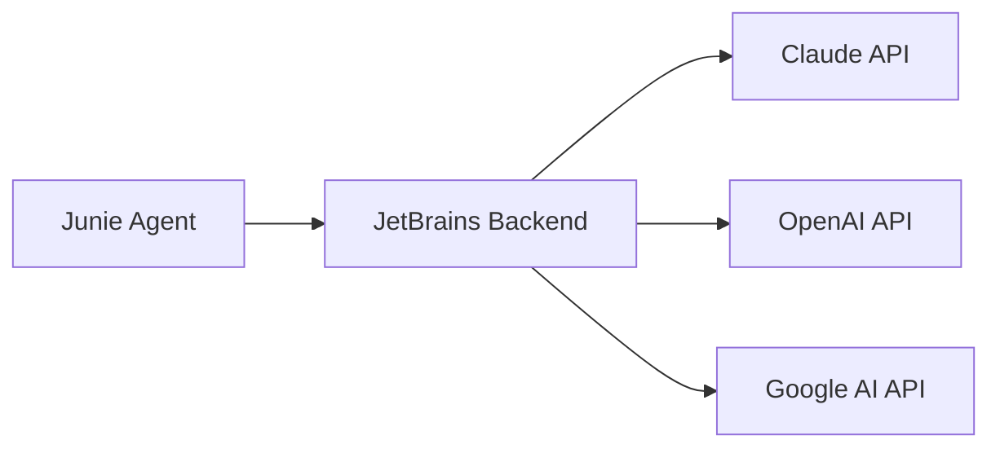

# Junie CLI — Architecture

## Overview

Junie's architecture is shaped by its origin as a JetBrains IDE plugin that was
subsequently extended to operate as a standalone CLI agent. This dual heritage gives
it a unique architectural profile: it carries the deep language intelligence of the
IntelliJ Platform while adapting to the constraints and opportunities of terminal-based
operation.

This document examines Junie's architecture across both modes, with particular attention
to the multi-model routing system that is its key differentiator.

## High-Level Architecture



## IDE Plugin Architecture

### IntelliJ Platform Integration

Junie's IDE mode is built on the IntelliJ Platform, which provides the richest code
analysis infrastructure in the industry. Key integration points include:

#### PSI (Program Structure Interface)

The PSI is JetBrains' abstract syntax tree representation, and it is the foundation
of all code intelligence in JetBrains IDEs:

```
Source Code → Lexer → Parser → PSI Tree → Semantic Analysis
                                   │
                                   ├── Type Resolution
                                   ├── Reference Resolution
                                   ├── Control Flow Analysis
                                   └── Data Flow Analysis
```

When Junie operates in IDE mode, it has access to:

- **Fully resolved type information** for all expressions and declarations
- **Cross-file reference resolution** (find usages, go to definition)
- **Import graph** showing dependencies between files and modules
- **Inheritance hierarchies** and interface implementations
- **Call graphs** showing how functions invoke each other
- **Data flow analysis** tracking how values propagate through code

This gives IDE-mode Junie a level of code understanding that is simply unavailable
to terminal-based agents that rely on text-level analysis.

#### Inspections System

JetBrains IDEs run hundreds of code inspections in real-time:

- **Code quality**: Unused variables, unreachable code, redundant operations
- **Potential bugs**: Null pointer dereferences, type mismatches, resource leaks
- **Performance**: Inefficient algorithms, unnecessary allocations
- **Style**: Naming conventions, formatting, idiomatic patterns
- **Framework-specific**: Spring annotations, React hook rules, Django patterns

In IDE mode, Junie can query these inspections to:
1. Understand existing code quality issues before making changes
2. Verify that its changes don't introduce new warnings
3. Use quick-fix suggestions as guidance for code modifications

#### Refactoring Engine

The IntelliJ refactoring engine performs semantic-aware code transformations:

- **Rename**: Updates all references across the project, including strings and comments
- **Extract Method/Variable/Constant**: Identifies scope, parameters, and return types
- **Inline**: Replaces a symbol with its definition, handling all usage sites
- **Move**: Relocates classes/functions with import updates
- **Change Signature**: Modifies function parameters with call-site updates

These refactorings are semantically correct — they understand the language's scoping
rules, type system, and import mechanisms. When Junie uses them in IDE mode, it gets
guaranteed-correct transformations that would be risky to perform with text-based
find-and-replace.

#### Test Runner Integration

JetBrains IDEs have first-class test runner support:

- **JUnit/TestNG** (Java/Kotlin)
- **pytest/unittest** (Python)
- **Jest/Mocha/Vitest** (JavaScript/TypeScript)
- **RSpec/Minitest** (Ruby)
- **Go test** (Go)
- **NUnit/xUnit** (.NET)

In IDE mode, Junie receives structured test results:
```
TestResult {
  name: "test_user_creation"
  status: FAILED
  duration: 0.45s
  assertion_error: "Expected 201, got 400"
  stack_trace: [...]
  source_location: "tests/test_user.py:42"
}
```

This structured output is richer than raw terminal test output and allows Junie to
more precisely diagnose and fix test failures.

### Plugin Registration

As an IntelliJ plugin, Junie registers itself through the standard plugin mechanism:

- **Tool Window Factory**: Creates the Junie panel in the IDE sidebar
- **Action Registration**: Adds menu items and keyboard shortcuts
- **Service Registration**: Background services for agent orchestration
- **Listener Registration**: Responds to file changes, build events, test results
- **Extension Points**: Hooks into existing IDE functionality

## CLI Mode Architecture

### Installation and Setup

The CLI mode is distributed through:

1. **JetBrains Toolbox**: The standard JetBrains tool management application
2. **Standalone Installer**: Direct download for terminal-only usage
3. **Package Managers**: Likely available via brew, apt, etc.

### Runtime Structure

In CLI mode, Junie operates as a standalone process:



### IDE Knowledge Without the IDE

A critical architectural question is: how much of the IDE's intelligence transfers
to CLI mode? Based on observable behavior and JetBrains' documentation:

**Transfers to CLI mode:**
- Project structure understanding (from build files, directory layout)
- Build system knowledge (Maven, Gradle, npm, pip, cargo command invocation)
- Test framework awareness (knows how to run and parse test output)
- Language-specific heuristics (common patterns, idioms, error patterns)
- Multi-file refactoring logic (though without PSI, it's text-based)
- Git integration for change tracking and history

**Lost in CLI mode:**
- Real-time PSI tree analysis (requires the IDE's language engine)
- Live inspection results (requires IDE background analysis)
- Semantic refactoring guarantees (falls back to text-based operations)
- Debugger integration (no IDE debugger available)
- Rich test result parsing (gets terminal output instead of structured data)
- Real-time compiler error feedback

**Partially preserved:**
- Type understanding (LLM can infer types, but without PSI guarantees)
- Import management (can analyze imports textually, not semantically)
- Code navigation (can grep/search, but not "go to definition" semantically)

## Multi-Model Routing System

### Architecture

The multi-model routing system is Junie's most distinctive architectural feature.
Rather than using a single LLM for all tasks, Junie dynamically selects the best
model for each sub-task:



### Routing Dimensions

The router likely considers multiple dimensions:

1. **Task type**: Planning, editing, analysis, test interpretation, code generation
2. **Complexity**: Simple one-liner vs. complex multi-file change
3. **Language**: Some models are better at certain languages
4. **Latency requirements**: Interactive queries need fast responses
5. **Cost optimization**: Use cheaper models when quality permits
6. **Context size**: Some tasks need large context windows

### Evidence from Benchmarks

The Terminal-Bench 2.0 results provide concrete evidence of multi-model benefits:

| Configuration | Score | Rank |
|---|---|---|
| Junie (Multiple Models) | 71.0% | #14 |
| Junie (Gemini 3 Flash) | 64.3% | #25 |

The **6.7 percentage point uplift** (71.0% vs 64.3%) from multi-model routing is
substantial. This means that for roughly 1 in 15 tasks, the model routing made the
difference between success and failure.

### JetBrains as Orchestration Layer

JetBrains acts as the intermediary between Junie and LLM providers:



This architecture provides:
- **Single authentication**: Users authenticate with JetBrains, not each provider
- **Unified billing**: Subscription covers all model usage
- **Model abstraction**: JetBrains can swap or update models transparently
- **Quality control**: JetBrains can A/B test model routing strategies
- **Rate limiting**: Centralized management of API quotas

## Communication Protocol

### IDE Mode Communication

In IDE mode, Junie communicates through the IntelliJ Platform's internal APIs:
- **Direct API calls** to PSI, inspection, and refactoring services
- **Message bus** for event-driven communication (file changes, build results)
- **Service layer** for background task management

### CLI Mode Communication

In CLI mode, communication is structured differently:
- **HTTPS** to JetBrains backend for model inference
- **Local file I/O** for reading and writing project files
- **Process spawning** for shell command execution
- **Standard streams** (stdin/stdout/stderr) for user interaction

### Backend Protocol

The JetBrains backend likely uses a streaming protocol for model communication:
- Server-Sent Events (SSE) or WebSocket for streaming responses
- JSON-based request/response format
- Authentication via JetBrains account tokens
- Session management for conversation continuity

## Security Architecture

### Authentication

- JetBrains account-based authentication
- License validation (AI Pro or AI Ultimate required)
- Token-based session management
- No direct API key management needed by users

### Permissions Model

Junie implements a permission system for sensitive operations:
- **File modifications**: May require user approval depending on configuration
- **Shell commands**: Likely has an allowlist/blocklist system
- **Network access**: Controlled through the JetBrains backend proxy
- **Destructive operations**: Additional confirmation required

### Data Handling

- Code sent to LLM providers through JetBrains' proxy
- Subject to JetBrains' data processing agreements
- Enterprise customers may have data residency options
- Telemetry collection governed by JetBrains privacy policy

## Comparison with Other Agent Architectures

| Aspect | Junie | Claude Code | Aider | Codex CLI |
|---|---|---|---|---|
| Runtime | JVM (IDE) / Native (CLI) | Node.js | Python | Node.js |
| Model Access | JetBrains proxy | Direct Anthropic API | Direct multi-provider | Direct OpenAI API |
| Code Analysis | PSI (IDE) / Heuristic (CLI) | File-based | File-based | File-based |
| Extension Model | IDE plugins | MCP servers | — | — |
| State Management | Server + Local | Local | Local (git) | Local |
| Streaming | Yes (SSE/WebSocket) | Yes (SSE) | Yes | Yes |

## Key Architectural Insights

1. **IDE-first design is both strength and limitation**: The deep IDE integration gives
   Junie unmatched code intelligence in IDE mode, but some of this is necessarily lost
   in CLI mode. The architecture must gracefully degrade.

2. **Multi-model routing is a genuine innovation**: By abstracting the model layer,
   JetBrains can optimize model selection independently of the agent logic, creating
   a feedback loop for continuous improvement.

3. **Server dependency is a trade-off**: The JetBrains backend provides unified auth,
   billing, and model routing, but also means Junie cannot operate offline or without
   JetBrains infrastructure.

4. **The proxy architecture enables unique capabilities**: By routing all model requests
   through their servers, JetBrains can implement sophisticated caching, routing, and
   optimization strategies invisible to the agent itself.
