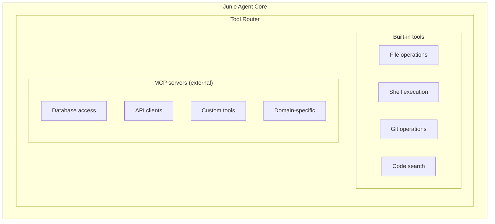

# Junie CLI — Tool System

## Overview

Junie's tool system reflects its dual nature as both an IDE plugin and a CLI agent.
In IDE mode, it has access to the full IntelliJ Platform API — one of the richest
tool sets available to any coding agent. In CLI mode, it falls back to file system
operations and shell execution while retaining JetBrains' domain knowledge about
build systems, test frameworks, and project structures.

This document catalogs Junie's tool capabilities across both modes, with analysis
of how IDE tools degrade gracefully in CLI mode.

## Tool Categories

### 1. File Operations

#### Read Operations

```
read_file(path) → content
  - Reads file content from disk
  - Available in both IDE and CLI modes
  - IDE mode may use VFS (Virtual File System) for caching
  - CLI mode reads directly from filesystem

list_directory(path) → entries
  - Lists directory contents
  - May include metadata (size, type, modified date)
  - Supports filtering by pattern

search_files(pattern, path?) → matches
  - Searches for files matching a glob/regex pattern
  - In IDE mode: Uses IntelliJ's file index (instant)
  - In CLI mode: Uses find/fd or equivalent
```

#### Write Operations

```
write_file(path, content) → success
  - Writes complete file content
  - Creates parent directories if needed
  - Used for new files or complete rewrites

edit_file(path, edits) → success
  - Applies targeted edits to existing files
  - Supports line-range or search-and-replace semantics
  - Preserves unchanged portions of the file
  - More efficient than full file rewrites for small changes

create_file(path, content) → success
  - Creates a new file (fails if exists)
  - Creates parent directories as needed

delete_file(path) → success
  - Removes a file from the project
  - Typically requires user approval
  - May clean up related imports/references in IDE mode
```

#### IDE-Enhanced File Operations

In IDE mode, file operations gain additional capabilities:

```
rename_symbol(old_name, new_name, scope) → affected_files
  - Renames a variable/function/class across the entire project
  - Updates all references, imports, and string usages
  - Uses PSI for semantic accuracy
  - NOT available in CLI mode (falls back to text search/replace)

move_file(source, destination) → success
  - Moves a file and updates all import/require references
  - IDE mode: Uses IntelliJ's Move refactoring
  - CLI mode: File system move + best-effort import updates

extract_method(file, range, name) → success
  - Extracts a code region into a new method
  - IDE mode: Full parameter/return type inference via PSI
  - CLI mode: LLM-based extraction (no PSI guarantees)
```

### 2. Shell Execution

```
execute_command(command, cwd?, timeout?) → output
  - Executes a shell command and returns output
  - Captures stdout, stderr, and exit code
  - Supports working directory specification
  - Timeout protection against hanging commands
  
  Security considerations:
  - Commands may require user approval
  - Likely has an allowlist/blocklist mechanism
  - Destructive commands get extra scrutiny
```

#### Common Shell Commands Used by Junie

```
Build Commands:
  - mvn compile / mvn package        (Java/Maven)
  - gradle build                      (Java/Gradle)
  - npm run build / yarn build        (JavaScript)
  - pip install -r requirements.txt   (Python)
  - cargo build                       (Rust)
  - go build ./...                    (Go)
  - dotnet build                      (.NET)

Test Commands:
  - mvn test / mvn verify            (Java/Maven)
  - gradle test                       (Java/Gradle)
  - npm test / npx jest              (JavaScript)
  - pytest / python -m pytest        (Python)
  - cargo test                        (Rust)
  - go test ./...                     (Go)
  - dotnet test                       (.NET)

Utility Commands:
  - git status / git diff / git log  (Version control)
  - find / grep / fd / rg            (File search)
  - cat / head / tail                (File viewing)
  - ls / tree                        (Directory listing)
  - curl / wget                      (HTTP requests)
```

### 3. Test Execution

Test execution is a first-class tool in Junie, not just a shell command wrapper.
The agent has specialized knowledge about test frameworks:

#### Test Framework Knowledge

| Language   | Framework  | Run Command      | Parser |
|------------|------------|------------------|--------|
| Java       | JUnit 5    | mvn test         | JUnit  |
| Java       | TestNG     | mvn test         | TestNG |
| Kotlin     | JUnit 5    | gradle test      | JUnit  |
| Python     | pytest     | pytest -v        | Pytest |
| Python     | unittest   | python -m ut     | Pytest |
| JavaScript | Jest       | npx jest         | Jest   |
| JavaScript | Vitest     | npx vitest       | Vitest |
| TypeScript | Jest       | npx jest         | Jest   |
| Go         | testing    | go test          | GoTest |
| Rust       | cargo test | cargo test       | Cargo  |
| Ruby       | RSpec      | bundle exec      | RSpec  |
| C#         | NUnit      | dotnet test      | NUnit  |
| C#         | xUnit      | dotnet test      | xUnit  |

#### Test Result Parsing

Junie parses test output to extract structured information:

```
Raw terminal output:
  FAIL tests/test_user.py::test_create_user
    AssertionError: assert 400 == 201
    
    tests/test_user.py:42: AssertionError

Parsed structure:
  TestResult {
    test_name: "test_create_user"
    file: "tests/test_user.py"
    line: 42
    status: FAILED
    error_type: "AssertionError"
    message: "assert 400 == 201"
    expected: 201
    actual: 400
  }
```

This structured parsing allows Junie to:
1. Identify exactly which tests failed
2. Locate the failure in source code
3. Understand the nature of the failure (assertion, exception, timeout)
4. Generate targeted fixes

#### IDE Mode Test Enhancements

In IDE mode, test execution gains additional capabilities:

- **Targeted test execution**: Run only tests in a specific class or method
- **Debug mode**: Run tests with debugger attached to inspect state
- **Coverage analysis**: See which code lines are covered by tests
- **Structured results**: Rich TestResult objects with PSI source links
- **Re-run failed**: Quick re-run of only previously failed tests
- **Test history**: Track test stability over time

### 4. Build System Integration

Junie has deep knowledge of build systems, inherited from JetBrains' IDE support:

#### Build File Analysis

```
Maven (pom.xml):
  - Parse dependencies and their versions
  - Understand module structure (multi-module projects)
  - Know plugin configurations
  - Identify test frameworks from dependencies

Gradle (build.gradle / build.gradle.kts):
  - Parse dependency blocks
  - Understand task definitions
  - Know plugin applications
  - Support both Groovy and Kotlin DSL

npm/yarn (package.json):
  - Parse dependencies and devDependencies
  - Understand scripts section
  - Know workspace/monorepo configurations
  - Identify test frameworks from dev dependencies

pip (requirements.txt / pyproject.toml / setup.py):
  - Parse dependency specifications
  - Understand virtual environment configurations
  - Know project metadata from pyproject.toml
  
Cargo (Cargo.toml):
  - Parse crate dependencies
  - Understand workspace configurations
  - Know feature flags and build profiles

Go (go.mod):
  - Parse module dependencies
  - Understand module paths and versions
  - Know replace directives
```

#### Build Command Execution

```
detect_build_system(project_root) → build_system
  - Examines project files to identify the build system
  - Returns appropriate commands for build, test, lint, etc.
  - Handles edge cases (e.g., both pom.xml and build.gradle present)

run_build(project_root, target?) → result
  - Executes the appropriate build command
  - Parses build output for errors and warnings
  - Returns structured build result with error locations

install_dependencies(project_root) → result
  - Runs the appropriate dependency installation command
  - Handles lock file updates
  - Reports any dependency conflicts
```

### 5. Code Analysis Tools

#### Code Search

```
search_code(query, path?, options?) → results
  - Searches for code patterns across the project
  - In IDE mode: Uses IntelliJ's code index with structural search
  - In CLI mode: Uses grep/ripgrep for text-based search
  
  IDE-mode bonus capabilities:
  - Structural search (e.g., "find all methods that return List<?>")
  - Type-aware search (e.g., "find all usages of UserService")
  - Regex search with syntax awareness
```

#### Code Navigation (IDE Mode)

```
find_usages(symbol) → usage_list
  - Finds all usages of a symbol across the project
  - Distinguishes read vs write usages
  - Includes usages in comments and strings
  - Not available in CLI mode

find_implementations(interface) → implementations
  - Finds all classes implementing an interface
  - Traverses the full class hierarchy
  - Not available in CLI mode

find_call_hierarchy(method) → call_tree
  - Shows who calls this method and what it calls
  - Useful for understanding impact of changes
  - Not available in CLI mode

go_to_definition(symbol) → location
  - Navigates to the definition of a symbol
  - Resolves across files, libraries, and frameworks
  - CLI mode: Approximated with text search
```

### 6. Git Operations

```
git_status() → status
  - Shows modified, added, and deleted files
  - Distinguishes staged and unstaged changes

git_diff(path?) → diff
  - Shows changes in working directory or specific file
  - Used to review changes before committing

git_log(count?, path?) → commits
  - Shows recent commit history
  - Useful for understanding recent changes and context

git_add(paths) → success
  - Stages files for commit

git_commit(message) → success
  - Creates a commit with the given message
  - May require user approval

git_branch_info() → branch_info
  - Shows current branch and tracking information
  - Helps understand the development context

git_stash() / git_stash_pop() → success
  - Temporarily saves/restores working changes
  - Useful for context switching during complex tasks
```

### 7. Refactoring Tools (IDE Mode)

These tools are only available in IDE mode but represent Junie's most powerful
capabilities:

```
rename_refactoring(element, new_name) → result
  - Semantically renames across entire project
  - Updates references, imports, comments, strings
  - Handles overrides and implementations
  - Language-aware (understands scope rules)

extract_method(code_range, name, params) → result
  - Extracts code into a new method
  - Infers parameter types and return type
  - Handles variable capture correctly
  - Manages exception declarations

inline_refactoring(element) → result
  - Replaces a method/variable with its definition
  - Inlines at all call sites
  - Handles complex expressions correctly

change_signature(method, new_params) → result
  - Modifies method parameters
  - Updates all call sites
  - Handles default values and overloads

move_refactoring(element, destination) → result
  - Moves class/method to new location
  - Updates all imports and references
  - Handles inner class extraction

introduce_variable(expression, name, type?) → result
  - Extracts an expression into a named variable
  - Infers type from expression
  - Replaces all identical occurrences optionally
```

### 8. Project Structure Analysis

```
analyze_project_structure(root) → structure
  - Maps the directory tree
  - Identifies source roots, test roots, resource directories
  - Detects project type (Java, Python, JavaScript, etc.)
  - Finds configuration files

detect_frameworks(root) → frameworks
  - Identifies frameworks in use (Spring, Django, React, etc.)
  - Reads framework configuration files
  - Understands framework conventions (e.g., Spring @Controller)

analyze_dependencies(root) → dependency_tree
  - Parses dependency declarations
  - Builds dependency graph
  - Identifies version conflicts
  - Suggests updates when relevant
```

## Potential MCP Support

While not confirmed, there is reason to believe Junie may support or be moving
toward Model Context Protocol (MCP) or a similar extension mechanism:

### Evidence For

1. **JetBrains' plugin ecosystem**: JetBrains has a strong tradition of extensibility
2. **Industry trend**: MCP is becoming a standard for agent tool extension
3. **Multi-model architecture**: The proxy architecture could easily accommodate MCP
4. **CLI mode needs**: Without IDE APIs, extensibility becomes more important

### Potential MCP Integration Architecture



## Tool Execution Safety

### Permission Levels

```
Level 0 — Always Allowed:
  - File reads (within project scope)
  - Directory listing
  - Code search
  - Git status / log / diff (read-only)

Level 1 — Auto-Approved (configurable):
  - File writes (within project scope)
  - File creation
  - Running linters / formatters

Level 2 — Requires Approval:
  - Shell command execution
  - Build commands
  - Test execution
  - Git commits

Level 3 — Always Requires Approval:
  - File deletion
  - Git push
  - Network requests
  - System commands
  - Operations outside project scope
```

### Sandboxing

Junie likely implements several sandboxing mechanisms:

- **Project scope enforcement**: Tools restricted to project directory
- **Command filtering**: Shell commands checked against security patterns
- **Resource limits**: Timeout and memory limits on shell commands
- **Undo capability**: Changes can be reverted via git

## Key Insights

1. **IDE tools are a significant advantage**: The refactoring, navigation, and
   analysis tools available in IDE mode are qualitatively superior to what any
   CLI agent can achieve with text-based operations. This is Junie's unique moat.

2. **Graceful degradation is well-designed**: The transition from IDE to CLI mode
   loses specific capabilities but retains the core workflow. JetBrains' knowledge
   of build systems, test frameworks, and project structures transfers to CLI mode.

3. **Test execution is a first-class tool**: Rather than treating tests as "just
   another shell command," Junie has specialized knowledge about test frameworks,
   output parsing, and failure diagnosis.

4. **Build system knowledge is comprehensive**: JetBrains' long experience with
   project import and build system integration gives Junie accurate knowledge of
   how to build, test, and lint projects across many technology stacks.
