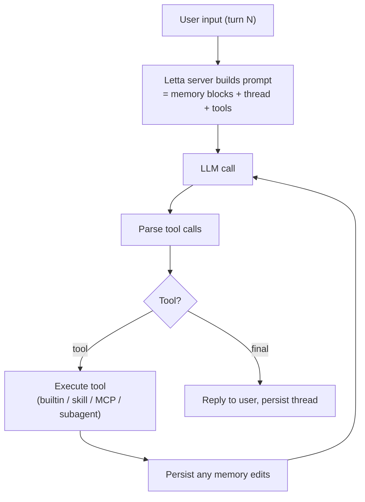

# Letta Code — Agentic Loop

## Stateful Loop

The Letta agent loop is a standard tool-using ReAct loop, but every turn
runs against a **persisted server-side agent** rather than a fresh
in-memory state machine. The implication: the loop's "context" includes
the always-on memory blocks plus the active conversation thread.

## `/clear` Semantics

Important distinction: `/clear` resets the **thread** (current
conversation messages) but not the **agent**. Memory blocks, learned
skills, and subagent state all survive. Compared to Claude Code where
`/clear` is closer to "new conversation, blank slate".

## `/init`

Initialises the agent's memory blocks from the current project — the
team recommends running it on first contact with any repo. After `/init`
the agent has a baseline understanding to build on across future sessions.

## `/remember`

`/remember [optional instructions on what to remember]` is a manual hook
into the memory-update mechanism. It tells the agent to actively persist
something it would otherwise let drift out of context.

## `/skill`

`/skill [optional instructions]` derives a reusable skill from the
current trajectory and stores it in `.skills/`. This is the most
distinctive verb in Letta Code — most coding agents don't include a
self-distillation loop in the daily workflow.

## Subagent Delegation

When the agent invokes a subagent, control transfers along with a
focused subset of context. Subagents have their own persistent memory,
so a "research" subagent invoked many times accumulates expertise across
those invocations.

## Loop Cap

Not explicitly published. The framework supports custom step caps via the
SDK, but the CLI's default is not stated in the README excerpt. Given the
TB2 results being mid-pack rather than failing-out, the default is
clearly high enough for most tasks.

---

*Loop description from `letta-ai/letta-code` README and the Letta SDK
examples in the parent `letta-ai/letta` repo. Specific step-cap defaults
are not documented publicly.*
