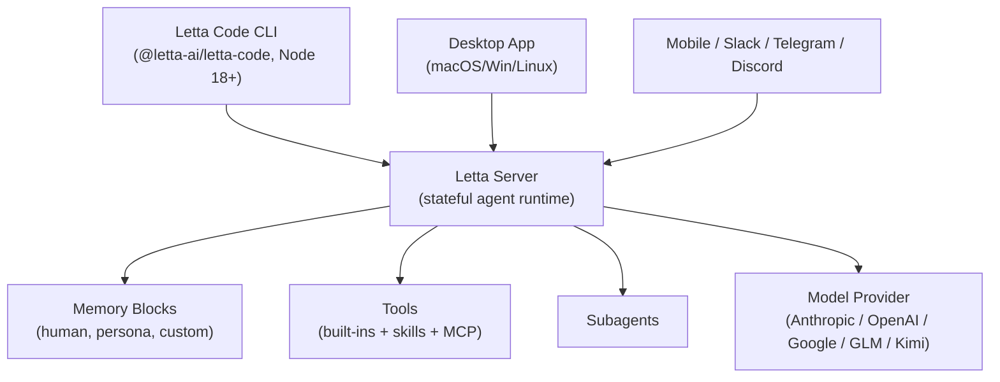

# Letta Code — Architecture

## Two-Layer System



The CLI is a thin client. The intelligence — agent state, memory, model
calls — lives in the **Letta server**, which can run locally or hosted
at app.letta.com.

This separation is what enables the multi-surface story: the same agent
shows up in the CLI, the desktop app, the mobile UI, and the
Slack/Telegram/Discord channels because each is just another client
talking to the same server-side agent.

## Memory Blocks

Letta inherits the **memory blocks** abstraction from MemGPT. An agent is
defined in part by labelled blocks of editable text:

```python
agent_state = client.agents.create(
    model="openai/gpt-5.2",
    memory_blocks=[
        {"label": "human",   "value": "Name: Timber. ..."},
        {"label": "persona", "value": "I am a self-improving superintelligence."},
    ],
    tools=["web_search", "fetch_webpage"],
)
```

Blocks are part of the always-on context the agent sees, and the agent
can edit them with tool calls. This is the core of Letta's "agent that
learns" claim — when the agent updates a block, the change persists
across every future session.

## Letta Code CLI

The CLI (`letta` command) is published as `@letta-ai/letta-code` on npm.
First run flow:

1. `npm install -g @letta-ai/letta-code`
2. `cd <project>` and run `letta`
3. `/connect` — configure provider API keys (Anthropic, OpenAI, zAI, …)
4. `/init` (recommended) — initialise the agent's memory system from the
   current repo
5. `/model` to swap the underlying LLM at any time

## Skills Directory

`.skills/` in the project is a Claude-Code-style skills directory. Each
skill is a folder with instructions the agent can pull in on demand.
Letta adds **skill learning**: `/skill [optional instructions]` asks the
agent to derive a new skill from its current trajectory.

## Subagents

`subagents` is bundled as a first-class concept (docs at
`docs.letta.com/letta-code/subagents`). They allow delegation similar to
Claude Code's `task` tool, but each subagent itself has its own memory
blocks and persists between calls.

## Model-Portable Memory

Because memory lives in server-side blocks, swapping models with `/model`
preserves everything the agent knows. The Letta team recommends Opus 4.5
or GPT-5.2 for best performance and publishes a
[model leaderboard](https://leaderboard.letta.com/) — note this is
Letta's own benchmark, distinct from Terminal-Bench.

---

*Architecture from `letta-ai/letta-code` README, the Letta API examples
in `letta-ai/letta`, and `docs.letta.com`.*
