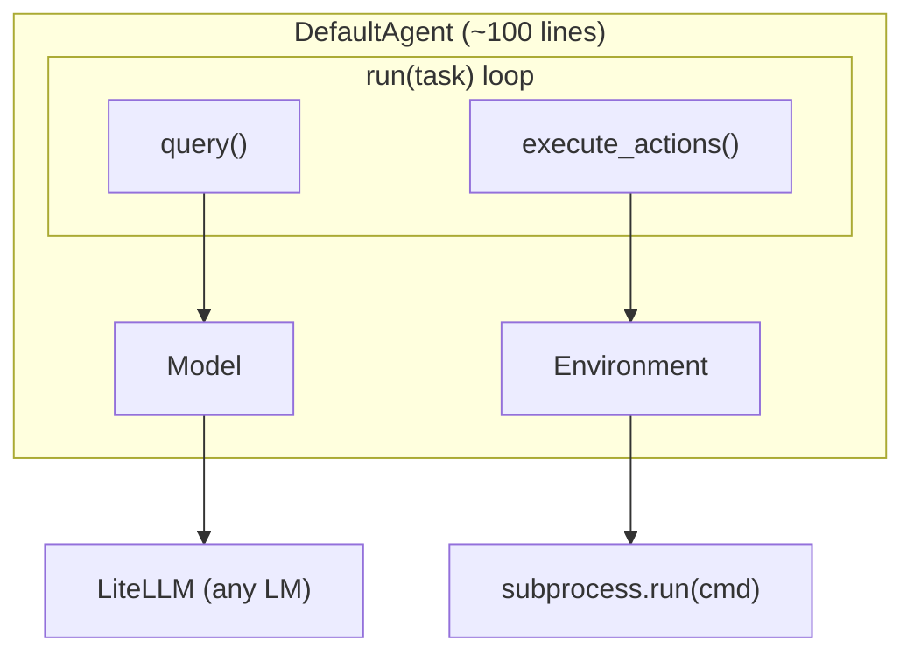
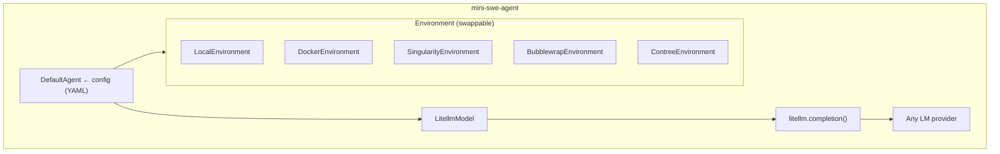

# Architecture

> mini-SWE-agent's architecture is its thesis statement: a software engineering agent needs nothing more than an LM, a bash shell, and a loop.

## High-Level Architecture



## Component Overview

The system has exactly **four components**, each in its own file:

| Component | File | Lines | Responsibility |
|-----------|------|-------|---------------|
| **Agent** | `agents/default.py` | ~100 | ReAct loop, message management, serialization |
| **Environment** | `environments/local.py` | ~80 | Execute bash via `subprocess.run`, detect completion |
| **Model** | `models/litellm_model.py` | ~130 | Query LM via LiteLLM, parse tool calls, format observations |
| **Run Script** | `run/hello_world.py` | ~40 | CLI entry point, wire components together |

### What's NOT Here

Conspicuously absent from the architecture (compared to SWE-agent and other coding agents):

- No tool registry or tool definitions (beyond a single `bash` tool)
- No history compaction or summarization
- No retrieval-augmented generation
- No planning modules or chain-of-thought scaffolding
- No state machine or finite automaton for control flow
- No persistent shell session management
- No file tracking or workspace indexing

## Component Details

### 1. DefaultAgent (`agents/default.py`)

The agent is a plain Python class with no inheritance hierarchy and no abstract methods:

```python
class DefaultAgent:
    def __init__(self, model: Model, env: Environment, *, config_class: type = AgentConfig, **kwargs):
        self.config = config_class(**kwargs)
        self.messages: list[dict] = []   # THE core state - just a list
        self.model = model
        self.env = env
        self.cost = 0.0
        self.n_calls = 0
```

**Key design insight**: The entire agent state is `self.messages` - an append-only list of dicts. There is no separate "memory", no "scratchpad", no "plan". The message list IS the agent's memory, plan, and reasoning trace all in one.

Configuration uses Pydantic `BaseModel`:

```python
class AgentConfig(BaseModel):
    system_template: str           # Jinja2 template for system prompt
    instance_template: str         # Jinja2 template for task description
    step_limit: int = 0            # Max steps (0 = unlimited)
    cost_limit: float = 3.0        # Max API spend
    output_path: Path | None = None  # Trajectory save path
```

### 2. LocalEnvironment (`environments/local.py`)

The environment executes commands via `subprocess.run` and detects task completion:

```python
class LocalEnvironment:
    def execute(self, action: dict, cwd: str = "", *, timeout: int | None = None) -> dict[str, Any]:
        command = action.get("command", "")
        result = subprocess.run(
            command,
            shell=True, text=True,
            cwd=cwd or self.config.cwd or os.getcwd(),
            env=os.environ | self.config.env,
            timeout=timeout or self.config.timeout,
            stdout=subprocess.PIPE,
            stderr=subprocess.STDOUT,
        )
        output = {"output": result.stdout, "returncode": result.returncode}
        self._check_finished(output)
        return output
```

Completion detection uses a magic string convention - the LM echoes a sentinel:

```python
def _check_finished(self, output: dict):
    lines = output.get("output", "").lstrip().splitlines(keepends=True)
    if lines and lines[0].strip() == "COMPLETE_TASK_AND_SUBMIT_FINAL_OUTPUT":
        raise Submitted({"role": "exit", "content": "".join(lines[1:]), ...})
```

The environment is **swappable by design**. The same interface works with:
- `LocalEnvironment` -> `subprocess.run`
- Docker/Podman -> `docker exec`
- Singularity/Apptainer -> container exec
- Bubblewrap -> sandboxed exec
- Contree -> distributed exec

### 3. LitellmModel (`models/litellm_model.py`)

The model wrapper handles three concerns:

1. **Querying**: Calls `litellm.completion()` with a single `bash` tool definition
2. **Parsing**: Extracts tool calls from the response into `{"command": "..."}` actions
3. **Formatting**: Renders observation messages from execution output using Jinja2 templates

```python
BASH_TOOL = {
    "type": "function",
    "function": {
        "name": "bash",
        "description": "Execute a bash command",
        "parameters": {
            "type": "object",
            "properties": {
                "command": {
                    "type": "string",
                    "description": "The bash command to execute"
                }
            },
            "required": ["command"],
        },
    },
}
```

### 4. Run Script (`run/hello_world.py`)

The simplest possible wiring - under 40 lines:

```python
agent = DefaultAgent(
    LitellmModel(model_name=model_name),
    LocalEnvironment(),
    **yaml.safe_load(Path(package_dir / "config" / "default.yaml").read_text())["agent"],
)
agent.run(task)
```

## Exception-Based Control Flow

One of the most elegant architectural decisions is using **exceptions for control flow**. All flow-interrupting events inherit from `InterruptAgentFlow`:

```python
class InterruptAgentFlow(Exception):
    def __init__(self, *messages: dict):
        self.messages = messages

class Submitted(InterruptAgentFlow): ...      # Task complete
class LimitsExceeded(InterruptAgentFlow): ... # Cost/step limit hit
class FormatError(InterruptAgentFlow): ...    # LM output malformed
class UserInterruption(InterruptAgentFlow): ... # User pressed Ctrl+C
```

Any component at any depth can signal completion or errors without threading return values through the call stack. The main loop catches these and appends their messages:

```python
while True:
    try:
        self.step()
    except InterruptAgentFlow as e:
        self.add_messages(*e.messages)
    if self.messages[-1].get("role") == "exit":
        break
```

## Template System

The system prompt and instance prompt are **Jinja2 templates** with access to rich context variables:

```python
def get_template_vars(self, **kwargs) -> dict:
    return recursive_merge(
        self.config.model_dump(),          # Agent config
        self.env.get_template_vars(),       # OS info, env vars
        self.model.get_template_vars(),     # Model config
        {"n_model_calls": self.n_calls, "model_cost": self.cost},
        self.extra_template_vars,           # Task-specific vars
        kwargs,
    )
```

This enables adaptive templates like:
```yaml
system_template: |
  You are a helpful assistant that can interact with a computer.
  <system_information>
  {{system}} {{release}} {{version}} {{machine}}
  </system_information>
```

## Serialization and Trajectory Format

The agent serializes its complete state into a JSON trajectory:

```python
def serialize(self, *extra_dicts) -> dict:
    return recursive_merge({
        "info": {
            "model_stats": {"instance_cost": self.cost, "api_calls": self.n_calls},
            "config": {"agent": ..., "model": ..., "environment": ...},
            "mini_version": __version__,
        },
        "messages": self.messages,       # THE ENTIRE TRAJECTORY
        "trajectory_format": "mini-swe-agent-1.1",
    }, self.model.serialize(), self.env.serialize(), *extra_dicts)
```

Because the history is linear, the trajectory IS the complete, faithful record of what the LM saw at every step. There is no gap between "what the agent stored" and "what the LM was prompted with."

## Deployment Topology



The entire system is configured via a single YAML file (`default.yaml`) that specifies the system prompt, instance prompt, environment variables, observation templates, and model parameters.
