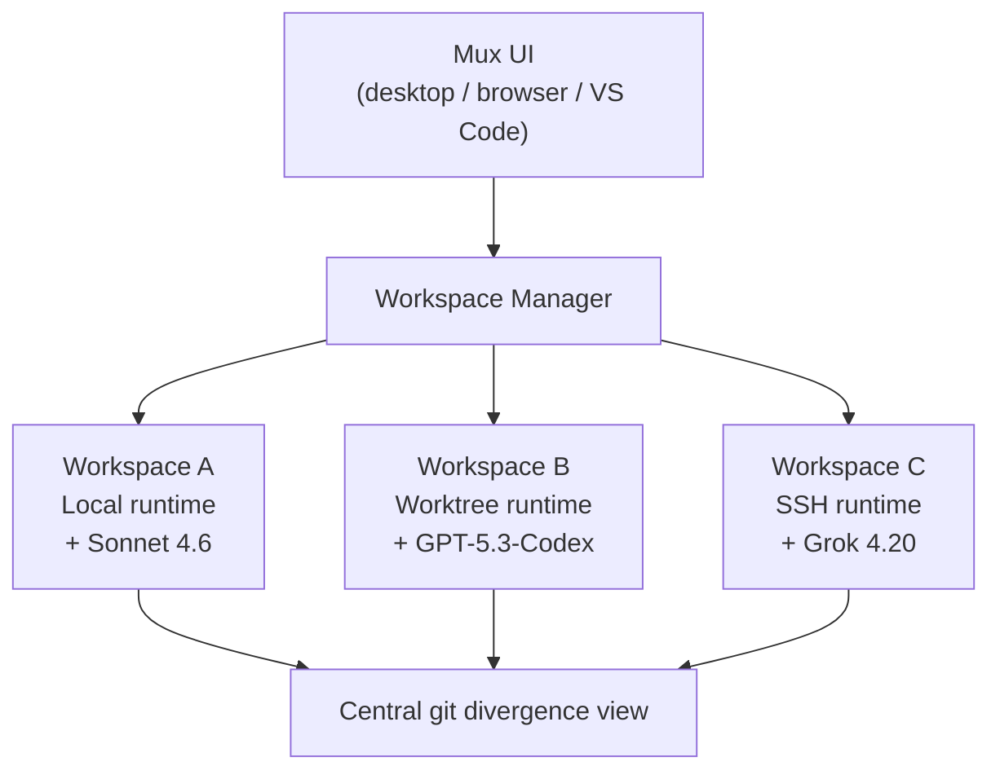

# Mux — Architecture

## High-Level

Mux is a desktop/browser front-end that hosts many concurrent agent
sessions ("workspaces"). Each workspace bundles three things:

1. an **agent loop** (Mux's own, Claude-Code-inspired),
2. a **runtime** that decides where commands actually run, and
3. a **conversation** (model, history, instructions).



## Runtimes

Three execution surfaces, all documented at
<https://mux.coder.com/runtime>:

| Runtime | What | Use |
|---|---|---|
| **Local** | Runs in your project directory directly | Single-workspace flows, fast iteration |
| **Worktree** | Per-workspace `git worktree` on your machine | Run N agents on N branches without conflict |
| **SSH** | Remote execution over SSH | Agents on a beefier server / CI box |

The worktree runtime is the most distinctive — it leverages git's native
parallel-checkout primitive so multiple agents can each have their own
working copy of the same repo with shared object storage, then surface
their divergence in Mux's central UI.

## Instruction Layering

Mux ingests instructions from two locations and layers them, documented at
<https://mux.coder.com/agents/instruction-files>:

```
~/.mux/AGENTS.md           # global default
~/.mux/AGENTS.local.md     # personal, gitignored
<workspace>/AGENTS.md      # project default
<workspace>/AGENTS.local.md
```

Within each location it picks the first base file in the order
`AGENTS.md → AGENT.md → CLAUDE.md` (Claude-Code compatibility), then
appends the corresponding `*.local.md`.

### Scoped headings

Instruction files support two scoping primitives:

- `## Model: <regex>` — content active only for matching models
- `## Tool: <tool_name>` — content appended to a specific tool's description

This means a single `AGENTS.md` can hold "be terse for Sonnet" and
"keep the todo list current for Codex" side by side without polluting the
global system prompt.

## VS Code Extension

A first-party extension lets you open a Mux workspace inside VS Code so the
agent and your editor share the same buffer — useful for human-in-the-loop
review of agent edits.

## Custom Agents

Markdown files at `.mux/agents/<name>.md` define custom sub-agents whose
prompts and tool descriptions can themselves use `Model:` / `Tool:`
scoping. Resolution order when scoped instructions overlap is:
agent definition → workspace `AGENTS.md` → global `AGENTS.md`, first match
wins.

---

*Architecture from `coder/mux` README and `mux.coder.com` docs. The
internal Go/TS layout of the workspace manager is not enumerated here
because the public docs don't break it down.*
