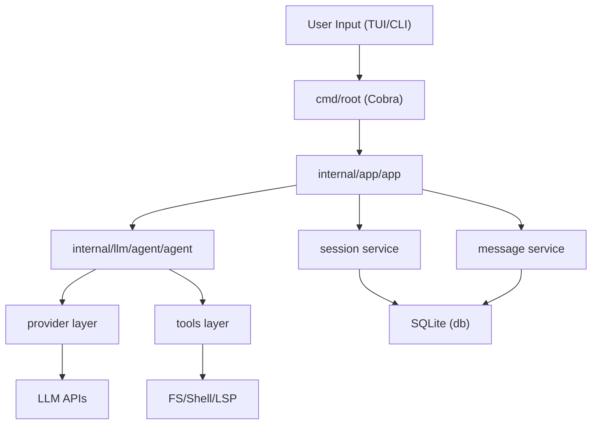
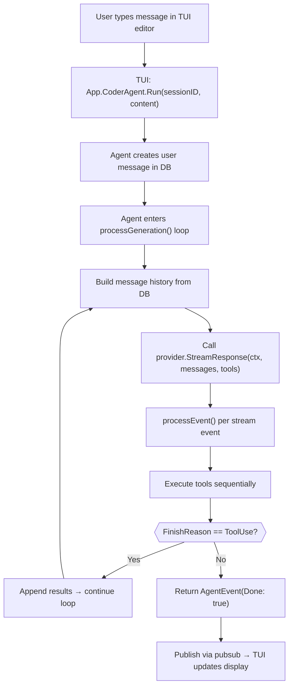

# OpenCode — Architecture

## Overview

OpenCode follows a clean, idiomatic Go architecture organized around the `internal/` package convention. The codebase separates concerns into well-defined packages: LLM interaction, tool execution, TUI rendering, data persistence, and application lifecycle management.

The architecture can be summarized as:



## Package Organization

```
opencode/
├── main.go                     # Entry point → cmd.Execute()
├── cmd/
│   └── root.go                 # Cobra CLI setup, flags, run modes
├── internal/
│   ├── app/
│   │   ├── app.go              # App struct: wires all services together
│   │   └── lsp.go              # LSP client initialization & file watchers
│   ├── config/                 # Viper-based config loading (.opencode.json)
│   ├── db/
│   │   ├── connect.go          # SQLite connection setup
│   │   ├── db.go               # sqlc-generated query interface
│   │   ├── migrations/         # Goose SQL migrations
│   │   └── sql/                # Raw SQL query definitions for sqlc
│   ├── llm/
│   │   ├── agent/
│   │   │   ├── agent.go        # ★ Core agentic loop
│   │   │   ├── agent-tool.go   # Sub-agent tool ("agent" tool)
│   │   │   ├── tools.go        # Tool set composition per agent type
│   │   │   └── mcp-tools.go    # MCP tool discovery & registration
│   │   ├── models/
│   │   │   ├── models.go       # Model struct & SupportedModels registry
│   │   │   ├── anthropic.go    # Anthropic model definitions
│   │   │   ├── openai.go       # OpenAI model definitions
│   │   │   ├── gemini.go       # Gemini model definitions
│   │   │   ├── copilot.go      # GitHub Copilot model definitions
│   │   │   └── ...             # groq, azure, openrouter, xai, local, vertexai
│   │   ├── prompt/
│   │   │   ├── coder.go        # System prompts (Anthropic vs OpenAI variants)
│   │   │   ├── task.go         # Task agent prompt
│   │   │   ├── title.go        # Title generation prompt
│   │   │   ├── summarizer.go   # Conversation summarization prompt
│   │   │   └── prompt.go       # Prompt router by agent name
│   │   ├── provider/
│   │   │   ├── provider.go     # ★ Provider interface & factory
│   │   │   ├── anthropic.go    # Anthropic SDK integration
│   │   │   ├── openai.go       # OpenAI SDK integration
│   │   │   ├── gemini.go       # Gemini SDK integration
│   │   │   ├── copilot.go      # GitHub Copilot provider
│   │   │   ├── bedrock.go      # AWS Bedrock provider
│   │   │   ├── azure.go        # Azure OpenAI provider
│   │   │   └── vertexai.go     # Google VertexAI provider
│   │   └── tools/
│   │       ├── tools.go        # ★ BaseTool interface & ToolCall/ToolResponse
│   │       ├── bash.go         # Shell command execution
│   │       ├── edit.go         # String-replace file editing
│   │       ├── write.go        # Full file writes
│   │       ├── patch.go        # Unified diff patch application
│   │       ├── view.go         # File reading with offset/limit
│   │       ├── glob.go         # File pattern matching
│   │       ├── grep.go         # Content search
│   │       ├── ls.go           # Directory listing
│   │       ├── fetch.go        # URL fetching
│   │       ├── sourcegraph.go  # Sourcegraph code search
│   │       ├── diagnostics.go  # LSP diagnostics
│   │       ├── file.go         # File read/write tracking
│   │       └── shell/          # Persistent shell session management
│   ├── message/                # Message types, serialization, CRUD service
│   ├── session/                # Session management with pub/sub
│   ├── history/                # File change history tracking
│   ├── permission/             # Permission request/grant system
│   ├── pubsub/                 # Generic typed pub/sub broker
│   ├── diff/                   # Diff generation utilities
│   ├── format/                 # Output formatting (spinner, text)
│   ├── fileutil/               # File utility helpers
│   ├── logging/                # Structured logging
│   ├── lsp/                    # LSP client implementation
│   ├── tui/
│   │   ├── tui.go              # ★ Main Bubble Tea model & update loop
│   │   ├── components/         # Reusable TUI components
│   │   ├── layout/             # Layout management
│   │   ├── page/               # Page views (chat, logs, etc.)
│   │   ├── styles/             # Lip Gloss style definitions
│   │   ├── theme/              # Theme management (catppuccin, etc.)
│   │   ├── image/              # Terminal image rendering
│   │   └── util/               # TUI utilities
│   ├── completions/            # Shell completion support
│   └── version/                # Version information
```

## Key Abstractions and Interfaces

### 1. Provider Interface

The core abstraction for LLM communication:

```go
// internal/llm/provider/provider.go
type Provider interface {
    SendMessages(ctx context.Context, messages []message.Message,
        tools []tools.BaseTool) (*ProviderResponse, error)
    StreamResponse(ctx context.Context, messages []message.Message,
        tools []tools.BaseTool) <-chan ProviderEvent
    Model() models.Model
}
```

The `Provider` is implemented via a generic `baseProvider[C ProviderClient]` struct that delegates to provider-specific clients. The factory function `NewProvider()` uses a switch on `ModelProvider` to instantiate the correct client. Notably, providers like Groq, OpenRouter, xAI, and local models reuse the `OpenAIClient` with custom base URLs.

### 2. BaseTool Interface

Every tool implements this interface:

```go
// internal/llm/tools/tools.go
type BaseTool interface {
    Info() ToolInfo
    Run(ctx context.Context, params ToolCall) (ToolResponse, error)
}
```

`ToolInfo` provides the name, description, and JSON Schema parameters. `ToolResponse` can be text or image, with optional metadata and error flag.

### 3. Agent Service Interface

The agent orchestrates the agentic loop:

```go
// internal/llm/agent/agent.go
type Service interface {
    pubsub.Suscriber[AgentEvent]
    Model() models.Model
    Run(ctx context.Context, sessionID string, content string,
        attachments ...message.Attachment) (<-chan AgentEvent, error)
    Cancel(sessionID string)
    IsSessionBusy(sessionID string) bool
    IsBusy() bool
    Update(agentName config.AgentName, modelID models.ModelID) (models.Model, error)
    Summarize(ctx context.Context, sessionID string) error
}
```

### 4. Pub/Sub Broker

A generic typed publish/subscribe system used throughout:

```go
// internal/pubsub/broker.go
type Broker[T any] struct { ... }
func (b *Broker[T]) Subscribe(ctx context.Context) <-chan Event[T]
func (b *Broker[T]) Publish(t EventType, payload T)
```

This is embedded in Session, Message, Agent, and Permission services—enabling the TUI to reactively update when any backend state changes.

### 5. Permission Service

A blocking permission request system:

```go
type Service interface {
    pubsub.Suscriber[PermissionRequest]
    GrantPersistant(permission PermissionRequest)
    Grant(permission PermissionRequest)
    Deny(permission PermissionRequest)
    Request(opts CreatePermissionRequest) bool
    AutoApproveSession(sessionID string)
}
```

The `Request()` method **blocks** the tool execution goroutine until the TUI user grants/denies the permission via the UI dialog. This is a channel-based synchronization pattern.

## Data Flow: User Input → LLM → Tool Execution → Output



## Service Wiring (App Initialization)

The `App` struct in `internal/app/app.go` wires everything together:

```go
func New(ctx context.Context, conn *sql.DB) (*App, error) {
    q := db.New(conn)
    sessions := session.NewService(q)
    messages := message.NewService(q)
    files := history.NewService(q, conn)

    app := &App{
        Sessions:    sessions,
        Messages:    messages,
        History:     files,
        Permissions: permission.NewPermissionService(),
        LSPClients:  make(map[string]*lsp.Client),
    }

    // LSP clients initialized in background goroutine
    go app.initLSPClients(ctx)

    // Create the coder agent with full tool set
    app.CoderAgent, _ = agent.NewAgent(
        config.AgentCoder,
        app.Sessions,
        app.Messages,
        agent.CoderAgentTools(app.Permissions, app.Sessions,
            app.Messages, app.History, app.LSPClients),
    )
    return app, nil
}
```

## Database Layer

OpenCode uses **SQLite** (via WASM-based `ncruces/go-sqlite3`) with:
- **Goose** for schema migrations
- **sqlc** for type-safe SQL query generation
- Tables: `sessions`, `messages`, `files`, `file_versions`

The database is per-project, stored in `.opencode/` directory. This means each project directory gets its own conversation history.

## Multi-Agent Architecture

OpenCode supports multiple agent types, each with different capabilities:

| Agent | Purpose | Tools | Provider |
|-------|---------|-------|----------|
| `coder` | Main coding assistant | Full tool set (12+ tools) | User-configured |
| `task` | Sub-agent for search/exploration | Read-only tools (glob, grep, ls, view, sourcegraph) | User-configured |
| `title` | Auto-generate session titles | None | User-configured |
| `summarizer` | Conversation compaction | None | User-configured |

The coder agent can spawn task sub-agents via the `agent` tool, creating a hierarchical delegation pattern. Task agents run in their own session scope and return results to the parent.

## Provider Factory Pattern

The `NewProvider()` factory function demonstrates how OpenCode maximizes code reuse across providers:

```go
func NewProvider(providerName models.ModelProvider, opts ...ProviderClientOption) (Provider, error) {
    switch providerName {
    case models.ProviderAnthropic:
        return &baseProvider[AnthropicClient]{...}, nil
    case models.ProviderOpenAI:
        return &baseProvider[OpenAIClient]{...}, nil
    case models.ProviderGROQ:
        // Reuses OpenAI client with custom base URL
        clientOptions.openaiOptions = append(clientOptions.openaiOptions,
            WithOpenAIBaseURL("https://api.groq.com/openai/v1"))
        return &baseProvider[OpenAIClient]{...}, nil
    case models.ProviderOpenRouter:
        // Also reuses OpenAI client
        clientOptions.openaiOptions = append(clientOptions.openaiOptions,
            WithOpenAIBaseURL("https://openrouter.ai/api/v1"),
            WithOpenAIExtraHeaders(map[string]string{
                "HTTP-Referer": "opencode.ai",
                "X-Title":      "OpenCode",
            }))
        return &baseProvider[OpenAIClient]{...}, nil
    // ... etc
    }
}
```

Only Anthropic, OpenAI, Gemini, Copilot, Bedrock, Azure, and VertexAI have dedicated client implementations. Groq, OpenRouter, xAI, and local models all delegate to the OpenAI client with different base URLs.
