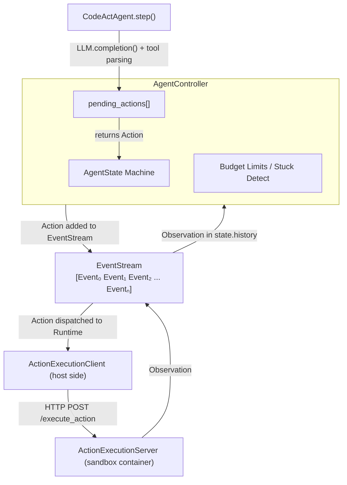
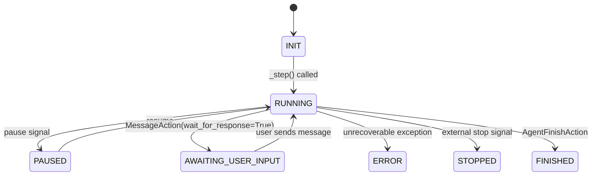
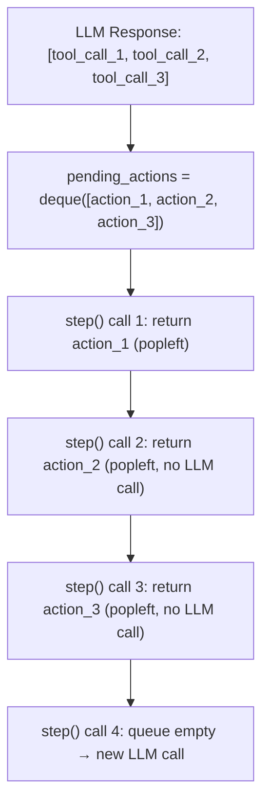
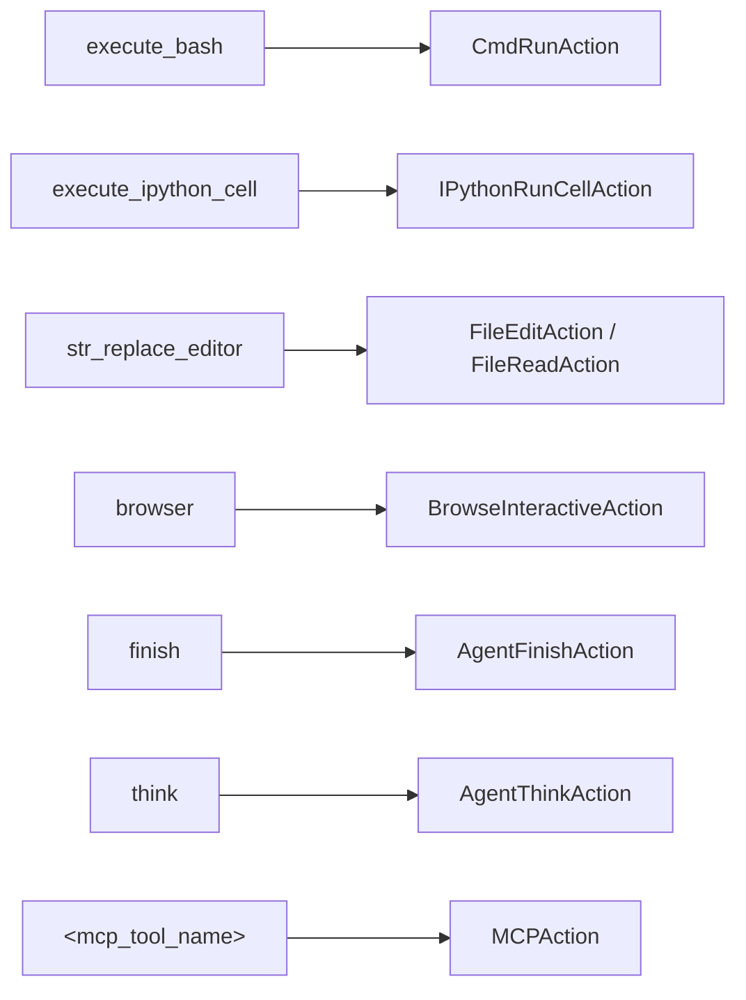
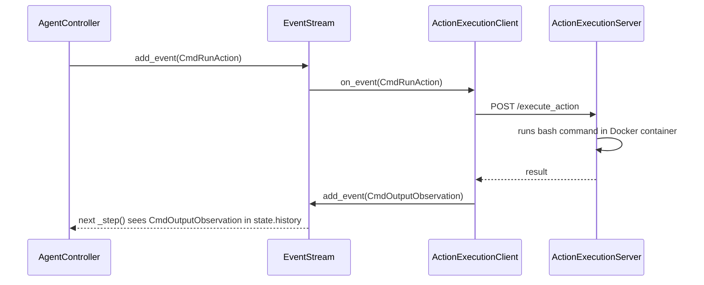
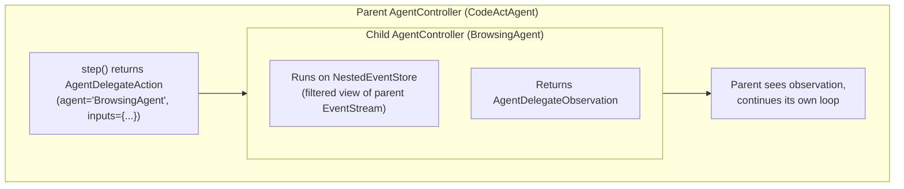
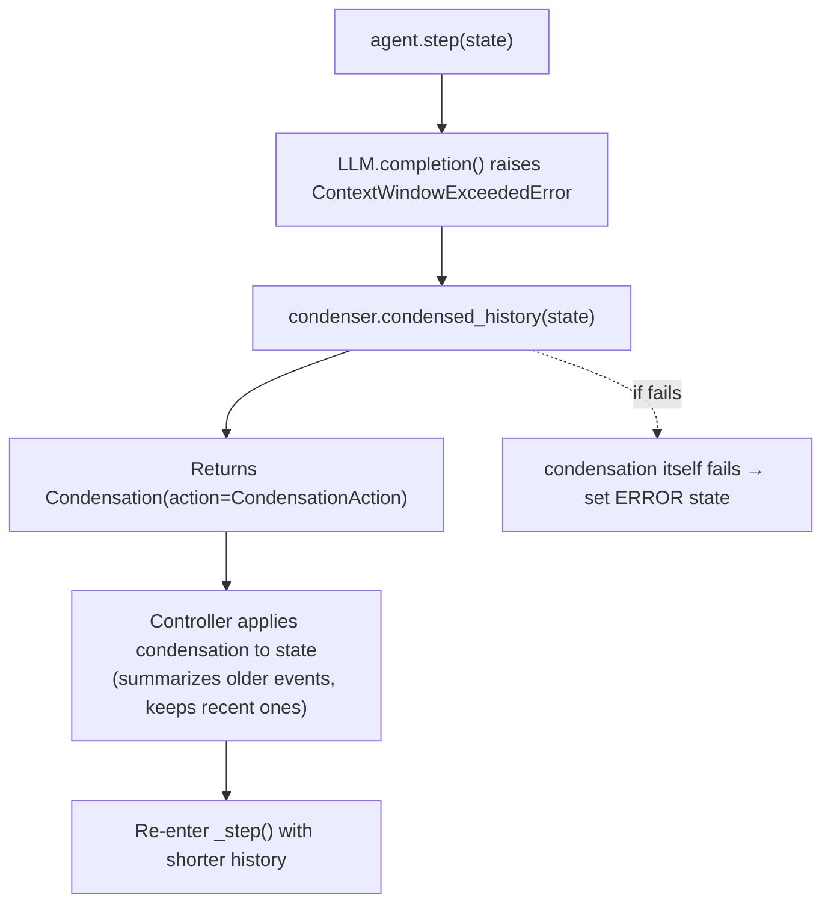
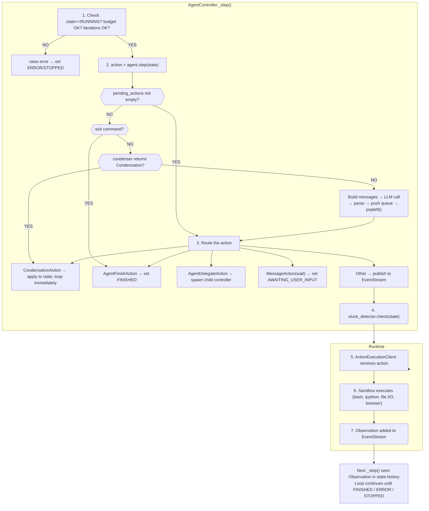

# OpenHands Agentic Loop

## Overview

OpenHands uses an **event-driven agent loop** where an `AgentController` orchestrates
stepping through an agent (typically `CodeActAgent`), and an `EventStream` acts as the
central bus connecting the controller, agent, runtime, and any observers. Every action
the agent produces and every observation the runtime returns is recorded as an `Event`
in a persistent, append-only stream.

This design separates concerns cleanly: the agent only sees conversation history and
returns an `Action`; the controller manages state transitions, budgets, and delegation;
the runtime executes actions in a sandboxed environment and publishes `Observation`s.

---

## Architecture Diagram



---

## AgentState Machine

The controller manages a finite state machine governing the agent lifecycle:



**Key transitions:**
- `INIT → RUNNING`: Controller starts stepping
- `RUNNING → AWAITING_USER_INPUT`: Agent returns `MessageAction(wait_for_response=True)`
- `AWAITING_USER_INPUT → RUNNING`: User sends a new message via EventStream
- `RUNNING → FINISHED`: Agent returns `AgentFinishAction`
- `RUNNING → ERROR`: Unrecoverable exception or budget exceeded
- `RUNNING → STOPPED`: External stop signal (user cancellation)
- `RUNNING → PAUSED`: External pause signal; resumes back to `RUNNING`

---

## The Core Loop: AgentController._step()

The `_step()` method in `AgentController` is the heartbeat of the system. It is invoked
repeatedly while the agent state is `RUNNING`.

```python
# Simplified from openhands/controller/agent_controller.py

async def _step(self) -> None:
    # ── 1. Pre-step checks ──────────────────────────────────
    if self.state.agent_state != AgentState.RUNNING:
        raise AgentNotReadyError()

    if self._is_budget_exceeded():
        raise AgentBudgetExceededError()

    if self.state.iteration >= self.state.max_iterations:
        raise AgentIterationLimitError()

    self.state.iteration += 1

    # ── 2. Invoke the agent ─────────────────────────────────
    action: Action = self.agent.step(self.state)

    # ── 3. Handle the returned Action ───────────────────────
    if isinstance(action, CondensationAction):
        # Apply condensation directly to state (no event stream)
        self.state.apply_condensation(action)
        return  # Re-enter _step() immediately

    if isinstance(action, AgentFinishAction):
        self._set_agent_state(AgentState.FINISHED)
        return

    if isinstance(action, AgentDelegateAction):
        self._create_child_controller(action)
        return

    if isinstance(action, MessageAction) and action.wait_for_response:
        self._set_agent_state(AgentState.AWAITING_USER_INPUT)

    # ── 4. Publish action to EventStream ────────────────────
    self.event_stream.add_event(action, EventSource.AGENT)

    # ── 5. StuckDetector evaluation ─────────────────────────
    self.stuck_detector.check(self.state)

    # Runtime picks up the action, executes it, and publishes
    # an Observation back to the EventStream. The next call to
    # _step() will see that Observation in state.history.
```

### Step-by-Step Breakdown

| Phase | What Happens | Failure Mode |
|-------|-------------|--------------|
| Pre-checks | Validate state, budget, iteration count | `AgentBudgetExceededError`, `AgentIterationLimitError` |
| Agent step | `agent.step(state)` → LLM call → parse → Action | `ContextWindowExceededError`, `RateLimitError` |
| Action routing | Route by action type (finish, delegate, message, other) | — |
| Event publish | Action appended to EventStream | — |
| Stuck detection | Pattern matching on recent history | `AgentStuckInLoopError` |
| Runtime exec | Async: Runtime executes, publishes Observation | Timeout, sandbox crash |

---

## CodeActAgent.step() — The Agent Brain

`CodeActAgent` is the primary agent implementation. Its `step()` method transforms
the current state into a single `Action` for the controller.

```python
# Simplified from openhands/agenthub/codeact_agent/codeact_agent.py

def step(self, state: State) -> Action:
    # ── 1. Drain pending multi-tool actions ─────────────────
    if self.pending_actions:
        return self.pending_actions.popleft()

    # ── 2. Check for user /exit command ─────────────────────
    latest_user_message = state.get_last_user_message()
    if latest_user_message and latest_user_message.content.strip() == '/exit':
        return AgentFinishAction()

    # ── 3. Condense history if needed ───────────────────────
    match self.condenser.condensed_history(state):
        case View(events=events):
            condensed_history = events
        case Condensation(action=condensation_action):
            return condensation_action  # Controller applies, re-steps

    # ── 4. Build LLM messages ──────────────────────────────
    messages: list[Message] = self._get_messages(
        condensed_history,
        state.extra_data.get('condenser_meta', {}),
    )

    # ── 5. Call the LLM ────────────────────────────────────
    params = {
        'messages': messages,
        'tools': self.tools,
        'stop': self.action_parser.stop_tokens,
    }
    response = self.llm.completion(**params)

    # ── 6. Parse response into Action(s) ───────────────────
    actions: list[Action] = self.response_to_actions(response)

    # ── 7. Queue and return first action ───────────────────
    for action in actions:
        self.pending_actions.append(action)
    return self.pending_actions.popleft()
```

### The pending_actions Queue

Modern LLMs can return **multiple tool calls** in a single response (parallel function
calling). OpenHands handles this by:

1. Parsing all tool calls into a list of `Action` objects
2. Pushing them all onto `self.pending_actions` (a `deque`)
3. Returning only the first action to the controller
4. On subsequent `step()` calls, draining from the queue before making a new LLM call

This means a single LLM response generating 3 tool calls results in 3 consecutive
`_step()` invocations without additional LLM calls — each popping from the queue.



---

## Function Calling Resolution

The `function_calling.py` module maps LLM tool call names to concrete OpenHands
Action types. This is the translation layer between the LLM's function-calling
interface and the internal action system.



### str_replace_editor Dispatch

The `str_replace_editor` tool is polymorphic — the `command` argument determines
the actual action type:

```python
if tool_call.function.name == 'str_replace_editor':
    args = json.loads(tool_call.function.arguments)
    command = args.get('command')

    if command == 'view':
        return FileReadAction(path=args['path'], ...)
    elif command == 'create':
        return FileEditAction(path=args['path'], content=args['file_text'])
    elif command == 'str_replace':
        return FileEditAction(
            path=args['path'],
            old_str=args['old_str'],
            new_str=args['new_str'],
        )
    elif command == 'insert':
        return FileEditAction(
            path=args['path'],
            insert_line=args['insert_line'],
            new_str=args['new_str'],
        )
```

---

## Event Processing by Runtime

When an `Action` event is published to the `EventStream`, the Runtime subscriber
picks it up and executes it in an isolated sandbox.



### Action → Observation Type Mapping

| Action Type | Observation Type | Runtime Handler |
|-------------|-----------------|-----------------|
| `CmdRunAction` | `CmdOutputObservation` | Bash execution in sandbox |
| `IPythonRunCellAction` | `IPythonRunCellObservation` | Jupyter kernel execution |
| `FileReadAction` | `FileReadObservation` | File system read |
| `FileEditAction` | `FileEditObservation` | File system write |
| `BrowseInteractiveAction` | `BrowserOutputObservation` | Browser automation |
| `MCPAction` | `MCPObservation` | MCP server call |

---

## StuckDetector

The `StuckDetector` (in `stuck.py`) prevents infinite loops by analyzing recent
action-observation patterns. It runs after every step.

### Detection Strategies

```
Strategy 1: Identical Action Repetition
─────────────────────────────────────────
  action[n] == action[n-1] == action[n-2]
  → Agent is repeating the exact same action

Strategy 2: Alternating Pattern
─────────────────────────────────────────
  action[n] == action[n-2] && action[n-1] == action[n-3]
  → Agent is ping-ponging between two actions

Strategy 3: Error Loop
─────────────────────────────────────────
  last K observations are all ErrorObservation
  → Agent is repeatedly hitting errors without recovery

Strategy 4: Empty Response Loop
─────────────────────────────────────────
  last K actions have empty/near-empty content
  → LLM is producing degenerate output
```

### Recovery

When stuck is detected, the controller can:
1. Raise `AgentStuckInLoopError` → terminates the agent with an error state
2. Inject a `LoopRecoveryAction` → gives the agent a nudge to try a different approach
3. Force condensation → compress history to break the pattern

---

## Agent Delegation

`AgentDelegateAction` enables hierarchical agent composition. A parent agent can
spawn a child agent (e.g., `BrowsingAgent`) to handle a subtask.



The `NestedEventStore` provides isolation — the child only sees events relevant to
its subtask, while results flow back to the parent's event stream.

---

## Error Handling

### Error Hierarchy and Recovery

```
Exception                          │ Handler                    │ Result
───────────────────────────────────┼────────────────────────────┼───────────────────
ContextWindowExceededError         │ Trigger condensation       │ Retry with shorter
                                   │ (shrink history)           │ context
───────────────────────────────────┼────────────────────────────┼───────────────────
RateLimitError                     │ Exponential backoff        │ Retry after delay
                                   │ with jitter                │
───────────────────────────────────┼────────────────────────────┼───────────────────
FunctionCallValidationError        │ Convert to                 │ Agent sees error,
                                   │ ErrorObservation           │ can self-correct
───────────────────────────────────┼────────────────────────────┼───────────────────
AgentStuckInLoopError              │ LoopRecoveryAction or      │ Break pattern or
                                   │ set ERROR state            │ terminate
───────────────────────────────────┼────────────────────────────┼───────────────────
AgentBudgetExceededError           │ Set STOPPED state          │ Terminate with
                                   │                            │ budget message
───────────────────────────────────┼────────────────────────────┼───────────────────
AgentIterationLimitError           │ Set STOPPED state          │ Terminate with
                                   │                            │ iteration message
───────────────────────────────────┼────────────────────────────┼───────────────────
Sandbox timeout / crash            │ ErrorObservation           │ Agent can retry
                                   │ added to stream            │ or finish
```

### Context Window Recovery Flow



---

## Complete Step Lifecycle

Putting it all together, here is one full cycle from controller step to observation:



---

## Key Design Decisions

| Decision | Rationale |
|----------|-----------|
| **Event-sourced architecture** | Full replay capability; every action and observation is persisted. Enables debugging, auditing, and resumption. |
| **Agent returns Action, not text** | Clean separation: agent decides *what* to do; runtime decides *how*. Agent never executes directly. |
| **pending_actions queue** | Supports parallel tool calling without modifying the controller loop. Multiple tool calls from one LLM response are serialized transparently. |
| **Condensation as Action** | History compression is treated as a first-class action type. The controller applies it and re-steps, keeping the agent's step() pure. |
| **NestedEventStore for delegation** | Child agents get an isolated view without polluting the parent's history. Clean composition. |
| **StuckDetector as post-step hook** | Non-invasive: runs after each step, pattern-matches on history. Can be tuned without changing agent or controller logic. |

---

## Comparison with Other Agent Loops

| Aspect | OpenHands | Typical ReAct Loop |
|--------|-----------|-------------------|
| Loop driver | EventStream + Controller | Simple while loop |
| Action dispatch | Type-based routing + EventStream subscribers | Direct function call |
| Multi-tool | pending_actions queue | Usually sequential |
| History | Event-sourced, condensable | Raw message list |
| Error recovery | Typed exceptions with specific handlers | Generic try/catch |
| Delegation | First-class child controllers | Not supported |
| Stuck detection | Pattern-based StuckDetector | Token/step limit only |