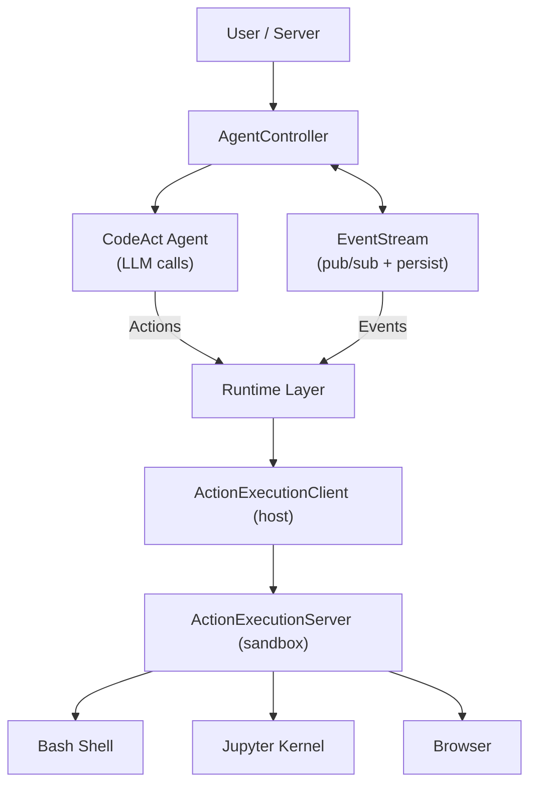
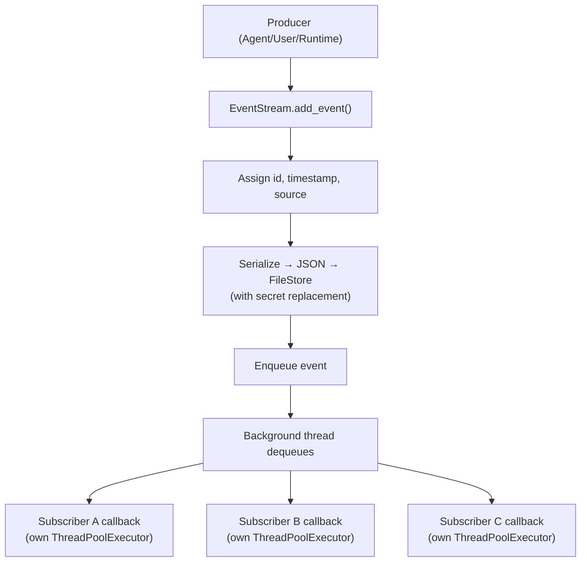
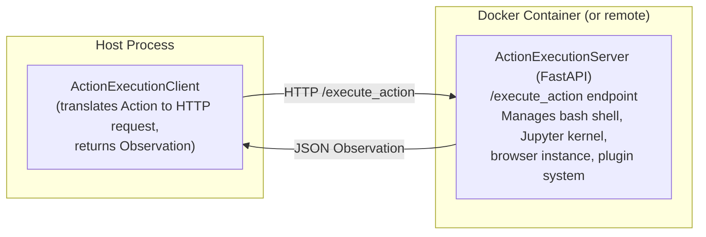
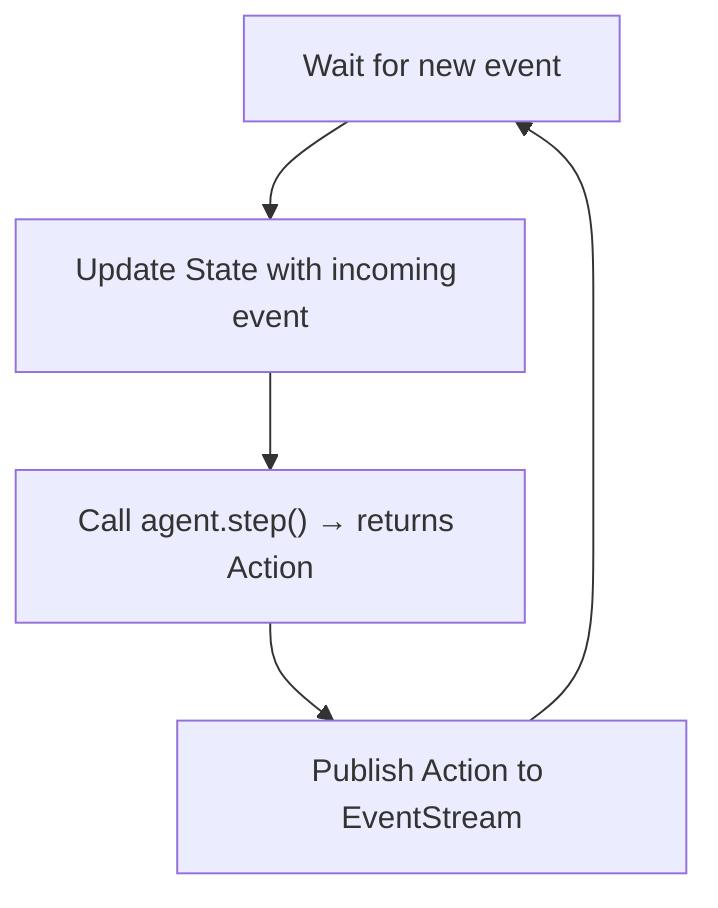
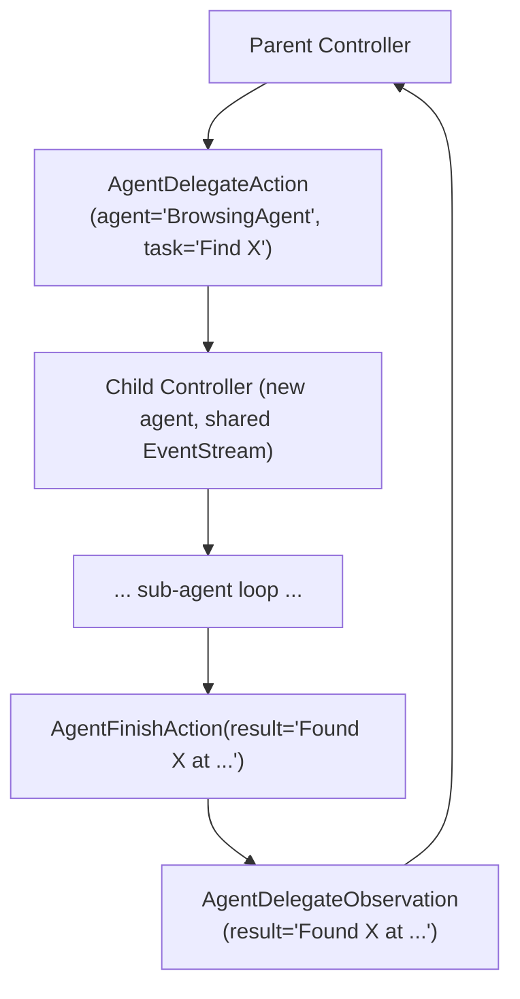

# OpenHands Architecture Deep Dive

## High-Level Architecture



## 1. EventStream — The Central Nervous System

Everything in OpenHands flows through the **EventStream** (`openhands/events/stream.py`).
It is a thread-safe, persistent, pub/sub event bus that decouples every major component
from every other. No component calls another directly; they all communicate by publishing
events to, and subscribing to events from, this single stream.

### 1.1 Design

EventStream extends `EventStore` and combines three responsibilities:

| Responsibility | Mechanism |
|---|---|
| **Ordering** | Monotonically-incrementing integer `id` assigned on `add_event` |
| **Persistence** | JSON serialization to a `FileStore` with pagination |
| **Pub/Sub** | Named subscribers with dedicated `ThreadPoolExecutor` per subscriber |

Subscribers are identified by well-known string IDs:

```
AGENT_CONTROLLER  – the agent loop
RESOLVER          – resolver workflow
SERVER            – WebSocket / REST server
RUNTIME           – sandbox execution layer
MEMORY            – memory / recall subsystem
MAIN              – CLI / main entry point
TEST              – test harness
```

### 1.2 Event Anatomy

Every event carries metadata set by the stream on ingestion:

```python
class Event:
    id: int              # auto-incremented by EventStream
    timestamp: str       # ISO-8601, set on add_event
    source: EventSource  # AGENT | USER | ENVIRONMENT
    cause: int           # id of the parent event that triggered this one
    timeout: int         # optional deadline for observation response
```

The `cause` field creates a causal graph: an `Observation` points back to the
`Action` that produced it, enabling replay and debugging.

### 1.3 Event Flow



Key details:

- **Secret replacement** scrubs credentials before events hit durable storage.
- **Subscriber callbacks** each run in their own `ThreadPoolExecutor`, so a slow
  subscriber cannot block the notification of others.
- **Queue-based dispatch** in a dedicated background thread decouples producers
  from consumers entirely.

### 1.4 Persistence & Replay

Events are serialized to JSON and written to a `FileStore` with pagination support.
This enables:

- **Session replay**: load all events and re-feed them through a controller.
- **Crash recovery**: resume from the last persisted event ID.
- **Audit trail**: every action the agent ever took is recorded.

---

## 2. Action / Observation Model

All events are partitioned into exactly two families:

| Family | Semantics | Direction |
|---|---|---|
| **Action** | An intent — something *should happen* | Agent/User → Environment |
| **Observation** | A report — something *did happen* | Environment → Agent/Controller |

An Action with `id=42` produces an Observation with `cause=42`. This pair forms
the fundamental request/response unit of the system.

### 2.1 Action Taxonomy

Actions live under `openhands/events/action/` and cover every capability the agent
can invoke:

**Shell & Code Execution**

| Action | Purpose | Key Fields |
|---|---|---|
| `CmdRunAction` | Run a bash command | `command`, `is_input` (for interactive stdin), `blocking`, `is_static` |
| `IPythonRunCellAction` | Execute Python in Jupyter | `code`, `include_extra` |

**File Operations**

| Action | Purpose | Key Fields |
|---|---|---|
| `FileReadAction` | Read a file | `path`, `view_range` (OH_ACI mode) |
| `FileWriteAction` | Overwrite/create a file | `path`, `content` |
| `FileEditAction` | Surgical edit | Two modes: LLM-based diff vs. OH_ACI `str_replace`/`insert`/`create` |

**Browser Automation**

| Action | Purpose |
|---|---|
| `BrowseURLAction` | Navigate to a URL |
| `BrowseInteractiveAction` | Execute browser actions (click, type, scroll) |

**Agent Lifecycle & Coordination**

| Action | Purpose |
|---|---|
| `AgentFinishAction` | Signal task completion |
| `AgentDelegateAction` | Spawn a sub-agent for a sub-task |
| `AgentThinkAction` | Log internal chain-of-thought (no side effects) |
| `MessageAction` | Send a message to the user |
| `SystemMessageAction` | Inject a system-level prompt |

**Memory & Context Management**

| Action | Purpose |
|---|---|
| `RecallAction` | Query memory (type: `WORKSPACE_CONTEXT` or `KNOWLEDGE`) |
| `CondensationAction` | Trigger history condensation |
| `CondensationRequestAction` | Request condensation from the agent side |
| `TaskTrackingAction` | Manage internal task/todo lists |

**Integrations**

| Action | Purpose |
|---|---|
| `MCPAction` | Call a tool exposed by an MCP server |

### 2.2 Observation Taxonomy

Observations under `openhands/events/observation/` mirror the actions:

| Observation | Corresponds To |
|---|---|
| `CmdOutputObservation` | `CmdRunAction` — stdout/stderr and exit code |
| `IPythonRunCellObservation` | `IPythonRunCellAction` — cell output |
| `FileReadObservation` | `FileReadAction` — file contents |
| `FileWriteObservation` | `FileWriteAction` — confirmation |
| `FileEditObservation` | `FileEditAction` — diff or result |
| `BrowserOutputObservation` | Browse actions — rendered page state |
| `ErrorObservation` | Any action that fails |
| `AgentDelegateObservation` | `AgentDelegateAction` — sub-agent result |
| `AgentStateChangedObservation` | Controller state machine transitions |
| `AgentCondensationObservation` | Condensation results |
| `RecallObservation` | `RecallAction` — retrieved memory fragments |
| `LoopDetectionObservation` | StuckDetector findings |
| `MCPObservation` | `MCPAction` — tool call results |

---

## 3. Runtime / Sandbox Architecture

The runtime layer (`openhands/runtime/`) executes actions in an isolated environment.
It uses a **client–server split** across a security boundary.

### 3.1 Client–Server Split



The **ActionExecutionClient** (host side) translates `Action` objects into HTTP
requests to the server. The **ActionExecutionServer** (`action_execution_server.py`)
is a FastAPI application running *inside* the sandbox container. It owns the actual
bash shell process, Jupyter kernel, and headless browser.

This split means the agent's host process never directly touches the sandboxed
filesystem or processes — all interaction is mediated through a well-defined HTTP API.

### 3.2 Runtime Implementations

The `Runtime` base class (`base.py`) defines the abstract interface. Concrete
implementations differ only in *how they provision and connect to the sandbox*:

| Implementation | Where the sandbox runs | Provisioning |
|---|---|---|
| `DockerRuntime` | Local Docker daemon | `docker run` with custom image |
| `LocalRuntime` | Same host (no isolation) | Direct process execution |
| `RemoteRuntime` | Remote HTTP endpoint | API call to a provisioning service |
| `ModalRuntime` | Modal cloud platform | Modal API |
| `RunloopRuntime` | Runloop platform | Runloop API |

All implementations share the same ActionExecutionClient; only the connection
target and lifecycle management differ.

### 3.3 Image Tagging System

Docker images follow a three-tag lifecycle for efficient rebuilds:

```
versioned tag  →  lock tag  →  source tag
(oh_v0.17.0_...)  (oh_v0.17.0_lock_...) (oh_v0.17.0_source_...)
```

This enables:
- **Lock tags**: rebuild only when dependency locks change.
- **Source tags**: rebuild only when source code changes.
- **Versioned tags**: pin to a specific OpenHands release.

### 3.4 Plugin System

The ActionExecutionServer supports plugins that extend its capabilities. Plugins
are loaded at server startup and can register new endpoints or background services.
The two built-in plugins are:

- **AgentSkillsPlugin**: File-editing utilities available in the IPython kernel.
- **JupyterPlugin**: Manages the Jupyter kernel lifecycle.

---

## 4. Agent Controller — The Orchestrator

The `AgentController` (`openhands/controller/agent_controller.py`, ~58KB) is the
main orchestration loop. It is the largest single file in the codebase for good
reason: it ties together the agent, the event stream, the runtime, and all
safety/budgeting mechanisms.

### 4.1 Core Loop



The controller subscribes to `EventStream` with ID `AGENT_CONTROLLER`. When an
`Observation` arrives (from the runtime or a sub-agent), it updates the agent's
`State`, then calls `agent.step(state)` to get the next `Action`, which it
publishes back to the stream.

### 4.2 State Management

The `State` object is the agent's working memory for a single session:

- **history**: ordered list of Action/Observation pairs
- **iteration count**: how many agent steps have executed
- **budget tracking**: tokens consumed, cost accrued
- **metrics**: success/failure counts, timing data

### 4.3 Safety Mechanisms

| Mechanism | Purpose |
|---|---|
| **max_iterations** | Hard cap on agent loop iterations |
| **budget_per_task** | Maximum dollar cost for a single task |
| **StuckDetector** | Detects repeated identical actions (loops) and emits `LoopDetectionObservation` |
| **Security analysis** | Evaluates actions against a security policy before execution |
| **Timeout handling** | Actions can specify a `timeout`; controller enforces it |

### 4.4 Agent Delegation

A controller can spawn child controllers for sub-tasks:



The child controller runs its own agent loop with its own state but publishes
events to the same `EventStream`. When the child finishes, the parent receives
an `AgentDelegateObservation` and continues.

### 4.5 Replay Manager

The `ReplayManager` enables session replay: given a persisted event stream, it
can reconstruct the agent's state up to any point and optionally continue
execution from there. This powers the "resume session" feature.

---

## 5. Agent Architecture

### 5.1 Base Class & Registry

The `Agent` base class (`openhands/controller/agent.py`) uses a **registry pattern**:

```python
class Agent:
    _registry: dict[str, type[Agent]] = {}

    @classmethod
    def register(cls, name: str, agent_cls: type[Agent]):
        cls._registry[name] = agent_cls

    @classmethod
    def get_cls(cls, name: str) -> type[Agent]:
        return cls._registry[name]

    @abstractmethod
    def step(self, state: State) -> Action:
        """Given current state, decide the next action."""
        ...
```

Every agent must implement `step(state) → Action`. The registry allows agent
selection by name at configuration time.

### 5.2 MCP Tool Integration

Agents can receive tools from external MCP (Model Context Protocol) servers:

```python
agent.set_mcp_tools(tools: list[MCPTool])
```

These tools are added to the agent's available tool set alongside the built-in
tools. When the LLM selects an MCP tool, a `MCPAction` is emitted, routed to the
appropriate MCP server, and the response comes back as an `MCPObservation`.

---

## 6. CodeActAgent — The Primary Agent

The `CodeActAgent` is the default and most capable agent in OpenHands. It implements
the **CodeAct** paradigm: using LLM function-calling (tool use) to map natural
language instructions to concrete environment actions.

### 6.1 Tool Set

| Tool | Maps To | Description |
|---|---|---|
| `bash` | `CmdRunAction` | Execute shell commands |
| `ipython` | `IPythonRunCellAction` | Run Python code in Jupyter |
| `browser` | `BrowseInteractiveAction` | Interact with web pages |
| `edit` | `FileEditAction` | Edit files (str_replace or LLM-based) |
| `think` | `AgentThinkAction` | Chain-of-thought with no side effects |
| `finish` | `AgentFinishAction` | Declare task complete |
| `condensation_request` | `CondensationRequestAction` | Request history condensation |
| `task_tracker` | `TaskTrackingAction` | Manage internal todo list |

### 6.2 Conversation Construction

The `ConversationMemory` component assembles the LLM prompt from the event history:

1. **System message**: Agent instructions, available tools, environment description.
2. **History**: Action/Observation pairs formatted as assistant/tool messages.
3. **Condensed segments**: Older history may be replaced with summaries.
4. **Prompt caching**: For Anthropic models, cache breakpoints are inserted to
   avoid re-processing unchanged prefix tokens.

### 6.3 History Condensation

As conversations grow, the `Condenser` compresses older history to stay within
context limits. Strategies include:

- **LLM summarization**: Ask the LLM to summarize older turns.
- **Sliding window**: Keep only the N most recent turns.
- **Hybrid**: Summarize old history, keep recent turns verbatim.

The agent can also *request* condensation via `CondensationRequestAction` when it
detects its context is getting large.

### 6.4 Step Function Flow

```python
# Simplified CodeActAgent.step()
def step(self, state: State) -> Action:
    # 1. Build messages from conversation memory
    messages = self.conversation_memory.build_messages(state)

    # 2. Call LLM with function-calling enabled
    response = self.llm.completion(
        messages=messages,
        tools=self.tools,       # bash, ipython, edit, browser, ...
    )

    # 3. Parse tool call from response
    tool_call = response.choices[0].message.tool_calls[0]

    # 4. Map to Action
    action = self.action_from_tool_call(tool_call)
    return action
```

---

## 7. Data Flow — End to End

A complete cycle for a user request like *"Fix the bug in auth.py"*:

```
1. User sends message
   └─▶ MessageAction(content="Fix the bug in auth.py", source=USER)
        └─▶ EventStream.add_event()

2. AgentController receives event
   └─▶ Updates State with new message
   └─▶ Calls CodeActAgent.step(state)

3. CodeActAgent builds prompt, calls LLM
   └─▶ LLM returns tool_call: bash(command="cat auth.py")
   └─▶ Returns CmdRunAction(command="cat auth.py")

4. Controller publishes CmdRunAction to EventStream
   └─▶ Runtime (subscriber) picks up the action
   └─▶ ActionExecutionClient sends HTTP POST to sandbox server
   └─▶ ActionExecutionServer runs `cat auth.py` in bash
   └─▶ Returns CmdOutputObservation(content="<file contents>", exit_code=0)

5. Runtime publishes CmdOutputObservation to EventStream
   └─▶ Controller receives it, updates State
   └─▶ Calls CodeActAgent.step(state) again

6. Agent sees file contents, decides to edit
   └─▶ Returns FileEditAction(path="auth.py", changes=...)

7. Cycle continues until AgentFinishAction
```

---

## 8. Key Design Patterns

### 8.1 Event Sourcing

The entire system state can be reconstructed from the event stream. There is no
mutable shared state outside of `EventStream`. This enables replay, debugging,
and crash recovery.

### 8.2 Subscriber Isolation

Each `EventStream` subscriber gets its own `ThreadPoolExecutor`. A misbehaving
subscriber (slow, crashing) cannot affect others. This is critical because the
runtime, agent controller, and server all subscribe to the same stream.

### 8.3 Security Boundary

The client–server split in the runtime creates a hard security boundary. The
host process (agent, controller, LLM calls) never directly accesses the sandboxed
filesystem or processes. All interaction goes through a narrow HTTP API, which
can be audited and rate-limited.

### 8.4 Registry Pattern

Agents, runtimes, and condensers all use a registry pattern. Components register
themselves by name, and the system instantiates them by configuration string.
This makes the system extensible without modifying core code.

### 8.5 Causal Event Linking

The `cause` field on events creates a directed acyclic graph of causality.
Given any observation, you can trace back through the chain of actions and
observations that led to it. This is invaluable for debugging agent behavior
and understanding why the agent took a particular path.

---

## 9. Summary

OpenHands' architecture is built on a small number of powerful abstractions:

| Abstraction | Role |
|---|---|
| **EventStream** | Decoupled, persistent, thread-safe communication bus |
| **Action/Observation** | Typed, causal request/response pairs |
| **Runtime** | Isolated execution via client–server split |
| **AgentController** | Orchestration loop with safety guardrails |
| **Agent (CodeAct)** | LLM-powered decision-making via function calling |

The event-sourced design means every session is fully reproducible. The sandbox
architecture means agent actions are isolated and auditable. The pub/sub model
means components can evolve independently. Together, these patterns create a
system that is both powerful and maintainable.
