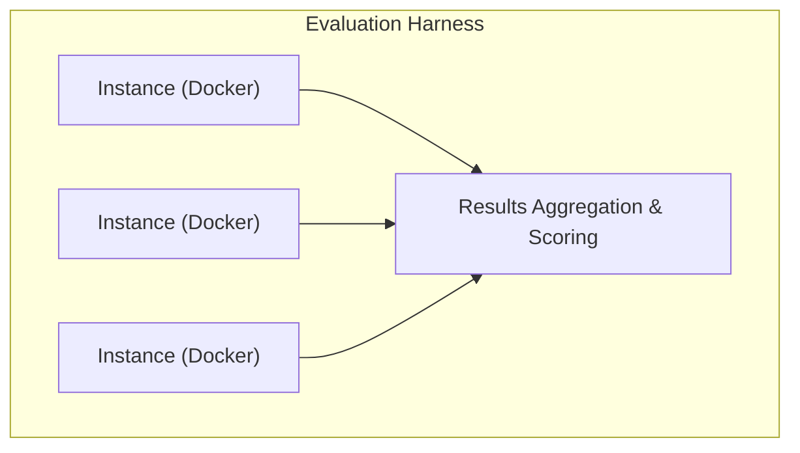

# OpenHands — Benchmark Analysis

> **Headline metric**: 77.6% on SWE-bench Verified (best-in-class among open-source agents)

OpenHands maintains one of the most rigorous open-source evaluation infrastructures
in the AI coding-agent space. This document covers their performance across
benchmarks, methodology, historical trajectory, and competitive positioning.

---

## 1. SWE-bench Verified

SWE-bench is the de-facto standard for evaluating AI coding agents. It tests an
agent's ability to resolve **real-world GitHub issues** — locating buggy code,
understanding context, and producing correct patches in Python repositories.

| Metric | Value |
|---|---|
| **Score** | 77.6% |
| **Benchmark variant** | SWE-bench Verified |
| **Best model** | Claude (Anthropic) |
| **Evaluation repo** | [github.com/OpenHands/benchmarks](https://github.com/OpenHands/benchmarks) |
| **Results tracking** | Google Sheets (linked from README badge) |

### What SWE-bench Verified tests

- Each instance is a real GitHub issue + the gold-standard patch that resolved it.
- The agent receives the issue text and repository state, then must produce a diff.
- "Verified" is the human-validated subset — harder and more reliable than Lite/Full.
- Tests span popular Python projects (Django, scikit-learn, sympy, flask, etc.).

### Performance across LLMs

OpenHands performance is heavily model-dependent. The 77.6% headline reflects
the best underlying LLM (Claude). Other models yield meaningfully different
results:

| Underlying LLM | Approx. SWE-bench Verified | Notes |
|---|---|---|
| Claude 3.5/4 Sonnet | **77.6%** | Headline score |
| GPT-4o / GPT-4.1 | ~55–65% | Strong but below Claude |
| Open-weight models | ~30–45% | Llama, DeepSeek, etc. |

> **Key insight**: The agent framework matters, but the LLM is the dominant
> variable. OpenHands's CodeAct architecture is optimized to extract maximum
> performance from frontier models.

---

## 2. Terminal-Bench 2.0

Terminal-Bench evaluates agents on CLI/terminal interaction tasks — file
manipulation, system administration, development workflows, and shell scripting.

### OpenHands results on Terminal-Bench 2.0

| Rank | Agent + Model | Score |
|---|---|---|
| **#49** | OpenHands + Claude Opus 4.5 | **51.9%** |
| **#58** | OpenHands + GPT-5 | **43.8%** |

### Context

- The leaderboard has **100+ entries** from various agent/model combinations.
- OpenHands with Claude Opus 4.5 lands in the **top 50**, a respectable but
  not dominant position.
- Claude Opus 4.5 outperforms GPT-5 by **+8.1 percentage points** on this
  benchmark when paired with OpenHands.
- The mid-range ranking reflects OpenHands's **broader focus** — it is a
  general-purpose coding agent, not a terminal-specific tool. Agents purpose-built
  for CLI interaction tend to score higher on this particular benchmark.

### What Terminal-Bench tests

- File system operations (create, move, search, transform files)
- System administration tasks (process management, permissions, networking)
- Development workflows (git operations, build systems, package management)
- Shell scripting and command composition
- Multi-step terminal interactions requiring state tracking

---

## 3. Other Benchmarks (Evaluation Infrastructure)

OpenHands maintains a comprehensive benchmarks repository at
[github.com/OpenHands/benchmarks](https://github.com/OpenHands/benchmarks)
covering:

| Benchmark | Focus | Status |
|---|---|---|
| SWE-bench Lite | Smaller subset of SWE-bench | Active |
| SWE-bench Full | Complete SWE-bench dataset | Active |
| SWE-bench Verified | Human-validated subset | Active (headline) |
| HumanEval | Function-level code generation | Tracked |
| MBPP | Mostly Basic Python Problems | Tracked |
| Agent-specific benchmarks | Custom multi-step agent tasks | Research |

The evaluation infrastructure supports:

- **Parallel evaluation** on remote runtimes (cloud-scale runs)
- **Docker-based isolation** for each benchmark instance
- **Standardized harness** for reproducible comparisons
- **Multi-LLM sweeps** to test across model providers

---

## 4. Historical Performance Trajectory

OpenHands (originally named OpenDevin) has shown dramatic improvement on
SWE-bench over its lifetime:

```
SWE-bench Performance Timeline (approximate)
─────────────────────────────────────────────
Early 2024 (OpenDevin launch)     ████████░░░░░░░░░░░░  ~25–30%
Mid 2024 (CodeAct v1)             ████████████░░░░░░░░  ~40–45%
Late 2024 (CodeAct v2 + Claude)   ████████████████░░░░  ~55–65%
Early 2025 (current)              ████████████████████  ~77.6%
─────────────────────────────────────────────
```

### Drivers of improvement

1. **LLM advances** — Claude 3.5 Sonnet → Claude 4 family brought large gains.
2. **CodeAct architecture refinements** — unified code action space, better
   tool integration, improved context management.
3. **Evaluation methodology** — better prompt engineering for the benchmark
   harness itself.
4. **Community contributions** — as one of the most active open-source agent
   projects, community PRs have improved edge-case handling.

### Academic significance

- OpenHands (as OpenDevin) was **one of the first open-source agents** to
  achieve competitive SWE-bench scores.
- The project serves as a **research baseline** in many academic papers on
  AI coding agents.
- The **CodeAct paper** introduced the unified code action space concept —
  executing code as the primary action type rather than separate tool calls.

---

## 5. Benchmark Methodology

### Evaluation setup



- **Docker sandbox**: Each benchmark instance runs in an isolated container
  with a faithful reproduction of the target repository at the correct commit.
- **Parallel execution**: The harness supports running many instances
  concurrently on remote runtimes, enabling large-scale evaluation runs.
- **Deterministic scoring**: Patches are applied and the project's existing
  test suite determines pass/fail — no LLM-based judging.
- **Open-source harness**: The entire evaluation infrastructure is public,
  enabling independent reproduction of results.

### Reproducibility

- All evaluation code is in the OpenHands benchmarks repo.
- Docker images pin exact dependency versions.
- Results are tracked in public Google Sheets linked from the README.
- Multiple independent groups have reproduced OpenHands benchmark results.

---

## 6. Competitive Comparison — SWE-bench Verified

| Agent | SWE-bench Verified | Open Source | Primary Model | Notes |
|---|---|---|---|---|
| **OpenHands** | **77.6%** | ✅ Yes | Claude | CodeAct architecture |
| SWE-agent | ~30–40% | ✅ Yes | Various | Princeton; CLI-focused agent |
| Aider | ~40–50% | ✅ Yes | Various | Editor integration focus |
| Devon | ~20–30% | ✅ Yes | Various | Earlier-stage project |
| Amazon Q Developer | ~40–50% | ❌ No | Proprietary | AWS-integrated |
| Factory Code Droid | ~50–60% | ❌ No | Proprietary | Enterprise-focused |

> **Caveats**: SWE-bench scores change rapidly as both agents and models
> improve. Scores above are approximate mid-2025 snapshots. Proprietary
> agents often report on different SWE-bench variants, making direct
> comparison imprecise.

### Why OpenHands leads among open-source agents

1. **CodeAct design** — executing code directly rather than generating
   tool-call JSON reduces overhead and error modes.
2. **Docker sandbox** — full environment fidelity means the agent can
   run tests, install dependencies, and inspect runtime behavior.
3. **Active development** — large contributor community with frequent
   releases.
4. **Model-agnostic** — can immediately leverage new frontier models.

---

## 7. Key Benchmark Observations

### Model dependency is the dominant factor

The single most important variable in OpenHands benchmark performance is the
underlying LLM. Switching from an open-weight model to Claude can double the
SWE-bench score. This has implications for cost, latency, and deployment
flexibility.

### CodeAct is optimized for coding benchmarks

The unified code action space — where the agent writes and executes Python
as its primary action type — is specifically well-suited for coding
benchmarks. This is a deliberate design choice that trades generality for
coding performance.

### Docker sandbox enables faithful evaluation

The container-based execution environment means benchmark results closely
reflect real-world capability. The agent operates in the same environment
a human developer would — with access to the full repo, test suite, and
system tools.

### The evaluation infrastructure is a product in itself

OpenHands's open-source evaluation harness has become a community resource.
Other agent projects use it (or fork it) for their own evaluations, which
helps standardize comparison across the ecosystem.

### Terminal-Bench reveals specialization gaps

The mid-range Terminal-Bench ranking (top 50 out of 100+) highlights that
OpenHands is optimized for **code editing and bug fixing**, not for raw
terminal interaction. Agents that are purpose-built for CLI tasks
outperform it on Terminal-Bench despite scoring lower on SWE-bench.

---

## 8. Terminal-Bench vs SWE-bench — Different Skills

| Dimension | SWE-bench | Terminal-Bench |
|---|---|---|
| **Primary skill** | Bug fixing / code editing | CLI interaction |
| **Environment** | Python repos | General terminal |
| **Success criteria** | Test suite passes | Task completion |
| **OpenHands strength** | ★★★★★ (77.6%) | ★★★☆☆ (~52%) |
| **What it measures** | Code understanding + patching | Shell fluency + tool use |

OpenHands's architecture (CodeAct) is specifically tuned for the SWE-bench
task profile. Terminal-Bench requires a different skill set — rapid shell
command composition, system knowledge, and file manipulation — where
OpenHands's code-execution-first approach is less advantageous.

---

## 9. Summary

| Benchmark | Score | Ranking | Significance |
|---|---|---|---|
| SWE-bench Verified | **77.6%** | **#1 open-source** | Headline metric; real-world bug fixing |
| Terminal-Bench 2.0 (Claude Opus 4.5) | **51.9%** | **#49 / 100+** | Mid-range; reflects broader focus |
| Terminal-Bench 2.0 (GPT-5) | **43.8%** | **#58 / 100+** | Model matters significantly |

**Bottom line**: OpenHands is the **strongest open-source coding agent on
SWE-bench**, with a 77.6% score that puts it in the same tier as
proprietary solutions. Its Terminal-Bench performance is respectable but
not exceptional, reflecting its optimization for code editing over terminal
interaction. Performance is heavily model-dependent, with Claude models
consistently delivering the best results.

---

*Last updated: 2025. Data sourced from OpenHands README badges, Terminal-Bench
leaderboard, and the OpenHands benchmarks repository. Scores are approximate
and subject to change as models and agents evolve.*
