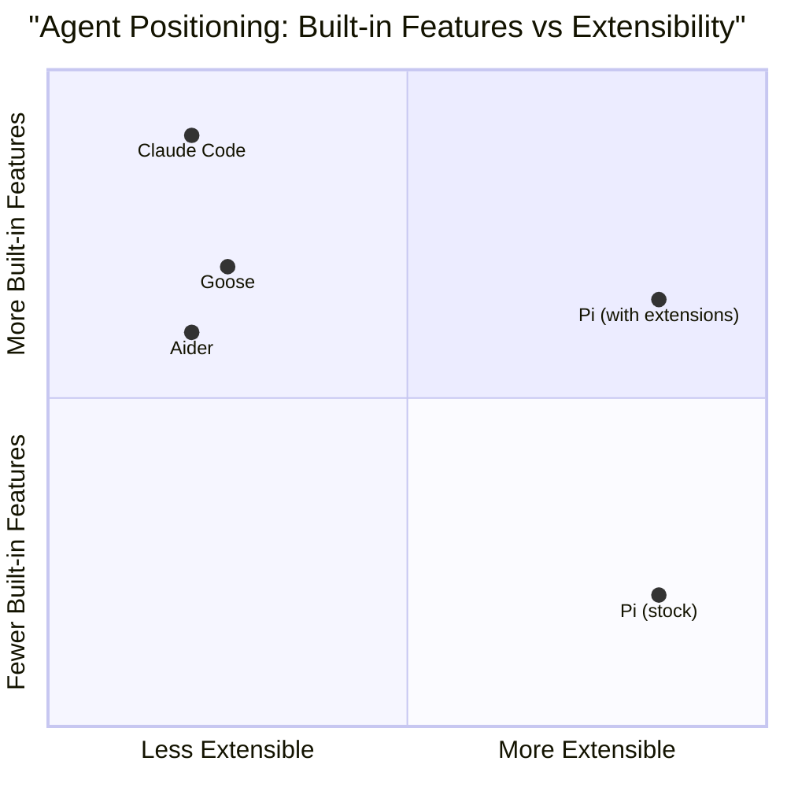

# Pi — Benchmarks & Adoption Metrics

## Overview

Pi does not currently appear on the Terminal-Bench 2.0 leaderboard or other major coding agent benchmarks. This is consistent with the project's philosophy — Pi is not optimized for benchmark performance, and Mario Zechner has not prioritized benchmark submission. The project's value proposition is flexibility and control, not raw benchmark scores.

This file instead covers community adoption metrics, ecosystem health indicators, and comparative analysis.

## Benchmark Absence — Context

### Why Pi Isn't on Terminal-Bench

Several factors explain Pi's absence from benchmark leaderboards:

1. **Philosophy mismatch**: Terminal-Bench measures out-of-the-box performance on coding tasks. Pi's strength is customizability, which benchmarks don't capture.
2. **Minimal defaults**: With only four built-in tools, Pi's default configuration is less optimized for complex coding benchmarks than agents with built-in search, lint-test-fix cycles, and planning.
3. **Extension-dependent performance**: Pi's real-world performance depends heavily on which extensions are installed. A Pi instance with git checkpointing, code search, and test-running extensions would perform very differently from a stock Pi instance.
4. **Project priorities**: Mario Zechner focuses on architecture and extensibility rather than benchmark optimization.

### What Benchmarks Would Show

A stock Pi (four tools, no extensions) would likely score below agents with more built-in capabilities (Claude Code, Aider) on standard benchmarks. However, a well-configured Pi with appropriate extensions and skills could potentially match or exceed these scores, as the extension system allows implementing the same strategies (planning, lint-test-fix cycles, code search) that give other agents their benchmark edges.

This highlights an interesting question for coding agent evaluation: **should benchmarks measure the agent as shipped, or the agent as configured by a skilled user?**

## Community Adoption Metrics

### GitHub Activity

The pi-mono repository and surrounding ecosystem provide several adoption signals:

- **Repository**: github.com/badlogic/pi-mono
- **Creator credibility**: Mario Zechner (@badlogic) is the creator of libGDX, one of the most popular open-source game frameworks, with a strong track record in developer tooling
- **Active development**: Regular commits and releases
- **Issue activity**: Active issue tracker with community contributions

### npm Ecosystem

Pi's packages are published to npm under the `@mariozechner` scope:

- `@mariozechner/pi-coding-agent` — The main CLI
- `@mariozechner/pi-ai` — Unified LLM API (independently useful)
- `@mariozechner/pi-agent-core` — Agent runtime
- `@mariozechner/pi-tui` — Terminal UI framework
- `@mariozechner/pi-web-ui` — Web components
- `@mariozechner/pi-mom` — Slack bot
- `@mariozechner/pi-pods` — GPU pod management

Community packages use the `pi-package` npm keyword for discoverability.

### Community Infrastructure

- **Discord**: Active community server for discussion, package sharing, and support
- **awesome-pi-agent**: Curated list of Pi resources, packages, and integrations
- **Comparison projects**: pi-vs-claude-code and similar repositories comparing Pi to other agents

## Ecosystem Health Indicators

### Third-Party Package Growth

The health of Pi's ecosystem is best measured by the diversity and quality of community-built packages:

| Package | Type | Description |
|---------|------|-------------|
| pi-skills | Skills collection | Common skills for various frameworks and tools |
| pi-messenger | Extension | Messaging platform integrations |
| pi-mcp-adapter | Extension | MCP protocol support for Pi |
| pi-web-access | Extension | Web browsing capabilities |

### Integration with Multi-Agent Systems

Pi's four modes of operation (especially RPC and SDK) have enabled integration with larger systems:

- **Overstory**: Multi-agent orchestrator that can use Pi as a component agent
- **Agent of Empires**: Another orchestration framework with Pi integration
- **pi-mom**: First-party Slack bot demonstrating the RPC integration pattern

### Developer Adoption Signals

Pi appeals to a specific developer segment:

- **Power users** who want full control over their coding agent
- **Extension builders** who want to customize agent behavior deeply
- **Multi-model users** who switch between LLM providers
- **Self-hosters** who want to run agents against local or private models

This is deliberately a niche audience. Mario Zechner has joked that the project name ("pi") is "so there will never be any users" — intentionally un-Google-able.

## Comparative Analysis

### Feature Comparison (Not a Benchmark)

| Capability | Claude Code | Aider | Goose | Pi |
|-----------|------------|-------|-------|-----|
| Default tools | ~15 | Edit formats | ~10 toolkits | 4 |
| Extension system | Limited | No | Toolkits | Full TypeScript API |
| LLM providers | 1 (Anthropic) | 20+ | Multiple | 15+ (unified API) |
| MCP support | Yes | No | Yes | Via extension |
| Sub-agents | Yes | No | No | Via extension |
| Session branching | No | No | No | Yes |
| System prompt control | No | Limited | No | Full |
| Background tasks | Yes | No | No | Via tmux |

### Positioning

Pi occupies a unique position in the terminal coding agent landscape:

Pi with extensions can reach feature parity with more built-in agents, but requires user effort to configure. The trade-off is: **predictability and control vs. out-of-the-box capability**.

## Recommendations for Evaluation

When evaluating Pi, consider:

1. **Don't compare stock Pi to fully-featured agents** — it's comparing a toolkit to a finished product
2. **Evaluate the extension ecosystem** — a Pi with good extensions can match other agents
3. **Consider the stability value** — no surprise behavior changes on updates
4. **Consider the customization value** — ability to perfectly tune the agent to your workflow
5. **Watch ecosystem growth** — the number and quality of community packages indicates long-term viability
