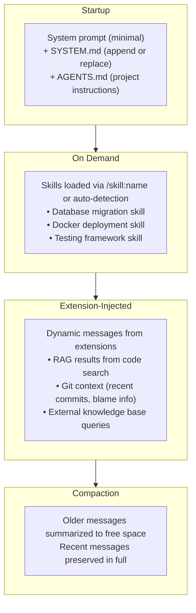

# Pi — Context Management

## Overview

Pi manages LLM context through a layered system of static files, dynamic injection, progressive disclosure, and automatic compaction. The design reflects Pi's "primitives not features" philosophy — each layer is simple and independently useful, but they compose into a flexible context management strategy that rivals more complex agents.

The key innovation is progressive disclosure: rather than front-loading all context into the system prompt (which hurts prompt cache hit rates and wastes tokens), Pi loads capabilities and knowledge on-demand as the conversation requires them.

## Static Context Layers

### AGENTS.md — Project Instructions

AGENTS.md is Pi's equivalent of Claude Code's CLAUDE.md or Cursor's `.cursorrules`. It's a Markdown file in the project root that provides project-specific instructions to the agent.

**Loading behavior:**
- Loaded at startup before the first user message
- Injected into the system prompt or as an early user message
- Can include coding conventions, project structure, testing requirements, deployment notes
- Supports nested AGENTS.md files in subdirectories for per-module instructions

**Example use cases:**
- "This project uses Vitest for testing, not Jest"
- "Always run `pnpm lint` after editing TypeScript files"
- "The API lives in `src/api/`, the frontend in `src/web/`"

### SYSTEM.md — System Prompt Customization

SYSTEM.md allows per-project customization of Pi's system prompt itself. This is more powerful than AGENTS.md — it modifies the instructions the LLM receives about how to behave, not just project context.

**Two modes:**
1. **Append mode** (default): SYSTEM.md content is appended to Pi's default system prompt
2. **Replace mode**: SYSTEM.md completely replaces Pi's default system prompt

**Why this matters**: Most coding agents don't let you modify the system prompt. Pi's default system prompt is intentionally minimal, and SYSTEM.md gives users full control over LLM behavior. You can change the agent's personality, add domain-specific reasoning instructions, or enforce strict coding standards at the system level.

## Dynamic Context

### Skills as Progressive Disclosure

Skills (SKILL.md files) are Pi's primary mechanism for progressive context disclosure:



**Why progressive disclosure matters for prompt cache**: If all skills were loaded at startup, the system prompt would vary based on which skills exist in the project. This would invalidate the prompt cache for every project. By loading skills on-demand, the system prompt stays stable and cacheable.

### Prompt Templates

Reusable Markdown prompts that can be invoked via `/name`:

- Stored in `~/.pi/agent/prompts/` or project directories
- Can include template variables
- Useful for repetitive tasks: `/review`, `/test`, `/deploy`
- Distributed via packages

### Extension-Driven Dynamic Context

Extensions can inject context at multiple points in the conversation:

- **Pre-message injection**: Add context before the LLM sees a user message (e.g., inject relevant file contents based on the question)
- **History filtering**: Remove or modify messages before they're sent to the LLM (e.g., strip large tool outputs that are no longer relevant)
- **RAG integration**: Query external knowledge bases and inject results as context
- **Conditional loading**: Load additional context based on what the agent is doing (e.g., load test framework docs when the agent is writing tests)

## Compaction

Compaction is Pi's strategy for managing context window limits. When the conversation grows too long, older messages are summarized to free space.

### How Compaction Works

1. **Threshold detection**: Pi monitors token count relative to the model's context window
2. **Message selection**: Older messages (not the most recent exchanges) are selected for summarization
3. **Summarization**: Selected messages are sent to the LLM with a summarization prompt
4. **Replacement**: The original messages are replaced with the summary in the conversation history
5. **Continuation**: The agent continues with the compacted context

### Auto vs Manual Compaction

- **Auto compaction**: Triggered automatically when approaching the context window limit. The threshold and behavior are configurable.
- **Manual compaction**: Users can trigger compaction via commands when they want to start fresh-ish without losing all context.

### Extension Customization

Extensions can fully customize compaction:
- Change the summarization prompt
- Modify the compaction threshold
- Choose which messages are compacted (protect certain messages)
- Replace the entire compaction strategy (e.g., use embeddings instead of summarization)
- Implement "smart compaction" that preserves messages about unresolved tasks

## Cross-Provider Context Handoff

Pi-ai's cross-provider context handoff is a unique context management challenge. When switching LLM providers mid-conversation (e.g., from Claude to GPT-4), the conversation history must be translated:

### Translation Challenges

| Source Feature | Translation Required |
|---------------|---------------------|
| Anthropic thinking traces | Convert to system messages or annotations |
| Signed content blobs | Cannot leave provider — must be replaced with text summaries |
| Provider-specific reasoning fields | Map to the target provider's format |
| Extended thinking content | Different field names across providers |
| Tool call IDs | Different ID formats and reference patterns |

### How Pi-ai Handles It

Pi-ai converts conversations between provider formats at the API boundary. This is best-effort — some provider-specific features (like signed blobs) can't be perfectly translated. But the result is that users can switch providers mid-conversation without losing context, which is unique among terminal coding agents.

## Tree-Structured Sessions

Pi's session storage is one of its most architecturally interesting features. Sessions are stored as JSONL files where each entry has an `id` and `parentId`, forming a tree structure.

### Why Trees Instead of Linear Logs

Most coding agents store sessions as linear arrays of messages. Pi's tree structure enables:

```
                    root
                   /    \
                msg1    msg1'  (branched from root)
                 |       |
                msg2    msg2'
                / \
           msg3   msg3'  (branched from msg2)
            |      |
           msg4   msg4'
```

- **In-place branching**: Try a different approach without creating a new session file
- **Navigation**: `/tree` shows the full session tree, jump to any point
- **Forking**: `/fork` creates a new session starting from the current branch point
- **History preservation**: All branches are preserved — nothing is ever lost
- **Exploration**: Try multiple approaches, compare results, merge the best

### Session Commands

| Command | Description |
|---------|-------------|
| `/tree` | Display the session tree, navigate to any node |
| `/fork` | Create a new session from the current branch |
| `/export` | Export session to HTML |
| `/gist` | Share session as a GitHub gist |

### JSONL Storage Format

Each line in the JSONL file is a message with:
- `id`: Unique message identifier
- `parentId`: ID of the parent message (forms the tree)
- `role`: user, assistant, tool, system
- `content`: The message content
- `metadata`: Tool call IDs, timestamps, branch info

This format is append-only — branching just means adding new entries with different `parentId` values pointing to existing messages. The active branch is tracked by following the chain of most recent `parentId` references.

## Context Management Compared to Other Agents

| Feature | Claude Code | Aider | Goose | Pi |
|---------|------------|-------|-------|-----|
| Project instructions | CLAUDE.md | .aider.conf.yml | profiles | AGENTS.md |
| System prompt control | No | Limited | No | Full (SYSTEM.md) |
| Progressive disclosure | No | No | No | Yes (Skills) |
| Compaction | Auto | Auto | Auto | Auto + customizable |
| Session branching | No | No | No | Yes (tree-structured) |
| Cross-provider handoff | No | No | No | Yes (pi-ai) |
| Dynamic context injection | Limited | No | Extensions | Extensions |
| Prompt templates | No | No | No | Yes (/name) |

Pi's context management is arguably the most flexible of any terminal coding agent, not because it does the most by default, but because every layer is customizable and extensible.
