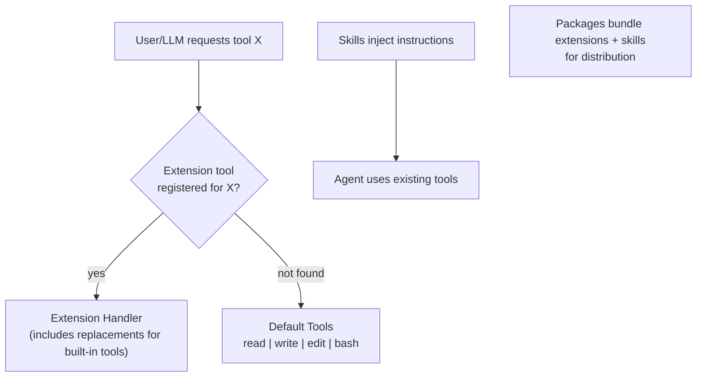

# Pi — Tool System

## Overview

Pi's tool system embodies its "primitives not features" philosophy. The coding agent ships with exactly four tools: `read`, `write`, `edit`, and `bash`. Every other capability — web access, MCP integration, sub-agents, code search, Git operations — is added through three extensibility mechanisms: extensions (TypeScript), skills (SKILL.md), and packages (distribution bundles).

This minimal default tool set keeps the system prompt small, the prompt cache stable, and the agent's behavior predictable. Extensions can add arbitrarily complex tools, but the core never grows.

## The Four Default Tools

### 1. `read` — File Reading

Reads file contents and returns them to the LLM. This is the agent's primary way of understanding existing code.

**Characteristics:**
- Reads single files or specific line ranges
- Returns content with line numbers for precise reference
- The simplest of the four tools — no side effects

### 2. `write` — File Writing

Creates new files or completely overwrites existing files with new content.

**Characteristics:**
- Full-file replacement semantics
- Creates parent directories as needed
- Used for new file creation and complete rewrites
- For surgical edits, the `edit` tool is preferred

### 3. `edit` — Surgical File Editing

Applies targeted edits to existing files using search-and-replace semantics.

**Characteristics:**
- Specifies old content to find and new content to replace it with
- More token-efficient than `write` for small changes to large files
- Requires exact string matching for the content to be replaced
- Can fail if the search string doesn't match (stale context)

### 4. `bash` — Shell Command Execution

Executes shell commands and returns their output (stdout and stderr).

**Characteristics:**
- Full shell access — any command the environment supports
- No built-in sandboxing or permission gates (by design)
- No background execution support (use tmux for that)
- Extensions can add permission gates, command filtering, or sandboxing

**Why only these four?** These are the primitive operations for coding: read code, write code, edit code, run commands. Every higher-level operation (search, test, lint, deploy, git) can be composed from these primitives via `bash`. Adding more built-in tools would mean more system prompt tokens, more prompt cache variability, and more opinions baked into the core.

## The Extension API for Custom Tools

Extensions are TypeScript modules that can register new tools with full schema definitions, handlers, and UI integration.

### Registering a Custom Tool

Extensions use the Pi extension API to define tools with:
- **Name**: The tool identifier the LLM calls
- **Description**: What the tool does (injected into the system prompt)
- **Schema**: JSON Schema for tool parameters
- **Handler**: TypeScript function that executes the tool call
- **Validation**: Optional parameter validation before execution

### What Extensions Can Do

Extensions have broad capabilities beyond just tool registration:

| Capability | Description |
|-----------|-------------|
| **Register tools** | Add new tools or replace built-in tools entirely |
| **Register commands** | Add slash commands (e.g., `/deploy`, `/review`) |
| **Keyboard shortcuts** | Bind actions to key combinations |
| **Event handlers** | Subscribe to agent lifecycle events |
| **UI components** | Custom status lines, headers, footers, editors |
| **Context injection** | Add messages to conversation, filter history |
| **Sub-agents** | Spawn and coordinate multiple pi instances |
| **Plan mode** | Implement planning workflows |
| **Permission gates** | Add approval prompts before tool execution |
| **Path protection** | Prevent modifications to specific files/directories |
| **Git checkpointing** | Auto-commit before/after tool calls |
| **SSH execution** | Run tools on remote machines |
| **MCP integration** | Connect to MCP servers |
| **Games** | Yes, someone got Doom running in pi |

### Tool Replacement

A unique capability: extensions can replace the built-in tools entirely. If you want `edit` to behave differently — perhaps using a diff-based approach instead of search-and-replace — you can register a tool with the same name and your handler takes over. The original tool is fully replaced, not wrapped.

This means Pi's "four default tools" are really "four default tools that you can swap out." The defaults are sensible for most users, but power users can customize everything.

## The Skills System

Skills are a lighter-weight extensibility mechanism designed for progressive context disclosure. Where extensions are TypeScript code that hooks into the agent runtime, skills are Markdown files that describe capabilities.

### SKILL.md Format

A skill is a SKILL.md file placed in `~/.pi/agent/skills/` or in a project directory:

```markdown
# Skill: Database Migration

## Description
This skill helps manage database migrations using the project's migration framework.

## Tools
- Run `npm run migrate:create <name>` to create a new migration
- Run `npm run migrate:up` to apply pending migrations
- Run `npm run migrate:down` to rollback the last migration

## Conventions
- Migration files go in `src/migrations/`
- Use snake_case for migration names
- Always create both up and down migrations
```

### How Skills Work

1. **Discovery**: Skills are discovered from `~/.pi/agent/skills/`, project directories, and installed packages
2. **On-demand loading**: Skills are NOT loaded into the system prompt by default. They're loaded when:
   - The user invokes `/skill:name`
   - The agent determines a skill is relevant (auto-loading)
3. **Progressive disclosure**: The skill content is injected into the conversation only when needed, preserving prompt cache for the common case
4. **Agent Skills standard**: Pi skills follow the agentskills.io specification, making them portable across compatible agent implementations

### Skills vs Extensions

| Aspect | Skills | Extensions |
|--------|--------|------------|
| Format | Markdown (SKILL.md) | TypeScript |
| Complexity | Simple — instructions and conventions | Full — code execution, UI, events |
| Loading | On-demand, injected into context | Always active once installed |
| Capabilities | Describe how to use existing tools | Register new tools, modify behavior |
| Prompt impact | Only when activated | Always present in system prompt |
| Use case | Domain knowledge, project conventions | New capabilities, workflow changes |

## The Deliberate Absence of MCP

Pi does not include Model Context Protocol (MCP) support in its core. This is a conscious and well-reasoned decision:

**Why no built-in MCP:**
1. **Skills + bash cover most cases**: A skill can describe how to use a CLI tool, and `bash` can execute it. This covers the same ground as most MCP servers without the protocol overhead.
2. **Prompt cache stability**: MCP server tool definitions would be injected into the system prompt, varying based on which servers are connected. This breaks prompt cache.
3. **Complexity budget**: MCP adds connection management, server lifecycle, protocol handling — all things that would complicate the core.
4. **Extension escape hatch**: The community has built `pi-mcp-adapter` as a package that adds MCP support for users who need it.

**The philosophy**: Rather than building MCP into the core (where it would affect all users), Pi lets users who need MCP install a package. Users who don't need it never pay the complexity cost.

## Pi Packages

Packages are the distribution format for Pi extensions, skills, and other resources:

### What a Package Contains

A package can bundle any combination of:
- Extensions (TypeScript modules)
- Skills (SKILL.md files)
- Prompt templates (reusable Markdown prompts)
- Themes (TUI customization)

### Installation

```bash
# From npm
pi install npm:@foo/pi-tools

# From git
pi install git:github.com/user/repo

# From local path
pi install ./my-extension
```

### Discovery

Packages are discoverable via:
- npm keyword `pi-package`
- The awesome-pi-agent curated list
- Pi Discord community

### Notable Community Packages

| Package | Description |
|---------|-------------|
| pi-skills | Collection of common skills for various frameworks |
| pi-messenger | Messaging integrations |
| pi-mcp-adapter | MCP protocol support |
| pi-web-access | Web browsing capabilities |

## Tool System Architecture Summary



The tool system's elegance is in its layering: four primitive tools provide the foundation, extensions add arbitrary capabilities, skills describe how to use them, and packages distribute them. The core never needs to grow.
