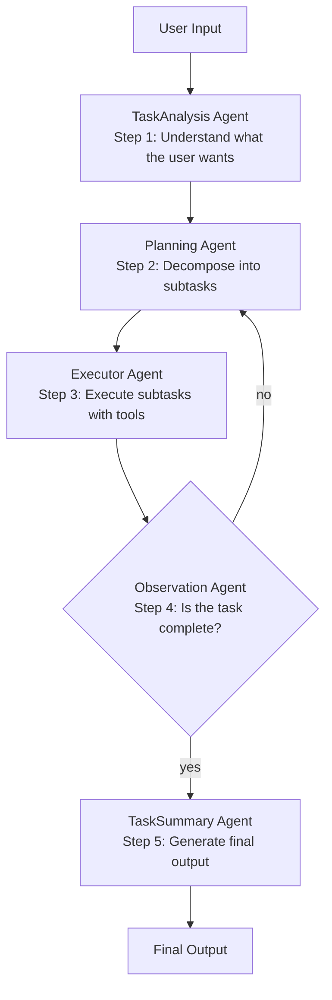
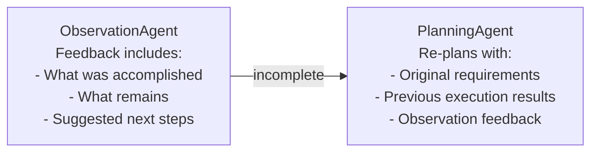

# SageAgent — Agentic Loop

## Pipeline Overview

SageAgent implements a linear multi-agent pipeline with a single feedback loop. Unlike
tree-based or graph-based agent orchestration, this is a straightforward sequential flow
with one controlled iteration point.

## Step-by-Step Flow

### Step 1 — TaskAnalysisAgent
- Receives raw user input
- Analyzes and structures the requirements
- Outputs a structured task description for the PlanningAgent
- Runs once per request (not part of the feedback loop)

### Step 2 — PlanningAgent
- Receives analyzed requirements (first pass) or feedback from ObservationAgent (subsequent passes)
- Decomposes the task into ordered subtasks with dependencies
- Produces an execution plan for the ExecutorAgent

### Step 3 — ExecutorAgent
- Iterates through planned subtasks
- Uses ToolManager to invoke local tools or MCP-connected external tools
- Produces execution results and artifacts

### Step 4 — ObservationAgent
- Evaluates execution results against original requirements
- Makes a binary determination: **complete** or **incomplete**
- If incomplete: sends feedback back to PlanningAgent with context about what remains
- If complete: passes results forward to TaskSummaryAgent

### Step 5 — TaskSummaryAgent
- Receives completed execution results
- Generates a human-readable summary of what was accomplished
- Returns final output to the user via AgentController

## Feedback Mechanism

The feedback loop is the key architectural feature that distinguishes SageAgent from a
simple chain-of-agents:

### Completion Determination

The ObservationAgent evaluates whether the task objectives have been met. The exact
criteria are LLM-driven — the agent uses its judgment (via prompt) to assess whether
the execution results satisfy the original task requirements.

There is likely a maximum iteration limit to prevent infinite loops, though the specific
bound is not documented in the public README.

## Deep Research vs. Rapid Mode

In **Deep Research Mode**, the full loop operates with feedback enabled, allowing multiple
planning-execution-observation cycles.

In **Rapid Execution Mode**, the loop likely runs a single pass (or with a reduced iteration
limit), prioritizing speed over thoroughness.

---

*Tier 3 analysis — loop mechanics inferred from README architecture diagram and agent names.*