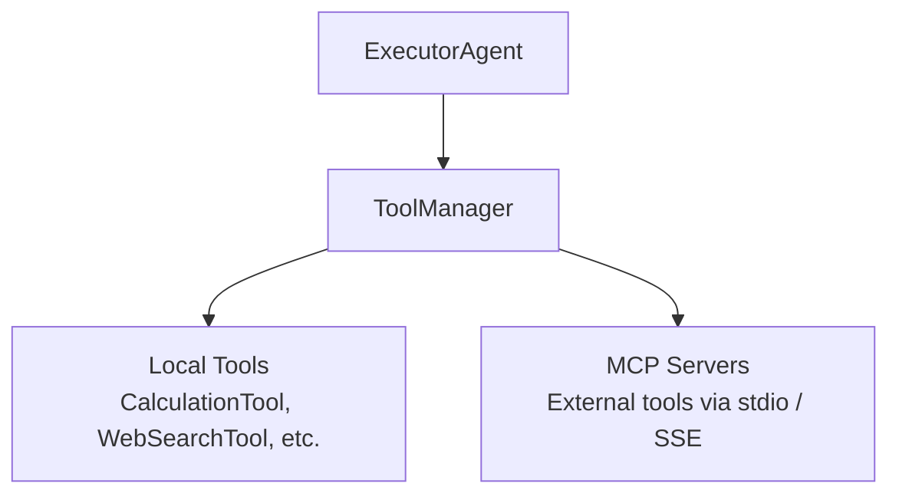

# SageAgent — Tool System

## Overview

SageAgent's tool system is centered around `ToolManager`, which provides a unified interface
for the ExecutorAgent to invoke both local Python tools and remote MCP-connected tools.



## ToolBase

`ToolBase` (in `agents/tool/tool_base.py`) is the abstract interface all tools implement.
Expected interface:

- **name**: Tool identifier string
- **description**: Human-readable description (used in LLM prompts for tool selection)
- **parameters**: Schema describing expected inputs
- **execute()**: Core execution method

This is a standard tool abstraction pattern seen across most agent frameworks.

## ToolManager

`ToolManager` (in `agents/tool/tool_manager.py`) handles:

1. **Registration**: Tools register themselves with the manager
2. **Discovery**: The manager exposes available tools to the ExecutorAgent
3. **Dispatch**: Routes tool calls to the appropriate implementation
4. **MCP Integration**: Manages connections to external MCP servers

The ToolManager is instantiated within the ExecutorAgent and provides the tool catalog
that gets included in the LLM's system prompt for function calling.

## Built-in Tools

### CalculationTool
- Located in `agents/tool/calculation_tool.py`
- Performs mathematical calculations
- Example of a simple local tool implementation

### WebSearchTool
- Web search capability
- Likely wraps a search API (specific provider not documented)

## MCP Server Integration

SageAgent has first-class support for the Model Context Protocol (MCP), supporting both
transport modes:

### stdio Mode
- Launches MCP servers as child processes
- Communicates via standard input/output
- Suitable for local tool servers

### SSE Mode (Server-Sent Events)
- Connects to remote MCP servers over HTTP
- Uses SSE for streaming responses
- Suitable for shared/remote tool services

### Configuration

MCP servers are configured via `mcp_servers/mcp_setting.json`:

```json
{
  "servers": [
    {
      "name": "example-server",
      "transport": "stdio",
      "command": "python",
      "args": ["server.py"]
    }
  ]
}
```

> Note: Exact schema inferred from common MCP patterns; specific SageAgent config
> format not deeply reviewed.

## Tool Discovery Flow

```
1. ToolManager initializes
2. Local tools registered programmatically
3. MCP servers loaded from mcp_setting.json
4. Tool catalog assembled (name, description, parameters for each)
5. Catalog provided to ExecutorAgent's LLM prompt
6. LLM selects tools via function calling
7. ToolManager dispatches to appropriate implementation
8. Results returned to ExecutorAgent
```

## Roadmap Notes

The SageAgent roadmap lists "Tool System Enhancements" as the #1 priority, specifically
targeting more comprehensive MCP server support. This suggests the current MCP integration
works but may have limitations in server lifecycle management, error handling, or
protocol coverage.

---

*Tier 3 analysis — tool system details inferred from directory structure, file names,
and README descriptions.*