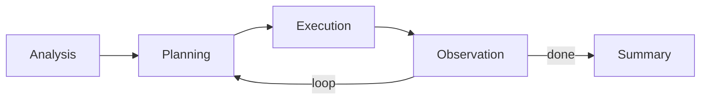

# SageAgent — Unique Patterns

## 1. Dual Execution Modes

SageAgent offers two distinct modes of operation:

| Mode | Pipeline | Feedback Loop | Use Case |
|---|---|---|---|
| Deep Research | Full 5-agent pipeline | Enabled (multi-iteration) | Complex research, analysis |
| Rapid Execution | Simplified pipeline | Disabled or limited | Quick tasks, simple queries |

**Why it matters**: Most agent frameworks offer a single execution path. The dual-mode
approach lets users trade thoroughness for speed explicitly, rather than relying on the
agent to self-calibrate. This is a pragmatic design that acknowledges not every task
needs a full multi-agent pipeline.

## 2. Linear Pipeline with Observation Feedback

Unlike graph-based agent orchestration (e.g., LangGraph) or tree-based approaches,
SageAgent uses a **simple linear pipeline** with exactly one feedback edge:

**Why it matters**: This is intentionally simple. The single feedback point (Observation
→ Planning) avoids the complexity of arbitrary agent-to-agent communication while still
enabling iterative refinement. It's easier to debug, reason about, and explain than
a full agent graph.

## 3. MCP-Native Tool Architecture

SageAgent builds MCP support into the core ToolManager rather than treating it as an
add-on. Both stdio and SSE transport modes are supported, with configuration via
`mcp_setting.json`.

**Why it matters**: Many agent frameworks bolt on MCP support after the fact. SageAgent's
approach of having ToolManager natively handle both local and MCP tools means external
tools are first-class citizens, not second-class wrappers.

## 4. Specialized Agent Roles

Each pipeline stage has a dedicated agent class rather than using a single general-purpose
agent with different prompts:

- `TaskAnalysisAgent` — not just "understand the task" but a separate class
- `PlanningAgent` — dedicated planner
- `ExecutorAgent` — dedicated executor with tool access
- `ObservationAgent` — dedicated evaluator
- `TaskSummaryAgent` — dedicated summarizer

**Why it matters**: This enforces separation of concerns at the code level, not just the
prompt level. Each agent can have specialized logic, different model configurations, or
different tool access. The tradeoff is more code and classes to maintain.

## 5. Professional Agents Concept

The `professional_agents/` directory and roadmap item suggest a plugin architecture for
domain-specialized agents. These would presumably slot into the pipeline for specific
task domains (e.g., code analysis, data science).

**Why it matters**: This is a forward-looking extensibility pattern. While not yet
fully implemented, it signals an intent to move beyond generic agents toward
domain-specialized ones — similar to how IDEs have language-specific plugins.

## 6. Thinking Message Type

The explicit `thinking` message type (alongside `normal`) separates chain-of-thought
reasoning from actionable output at the protocol level.

**Why it matters**: This is a clean abstraction that enables UIs to show/hide reasoning
traces, logging systems to filter by message type, and downstream agents to distinguish
between conclusions and deliberation.

## Comparison to Other Frameworks

| Pattern | SageAgent | LangGraph | CrewAI |
|---|---|---|---|
| Orchestration | Linear pipeline | Arbitrary graph | Role-based crew |
| Feedback | Single loop point | Any edge | Inter-agent chat |
| Tool integration | MCP-native | Tool abstraction | Tool abstraction |
| Execution modes | Dual (Deep/Rapid) | Single | Single |
| Agent identity | Class per role | Node per step | Agent per role |

---

*Tier 3 analysis — patterns identified from public architecture and README.*