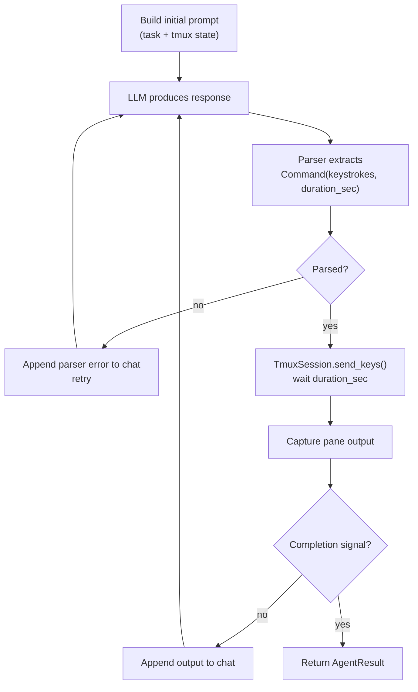

# Terminus 2 — Agentic Loop

## Episode Loop

Terminus 2 runs a single LLM in a fixed-shape ReAct-ish loop, one episode per
turn:



## Completion Signal

The agent uses a **two-step "are you sure" pattern** for completion. The
first time the model emits a completion marker, `_pending_completion` is set
to `True` and control returns for one more turn — only on confirmation does
the agent stop. This guards against the well-known failure mode of LLMs
declaring victory before they have actually run the verification step.

## Episode Budget

Default `max_episodes = 1_000_000` is effectively unlimited. The runtime
emits a warning when a smaller value is set:

```
max_episodes artificially limited to {N}.
Consider removing this limit for better task completion.
```

The TB2 harness still imposes a wallclock timeout per task, so runaway
agents do terminate.

## Timeout Handling

When a tmux command exceeds its `duration_sec`, the agent injects the
`timeout.txt` template into the chat — telling the model "the command is
still running, here is what you have so far, decide what to do" — rather
than killing the process. This lets long builds and tests run to completion
under model supervision.

## Retries

The class is decorated with `@retry(stop=stop_after_attempt(...))` from
`tenacity` on the LLM call boundary, so transient API errors don't fail the
whole episode.

## What This Loop Does Not Have

- No planning phase
- No reflection phase between episodes
- No multi-agent dispatch
- No tool selection — there is exactly one "tool" (send keys)
- No verification subagent — verification, if it happens, is the model's
  responsibility inside the same loop

The loop is intentionally as close to "LLM + terminal" as the harness allows.

---

*Loop mechanics from `terminus_2.py` source.*
