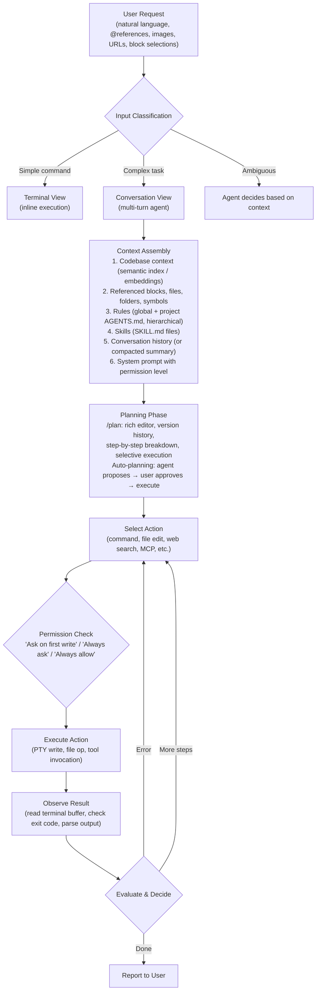
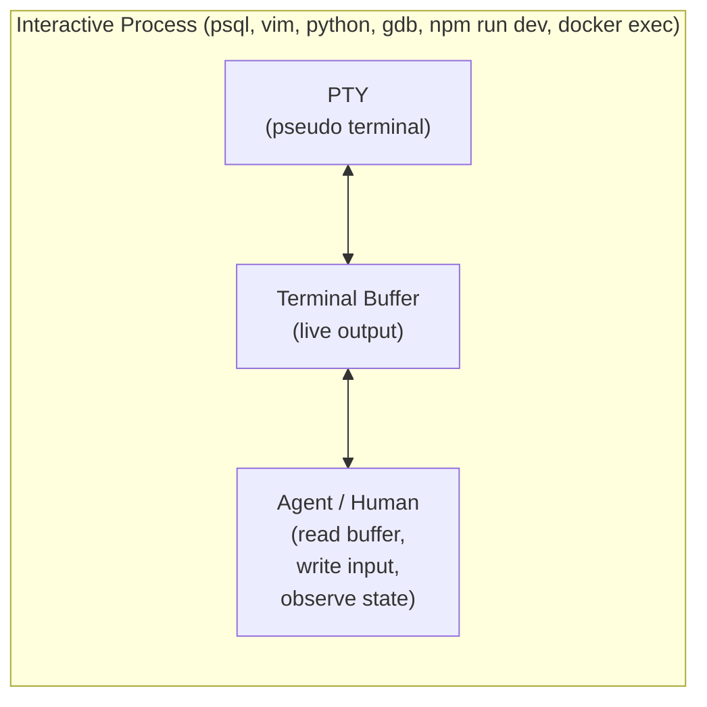
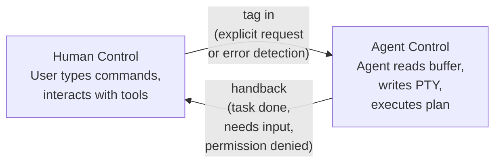
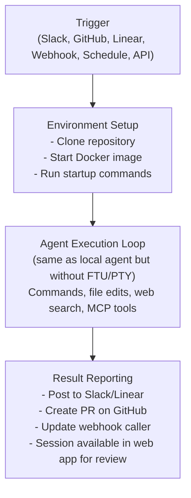

# Agentic Loop

> Warp's agent operates through the Oz orchestration platform, processing requests via a
> cycle of planning, command execution, terminal observation, and iterative refinement.
> The loop is distinguished by Full Terminal Use — the ability to attach to and interact
> with live interactive processes.

## Overview

Unlike wrapper-based agents that follow a simple generate-execute-observe loop, Warp's
agent loop is tightly coupled with the terminal's block system and PTY layer. The agent
doesn't just execute commands — it observes the live terminal state, interacts with
running processes, and can be "tagged in" by the user mid-session.

## Request Processing Flow



## Full Terminal Use

Full Terminal Use (FTU) is Warp's most distinctive agent capability. Because Warp owns
the PTY, the agent can interact with **running interactive processes** — something no
wrapper-based agent can do.

### How FTU Works



### FTU Scenarios

**Scenario 1: Agent starts interactive tool**
```
User:  "Connect to the production database and check the users table schema"
Agent: [Starts psql session]
       [Reads terminal buffer showing psql prompt]
       [Writes: \d users]
       [Reads schema output]
       [Reports findings to user]
       [Writes: \q to exit]
```

**Scenario 2: User "tags in" agent to running process**
```
User:  [Is in a Python REPL, encounters complex data transformation]
User:  "Hey agent, I need to pivot this DataFrame by date"
Agent: [Reads terminal buffer — sees current Python state, variable names]
       [Writes Python code to the REPL]
       [Reads output to verify correctness]
       [Hands back control to user]
```

**Scenario 3: Agent monitors long-running process**
```
User:  "Start the dev server and fix any compilation errors"
Agent: [Writes: npm run dev]
       [Monitors terminal buffer for output]
       [Detects compilation error]
       [Edits source file to fix error]
       [Observes dev server hot-reload success]
       [Reports fix to user]
```

### FTU Capabilities

| Capability | Description |
|------------|-------------|
| **Buffer reading** | Agent reads the live terminal buffer content |
| **PTY writing** | Agent writes input to the PTY (keystrokes, commands) |
| **Process detection** | Agent identifies what interactive process is running |
| **State awareness** | Agent understands prompts, error states, waiting states |
| **Graceful exit** | Agent can cleanly exit interactive tools when done |
| **Handback** | Agent returns control to user at natural breakpoints |

## Takeover / Handback Pattern

Warp implements a structured control transfer mechanism between human and agent:

### Control Flow



### Takeover Triggers
- **Explicit request**: User asks agent to take over (e.g., "fix this for me")
- **Error detection**: Active AI detects command failure and offers to help
- **Proactive suggestion**: Agent notices pattern and suggests intervention
- **Tag-in gesture**: User invokes agent while in an interactive tool

### Handback Triggers
- **Task completion**: Agent finished executing its plan
- **Permission boundary**: Agent needs write permission it doesn't have
- **Human judgment needed**: Agent encounters ambiguous situation
- **Interactive input required**: Process needs human-specific input (passwords, 2FA)
- **Natural breakpoint**: Agent reaches a logical stopping point

## Permission Model

Warp implements three permission levels for agent actions:

### Permission Levels

| Level | Behavior | Use Case |
|-------|----------|----------|
| **Ask on first write** | Agent executes read-only actions freely; prompts on first destructive action per category | Default for most users |
| **Always ask** | Agent prompts for every action | High-security environments |
| **Always allow** | Agent executes all actions without prompting | Trusted automation, CI/CD |

### What Counts as "Write" Actions

- File creation, modification, deletion
- Shell commands that modify state (git commit, rm, mv, etc.)
- PTY input to interactive processes
- Network requests that modify remote state

### Read-Only Actions (Always Allowed)

- Reading file contents
- Listing directories
- Reading terminal buffer
- Semantic index queries
- Web search (information retrieval)

## Planning and Execution

### The /plan Command

Warp provides a dedicated planning workflow via the `/plan` command:

1. **Plan creation**: Agent generates a structured plan with numbered steps
2. **Rich editor**: Plan appears in a rich text editor, not just terminal text
3. **Version history**: Plans are versioned; user can see evolution of approach
4. **Selective execution**: User can execute specific steps, skip others
5. **Plan iteration**: Agent can refine plan based on user feedback before executing
6. **Persistent storage**: Plans saved to Warp Drive for future reference

### Auto-Planning

For complex tasks, the agent may automatically propose a plan:

```
User: "Migrate the authentication system from JWT to session-based auth"

Agent: I'll create a plan for this migration:

Plan v1: Auth Migration
├── Step 1: Analyze current JWT implementation
│   ├── Identify all JWT creation/validation points
│   └── Map session management requirements
├── Step 2: Create session store
│   ├── Add Redis session middleware
│   └── Create session model
├── Step 3: Replace JWT endpoints
│   ├── Update login endpoint
│   ├── Update token refresh → session refresh
│   └── Update logout to destroy session
├── Step 4: Update middleware
│   └── Replace JWT validation with session lookup
└── Step 5: Test and verify
    ├── Run existing auth tests
    └── Add session-specific tests

[Execute All] [Execute Step 1] [Edit Plan]
```

## Auto-Detection of Input Type

Warp's agent classifies user input to route it optimally:

### Classification Logic

| Input Pattern | Classification | Routing |
|---------------|----------------|---------|
| Direct command (e.g., "ls -la") | Command | Terminal view, direct execution |
| Question about output | Query | Inline agent response in terminal |
| Multi-step request | Complex task | Conversation view with planning |
| Code modification request | Edit task | Conversation view with diff preview |
| Reference to running process | FTU interaction | Terminal view, PTY attachment |
| Error in previous block | Error fix | Active AI suggestion |

### How Classification Works

The agent considers:
- **Lexical cues**: Imperative verbs ("run", "execute") vs. question words ("how", "why")
- **Context**: Previous blocks, current working directory, running processes
- **Complexity estimation**: Single-step vs. multi-step, read vs. write operations
- **User preferences**: Configured defaults for ambiguous cases
- **Conversation state**: Whether already in a multi-turn conversation

## Conversation Management

### Forking

Warp supports conversation branching:

- **/fork**: Create a new conversation branch from current point
- **/fork-and-compact**: Fork and summarize the parent conversation to save context
- **/fork from point**: Fork from a specific earlier point in conversation

This enables exploratory workflows where the user can try multiple approaches without
losing previous context.

### Compaction

- **/compact**: Summarize conversation history to free context window space
- Preserves key decisions, code changes, and outcomes
- Allows longer-running agent sessions without hitting token limits
- Agent can suggest compaction when context is getting large

### Session Persistence

- Conversations persist across Warp restarts
- Stored in Warp Drive for cross-device access
- Can be shared with team members for collaborative debugging

## Cloud Agent Loop

Cloud agents follow a similar loop but with additional orchestration:



### Key Differences from Local Loop

| Aspect | Local Agent | Cloud Agent |
|--------|-------------|-------------|
| Trigger | User interaction | External event |
| PTY access | Full (FTU) | Simulated terminal |
| UI | Real-time in Warp app | Web app / Oz CLI |
| Parallelism | Single session | Multiple parallel sessions |
| Environment | User's machine | Configured Docker image |
| Human-in-loop | Real-time takeover | Async session steering |
| Permission | Interactive prompts | Pre-configured policy |

## Summary

Warp's agentic loop is fundamentally shaped by its terminal-native architecture. The
ability to read live terminal buffers, write to PTYs, and manage structured blocks gives
the agent capabilities that wrapper-based agents cannot replicate. The Oz platform extends
this model to cloud execution, creating a unified agent system that spans interactive
local development and automated background workflows.
