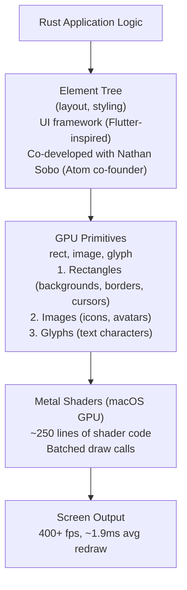
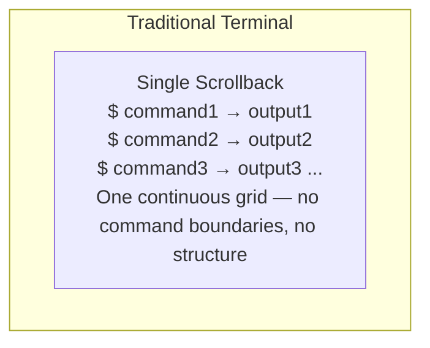
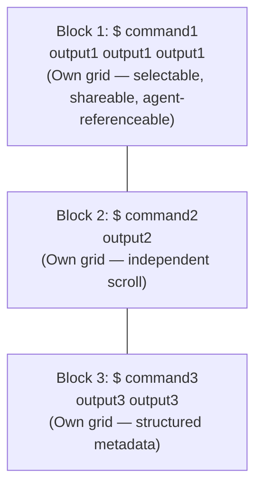
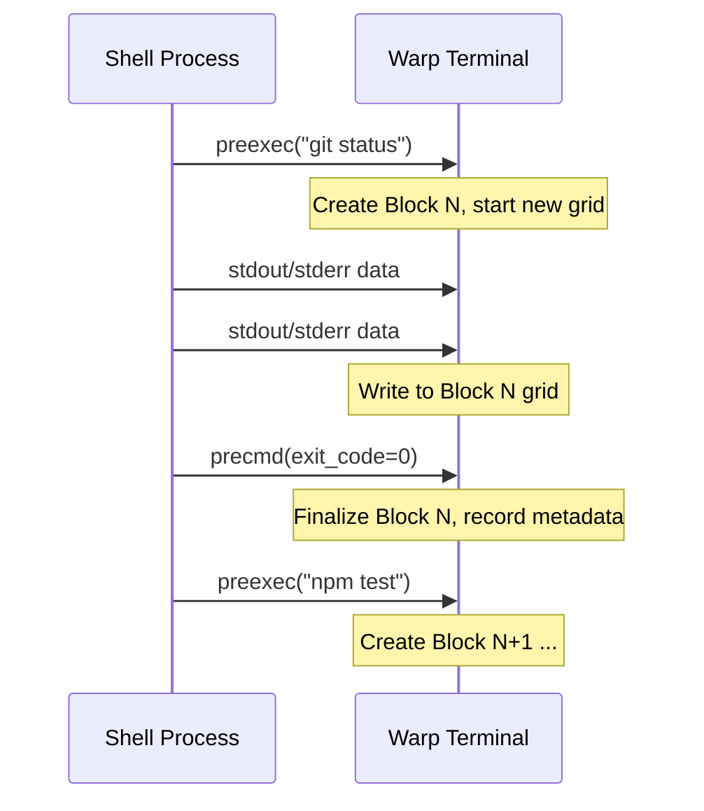
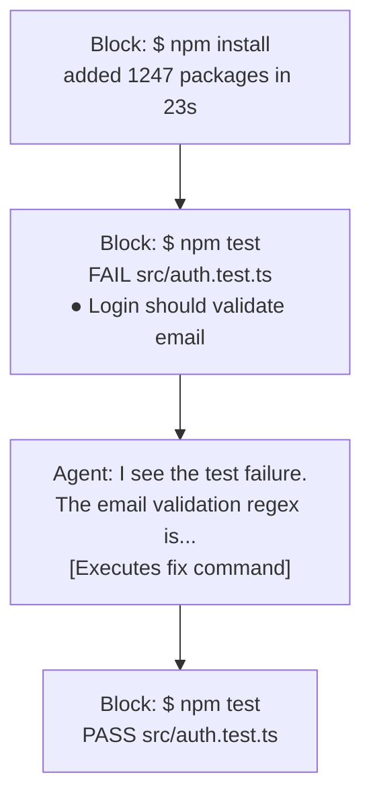
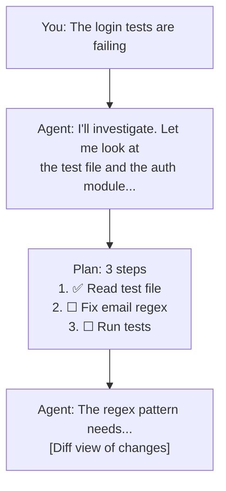
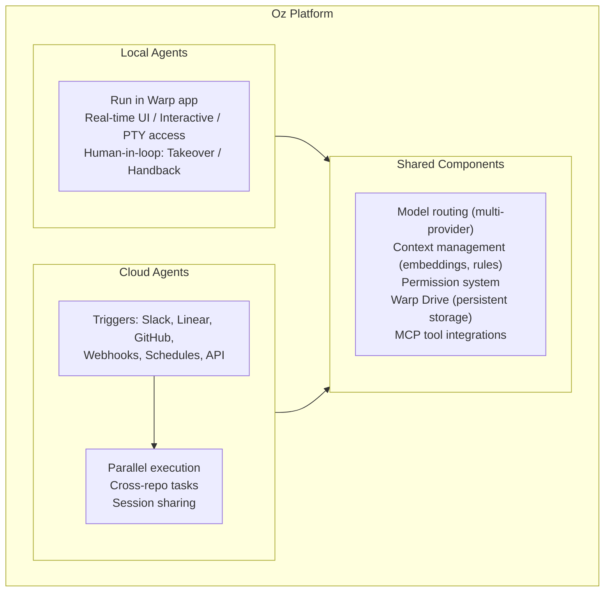

# Architecture

> Warp's architecture is defined by three core innovations: GPU-accelerated rendering via
> Metal, a block-based terminal data model with per-command grids, and a unified agent
> platform (Oz) that spans local and cloud execution environments.

## Rendering Pipeline: Rust → Metal GPU

Warp's rendering is fundamentally different from every other terminal. Traditional terminals
(iTerm2, Terminal.app, even Alacritty) use CPU-based text rendering or basic GPU
acceleration. Warp built a custom rendering pipeline from scratch:

### Pipeline Stages



### Performance Characteristics

| Metric | Value | Context |
|--------|-------|---------|
| Frame rate | 400+ fps | Measured on modern macOS hardware |
| Average redraw time | ~1.9ms | Full terminal content redraw |
| Shader code | ~250 lines | Metal shader language (MSL) |
| Primitive types | 3 | rect, image, glyph |
| Draw call batching | Yes | Primitives grouped by type |

### Why GPU Rendering Matters for Agents

The GPU rendering pipeline isn't just about speed — it enables the block-based UI that
makes agent interaction feel native:

1. **Block separation**: Visual dividers between command blocks require efficient rendering
   of many independent regions
2. **Agent conversation view**: Rich multi-turn conversations with syntax highlighting,
   diff views, and inline code require GPU-class rendering
3. **Real-time updates**: When the agent is executing commands, the terminal needs to
   render live output without blocking the agent's processing
4. **Interactive code review**: Inline diff annotations on agent-generated changes require
   flexible rendering not possible with cell-grid terminals

### UI Framework

Warp's UI framework was co-developed with **Nathan Sobo**, co-creator of Atom (and later
founder of Zed). The framework draws inspiration from Flutter's widget model:

- **Element tree**: Declarative UI description, similar to Flutter widgets
- **Layout engine**: Flexbox-inspired layout for terminal content
- **Styling**: Rich styling beyond terminal cell attributes
- **Event handling**: Unified input event model for keyboard, mouse, and touch
- **Animation**: Smooth transitions for block expansion, agent responses

The framework is separate from the terminal emulation layer, allowing Warp to render
non-terminal UI elements (agent conversations, settings, file pickers) alongside terminal
content.

> **Open-source plans**: Warp has stated intentions to open-source the Rust UI framework,
> which would be significant for the Rust GUI ecosystem.

## PTY and Block System

### Traditional Terminal Model



### Warp's Block Model



### How Blocks Work

Warp creates blocks using **shell hooks** — specifically `precmd` and `preexec` hooks
available in zsh, bash, and fish:

1. **preexec** fires before a command executes → Warp creates a new block, records the
   command text, timestamp, and working directory
2. The command runs in the PTY, output flows into the block's **dedicated grid**
3. **precmd** fires when the command completes → Warp finalizes the block, records exit
   code and duration



### Data Model: Forked Alacritty Grid

Warp's terminal data model is forked from **Alacritty's grid implementation**, but with
a critical modification: instead of a single grid for the entire terminal, Warp maintains
**separate grids per block**.

Each grid contains:
- **Cell storage**: Character data, attributes (color, style, etc.)
- **Cursor position**: Per-grid cursor for rendering
- **Scroll region**: Independent scrollback per block
- **Dimensions**: Width shared with terminal, height varies per block

The Alacritty fork provides:
- Proven VT100/VT220/xterm escape sequence handling
- Efficient cell storage and reflow
- Unicode and wide character support
- Sixel/kitty graphics protocol support (via grid cell attributes)

### Block Metadata

Each block stores rich metadata beyond the grid content:

```
Block {
    id: UUID,
    command: String,           // The command text
    working_directory: Path,   // CWD when executed
    start_time: Timestamp,
    end_time: Timestamp,
    exit_code: i32,
    duration: Duration,
    grid: Grid,                // Alacritty-forked grid
    environment: HashMap,      // Captured env vars
    is_interactive: bool,      // Was this an interactive app?
}
```

This metadata enables the agent to:
- Reference specific commands and their outputs
- Understand command success/failure
- Know the working directory context
- Identify interactive sessions for Full Terminal Use

## Agent Modality Architecture

Warp provides two distinct modes for agent interaction:

### Terminal View (Command Mode)



In terminal view, the agent's actions appear **inline** with command blocks. The agent
can read block output, execute commands, and its responses are interleaved naturally.

### Agent Conversation View



In conversation view, the agent operates in a dedicated space with multi-turn context,
planning, code diffs, and task tracking. This is optimized for complex, multi-step
workflows.

### Modality Switching

The two modes are not isolated — they share state:
- Agent can reference terminal blocks from conversation view
- Commands executed in conversation view create blocks in terminal view
- User can switch between views while maintaining context
- Auto-detection routes simple commands to terminal view, complex tasks to conversation

## Oz Platform Architecture

**Oz** is Warp's orchestration platform that unifies local and cloud agent execution:



### Local Agents

- Execute within the Warp desktop application
- Full access to the terminal PTY and block system
- Real-time interaction with the user
- Can attach to interactive processes
- Governed by the permission model (Ask on first write, Always ask, Always allow)

### Cloud Agents

- Execute on Warp's managed infrastructure or self-hosted environments
- Triggered asynchronously by external events
- Can run in parallel across multiple repositories
- Environment configured with: repository, Docker image, startup commands
- Sessions can be shared and steered by multiple users
- Accessible via Oz CLI, web app, API, and SDK

### Self-Hosting Options

1. **Managed worker daemon**: Warp provides a daemon that runs on your infrastructure,
   connects to Oz for orchestration
2. **Unmanaged mode**: Full control over the execution environment, Oz provides
   coordination only

## Model Architecture

Warp supports multiple LLM providers with intelligent routing:

### Supported Models
- **OpenAI**: GPT-5.x series (GPT-5, GPT-5 mini)
- **Anthropic**: Claude Opus 4.x, Claude Sonnet 4.x
- **Google**: Gemini 3 Pro, Gemini 2.5 Pro

### Auto Modes
- **Cost-efficient**: Routes to cheapest adequate model for the task
- **Responsive**: Prioritizes speed of response
- **Genius**: Routes to most capable model regardless of cost

### Reliability
- **Model fallback**: Automatic failover when a provider has an outage
- **Per-profile configuration**: Different model preferences per workspace/project
- **Zero Data Retention**: Contractual ZDR with all LLM providers
- **SOC 2 compliance**: Enterprise security certification

## Summary

Warp's architecture represents a fundamentally different approach from wrapper-based agents.
By controlling the entire stack — from GPU rendering to PTY management to agent
orchestration — Warp can offer capabilities (Full Terminal Use, block-level context,
cloud agents) that are architecturally impossible for agents that run inside a traditional
terminal. The trade-off is complexity and platform lock-in: Warp is a full application
replacement, not a tool you install in your existing workflow.
