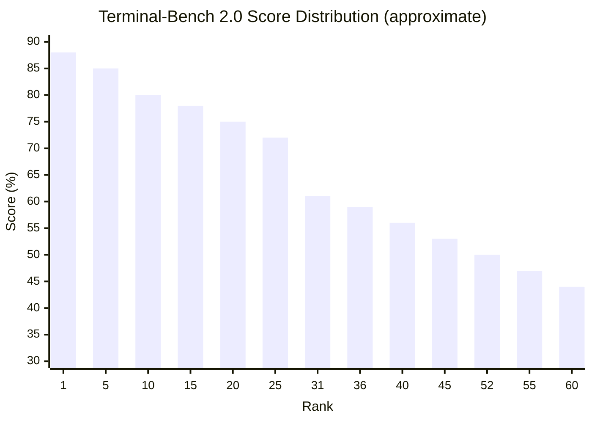

# Benchmarks

> Warp's agent performance has been evaluated on Terminal-Bench, the primary benchmark
> for terminal-based coding agents. Results vary significantly across model configurations,
> reflecting the multi-model architecture of the Oz platform.

## Terminal-Bench Overview

**Terminal-Bench** is a benchmark suite designed to evaluate AI coding agents that operate
in terminal environments. It tests agents on real-world software engineering tasks that
require:

- Reading and understanding code
- Executing shell commands
- Modifying files
- Running tests to verify changes
- Multi-step problem solving
- Terminal interaction proficiency

### Terminal-Bench 2.0 vs 1.0

| Aspect | Terminal-Bench 1.0 | Terminal-Bench 2.0 |
|--------|-------------------|-------------------|
| Task complexity | Moderate | Higher |
| Task count | Smaller set | Expanded set |
| Evaluation | Pass/fail per task | More granular scoring |
| Terminal skills | Basic | Advanced (interactive, multi-step) |
| Leaderboard size | ~20 entries | ~60+ entries |

## Warp's Terminal-Bench 2.0 Results

### Summary Table

| Rank | Configuration | Score | Notes |
|------|--------------|-------|-------|
| #31 | Warp (config A) | 61.2% | Best Warp 2.0 result |
| #36 | Warp (config B) | 59.1% | Mid-tier configuration |
| #52 | Warp (config C) | 50.1% | Lower-tier configuration |

### Context in the Leaderboard


> ▓ = Warp entries: Rank 31 (61.2%), Rank 36 (59.1%), Rank 52 (50.1%)

### Model Configuration Analysis

Warp's multi-model support means different configurations yield different benchmark
results. The spread between best (#31, 61.2%) and worst (#52, 50.1%) Warp results
spans ~11 percentage points, indicating:

1. **Model choice matters significantly**: The underlying LLM has a major impact on
   agent performance, even with the same orchestration platform
2. **Auto modes vs. fixed models**: The Auto modes (Cost-efficient, Responsive, Genius)
   may route to different models for different tasks, affecting consistency
3. **Terminal-specific skills**: Some models may be better at terminal interaction
   patterns (command generation, output parsing) than others

### Possible Configuration Mapping

While exact configurations aren't publicly detailed, the three entries likely represent
different model tiers:

| Config | Likely Model Tier | Score | Trade-off |
|--------|------------------|-------|-----------|
| A (#31) | Genius / Top-tier model | 61.2% | Best quality, highest cost |
| B (#36) | Responsive / Mid-tier | 59.1% | Balanced speed/quality |
| C (#52) | Cost-efficient / Budget | 50.1% | Lowest cost, adequate quality |

## Warp's Terminal-Bench 1.0 Results

### Summary

| Rank | Score | Notes |
|------|-------|-------|
| #11 | 52.0% | Strong showing in original benchmark |

### 1.0 vs 2.0 Performance

```
Warp Performance Across Benchmark Versions:

         Terminal-Bench 1.0    Terminal-Bench 2.0
         ─────────────────    ─────────────────
Rank:         #11                 #31 / #36 / #52
Score:       52.0%              61.2% / 59.1% / 50.1%
```

**Observations**:
- Warp's best 2.0 score (61.2%) exceeds its 1.0 score (52.0%), suggesting improvement
  in the agent platform over time
- The rank dropped from #11 to #31+ as more competitors entered the 2.0 leaderboard
- The 2.0 benchmark is harder, so absolute score improvements may understate progress
- Multiple 2.0 entries vs. single 1.0 entry reflects the multi-model configuration

## Comparative Analysis

### How Warp Compares to Other Terminal Agents

Based on publicly available Terminal-Bench data:

```
Terminal-Bench 2.0 — Selected Agents (approximate):

Agent                        Best Score    Best Rank
─────────────────────────   ──────────    ─────────
Claude Code (Opus 4)          ~82%          ~#1-3
Codex CLI                     ~70%          ~#10-15
Warp (best config)            61.2%         #31
Aider (architect)             ~55-60%       ~#35-45
```

> **Note**: These comparisons are approximate. Terminal-Bench rankings change frequently
> as new entries are submitted and configurations are updated.

### Factors Affecting Warp's Benchmark Performance

Several factors may explain Warp's mid-tier benchmark ranking despite its advanced
architecture:

1. **Benchmark design**: Terminal-Bench may not test the capabilities where Warp excels
   (interactive process control, block-level context, GPU UX). Benchmarks focus on
   file editing and test passing, where wrapper agents are equally capable.

2. **Orchestration overhead**: Warp's rich context assembly and planning features may
   add latency or token overhead that doesn't help on benchmark tasks but is valuable
   for real-world usage.

3. **Multi-model routing**: Auto modes may not always select the optimal model for each
   benchmark task, whereas dedicated agents using a single top model have consistency.

4. **Terminal-native vs. benchmark-optimal**: Warp's architecture is optimized for the
   human-in-the-loop experience, not for fully autonomous benchmark execution.

5. **Closed-source optimization**: Without access to Warp's internals, it's hard to know
   how much prompt engineering or benchmark-specific tuning has been done.

### What Benchmarks Don't Capture

Terminal-Bench measures autonomous task completion but does not evaluate:

| Unmeasured Capability | Warp Advantage |
|----------------------|----------------|
| Interactive debugging (GDB, REPL) | Full Terminal Use |
| Long-running dev server interaction | PTY monitoring |
| Human-agent collaboration quality | Takeover/handback |
| UX quality and trust-building | GPU-rendered rich UI |
| Team workflow integration | Cloud agents, Warp Drive |
| Error recovery with context | Block-level structured history |
| Multi-turn conversation management | Forking, compaction |

## Performance Metrics Beyond Benchmarks

### Rendering Performance (Not Agent, but Notable)

| Metric | Value | Benchmark |
|--------|-------|-----------|
| Frame rate | 400+ fps | Measured on Apple Silicon |
| Average redraw | ~1.9ms | Full terminal content |
| Input latency | Sub-frame | Keypress to render |
| Startup time | ~200ms | Cold start to usable |

These rendering metrics matter for agent UX: fast rendering means agent output appears
instantly, reducing perceived latency of the agent loop.

### Cloud Agent Performance

Cloud agent performance characteristics (from documentation):
- **Parallel execution**: Multiple agents can run simultaneously
- **Environment setup**: Docker container startup adds baseline latency
- **Trigger latency**: Event → agent start varies by trigger type
- **Session persistence**: Sessions maintain state for async steering

## Benchmark Evolution

### What Would a Terminal-Native Benchmark Look Like?

To properly evaluate Warp's unique capabilities, a benchmark would need tasks like:

1. **Interactive debugging**: Start GDB, find and fix a bug using debugger commands
2. **Dev server interaction**: Start a dev server, detect errors, fix them while server runs
3. **REPL exploration**: Use Python REPL to explore data, write analysis code
4. **Database interaction**: Connect to database, explore schema, write migration
5. **Multi-tool workflow**: Use git, docker, and language tools in concert
6. **Error recovery**: Handle unexpected failures gracefully with terminal context
7. **Human collaboration**: Tasks requiring handoff between human and agent

### Terminal-Bench 3.0 Potential

Future benchmark versions may incorporate more interactive terminal tasks, which would
better showcase Warp's Full Terminal Use capabilities and potentially improve its
relative ranking.

## Summary

Warp's benchmark performance places it in the **middle tier** of terminal-based coding
agents on Terminal-Bench, with scores ranging from 50.1% to 61.2% depending on model
configuration. While this is below top-ranked agents like Claude Code, the benchmarks
primarily measure autonomous file editing — a task where wrapper agents have no structural
disadvantage. Warp's unique strengths (Full Terminal Use, rich UX, cloud agents, team
workflows) are largely untested by current benchmarks, suggesting that real-world value
may diverge significantly from benchmark rankings.
