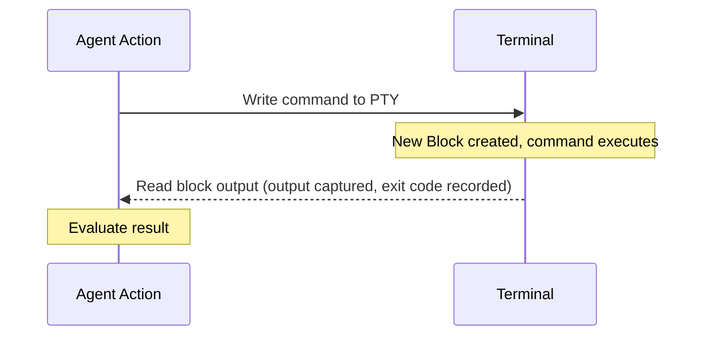
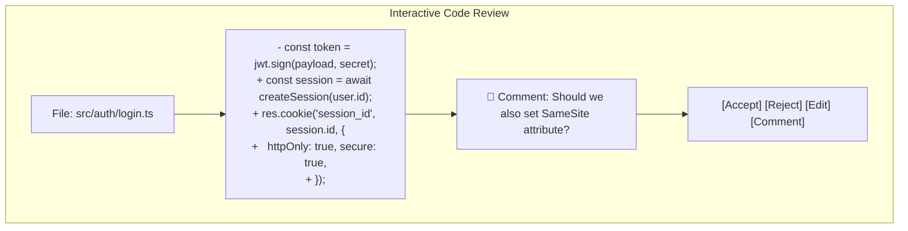
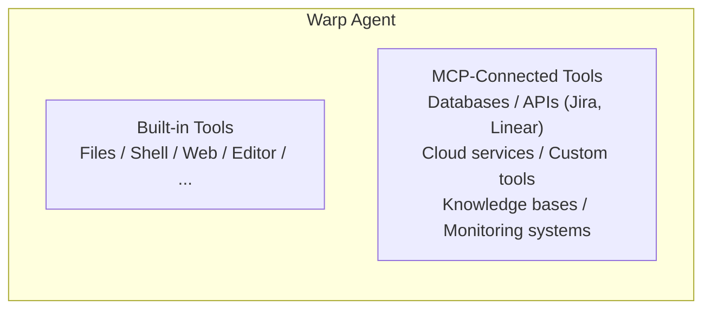
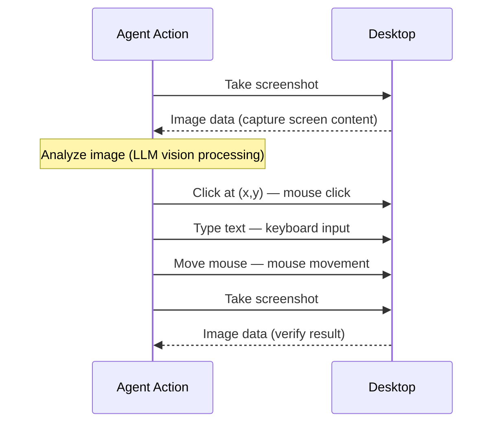
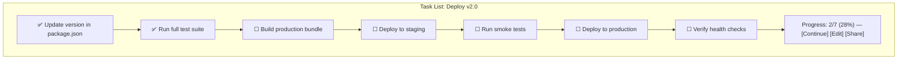
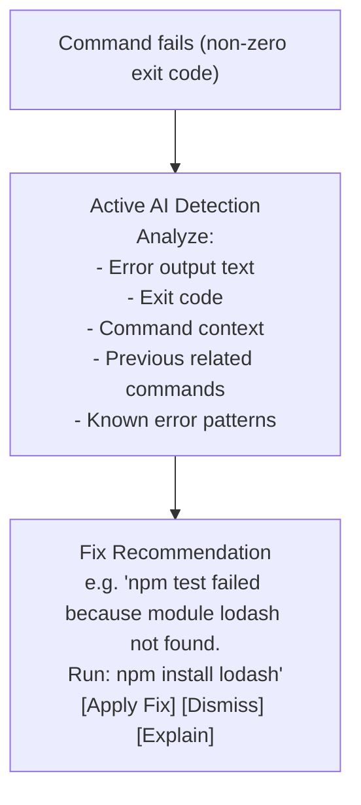

# Tool System

> Warp's tool system spans from basic file operations to Computer Use (desktop interaction
> via screenshots), with MCP integration for extensibility, a built-in code editor with
> LSP support, interactive code review, and voice input.

## Overview

Warp's agent has access to a broad set of tools that fall into several categories:

1. **Core tools**: File operations, shell commands, web search
2. **Terminal-native tools**: PTY interaction, block reading, interactive process control
3. **Editor tools**: Built-in code editor with LSP, interactive code review
4. **Extended tools**: MCP integrations, Computer Use, voice input
5. **Workflow tools**: Task lists, planning, Warp Drive storage
6. **Proactive tools**: Active AI error detection and fix suggestions

## Core Tools

### File Operations

The agent can perform standard file operations:

| Operation | Description | Permission Required |
|-----------|-------------|---------------------|
| Read file | Read contents of a file | No (read-only) |
| Write file | Create or overwrite a file | Yes (write) |
| Edit file | Modify specific portions of a file | Yes (write) |
| Delete file | Remove a file | Yes (write) |
| Move/rename | Move or rename files | Yes (write) |
| List directory | List directory contents | No (read-only) |
| Search files | Search file names with patterns | No (read-only) |
| Search content | Grep/ripgrep through file contents | No (read-only) |

File operations are performed directly by the agent (not by generating shell commands),
which provides:
- Better error handling and reporting
- Atomic operations (write succeeds or fails completely)
- Structured diffs for review
- Integration with the interactive code review system

### Shell Command Execution



Shell execution in Warp differs from wrapper agents:
- Commands create **blocks** with structured metadata (exit code, duration, CWD)
- Agent reads output from the block's grid, not from stdout capture
- Long-running commands can be monitored asynchronously
- Interactive commands trigger Full Terminal Use mode

### Web Search

The agent can search the web for information:
- Query web search engines
- Retrieve and parse web page content
- Extract relevant information for the current task
- Useful for looking up API docs, error messages, library usage

## Terminal-Native Tools

These tools are unique to Warp's terminal-native architecture:

### Block Reading

```
Agent can:
├── Read output of any visible block
├── Read output of specific block by reference
├── Search across block outputs
├── Read metadata (exit code, duration, CWD)
└── Reference blocks in conversation context
```

### PTY Interaction (Full Terminal Use)

| Capability | Description |
|------------|-------------|
| Write to PTY | Send keystrokes/text to running process |
| Read buffer | Read current terminal buffer content |
| Send control sequences | Ctrl+C, Ctrl+D, Ctrl+Z, etc. |
| Detect prompt | Identify when process is waiting for input |
| Monitor output | Watch for specific patterns in output stream |
| Attach to process | Connect to already-running interactive process |

### Interactive Process Control

The agent can manage interactive processes:

```
Supported Interactive Tools:
├── Databases:     psql, mysql, sqlite3, redis-cli, mongosh
├── REPLs:         python, node, irb, ghci, erl
├── Editors:       vim, nano (limited), emacs
├── Debuggers:     gdb, lldb, pdb, node --inspect
├── Dev servers:   npm run dev, flask run, cargo watch
├── Containers:    docker exec, kubectl exec
├── Package mgrs:  npm init (interactive prompts)
└── Other:         ssh sessions, tmux, screen
```

## Editor Tools

### Built-in Code Editor with LSP

Warp includes a code editor that goes beyond terminal text editing:

- **Syntax highlighting**: Language-aware highlighting for displayed code
- **LSP integration**: Language Server Protocol support for:
  - Go-to-definition
  - Find references
  - Hover information
  - Completions
  - Diagnostics (errors, warnings)
- **Inline editing**: Edit files within the terminal without launching external editors
- **Diff view**: Side-by-side or inline diff display for changes

The LSP integration means the agent has access to semantic code information, not just
text pattern matching. It can:
- Navigate to symbol definitions
- Find all usages of a function
- Understand type information
- Detect errors before running code

### Interactive Code Review

When the agent makes code changes, they go through an interactive review process:



Features of interactive code review:
- **Per-file diff view**: Each changed file shown separately
- **Inline comments**: User can add comments on specific lines
- **Accept/reject per hunk**: Granular control over which changes to apply
- **Agent response to comments**: Agent can revise changes based on review feedback
- **Batch operations**: Accept all, reject all
- **Undo**: Revert applied changes

## MCP (Model Context Protocol) Integration

Warp supports the **Model Context Protocol** for extensible tool integration:

### What MCP Enables



### MCP Configuration

MCP servers are configured in Warp's settings:
- **Per-project**: MCP servers can be scoped to specific projects
- **Global**: MCP servers available across all projects
- **Discovery**: Warp can discover MCP servers from project configuration
- **Authentication**: Support for OAuth, API keys, and other auth mechanisms

### MCP Tool Types

| Type | Description | Example |
|------|-------------|---------|
| **Resources** | Read-only data sources | Database schemas, API docs |
| **Tools** | Executable actions | Create Jira ticket, deploy service |
| **Prompts** | Reusable prompt templates | Code review checklist |

## Computer Use

Warp's agent can interact with the desktop environment beyond the terminal:

### How Computer Use Works



### Computer Use Capabilities

| Capability | Description |
|------------|-------------|
| **Screenshot** | Capture current screen content |
| **Click** | Click at specific screen coordinates |
| **Type** | Type text via keyboard simulation |
| **Scroll** | Scroll in applications |
| **Drag** | Drag-and-drop operations |
| **Wait** | Wait for UI elements to appear |

### Use Cases

- Interacting with GUI applications that don't have CLI interfaces
- Browser automation for web-based tasks
- GUI testing and verification
- Filling out forms in desktop applications
- Taking screenshots for documentation

> **Note**: Computer Use requires explicit permission and is governed by the same
> permission model as other agent actions.

## Task Lists

Warp provides structured task tracking for complex multi-step workflows:

### Task List Features



- **Agent-generated**: Agent creates task lists from complex requests
- **User-editable**: User can add, remove, or reorder tasks
- **Trackable**: Progress visible as agent works through tasks
- **Resumable**: Task lists persist across sessions
- **Shareable**: Share task lists with team via Warp Drive

## Voice Input

Warp supports voice as an input modality:

- **Speech-to-text**: Voice input transcribed to text commands/requests
- **Natural language**: Speak requests in natural language, agent interprets
- **Hands-free**: Useful when debugging physical hardware, pair programming
- **Context-aware**: Voice input has same context as typed input (blocks, files, etc.)

## Active AI

Active AI is Warp's proactive assistance system:

### How It Works



### Active AI Features

| Feature | Description |
|---------|-------------|
| **Error detection** | Monitors command exit codes and output for errors |
| **Pattern matching** | Recognizes common error patterns across languages |
| **Fix suggestion** | Proposes specific commands or code changes to fix errors |
| **One-click apply** | User can apply suggested fix with a single click |
| **Learning** | Suggestions improve based on project context and history |
| **Non-intrusive** | Appears as subtle suggestion, doesn't interrupt workflow |

## Tool Invocation Priority

When the agent needs to accomplish a task, it selects tools in this general priority:

1. **Built-in file operations** — for direct file manipulation
2. **Shell commands** — for system operations, builds, tests
3. **LSP queries** — for code navigation and understanding
4. **Web search** — for external information
5. **MCP tools** — for integrated service operations
6. **Computer Use** — for GUI interactions (last resort)

## Summary

Warp's tool system is the most comprehensive of any terminal-based agent, combining
traditional coding tools (files, shell, search) with terminal-native capabilities
(PTY interaction, block reading) and advanced features (Computer Use, LSP, MCP,
interactive code review). The breadth of tools reflects Warp's position as a full
terminal replacement rather than a single-purpose coding agent.
